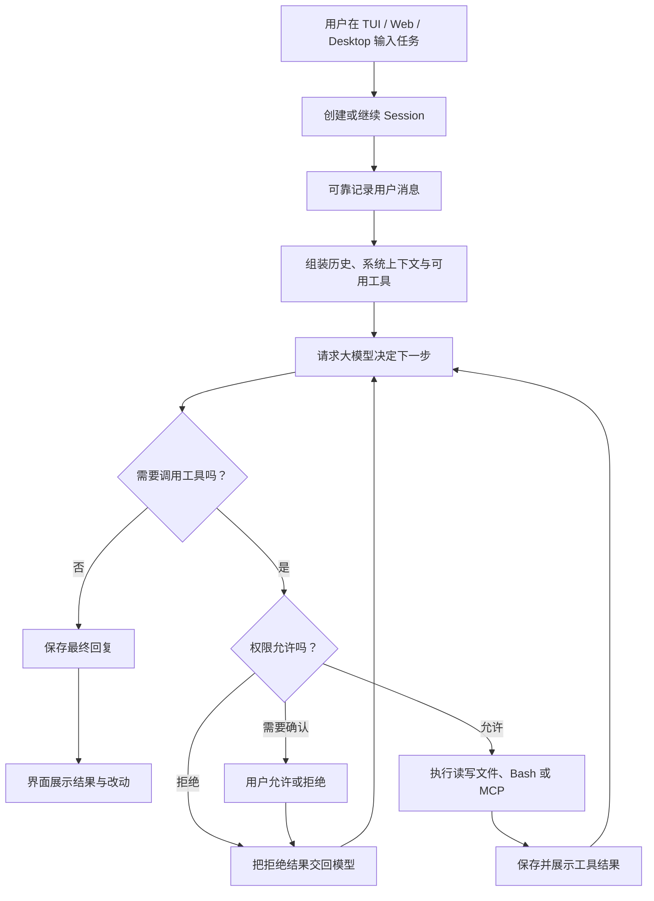

# 01 · 从零理解 Coding Agent

> 读完本章，你应该能用自己的话回答：  
> 「AI 编程助手和纯 ChatGPT 式聊天有什么不同？」  
> 「用户发出一句需求以后，OpenCode 大致经历了什么？」

---

## 1. 先忘掉源码：把 Agent 当成会动手的实习生

想象你雇了一个 **会写代码的实习生**，你坐在电脑前当老板。

| 你（老板） | 实习生（Agent） |
|------------|-----------------|
| 说：「把登录接口的 500 错误修掉」 | 先看代码、搜日志，再决定改哪里 |
| 说：「可以改数据库吗？」→「先别」 | 停下并调整方案 |
| 说：「停！」 | 尽快住手，但刚才写下的工作记录还在 |
| 过一会儿说：「继续」 | 翻开记录，从已有进度接着干 |

OpenCode 要解决的，就是把这套「实习生工作法」做成可靠软件。

这里最重要的不是 AI 会不会聊天，而是它能不能在受控条件下完成一个闭环：

> **理解任务 → 查看现场 → 动手操作 → 检查结果 → 汇报。**

---

## 2. 它和纯 ChatGPT 式聊天有什么不同？

这里说的「纯 ChatGPT 式聊天」，是指只交换文字、没有接入你本地开发环境的聊天页面。带有代码执行或工具能力的聊天产品，也可以成为 Coding Agent，所以两者的边界不在产品名字，而在 **是否能可靠地行动**。

| 对比点 | 纯文字聊天 | Coding Agent |
|--------|------------|--------------|
| 能看到什么 | 你粘贴进去的文字 | 经授权后可读仓库、配置、命令结果 |
| 能做什么 | 给建议、生成代码片段 | 读写文件、搜索、运行测试、调用外部工具 |
| 一次回答怎么结束 | 输出一段文字就结束 | 可以多轮「模型 ↔ 工具」，直到任务完成 |
| 结果在哪里 | 留在聊天框，通常要你手工复制 | 可以直接形成工作区里的文件改动 |
| 风险控制 | 主要靠你判断回答 | 还需要权限规则、确认弹窗、取消与审计 |
| 失败后怎么接着来 | 依赖聊天上下文 | 还要保存会话、工具结果和执行状态 |

例如你说「修复登录接口」：

- 纯文字聊天通常还会问你贴代码，最后给一段建议；
- Coding Agent 可以自己搜索登录路由、读取相关测试、修改文件并运行测试；
- 但 Agent **不是无人监管的万能程序**。需求不清、命令危险或权限不足时，它应该询问或停止。

一句话记住：

> 聊天助手主要交付「答案」，Coding Agent 还要交付「在真实环境中完成并验证过的动作」。

---

## 3. Coding Agent 的最小闭环

任何 Coding Agent，本质上都在重复这四步：

```text
① 接收任务（用户输入）
      ↓
② 让大模型决定下一步（要不要读文件？改哪里？）
      ↓
③ 如果模型要求调用工具，就由程序真正执行
      ↓
④ 把工具结果喂回模型，直到模型认为可以结束
```

这四步合在一起，叫 **Agent Loop（智能体循环）**。  
名字吓人，其实就是：**模型想 → 工具干 → 看结果 → 再想……**

### 3.1 一个超短例子

用户说：`README 里把项目名改成 PyCode`

可能发生：

1. 模型请求读取 `README.md`；
2. 系统执行读文件工具，把内容返回；
3. 模型根据原文请求编辑标题；
4. 系统执行编辑，再把结果返回；
5. 模型确认目标已完成，不再调用工具，向用户汇报。

如果第 3 步模型想执行 `rm -rf /`，好的系统会按权限规则 **拒绝或弹窗询问**，而不是直接执行。

### 3.2 用户从发消息到拿到结果

下面这张图先画主干；异常恢复、中途转向和多 Agent 会在后续章节展开。



从用户视角看，界面里只是「发了一句话」；从系统视角看，背后可能发生多次模型调用、工具执行、权限判断和持久化记录。

---

## 4. OpenCode 可以长成哪些产品形态？

同一套 Agent 能力可以放进不同界面。**TUI、Web、Desktop 是入口，不是三套不同的大脑。**

| 形态 | 你在哪里使用 | 适合什么场景 | 需要注意 |
|------|--------------|--------------|----------|
| **TUI**（终端界面） | Terminal 里 | 键盘操作、远程服务器、贴近命令行工作流 | 对终端和快捷键不熟的新手有门槛 |
| **Web**（网页） | 浏览器里 | 跨设备访问、分享会话、轻量使用 | 浏览器未必直接拥有本机文件权限，通常要连接后端或本地服务 |
| **Desktop**（桌面应用） | 独立桌面客户端 | 本地文件集成、系统通知、更完整的图形交互 | 需要处理安装、升级和操作系统权限 |

三种界面通常都会做相似的事：

1. 选择项目、模型和 Agent 模式；
2. 展示消息、工具调用和文件变化；
3. 让用户停止、继续或批准危险动作；
4. 通过 Client / HTTP API 与后端的 Session 和 Agent Loop 通信。

因此，做 pycode 时不要把「界面按钮」和「核心执行逻辑」绑死。今天从 TUI 发出的消息，和明天从 Web 发出的消息，应该进入同一套会话与执行规则。

详见：[19-HTTP API 与 Client 约定](./19-HTTP-API与Client约定.md)、[21-运行形态与部署](./21-运行形态与部署.md)。

---

## 5. 新手最容易做成的「玩具 Agent」

很多人的第一版会这样写：

```python
while True:
    reply = call_llm(messages)
    if reply.没有工具调用:
        break
    for tool_call in reply.工具调用:
        result = 直接执行(tool_call)   # 危险：没有确认、没有记账
        messages.append(result)
```

它能跑通 Demo，但上生产会痛：

| 问题 | 会发生什么 |
|------|------------|
| 用户点「停止」 | 工具可能还在跑，状态一团乱 |
| 网络抖了一下，请求重发 | 同一条用户消息可能被执行两次 |
| 对话太长 | 超过模型上下文，整段失败 |
| 想加「只读规划模式」 | 只能靠提示词求模型别改文件 |
| 两个请求同时推进同一会话 | 消息和工具结果可能交错 |
| 进程重启 | 内存里的 `messages` 和执行进度丢失 |
| 工具输出几百 MB | 模型上下文被日志塞满 |

OpenCode 的很多「复杂设计」，都是为了解决这些真实问题，而不是为了炫技。

---

## 6. OpenCode 把问题拆成了哪些模块？

先建立一张地图，后文每章展开一块：

```text
┌─────────────────────────────────────────────┐
│ 用户界面：TUI / Web / Desktop                 │
└───────────────────┬─────────────────────────┘
                    │ 发消息 / 停止 / 允许
┌───────────────────▼─────────────────────────┐
│ Client / Server：把界面请求送进核心             │
└───────────────────┬─────────────────────────┘
                    │
┌───────────────────▼─────────────────────────┐
│ Session：这次编程任务的笔记本                  │
│ 用户、模型、工具以及状态变化都要留下记录          │
└───────────────────┬─────────────────────────┘
                    │
┌───────────────────▼─────────────────────────┐
│ Agent Loop：何时请求模型、跑工具、继续或停止      │
└───────┬─────────────────────┬───────────────┘
        │                     │
        ▼                     ▼
┌───────────────┐     ┌───────────────────────┐
│ 提示词与模式    │     │ 工具箱                 │
│ build / plan  │     │ 文件、Bash、MCP…       │
└───────────────┘     └───────────┬───────────┘
                                  │
                          ┌───────▼───────┐
                          │ 权限 / 人机确认 │
                          └───────────────┘
```

另外还有：

- **多 Agent**：主实习生把独立工作交给专门的子实习生；
- **记忆与压缩**：笔记本太厚，先做摘要再继续；
- **取消与恢复**：停止后不把已经记录的事实一起抹掉；
- **可观测性**：老板能看见每一步在做什么；
- **插件与协议**：接入外部工具、客户端或其他 Agent。

---

## 7. 为什么不「一个脚本搞定」？

| 设计目标 | 白话解释 |
|----------|----------|
| **可恢复** | 电脑重启后，已接收的用户消息还在 |
| **可取消** | 点停止只打断当前工作，不胡乱删除历史 |
| **可审计** | 出问题时能回看：模型要求了什么、谁批准了什么 |
| **可限制** | Plan 模式硬性禁止写操作，不只靠提示词 |
| **可协调** | 同一会话不要被两条执行链同时写乱 |
| **可扩展** | 新工具和插件可以接入，不必重写核心循环 |

这些目标贯穿后面所有章节。每看到一个「看起来多余」的概念，都可以问：

> **它在保护哪一种失败场景？如果删掉它，刷新、重试、并发或危险命令发生时会怎样？**

### 7.1 和固定工作流有什么区别？

| | Coding Agent | 固定工作流（写死的流水线） |
|--|--------------|---------------------------|
| 下一步谁决定 | 大模型根据现场动态决定 | 程序员事先写死 |
| 适合任务 | 探索性的修 Bug、理解陌生仓库、加功能 | 固定步骤，如 lint → test → deploy |
| 优点 | 能根据新证据调整路线 | 稳定、可预测、容易审计 |
| 风险 | 模型可能选错工具或走弯路 | 遇到预料外情况就卡住 |

二者不是敌人。实际系统常用固定程序守住边界，再让 Agent 在边界内动态决策。OpenCode 选择 Agent 路线，所以 **循环 + 工具 + 权限 + 会话记录** 是中心，而不是只画一条固定流水线。

---

## 8. 本章小结与自测

先记住四句话：

1. Coding Agent ≈ 能看现场、能动手、会检查结果的编程实习生；
2. 核心是「模型 ↔ 工具」反复运行的 Agent Loop；
3. TUI、Web、Desktop 是不同入口，底层应复用同一套会话和执行规则；
4. 玩具版 `while` 循环不够，真实系统还要处理权限、持久化、取消、并发和压缩。

试着不用术语回答：

1. 为什么「模型能生成代码」还不等于 Coding Agent？
2. 一次工具执行结束后，为什么还要把结果交回模型？
3. 为什么 Web 界面和 TUI 不应该各写一套 Agent Loop？
4. 固定工作流和 Coding Agent 各适合什么任务？

**下一章**：[02-白话术语表](./02-白话术语表.md) —— 把后文会出现的词先翻译成人话。
