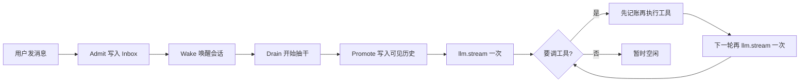
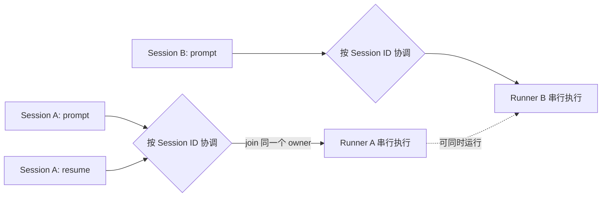
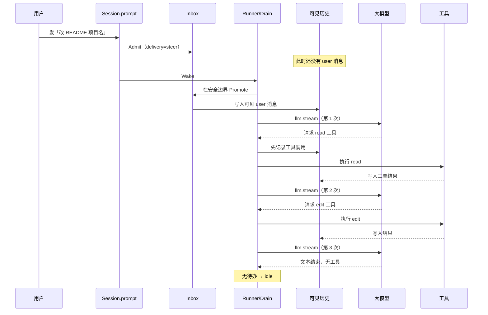

# 03 · Agent 循环：一次对话如何跑完

> 读完本章，你应该能用自己的话讲清楚：  
> 「用户敲下一句话之后，系统里到底发生了什么，为什么不是简单的 `while True: call_llm()`。」

---

## 1. 这一章要解决什么问题

上一章（[02-白话术语表](./02-白话术语表.md)）已经给过一堆词：入队、提升、转向、排队、抽干……  
本章要把这些词 **串成一条完整故事线**。

先用餐厅类比，把问题钉死：

你走进一家餐厅，对服务员说：「给我做一份番茄炒蛋，少放糖。」

天真的系统会怎么做？

1. 服务员听见了，**立刻冲进厨房炒菜**
2. 炒到一半你又说：「等等，改成宫保鸡丁」
3. 厨房可能：两盘一起炒、把第一盘扔掉、或者假装没听见

更糟的情况：

- 你点单时网络卡了一下，手机 App **重发了一次**，厨房收到两张同样的单 → 炒了两盘
- 你点了「停止」，厨房把锅砸了，**连你之前写在小票上的备注也撕掉了**
- 你想在当前这桌菜上完之后，再点下一道；系统却把新菜硬塞进正在炒的锅里

Coding Agent 面对的，就是同一类问题：

| 生活场景 | Agent 里对应什么 |
|----------|------------------|
| 客人点菜 | 用户发消息 |
| 厨房炒菜 | 大模型思考 + 工具干活（读文件、改代码） |
| 小票 / 笔记本 | Session（会话）里可靠记下的内容 |
| 叫号排队 | 消息先入队，还没进「可见对话」 |
| 中途改口味 | Steer（转向） |
| 等这桌上完再点 | Queue（排队） |
| 经理喊「这桌先忙完」 | Wake / Drain（唤醒 / 抽干待办） |

**这一章要回答的核心问题只有一个：**

> 怎样设计「用户输入 → 模型调用 → 工具执行 → 再调用模型」这条回路，  
> 才能既好用，又不容易丢消息、重复执行、状态混乱？

OpenCode V2 的答案可以先记成一句话（后面会慢慢拆开）：

> **先把用户的话可靠写进收件箱（admit），再在合适时机写入可见历史（promote），然后每个模型回合只正式请求模型一次（one stream），工具跑完再开下一回合。**

---

## 2. 最 naive 的写法，及会出什么问题

很多人第一天写 Agent，脑子里只有一个循环。  
也就是说：**用户话说完，立刻塞进 messages，然后 while 循环里调模型、跑工具。**

### 2.1 伪代码：玩具版 Agent

```python
# 最 naive 的 Coding Agent —— Demo 能跑，生产会痛
messages = [
    {"role": "system", "content": "你是编程助手，可以读文件、改文件。"},
]

def chat(user_text: str):
    # 问题①：用户话一到，立刻变成「模型可见历史」
    messages.append({"role": "user", "content": user_text})

    while True:
        # 问题②：在内存里偷偷套很多层工具循环
        reply = call_llm(messages)   # 可能内部又嵌套调模型
        messages.append(reply)

        if not reply.tool_calls:
            return reply.text

        for call in reply.tool_calls:
            # 问题③：工具立刻执行，没有「先记账再干活」
            result = run_tool_now(call)
            messages.append({"role": "tool", "content": result})
```

UI 调用方可能长这样：

```python
# 前端按钮「发送」
on_click_send(text):
    chat(text)   # 同步阻塞；重试？取消？排队？全靠祈祷
```

### 2.2 这套写法会踩哪些坑？

下面每个坑，都对应 OpenCode V2 后来专门拆开的设计点。

#### 坑 A：发消息 = 立刻执行

用户点「发送」，函数直接 `call_llm`。  
若 HTTP 超时重试，**同一句话可能被执行两次**。  
若页面刷新，内存里的 `messages` 没了，用户却以为「我已经说过了」。

也就是说：**「用户意图已被系统收下」和「厨房已经开始炒」被绑死在一起**——绑死了就很难做可靠重试。

#### 坑 B：中途插话没有语义

用户正在跑「修登录 500」，又发「别改数据库」。  
Naive 循环要么：

- 完全听不见（还在 while 里阻塞）
- 要么硬塞进当前 `messages`，和正在进行的工具结果交错，模型看到一团乱麻

没有「转向」和「排队」两种交付方式，产品体验只能靠猜。

#### 坑 C：取消会把一切撕掉

用户点「停止」。Naive 实现常常直接 `break`，甚至清空缓冲区。  
结果：**已经排好的下一句话也丢了**；工具可能半截写完文件却没有任何失败记录。

#### 坑 D：内存 tool-loop 不好记账

有人会写：`call_llm` 内部发现要调工具，就同步跑工具，再递归调模型，对外只算「一次请求」。  
表面省事，实际：

- 很难精确取消「第几次模型调用」
- 崩溃后不知道算进行到哪一步
- UI 事件流和真实执行不同步

#### 坑 E：可见历史与真实意图脱节

有时 UI 已经显示用户气泡了，后端其实还没写入持久化；  
有时后端写了，模型却因为循环卡在别处还没读到。  
**「屏幕上看得见」≠「模型看得见」≠「已经入队」**——三个概念混成一个，调试会哭。

### 2.3 小结：naive 版缺的不是「聪明」，是「边界」

玩具版缺的是这些清晰边界：

1. **入队** 和 **执行** 分开  
2. **已排队但模型还看不见** 和 **已进入对话历史** 分开  
3. **中途改方向** 和 **等当前波次结束** 分开  
4. **一次正式的模型请求** 和 **工具副作用** 分开  
5. **取消当前生成** 和 **丢弃收件箱** 分开

OpenCode V2 就是围绕这些边界长出来的。

---

## 3. OpenCode 的核心思想：先入队（admit）再执行（drain）；可见历史要 promote

这一节是整章的心脏。请慢慢读，允许自己反复对照餐厅类比。

### 3.1 三个阶段，不要合成一步

把「用户说了一句话」拆成三个阶段：

```text
① Admit（准入 / 入队）
   把这句话可靠写进 Inbox（收件箱）
   —— 此时对话历史里还没有这条 user 消息
   —— 模型也还看不见

② Promote（提升 / 入席）
   到了安全时机，把收件箱里的话正式写入可见历史
   —— 这时 UI 和模型才会把它当成「用户消息」

③ Drain（抽干 / 执行）
   进程里针对这个 Session：promote → 调模型 → 跑工具 → 再调模型……
   直到暂时没事可做
```

**举个例子（点菜）：**

1. **Admit**：服务员给你发号，小票进系统——「客人要番茄炒蛋」已登记。厨房还没动锅。  
2. **Promote**：叫到你的号，菜单正式交后厨——厨师这才按这道菜做。  
3. **Drain**：这桌该炒的菜、该上的菜，尽量忙完，直到暂时没有新活。

也就是说：

> **Admit ≠ Execute。**  
> 「系统已收下你的话」绝不等于「模型已经开始想 / 工具已经开始跑」。

### 3.2 为什么要拆开？

| 好处 | 白话解释 |
|------|----------|
| 网络重试安全 | 同一 message ID 再 admit 一次，可以做成幂等；不会悄悄双开厨房 |
| UI 可以诚实显示「已排队」 | 收件箱里有货，但还没 promote，界面可以说「等待处理」 |
| 崩溃后意图不丢 | 进程挂了，Drain 这种「正在忙」的状态会丢；但 Inbox 里未 promote 的话还在数据库 |
| 取消有分寸 | 可以打断当前炒菜（模型/工具），而不撕掉已经登记的小票 |

### 3.3 Drain 不是「任务 ID」

这里有个初学者极容易晕的点：

> **Drain 只是进程里「把该干的活干完」的一段时间。**  
> 它通常 **没有** 一个长期存在于数据库里的「run_id」。

类比：

- **笔记本（Session 历史 + Inbox）**：写在纸上的，重启店还在  
- **Drain**：今晚值班经理喊「把 3 号桌忙完」——这是当下协调动作，不是单独装订成册的合同

所以：

- 重启进程后，「正在 drain」这件事本身可能丢了  
- 但「用户说过什么、已经 promote 了什么、工具结果记了什么」应尽量还在  
- 「崩溃后要不要自动再调一次模型」是另一套恢复设计，不要和「普通 wake 抽干收件箱」混为一谈

### 3.4 Wake：敲门说「有活了」

用户消息 admit 之后，系统通常会 **Wake（唤醒）** 这个 Session：

> 「嘿，执行器，这个会话收件箱有新东西，有空就去 drain。」

如果该 Session 已经在忙，Wake 往往只是插个「忙完再看一眼」的标记（合并多次敲门），而不是同时开两个厨房炒同一桌菜。  
**同一 Session 串行；不同 Session 可以并发。**

也有一种只入队、先不唤醒的写法：`resume=false`（或同类开关）——只 admit，稍后再显式继续。  
举个例子：批量导入历史消息时，你可能只想记账，不想立刻烧钱调模型。

### 3.5 Promote：模型「看见」的那一刻

在 OpenCode V2 语义里：

- **Admitted**：在 Inbox 里，`promoted` 标记为空 → **模型不可见**  
- **Promoted**：原子地消费 Inbox，并追加一条可见的 user 消息 → **模型可见**

也就是说：

> 用户气泡什么时候出现在「模型该读的历史」里，取决于 promote，而不是取决于你按下发送键的那一瞬间。

安全时机通常是：**一轮模型调用开始前的边界**（safe provider-turn boundary）。  
不要在模型正在流式输出中间，把新用户话硬塞进同一次请求——账本会很难对齐。

### 3.6 一张总览图（先有感觉即可）



下一节专门讲：新消息进来时，是「尽快转向」还是「等闲下来再处理」。

### 3.7 线上事件长什么样：`PromptAdmitted` 与 `Prompted`

> **标签：V2 已有。** 以下是为了教学而简化的 JSON-ish（像 JSON，但省略了部分包装字段）；字段含义以当前 Schema 为准，不要把示例里的 ID 和时间写死。

用户按下发送后，第一张耐久凭证是 `PromptAdmitted`。它表示「输入已经进入收件箱」，**不表示模型已经看见**：

```json
{
  "type": "session.next.prompt.admitted",
  "durable": {
    "aggregateID": "ses_123",
    "seq": 41,
    "version": 1
  },
  "data": {
    "timestamp": 1786075200000,
    "sessionID": "ses_123",
    "messageID": "msg_abc",
    "prompt": {
      "parts": [{ "type": "text", "text": "别改数据库，只查应用层" }]
    },
    "delivery": "steer"
  }
}
```

Runner 到达安全边界并完成提升后，会发布 `Prompted`。同一个 `messageID` 现在正式进入模型可见历史：

```json
{
  "type": "session.next.prompted",
  "durable": {
    "aggregateID": "ses_123",
    "seq": 42,
    "version": 1
  },
  "data": {
    "timestamp": 1786075200000,
    "sessionID": "ses_123",
    "messageID": "msg_abc",
    "prompt": {
      "parts": [{ "type": "text", "text": "别改数据库，只查应用层" }]
    },
    "delivery": "steer"
  }
}
```

客户端可以据此区分两种 UI 状态：

```text
只看到 PromptAdmitted：已接收 / 排队中，模型还没看见
又看到 Prompted：已进入对话历史，下一次 Provider Turn 可见
```

`durable.seq` 是这个 Session 内耐久事件的顺序号。它帮助投影器按顺序重建 Inbox 和历史，但它不是「第几次模型调用」。

### 3.8 两条容易误判的异常路径：`PromptConflict` 与 busy join

#### 路径 A：同一个消息 ID 被拿来表达另一件事

> **标签：V2 已有。**

精确重试必须同时匹配：

- 同一个 Session
- 同一个 `messageID`
- 同一份 prompt
- 同一种 delivery

完全一致时，系统返回原来的 admission receipt（准入回执），这是幂等重试。只要其中一项变了，就会得到 `Session.PromptConflictError`：

```python
# 第一次：成功 admit
session.prompt(
    session_id="ses_123",
    message_id="msg_fixed",
    text="只查应用层",
    delivery="steer",
)

# 网络重试：完全一样，安全返回同一回执
session.prompt(
    session_id="ses_123",
    message_id="msg_fixed",
    text="只查应用层",
    delivery="steer",
)

# 冲突：复用 ID，却换了内容
session.prompt(
    session_id="ses_123",
    message_id="msg_fixed",
    text="直接改数据库",
    delivery="steer",
)  # -> PromptConflict
```

这里不能采用「后写覆盖前写」。否则客户端一次超时重试，就可能偷偷改掉已经准入的用户意图。

#### 路径 B：Session 正忙时再次 `resume`

> **标签：V2 已有（进程内协调）；集群所有权 deferred。**

「忙」本身**不是错误**。当前进程里同一个 Session 已有 drain 时：

- 显式 `resume(sessionID)` 会 **join** 当前执行，也就是等待同一个 owner 完成，而不是再开第二个 Runner；
- 新 prompt 触发的 `wake(sessionID)` 会合并成一个 `pendingWake`，当前执行结束后再检查一次；
- 若当前 owner 正在停止，新的显式 resume 会先等清理完成，再启动后继执行。

因此不要设计一个泛化的 `SessionBusyError` 让客户端盲目重试；那会制造惊群和双执行。真正的规则是：**同 Session 合流，不同 Session 并发。**

### 3.9 多 Session 并发：不是全局只能跑一个

> **标签：V2 已有（单进程）；跨节点调度 deferred。**



协调器的 key 是 Session ID，而不是一个全局锁。因此 A 的两次请求不会并排改同一份会话历史，但 A 和 B 可以同时等待不同 Provider、执行不同工具。

当前边界也要说清：

- 进程内：`SessionRunCoordinator` 保证每个 Session 一个 owner；
- 多进程 / 多节点：耐久所有权、租约与 stale-owner fencing（阻止旧 owner 继续写）仍是 **deferred**；
- 不要把「本机 active 列表」当成重启后仍可靠的数据库状态。

---

## 4. Steer vs Queue：用生活例子讲清楚 + 配置/API 示例

用户第二句话进来时，系统需要知道：**这句是插队改方向，还是排在后面？**

OpenCode 用一个叫 **delivery（交付方式）** 的字段表达这件事。常见两个值：

| delivery | 中文直觉 | 行为摘要 |
|----------|----------|----------|
| `steer`（默认） | 转向 / 插话改口味 | 在下一个安全的模型回合边界，**尽量把当前待处理的转向消息一起 promote**，尽快影响方向 |
| `queue` | 排队 / 等上完再点 | **等当前这波 continuation 告一段落（快要 idle）时，才 FIFO 取出一条** promote |

### 4.1 餐厅故事：Steer

你点了「番茄炒蛋」。厨师已经在切番茄。  
你喊：「少放糖！改成少油！」

这是 **Steer**：

- 不是等整桌吃完再告诉厨房  
- 而是在「下一锅动手前」把新要求并进去  
- 如果短时间内你连喊两句转向，往往会在同一个边界 **一批处理**（一批 steers 一起进历史）

编程里对应：

> Agent 正在排查登录 500，你发：「别动数据库 schema，只改应用层。」  
> 你希望它 **尽快改方向**，而不是先把错误的改库方案跑完。

### 4.2 餐厅故事：Queue

你点了「先上凉菜拼盘」，厨房正在做。  
你又说：「拼盘上完后，再给我一份蛋炒饭——现在别打断拼盘。」

这是 **Queue**：

- 明确说：先把当前 continuation 做完  
- 到「本来就要闲下来」的边界，再 FIFO promote **一条** queued 输入  
- promote 一条之后，再重新评估要不要继续；不会一次把队列全倒进锅里

编程里对应：

> Agent 正在跑一长串重构。你预写好下一句：「重构完后请补测试。」  
> 你不希望这句话打断当前工具波次，只希望它成为 **下一阶段任务**。

### 4.3 优先级直觉（很重要）

实现上常见规则是：

1. 若 Inbox 里还有 **steer**，优先按 steer 路径 promote  
2. 没有 steer、但有 **queue**，才在合适边界 promote **一条** queue  
3. 任一新的用户输入被 promote，通常会 **重置**「这个 agent 本轮还能走多少步」之类的配额；一批 steers 一起进来，只重置一次

也就是说：**转向优先于排队**；排队是「礼貌地等」，不是「插队」。

### 4.4 API / 配置示例（可抄）

下面是对齐 V2 语义的调用形状（语言无关；Python 伪代码）：

```python
# 默认：转向（steer）
session.prompt(
    session_id="ses_123",
    text="登录接口一直 500，帮我查",
    # delivery 省略时等于 "steer"
)

# 显式转向：中途改方向
session.prompt(
    session_id="ses_123",
    text="先别改数据库，只查应用层日志",
    delivery="steer",
)

# 排队：等当前波次告一段落再处理
session.prompt(
    session_id="ses_123",
    text="上面查完后，再帮我写回归测试提纲",
    delivery="queue",
)

# 只入队、先不唤醒执行（admit-only）
session.prompt(
    session_id="ses_123",
    text="这条先记着，稍后统一跑",
    delivery="steer",
    resume=False,   # 不 wake；之后再 session.resume(session_id)
)
```

HTTP 直觉上也类似（示意，字段名以实际协议为准）：

```http
POST /session/ses_123/prompt
Content-Type: application/json

{
  "parts": [{ "type": "text", "text": "别改 schema" }],
  "delivery": "steer"
}
```

```http
POST /session/ses_123/prompt
Content-Type: application/json

{
  "parts": [{ "type": "text", "text": "忙完再补测试" }],
  "delivery": "queue"
}
```

### 4.5 和「取消」的关系（先埋一笔）

用户点「停止」时：

- 当前正在生成 / 正在跑的工具应被打断  
- **Inbox 里已经 admit 但未 promote 的消息应保留**  
- 尤其是 `queue` 的那句「忙完再……」，不应因为点了停止就消失

也就是说：**Interrupt 保 inbox。**  
取消的是「正在炒的那锅」，不是「已经发号的小票」。

更完整的取消/恢复会在第 09 章展开；这里只要记住这个不变量。

---

## 5. 一整轮循环逐步走读（配流程图）

下面用一个具体任务，把时间线走一遍。

**用户任务**：`README 里把项目名改成 PyCode`

### 5.1 时间线（白话版）

| 步骤 | 发生了什么 | 笔记本上多了什么 |
|------|------------|------------------|
| 1 | 用户发送消息 | Inbox 多了一条 admitted 输入（模型仍看不见） |
| 2 | 系统 Wake | 执行器得知「有活」 |
| 3 | Drain 开始，到达安全边界 | 准备 promote |
| 4 | Promote | 可见历史出现 user 消息；Inbox 该条标记已提升 |
| 5 | 组装上下文（环境说明 + 历史） | 仍是读；然后 **第一次** `llm.stream` |
| 6 | 模型说：先读 README | 先把「工具调用意图」写入事件/历史，再真正读文件 |
| 7 | 工具结果回来 | 历史多了 tool 结果；因为还有未完成工作 → 需要 continuation |
| 8 | **第二次** `llm.stream`（又是恰好一次） | 模型看到文件内容，请求编辑工具 |
| 9 | 编辑执行并记账 | 再评估是否还要 continuation |
| 10 | 模型输出「改完了」，无工具调用 | Drain 结束，会话暂时 idle |

### 5.2 流程图



### 5.3 中途插一句 Steer，会怎样？

假设第 1 次 `llm.stream` 之后、工具还在跑时，用户又发：

> 「标题旁边顺便加一句：Python 复刻版」

且 `delivery="steer"`：

1. 新消息 **Admit** 进 Inbox（仍可能暂不可见）  
2. 当前这次模型调用不会被「切开重来」乱改账本（具体取消策略另说）  
3. 到 **下一轮** 模型调用前的安全边界，Steer 被 promote  
4. 第 2 次 `llm.stream` 时，模型历史里已经能看见这句补充要求  
5. 步数配额通常会被重置（新用户意图进来了）

### 5.4 若第二句是 Queue？

同一句改成 `delivery="queue"`：

1. 仍先 Admit  
2. 只要还有 steer 或当前 continuation 认为「还得继续」，queue **先不 promote**  
3. 当模型不再请求工具、本来要闲下来时，才 FIFO promote **一条** queue  
4. promote 后重新开一轮，再评估后面还有没有 queue

也就是说：

> **Steer 抢的是「下一锅」；Queue 抢的是「下一桌开始前」。**

### 5.5 和「提示词」的交界（预告）

Promote 之后、调用模型之前，系统还会准备：

- Agent 人格 / 工作模式说明（Build vs Plan 等）  
- System Context（目录、日期、可用技能索引……）  
- Session History（压缩后的可见对话）

那是 [04-提示词与工作模式](./04-提示词与工作模式.md) 的主题。  
本章只要记住：**循环负责何时调模型；提示词负责模型「以为自己是谁、在什么环境」。**

---

## 6. 为什么每轮只 `llm.stream` 一次？

这里的「一次」，英文常说 **one stream per provider turn**。  
先用白话：

> **每一个「模型回合」，对外只发起一次正式的流式请求。**  
> 工具执行发生在这次请求结束之后；工具跑完，再开启 **下一个** 模型回合，再 `llm.stream` 一次。

禁止的是这种偷懒结构：

```python
def call_llm_magic(messages):
    reply = provider.stream(messages)
    while reply.tool_calls:
        for c in reply.tool_calls:
            messages.append(run_tool(c))
        reply = provider.stream(messages)  # 对外仍假装「一次 call_llm」
    return reply
```

### 6.1 演进动机：从「方便写」到「方便管」

早期玩具 Agent 喜欢内存 tool-loop，因为：

- 代码短  
- 调用方只写一个 `await chat()`  
- Demo 好看

但产品做大后，你会需要：

| 需求 | 内存套娃循环为什么难受 |
|------|------------------------|
| 精确取消 | 不知道取消的是外层还是第 3 层嵌套 stream |
| UI 实时进度 | 事件边界糊成一团 |
| 崩溃恢复 | 「执行游标」不在账本里 |
| 权限 / HITL | 工具要弹窗时，套娃栈很难暂停/恢复 |
| 中途 Steer | 不知道该插在哪一层 messages |
| 计费与限流 | 「一次用户点击」对应多少次真实 provider 调用说不清 |

于是演进到显式回合：

```text
promote → 组装请求 → llm.stream 一次 → 持久化事件
       → 结算工具（先记后跑）→ 若需继续 → 再开下一回合
```

### 6.2 优点

1. **账本清晰**：每次模型调用都是一等公民事件，可回放、可展示  
2. **取消清晰**：打断「当前这一次 stream / 当前工具」，语义干净  
3. **与 promote 对齐**：Steer/Queue 只在回合边界进入历史，不和半截 token 打架  
4. **便于测试**：可以断言「这一回合只打了一次 provider」  
5. **副作用可控**：工具不是藏在 provider SDK 回调深处，而是会话编排层显式 settle

### 6.3 代价 / 缺点

1. **代码不再是一个小 while**：要有 Runner、Inbox、回合状态  
2. **延迟可能略增**：每次工具后重新组装历史再请求（换来的是正确性）  
3. **初学者心智负担**：必须理解「回合」而不只是「函数递归」  
4. **错误地以为「慢」**：有人会想把多次 stream 合并回去「优化」，通常会把取消/恢复搞坏

### 6.4 给 pycode 的一句忠告

> 如果你发现自己在 `llm.stream` 里面又写了 `while tool: stream()`，停手。  
> 把循环抬到 Session Runner；让 LLM 模块保持「傻」——只负责 **这一次** 请求。

### 6.5 `max_steps` 怎样截断 continuation

> **标签：V2 已有。**

`continuation`（继续条件）表示：当前 Provider Turn 结束后，还有本地工具结果或新的 steer 值得让模型再看一次。它不是「模型包自己递归」，而是 Session Runner 明确决定是否开启下一回合。

但循环不能无限跑。当前 V2 Runner 会读取所选 Agent 的步骤上限（配置概念可写成 `max_steps`；当前源码字段为 agent `steps`）：

1. 每开一个 Provider Turn，`step` 增加；
2. 新用户输入被 promote 时，`step` 重置为 1；一批 steers 只重置一次；
3. 到最后一步时，不再向模型提供工具定义，并强制 `toolChoice="none"`；
4. 历史里加入「已到最大步数，请只用文字总结」的提醒；
5. 即使模型仍想调工具，也不能继续形成新的本地工具循环。

```text
step < max_steps
  → 可以暴露工具
  → 工具调用完成后 needsContinuation=true
  → Session 决定开启下一 Provider Turn

step >= max_steps
  → 工具关闭
  → 模型只做文字收尾
  → 当前 continuation 到此为止
```

这条限制属于 **Session / Agent 策略**，不属于 Provider。Provider 只知道本次 request 里有没有 tools，并不知道整个会话已经跑了几步。

当前实现可从 `packages/core/src/session/runner/llm.ts` 概念性阅读：它负责步数、工具物化、`needsContinuation` 和外层循环；`packages/core/src/session/runner/max-steps.ts` 只提供到限时的提示文字。

---

## 7. 完整可抄的 Python 伪代码（对齐 V2 语义）

下面是一份 **教学用** 伪代码，刻意对齐 OpenCode V2 的关键语义：

- admit ≠ execute  
- steer / queue  
- promote 在回合边界  
- 每个回合恰好一次 `llm.stream`  
- interrupt 不丢 inbox  
- drain 无长期 run_id（进程内协调）

它不是生产代码，也不是对 TypeScript Effect 的逐行翻译。

```python
from dataclasses import dataclass, field
from enum import Enum
from typing import Literal


Delivery = Literal["steer", "queue"]


@dataclass
class PromptInput:
    id: str
    session_id: str
    text: str
    delivery: Delivery
    promoted: bool = False


@dataclass
class SessionState:
    id: str
    # 可见历史（模型能看见的）
    history: list[dict] = field(default_factory=list)
    # 收件箱（已 admit、未 promote）
    inbox: list[PromptInput] = field(default_factory=list)
    # 进程内协调态（重启可丢）
    busy: bool = False
    pending_wake: bool = False
    stopping: bool = False


class Store:
    """假装这是数据库。Inbox/History 应耐久；busy 等可不耐久。"""

    def __init__(self):
        self.sessions: dict[str, SessionState] = {}

    def get(self, session_id: str) -> SessionState:
        return self.sessions[session_id]


store = Store()


# ---------- 1) Admit：只入队，可选唤醒 ----------

def prompt(
    session_id: str,
    text: str,
    *,
    message_id: str,
    delivery: Delivery = "steer",
    resume: bool = True,
) -> PromptInput:
    """SessionV2.prompt 的语义缩小版。"""
    session = store.get(session_id)

    # 精确重试：同 session + 同 message + 同内容 + 同 delivery → 幂等
    for row in session.inbox + _promoted_rows_projection(session):
        if row.id == message_id:
            if (row.text, row.delivery) != (text, delivery):
                raise PromptConflictError("同一 message_id 不能改内容/delivery")
            return row

    admitted = PromptInput(
        id=message_id,
        session_id=session_id,
        text=text,
        delivery=delivery,
        promoted=False,
    )
    session.inbox.append(admitted)  # 耐久写入（此处省略落盘细节）

    if resume:
        wake(session_id)
    return admitted


def _promoted_rows_projection(session: SessionState) -> list[PromptInput]:
    # 真实系统会用事件日志投影；这里略
    return []


class PromptConflictError(Exception):
    pass


# ---------- 2) Wake / Interrupt / Resume ----------

def wake(session_id: str) -> None:
    """有新活：忙则记一笔，闲则开始 drain（force=False）。"""
    session = store.get(session_id)
    if session.busy:
        session.pending_wake = True
        return
    start_drain(session_id, force=False)


def resume(session_id: str) -> None:
    """显式继续：闲则强制开跑；忙则加入当前执行（示意）。"""
    session = store.get(session_id)
    if session.busy:
        # 真实系统：join 当前 drain
        return
    start_drain(session_id, force=True)


def interrupt(session_id: str) -> None:
    """取消当前生成/工具；Inbox 保留。"""
    session = store.get(session_id)
    session.stopping = True
    session.pending_wake = False
    # 真实系统：取消当前执行纤维/任务
    # 注意：不要 session.inbox.clear()


# ---------- 3) Drain：抽干 eligible work ----------

def start_drain(session_id: str, *, force: bool) -> None:
    session = store.get(session_id)
    session.busy = True
    session.stopping = False
    try:
        run_drain(session_id, force=force)
    finally:
        session.busy = False
        if session.pending_wake and not session.stopping:
            session.pending_wake = False
            # 成功结束后若还有敲门，可再开一轮 successor drain
            start_drain(session_id, force=False)


def has_pending(session: SessionState, delivery: Delivery) -> bool:
    return any((not x.promoted) and x.delivery == delivery for x in session.inbox)


def run_drain(session_id: str, *, force: bool) -> None:
    session = store.get(session_id)

    has_steer = has_pending(session, "steer")
    has_queue = (not has_steer) and has_pending(session, "queue")
    if not force and not has_steer and not has_queue:
        return

    fail_interrupted_tools(session)  # 禁止静默重放副作用

    promotion: Delivery | None = "steer" if has_steer else ("queue" if has_queue else None)
    should_run = True

    while should_run and not session.stopping:
        needs_cont = True
        step = 1

        while needs_cont and not session.stopping:
            needs_cont, step = run_turn(session, promotion, step)
            step += 1
            # continuation 路径上，优先继续吸收 steer
            promotion = "steer"
            if not needs_cont:
                needs_cont = has_pending(session, "steer")

        # 当前 continuation 结束：若有 queue，FIFO 一条再开
        should_run = has_pending(session, "queue")
        promotion = "queue" if should_run else None


# ---------- 4) 单个 Provider Turn ----------

def run_turn(
    session: SessionState,
    promotion: Delivery | None,
    step: int,
) -> tuple[bool, int]:
    """返回 (needs_continuation, step)。每个 turn 只 llm.stream 一次。"""

    fence_location(session)  # 确保在正确工作目录/权限作用域

    promoted = promote(session, promotion)  # steers 一批，或 queue 一条
    if promoted:
        step = 1  # 新用户意图进入 → 重置步数配额

    system = build_system_context(session)  # 详见第 04 章
    history = load_model_visible_history(session)

    if maybe_compact(session, history):
        # 压缩后重建，再跑本回合（示意）
        return run_turn(session, promotion=None, step=step)

    request = {
        "system": system,
        "messages": history,
        "tools": list_tools(session),
        "step": step,
    }

    needs_continuation = False
    tool_jobs = []

    # ★ 关键不变量：每个 provider turn 恰好一次
    for event in llm_stream(request):
        if session.stopping:
            break
        publish_durable(session, event)  # 先入账，再谈副作用
        if event_is_local_tool_call(event):
            needs_continuation = True
            tool_jobs.append(start_tool_settlement(session, event))

    await_all(tool_jobs)
    publish_step_ended(session)
    return needs_continuation, step


def promote(session: SessionState, promotion: Delivery | None) -> bool:
    if promotion is None:
        return False

    pending = [x for x in session.inbox if (not x.promoted) and x.delivery == promotion]
    if not pending:
        return False

    if promotion == "steer":
        batch = pending  # 一批 steers
    else:
        batch = pending[:1]  # queue：FIFO 一条

    for item in batch:
        item.promoted = True
        session.history.append({"role": "user", "content": item.text})
        # 真实系统：写 Prompted 事件，投影到 session_message
    return True


# ---------- 5) 工具：先记后跑（示意） ----------

def start_tool_settlement(session: SessionState, event) -> object:
    """先把工具调用变成耐久记录，再执行副作用。"""
    record_tool_request(session, event)

    def job():
        if session.stopping:
            record_tool_failed(session, event, reason="interrupted")
            return
        try:
            result = execute_tool(session, event)
            record_tool_result(session, event, result)
        except Exception as e:
            record_tool_failed(session, event, reason=str(e))

    return spawn(job)


# ---------- 占位：真实项目里换成你的实现 ----------

def fail_interrupted_tools(session): ...
def fence_location(session): ...
def build_system_context(session): ...
def load_model_visible_history(session): ...
def maybe_compact(session, history) -> bool: ...
def list_tools(session): ...
def llm_stream(request):
    """生成器：只表示一次 provider 流式调用。"""
    yield from []
def event_is_local_tool_call(event) -> bool: ...
def publish_durable(session, event): ...
def publish_step_ended(session): ...
def record_tool_request(session, event): ...
def record_tool_result(session, event, result): ...
def record_tool_failed(session, event, reason: str): ...
def execute_tool(session, event): ...
def spawn(fn): ...
def await_all(jobs): ...
```

### 7.1 读伪代码时抓住 5 个锚点

1. `prompt(..., resume=False)` → **只 admit**  
2. `wake` → **尝试 drain**，但不在 admit 函数里直接 `call_llm`  
3. `promote` → **可见历史的唯一入口**（对用户消息而言）  
4. `for event in llm_stream(...)` → **每个 turn 只有这一处**  
5. `interrupt` → **stopping=True，inbox 不动**

如果你做 pycode 时只实现这 5 点，循环骨架就已经「像 V2」了。

---

## 8. 优点 / 缺点 / pycode 注意坑

### 8.1 这套设计的优点

| 优点 | 你获得什么 |
|------|------------|
| Admit / Execute 分离 | 重试、排队态、崩溃后意图保留变得可能 |
| Steer / Queue | 产品能表达两种真实人类习惯 |
| One stream / turn | 取消、计费、回放、测试都有清晰边界 |
| 先记后跑工具 | 半截副作用有据可查；中断可标 Failed |
| Drain 轻量 | 不把「执行外壳」误当成领域实体去持久化 |

### 8.2 代价与张力

| 代价 | 表现 |
|------|------|
| 概念多 | 新人要先过术语关（所以有第 02 章） |
| 实现量大 | Inbox、投影历史、协调器都要写 |
| 集群未完成时的限制 | 进程局部 drain；崩溃自动续跑 provider 需另设计 |
| 调试要分清三层 | Inbox / 可见历史 / 进程 busy 态 |

### 8.3 做 pycode 时特别容易踩的坑

1. **在 `prompt()` 里直接调模型**  
   → 你又把 admit 和 execute 焊死了。

2. **用户一发送就写入 `role=user` 历史，却没有 Inbox**  
   → Steer/Queue、幂等重试会很难做。

3. **在 `llm_stream` 内部 while 跑工具再 stream**  
   → 表面快，长期一定后悔。

4. **Interrupt 时 `inbox.clear()`**  
   → 违反「取消当前生成 ≠ 丢弃已排队消息」。

5. **给每次 drain 分配全局 durable run_id，并以此做恢复真理**  
   → V2 刻意不把 drain 当领域实体；恢复应对齐 inbox + 投影历史 + 工具状态。

6. **Queue 一次 promote 多条**  
   → 语义应是 idle 边界 FIFO **一条**，再评估。

7. **Steer 与 Queue 优先级写反**  
   → 用户会感觉「我说改方向怎么还不听」。

8. **把 Effect / Fiber 等 TS 运行时概念硬译成 Python 框架**  
   → pycode 用清晰的异步任务 + 锁/队列表达「每 Session 串行」即可，不要为了像而像。

9. **混淆 wake 与「崩溃恢复自动重打 provider」**  
   → wake 抽干的是 eligible inbox；crash recovery 是另一张设计图。

10. **UI 显示了气泡就以为已经 promote**  
    → 显示层可以乐观更新，但模型可见性必须以 promote/投影为准。

---

## 9. 想深入时看哪些源码路径

初学可先收藏，不必马上读懂：

```text
packages/core/src/session.ts
packages/core/src/session/input.ts
packages/core/src/session/run-coordinator.ts
packages/core/src/session/execution/local.ts
packages/core/src/session/runner/llm.ts
packages/core/src/session/compaction.ts
packages/llm/
packages/core/test/session-runner.test.ts
specs/v2/session.md
```

旧路径（仅对照，不要当 pycode 目标）：

```text
packages/opencode/src/session/prompt.ts
```

---

## 10. 本章小结

把整章收成一张小抄：

1. **Naive Agent** 把「收消息」和「跑模型」焊在一起，取消/重试/插话都会痛。  
2. **Admit** 先发号；**Promote** 才入席；**Drain** 是当下把活忙完。  
3. **Steer** 尽快改方向；**Queue** 等闲下来 FIFO 一条；默认多是 steer。  
4. **每个模型回合只 `llm.stream` 一次**；工具在回合外结算；需要则开下一回合。  
5. **Interrupt 保 inbox**；不要把停止做成「撕掉所有小票」。  
6. pycode 对齐的是 **V2 语义**，不是把 TypeScript 语法搬进 Python。

### 下一步

- 回看词汇：[02-白话术语表](./02-白话术语表.md)  
- 接着读模型「以为自己是谁」：[04-提示词与工作模式](./04-提示词与工作模式.md)

---

> 若你只能记住一句：  
> **先入队，再入席，再一回合只问模型一次；中途插话分转向与排队，停止不删收件箱。**
