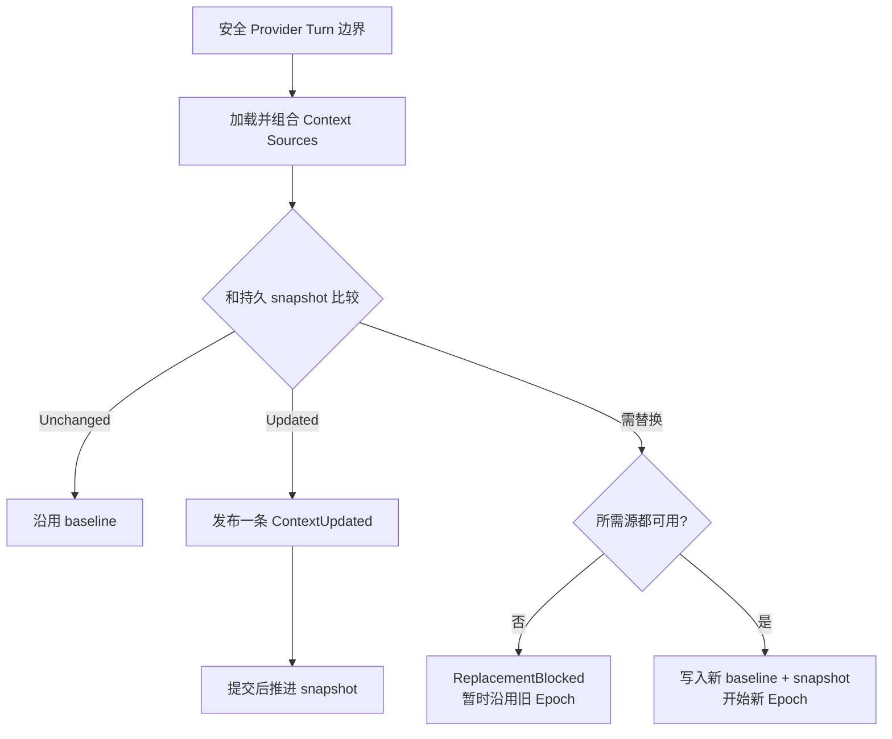

# 04 · 提示词与工作模式

> 读完本章，你应该能用自己的话回答：  
> 「发给大模型的，除了用户那句话，还塞了什么？Build 和 Plan 到底差在哪？」

上一章讲的是 **循环怎么转**（模型想 → 工具干 → 再想）。  
这一章讲的是：**每一轮转起来之前，系统到底给模型准备了怎样的「说明书」**，以及为什么要有 Build / Plan 两种工作模式。

建议你先读过：[03-Agent循环-一次对话如何跑完.md](./03-Agent循环-一次对话如何跑完.md)。

---

## 1. 这一章要解决什么问题？

想象你雇了一个很聪明、但 **刚走进公司第一天** 的实习生。

你只说：「把登录接口的 500 修掉。」

光这句话，他其实还缺很多东西：

| 他需要知道的 | 生活类比 | 编程 Agent 里对应什么 |
|--------------|----------|------------------------|
| 我是谁、怎么做事 | 入职培训：「你是工程师，要先读代码再改」 | Agent / Provider 的 **人格说明书**（基座提示词） |
| 我现在在哪、规矩是什么 | 工位、仓库路径、今天几号、公司 AGENTS.md | **System Context**（环境事实） |
| 刚才大家聊过什么 | 会议记录、昨天改过哪个文件 | **Session History**（对话历史） |
| 哪些事绝对不能干 | 门禁卡：财务室进不去 | **Permission**（权限硬闸门） |
| 今天是「只写方案」还是「动手改」 | 今天开规划会 vs 今天上线改代码 | **工作模式**（选哪个 Agent：build / plan） |

也就是说：**用户问题只是冰山一角**。  
Coding Agent 的质量，很大程度取决于——你有没有把上面这些「该知道的」**分层、稳定、可演进地**交给模型。

---

## 2. 新手最 naive 的做法：一整根 `system_prompt` 大字符串

很多人第一版会这样：

```python
SYSTEM = """
你是编程助手。当前目录是 /Users/me/app。今天是周五。
绝对不要改文件……等等我又改主意了你其实可以改。
用户仓库里有 AGENTS.md，内容是……（把整文件粘进来）
可用技能有 skill-a、skill-b……
记得用 TodoWrite……记得先探索……记得别删 .env……
"""

messages = [
    {"role": "system", "content": SYSTEM},
    {"role": "user", "content": user_text},
]
```

### 2.1 为什么它「能跑 Demo，却很难长大」

| 问题 | 会发生什么 |
|------|------------|
| **一切搅在一起** | 「你是谁」和「今天几号」混在同一段；改一条日期，整段提示都变了 |
| **每轮重拼** | 对话越长，system 越臃肿；也很难做「前缀缓存」（很多厂商对 **开头不变** 的 token 有优惠） |
| **软约束当硬约束** | 只写「禁止改文件」，模型偶尔还是会调用 edit——没有门禁卡，只有口头叮嘱 |
| **模式靠猜** | 想靠提示词让模型「自己判断该规划还是该改代码」——意图分类不准，还难调试 |
| **环境一变就乱** | 用户换了目录、装了新 skill、改了 AGENTS.md，你不知道该 **整段重印** 还是 **发一张变更通知** |

也就是说：大字符串不是「错」，而是 **把三种不同寿命、不同职责的信息，硬塞进一个盒子**。

OpenCode 的演进，基本上就是把这个盒子拆开。

---

## 3. OpenCode 的三层：人格说明书 vs 环境事实 vs 对话历史

官方命名（见仓库根目录 `CONTEXT.md`）刻意 **不要** 把一切都叫「system prompt」。  
白话可以记成三层：

```text
┌─────────────────────────────────────────────┐
│ ① 人格说明书（Agent / Provider 基座文本）      │
│    「你是 OpenCode」「工具怎么用」「Plan 只读」   │
├─────────────────────────────────────────────┤
│ ② System Context（环境事实，可刷新）           │
│    工作目录、日期、AGENTS.md、技能索引……       │
├─────────────────────────────────────────────┤
│ ③ Session History（对话历史）                 │
│    用户话、助手回复、工具结果、中途的「变更通知」 │
└─────────────────────────────────────────────┘
```

### 3.1 第一层：人格说明书

- **像什么**：员工手册里「岗位职责」那一章——相对稳定，不天天改。
- **从哪来**：
  - 默认：按模型厂商选不同的提示词文件，例如 `anthropic.txt`、`gpt.txt`、`gemini.txt`……
  - Plan 模式还会叠上只读约束（`plan.txt`）和五阶段工作流提醒（`plan-mode.txt`）
  - 用户也可以在配置里给某个 agent 写自定义 `prompt`
- **解决什么**：告诉模型 **怎么扮演这个角色**、工具使用习惯、语气、禁忌。

### 3.2 第二层：System Context（环境事实）

- **像什么**：工位信息、今天的日期、墙上贴的团队规范——**会变**，但变的方式和「聊天内容」不一样。
- **典型内容**：
  - 当前工作目录、是否 git 仓库、操作系统
  - 今天的日期
  - 项目里聚合出来的 `AGENTS.md` 等指令
  - 可用 Skill 的 **名字和简介**（不是整份技能正文）
- **关键点**：它是 **结构化的「事实源」拼出来的**，不是手写一大段散文。V2 里这叫 System Context 代数（后面第 7 节展开）。

### 3.3 第三层：Session History（对话历史）

- **像什么**：这次任务的会议记录。
- **包括**：用户消息、助手消息、工具调用与结果，以及（V2）环境变更时插入的 **中途系统消息**。
- **注意**：已经排队但还没「入席」的用户输入（inbox 里的 admit）**模型还看不见**——详见第 03 章。

### 3.4 为什么要拆三层？（设计动机）

| 拆开的好处 | 白话 |
|------------|------|
| 不同变化频率 | 人格很少改；日期天天变；对话每轮变 |
| 利于缓存 | 前面一大段 baseline 固定，后面只追加，厂商缓存更友好 |
| 利于调试 | 「模型乱改文件」到底是人格写错了、权限没关，还是历史带偏了？ |
| 利于演进 | 加一种新环境事实（比如新 skill 列表），不必重写整本人格手册 |

---

## 4. Build vs Plan：硬闸门 + 软引导

OpenCode 里，「模式」**不是**单独的 Intent 引擎，而是：

> **你显式选中的 Agent**（例如 `build` 或 `plan`）  
> = 一套 **权限规则** + 一套 **提示词**

可以记成双重保护：

```text
        ┌──────────────────────┐
用户选  │  Agent = build/plan  │
模式 ──►│                      │
        │  ① Permission 硬闸门  │──► 不允许的工具直接失败 / 被摘掉
        │  ② Prompt 软引导      │──► 告诉模型「今天该怎么做事」
        └──────────────────────┘
```

### 4.1 硬闸门：Permission

模型就算「嘴上答应不改文件」，只要它发出 `edit` / `write` 之类的工具调用，系统仍会走权限评估：

- `deny` → **直接拒绝**（不是靠模型自觉）
- `ask` → 弹给人确认
- `allow` → 放行

也就是说：**安全边界写在权限里，不写在「求求你别改」的提示词里。**

### 4.2 软引导：Prompt

权限解决「能不能」；提示词解决「该怎么想、按什么流程做」。

- Build：执行型人格——帮用户把软件工程任务做完，善用 TodoWrite、工具策略等
- Plan：只读分析 + 五阶段规划工作流——先搞清楚再写计划文件，最后 `plan_exit`

### 4.3 对照表（记这张就够）

| 层 | Build（默认动手） | Plan（先规划） |
|----|-------------------|----------------|
| **Permission** | 编辑类默认允许；允许 `question`、`plan_enter` | `edit:*` 默认 **deny**；仅允许改计划文件（如 `.opencode/plans/*.md`）；允许 `plan_exit`、`question` |
| **Prompt** | 执行型（如 `anthropic.txt` 等） | 只读约束（`plan.txt`）+ 五阶段（`plan-mode.txt`） |
| **主要产物** | 代码 / 命令结果 | 计划 markdown + 等人批准的 `plan_exit` |
| **从 Plan 切回 Build** | — | 注入类似 `build-switch.txt`：「你现在可以改文件了」 |

### 4.4 配置长什么样？（可抄的例子）

下面是 **示意风格**（贴近 OpenCode 真实合并逻辑，字段名便于理解；实际配置可能是 JSON/TS 配置对象）。

**Build 侧（概念上）：**

```yaml
# 概念示例：build agent
agent:
  build:
    mode: primary
    permission:
      question: allow
      plan_enter: allow
      # 其他多数工具沿用默认 allow；用户全局 permission 可再覆盖
```

**Plan 侧（概念上）：**

```yaml
# 概念示例：plan agent
agent:
  plan:
    mode: primary
    permission:
      question: allow
      plan_exit: allow
      task:
        general: deny   # 注意：与五阶段文案里「可派 general」存在张力，见后文
      edit:
        "*": deny
        ".opencode/plans/*.md": allow
        # 另外还允许全局 data/plans 下的计划文件路径
```

**用户想自定义一个「更怂的只读审查员」：**

```json
{
  "agent": {
    "reviewer": {
      "mode": "primary",
      "description": "只读代码审查，不许改仓库",
      "prompt": "你是严格的代码审查员。只给意见，不改文件。",
      "permission": {
        "edit": { "*": "deny" },
        "bash": "ask",
        "question": "allow"
      }
    }
  }
}
```

也就是说：在 OpenCode 里，**「新模式」≈「新 Agent 配置」**，而不是再写一个意图分类器。

### 4.5 真实源码里的默认值（便于对照）

Build / Plan 的默认权限合并逻辑在：

`packages/opencode/src/agent/agent.ts`

要点（截至本文写作时）：

- **build**：在 defaults 之上允许 `question`、`plan_enter`
- **plan**：允许 `question`、`plan_exit`；`edit` 全局 deny，仅白名单计划路径；并对 `task.general` 设为 **deny**

五阶段文案（`plan-mode.txt`）会鼓励用 `general` 做设计——这和默认 `task.general: deny` **不完全一致**。  
这是已知张力：做 pycode 时要 **二选一并写清楚**（改权限，或改文案），不要假装它们已经对齐。

### 4.6 Build / Plan / Reminders：别把三者混成一层

Legacy（V1）执行路径还有一个容易漏掉的部件：`packages/opencode/src/session/reminders.ts`。它不是第三种模式，而是一个 **按当前 Agent 和历史状态追加合成文本** 的适配层：

- 当前 Agent 是 Plan 时，把 `plan.txt` 或 `plan-mode.txt` 作为 `synthetic` 文本附到最近一条用户消息。
- 历史里曾由 Plan 回复、现在切到 Build 时，追加 `build-switch.txt`，明确撤销「仍处于只读阶段」的模型认知。
- 实验性 Plan Mode 开启时，还会检查计划文件是否存在，并告诉模型应该新建、增量修改，还是按已有计划执行。

这说明模式有三种不同性质的约束：

| 部件 | 回答的问题 | 可靠性 |
|------|------------|--------|
| Agent 配置 | 现在扮演 Build 还是 Plan？ | 显式选择，稳定 |
| Permission | 哪些动作真的能执行？ | 运行时硬约束 |
| Reminder | 此刻应记住哪段工作流或切换事实？ | 给模型看的软提示 |

**V2 注意事项**：System Context / Context Epoch 已经有明确的新架构，但 Legacy `reminders.ts` 中这些 Build↔Plan 切换与五阶段提醒，V2 常常还没有完全等价的接线。做 pycode 或迁移 V2 时，不能因为「已有 Epoch」就默认 reminder 语义自动出现；应逐项检查 **模式切换通知、Plan 工作流、计划文件位置、`plan_exit` 交互** 是否真的覆盖。

---

## 5. OpenCode 没有独立 NLU / 意图分类器

### 5.1 OpenCode 怎么选模式？

**没有**「读用户这句话 → NLU 判断意图 → 自动选择 plan/build」这种隐藏引擎，也没有一套独立的 Intent Router 在 Agent 循环前替模型分类。

模式 = 用户（或 UI / 命令）**显式选中的 Agent**：

- 默认常常是 `build`
- 用户切到 Plan → Agent 变成 `plan`
- 也可以是自定义 agent 名

遇到意图不清时，OpenCode 依靠的是三件显式机制，而不是幕后猜测：

1. **Agent**：用户或客户端明确选择 Build、Plan 或自定义角色。
2. **Permission**：即使模型理解错了，危险动作仍由 allow / ask / deny 硬控制。
3. **`question` 工具**：模型发现需求有歧义时，主动暂停并向用户提结构化问题。

例如「帮我看看登录模块」既可能是只读审查，也可能暗含修复要求。系统不会先跑一个 NLU 分类器偷偷切权限；当前 Agent 决定工作模式，模型若无法安全判断，就应调用 `question`。澄清通道的完整契约见 [16 · 澄清提问与交互契约](./16-澄清提问与交互契约.md)，权限硬闸门见 [06 · 权限、人机确认与命令安全](./06-权限-人机确认与命令安全.md)。

不变量可以记成（设计参考里的原话思路）：

> **Mode = Agent + Permission**（外加对应提示词）  
> **不是** NLU Intent Classifier

### 5.2 这对产品意味着什么？

| 好处 | 代价 |
|------|------|
| 行为可预测：你选 Plan，就按 Plan 的权限跑 | 用户必须知道「有模式」这回事，或 UI 要做得明显 |
| 调试简单：出问题先看当前 agent 名和 permission | 不会自动「听出你其实只想规划」 |
| 配置可扩展：加模式 = 加 agent | 错误选择会导致「想改却改不了」或「想只读却动手了」（后者有权限兜底） |

### 5.3 对 pycode 的启示

如果你在做 Python 复刻：

1. **先做显式模式**（CLI 参数、API 字段、`agent="plan"`），不要一上来做意图分类。
2. 若以后要做「智能推荐模式」，也应是 **建议层**（提示用户切换），不要悄悄改权限。
3. 模式切换时要像 OpenCode 一样考虑 **切换提示**（plan→build 的 `build-switch.txt`），否则模型可能还停在「只读人格」里犹豫。

---

## 6. Plan 五阶段工作流：用人话走一遍

Plan 模式的提示词（核心在 `plan-mode.txt`，另有 `plan.txt` 的只读硬声明）大致要求模型按五阶段做事。  
下面用一场 **虚构但好懂的对话** 串起来。

**用户**（已切到 Plan）：  
「给用户设置页加一个深色模式开关。」

### Phase 1：先搞懂（Initial Understanding）

- **目标**：弄清用户要什么、代码现在长什么样。
- **做法**：优先派 **explore** 子代理去搜（提示词里最多并行约 3 个，通常 1 个就够）。
- **然后**：用 `question` 把含糊处问清楚。

**助手可能做的事**：

1. 启动 explore：「设置页路由在哪？有没有现成的 theme 上下文？」
2. 问用户：「深色模式是跟系统走，还是应用内独立开关？要不要持久化到本地？」

### Phase 2：设计方案（Design）

- **目标**：在理解代码之后，设计实现路径。
- **文案倾向**：可派 **general** 子代理帮忙出方案（注意：默认权限可能 deny general，见 4.5）。

**助手可能做的事**：  
「方案 A：CSS 变量 + `localStorage`；方案 B：接现有 design token……推荐 A，因为……」

### Phase 3：核对（Review）

- **目标**：自己再读关键文件，确认方案没跑偏；还有疑问继续 `question`。
- **不是** 直接改业务代码。

### Phase 4：写下最终计划（Final Plan）

- **目标**：把 **推荐方案** 写入计划文件（通常是 `.opencode/plans/*.md`）。
- **硬事实**：在 Plan 权限下，这往往是 **唯一允许编辑的一类文件**。
- 计划里通常要有：改哪些路径、怎么验证（跑什么测试 / 怎么手工点一遍）。

### Phase 5：`plan_exit`（等人批准）

- **目标**：规划结束，请求用户批准计划（不是再用 `question` 问「计划可以吗？」——那是 `plan_exit` 的职责）。
- 用户 Yes → 切到 Build 执行；用户 No → 继续改计划文件。

### 6.1 一张脑图

```text
Explore（explore≤3）
    → 澄清 question
        → Design（文案说可 general）
            → Review（再读关键文件 + question）
                → 写入 plans/*.md
                    → plan_exit 等人
                        → Yes：Build 动手
                        → No：回到改计划
```

### 6.2 和 Build 里「TodoWrite」有什么不同？

| | Plan 的计划文件 | Build 的 TodoWrite |
|--|-----------------|---------------------|
| 目的 | 给人批准的 **持久方案文档** | 执行过程中的 **轻量进度清单** |
| 权限 | Plan 下几乎唯一可写的业务相关文件 | Build 下普通工具 |
| 结束信号 | `plan_exit` | 任务做完即可 |

也就是说：Plan 是「开工前的设计评审」；TodoWrite 是「开工后的看板」。

---

## 7. System Context / Context Epoch：员工手册类比

这一节对应 V2 目标架构（pycode 应对齐），比 V1「每轮重拼 system 数组」更清晰。

### 7.1 System Context 是什么？

把它想成：**当前生效的环境事实合集**。

不是散文式「system prompt」，而是多个 **Context Source（上下文源）** 拼出来的：

| 源（例子） | 告诉模型什么 |
|------------|--------------|
| `core/environment` | 工作目录、是否 git、平台…… |
| `core/date` | 今天的日期 |
| instructions | AGENTS.md 等项目指令聚合 |
| skill-guidance 等 | 有哪些技能 **可按需加载**（索引，不是全文） |

每个源有稳定的 key，会：

1. **load** 当前值  
2. 用 **baseline** 渲染「第一次完整说明」  
3. 用 **update** 渲染「跟上次比，现在变成了……」  
4. 必要时用 **removed** 说明某动态源没了  

这里的「代数」不是高深数学，而是说这些源有一组 **可组合、可解释、可测试的固定操作**：

| 操作 / 结果 | 白话含义 |
|-------------|----------|
| `empty` | 没有任何上下文源的单位元 |
| `make(source)` | 把一种强类型事实封装成统一的上下文源 |
| `combine([...])` | 按稳定顺序组合不同类型的源；重复 key 立即报错 |
| `initialize` | 全量采样，产出模型可见 baseline + 可持久化 snapshot |
| `reconcile` | 当前值和 snapshot 对比，得出 Unchanged / Updated / Replacement |
| `replace` | 无法安全增量比较时，准备一代完整的新 baseline |

`snapshot` 保存的是 **结构化比较状态**，不是把提示词文本再存一遍。每个源用自己的 codec 编解码值、用等价关系判断是否变化，再由自己的 `update(previous, current)` 生成人能读懂的更新文本。于是「比较事实」和「怎么告诉模型」不会混在一串字符串里。

还有两个故障语义很重要：

- `unavailable` 表示「这次暂时观察不到」，**不等于源被删除**。普通刷新会保留已 admit 的旧 snapshot，避免一次临时 I/O 失败就谎称规则消失。
- 若旧 snapshot 与新 codec 不兼容，或某个没有 `removed` 文案的源真的消失，就不能伪造增量更新，而应请求 **replacement**；replacement 所需的已知源仍 unavailable 时，结果是 `ReplacementBlocked`，继续沿用旧 baseline，等待以后再试。

### 7.2 Context Epoch（上下文世代）是什么？

类比：

| 公司文档 | OpenCode |
|----------|----------|
| 《员工手册》第 3 版整本印发 | **Baseline System Context**（某一世代的完整环境说明） |
| 这一版手册使用期间 | **Context Epoch**（同一 baseline 保持不变的时间段） |
| 平时只发「变更通知」：食堂改到 3 楼 | **Mid-Conversation System Message**（中途系统消息） |
| 大改版 / 搬家 / 合并裁员后重印手册 | **新 Epoch**（compaction、Session 迁移等会 `replace`） |

也就是说：

- **同一 Epoch 内**：开头那份完整环境说明 **尽量不变**（利于 provider 前缀缓存）。
- **环境变了**：不要撕掉整本重印；在对话时间线上追加一条「现在环境是……」。
- **采样时机**：不是源文件一变就立刻推送，而是等到 **Safe Provider-Turn Boundary**（安全的模型调用边界：该 promote 的用户输入已处理、该结算的工具已结算）再懒采样、合并成 **一条** 中途系统消息。

Epoch 不是一个纯内存缓存。V2 会耐久保存 baseline、snapshot 和 `baseline_seq`：

- `baseline_seq` 标记这份完整说明从事件时间线的哪个位置开始生效。
- 同 Epoch 的 `Updated` 会发布一条 `ContextUpdated` 事件；事件提交成功后才推进 snapshot，避免「模型看到了更新，但比较状态没记住」或反过来。
- 发生 compaction，且压缩点越过旧 baseline 后，系统会尝试建立 replacement generation，让压缩后的历史有一份自洽的新开场说明。

因此，Epoch 真正解决的是 **时间语义**：回放任意一段历史时，都能回答「当时哪份 baseline 生效、后来追加过哪些环境更新」。



### 7.3 为什么说它对缓存友好？

很多模型服务会对 **请求前缀相同** 的部分做缓存优化。

若你每轮都把「整本手册 + 日期 + AGENTS + skill 列表」重拼成全新 system 字符串，哪怕只改了一个日期字符，前缀也可能整段失效。

Epoch 策略是：

```text
[固定的 Baseline 前缀]  ← 同一 Epoch 内反复复用
[对话历史……]
[偶尔一条：环境更新说明]
[本轮用户 / 工具结果……]
```

这对成本和延迟都更友好；也让「环境更新」变成可审计的历史事件，而不是神秘地改写了开头。

### 7.4 V1 vs V2（你做 pycode 时别走弯路）

| | V1（旧路径，仍常见） | V2（应对齐） |
|--|---------------------|--------------|
| 做法 | 每轮重拼 system 数组 + 各种 reminder 注入 | System Context 代数 + Context Epoch |
| 风险 | 难缓存、难推理「哪次环境变更」 | 实现稍复杂，但语义干净 |
| pycode | 不要当目标 | **直接上 Epoch**，避免先抄 V1 再迁移 |

---

## 8. 实例：一次请求大概组装成什么样？

下面是一份 **教学用标注文本块**（不是精确的线上 wire format）。  
假设：用户在 Plan 模式，第一次提问。

```text
════════════════════════════════════════════════════════
【A. Baseline System Context｜本 Epoch 的员工手册全文】
════════════════════════════════════════════════════════
Here is some useful information about the environment you are running in:
<env>
  Working directory: /Users/me/myapp
  Workspace root folder: /Users/me/myapp
  Is directory a git repo: yes
  Platform: darwin
</env>
Today's date: Fri Aug 07 2026

（此处还有 AGENTS.md 聚合内容、可用 skill 的 name/description 索引……）

════════════════════════════════════════════════════════
【B. Agent 人格说明书｜岗位职责】
════════════════════════════════════════════════════════
（Plan 只读约束，来自 plan.txt 一类文本）
CRITICAL: Plan mode ACTIVE - READ-ONLY ...
禁止随意改业务文件；只能观察、分析、规划……

（以及 plan-mode 五阶段工作流提醒）
Phase 1 … Phase 5: 结束时调用 plan_exit …

（若是 Build，这里换成 anthropic.txt / gpt.txt 等执行型人格）

════════════════════════════════════════════════════════
【C. Session History｜会议记录】
════════════════════════════════════════════════════════
user:
  给用户设置页加一个深色模式开关。

（若环境中途变了，可能出现：）
system:   # Mid-Conversation System Message
  The environment you are running in is now: ...
  （或：skill 列表更新、日期更新等合并后的一条说明）

assistant:
  （可能先调用 task/explore、question……）

tool:
  （探索结果……）

════════════════════════════════════════════════════════
【D. 本轮要模型继续做的事】
════════════════════════════════════════════════════════
（继续生成：再读文件 / 写 plans/*.md / plan_exit / 回答用户）
```

### 8.1 读这段时抓住三句话

1. **A 变少、变慢**（同一 Epoch 尽量稳）。  
2. **B 随 Agent 变**（build / plan / 自定义）。  
3. **C 随对话变**；环境抖动进 C 的「中途系统消息」，而不是偷偷改写 A。

---

## 9. 设计取舍：优点、缺点、常见手段

### 9.1 按厂商拆提示词文件（`anthropic.txt`、`gpt.txt`……）

| 优点 | 缺点 |
|------|------|
| 能贴合不同模型的习惯与能力边界 | 多份文本要同步维护，容易「改了一处漏了另一处」 |
| 出问题时可单独调某一厂商 | 新人不知道该改哪份 |
| 比「一份提示通吃所有模型」效果往往更好 | 测试矩阵变大 |

**pycode 建议**：可以保留「默认一份 + 按 provider 覆盖」；但先保证 **三层结构** 正确，再堆厂商特化。

### 9.2 Plan 的 reminder / 五阶段长提示

| 优点 | 缺点 |
|------|------|
| 复杂规划有固定节奏，少一上来就改代码 | 提示很长，占上下文 |
| 和只读权限形成双保险 | 文案与真实权限可能漂移（如 general） |
| `plan_exit` 给人明确的批准点 | 模型可能提前结束或阶段跳步——仍需权限兜底 |

**pycode 建议**：工作流提示要 **短而可测**；阶段约束能靠工具/权限表达的，就不要只写在散文里。

### 9.3 模式切换提示（`build-switch.txt`）

| 优点 | 缺点 |
|------|------|
| 明确告诉模型「角色变了」 | 又多一种注入文本 |
| 减少 Plan 人格残留到 Build | 切换瞬间的历史里仍有大量「只读」上下文，偶发惯性 |

### 9.4 「只有软提示、没有硬权限」——不推荐

这是最常见的失败模式：  
只写「你是只读的」，却把 `edit` 工具完整暴露且默认 allow。

模型一旦幻觉或被用户话术带偏，就会改文件。  
OpenCode 的经验是：**软引导负责体验，硬闸门负责安全。**

### 9.5 「自动意图分类选模式」——OpenCode 故意不做

| 若做自动分类 | 为何 OpenCode 先不做 |
|--------------|----------------------|
| 少点一次切换 | 分类错误代价高（静默改权限更可怕） |
| 看起来更「智能」 | 难复现、难测试、难向用户解释 |

pycode 若要做，建议：**推荐切换 ≠ 自动切换权限**。

### 9.6 System Context 代数 + Epoch

| 优点 | 缺点 |
|------|------|
| 可组合、可测试、可缓存 | 概念比「拼字符串」多，要学一会儿 |
| 变更可审计（中途系统消息） | 要实现边界采样、unavailable、replace 等细节 |
| 和新 Source（插件/指令）扩展友好 | 错误实现会重复发更新或丢更新 |

---

## 10. 对应源码位置（初学可跳过，以后对照）

| 主题 | 路径 |
|------|------|
| 术语权威说明 | 仓库根目录 `CONTEXT.md` |
| Build/Plan 默认 Agent 与权限 | `packages/opencode/src/agent/agent.ts` |
| 执行型基座提示（Anthropic 等） | `packages/opencode/src/session/prompt/anthropic.txt` 等 |
| Plan 只读声明 | `packages/opencode/src/session/prompt/plan.txt` |
| Plan 五阶段工作流 | `packages/opencode/src/session/prompt/plan-mode.txt` |
| Plan→Build 切换提示 | `packages/opencode/src/session/prompt/build-switch.txt` |
| Plan 提醒类文本 | `packages/opencode/src/session/prompt/plan-reminder-anthropic.txt` |
| System Context 代数 | `packages/core/src/system-context/` |
| 内置环境/日期源 | `packages/core/src/system-context/builtins.ts` |
| Context Epoch 持久化 | `packages/core/src/session/context-epoch.ts` |
| 逐行对比笔记（进阶） | 仓库根目录 `BUILD_VS_PLAN_PROMPT_ANALYSIS.md` |

更完整的设计评审见根目录 `PYCODE_DESIGN_REFERENCE.md` 第 4 章；**入门请以本目录为准**。

---

## 11. 本章小结

用六句话收束：

1. **用户问题不够**：还要人格说明书、环境事实、对话历史，外加权限。  
2. **不要用一根巨无霸 system 字符串** 混装所有东西。  
3. OpenCode 拆成三层：**人格 / System Context / History**。  
4. **Build vs Plan = 显式 Agent**；**权限硬闸门 + 提示软引导**；没有自动意图分类器。  
5. Plan 用五阶段把「先调研再写计划再 `plan_exit`」说清楚；真正防改文件的是 **edit deny**。  
6. V2 用 **Context Epoch**：整本手册少重印，日常发变更通知——对缓存和审计都更友好。

---

## 12. 下一章读什么？

- 上一章：[03-Agent循环-一次对话如何跑完.md](./03-Agent循环-一次对话如何跑完.md) —— 提示词备好之后，循环如何一回合一回合跑。  
- 下一章：[05-工具-MCP-与Skill.md](./05-工具-MCP-与Skill.md) —— 模型「动手」时，工具箱、MCP、Skill 索引与正文如何分离。  
- 权限与弹窗细节：[06-权限-人机确认与命令安全.md](./06-权限-人机确认与命令安全.md)（读完 05 后很自然接上）。

若你正在设计 pycode：本章落地时优先实现 **显式 agent + permission 合并 + System Context Epoch**；厂商特化提示词和华丽五阶段文案可以第二波再加。
