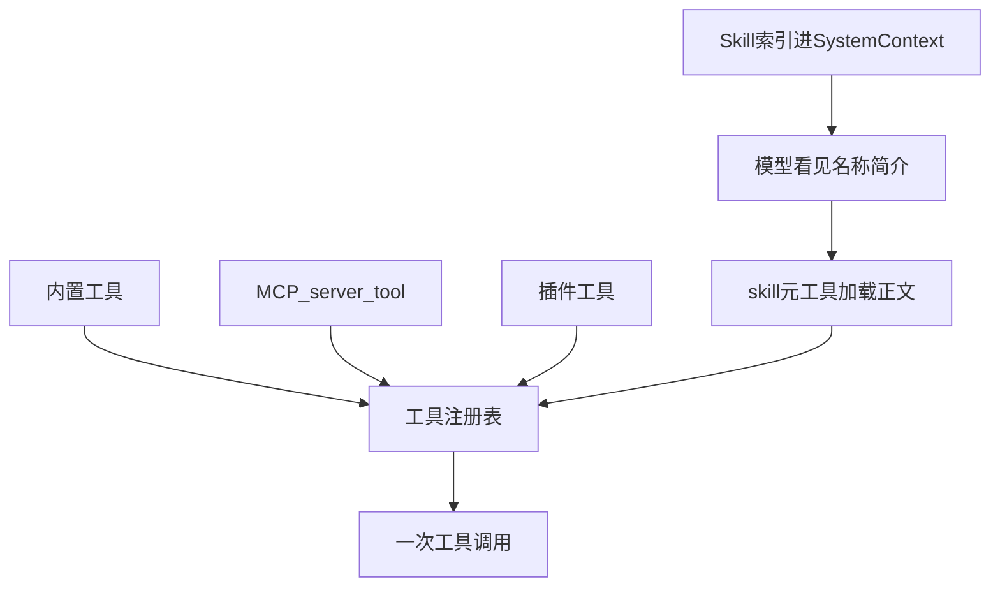

# 05 · 工具、MCP 与 Skill

> 读完本章，你应该能用自己的话回答：  
> 「模型为什么需要工具？MCP 和 Skill 各解决什么问题？它们分别像什么？」

上一章讲的是「怎么对模型说话」（提示词与 Build/Plan 模式，见 [04-提示词与工作模式.md](./04-提示词与工作模式.md)）。  
本章讲的是「模型怎么动手」——工具箱、外挂插件、以及按需加载的说明书。

下一章会专门讲「动手时谁来拦」——权限弹窗与命令安全（见 [06-权限-人机确认与命令安全.md](./06-权限-人机确认与命令安全.md)）。  
本章会提到权限，但细节留给 06。

---

## 1. 这一章要解决什么问题？

大模型本身只会「想」和「说」。  
它看不见你硬盘上的文件，也不能直接跑 `npm test`。

Coding Agent 要真正帮你改代码，必须给它一双手。这双手就是 **工具（Tools）**。

可以用两个生活类比记牢本章三件套：

| 概念 | 生活类比 | 一句话 |
|------|----------|--------|
| **内置工具** | 电脑出厂自带的键盘、屏幕 | Agent 默认就能读写文件、搜代码、跑命令 |
| **MCP** | **USB 接口**——插上别人做的外设 | 用标准插头接上「公司文档 / 浏览器 / 工单系统」等外挂工具箱 |
| **Skill** | **说明书**——教你怎么用现有工具做某类事 | 按需加载一篇 `SKILL.md`；**不会**自动长出新按钮 |

本章会走完整条链路：


三类扩展怎么接到同一工具箱：



---

## 2. 为什么模型需要工具？

### 2.1 没有工具时，模型只能「空口说白话」

用户说：「把 `README.md` 里的项目名改成 PyCode。」

没有工具的模型可能回答：

> 「好的，请你打开 README，把第一行改成 `# PyCode`……」

这很像请了一个只会口头指导、却不能碰键盘的顾问。  
你要的是：**它自己去读、去改、去验证**。

### 2.2 有了工具，模型才变成「能动手的实习生」

同样的任务，有工具时大致会变成：

1. 调用 `read`：读 `README.md`
2. 调用 `edit` 或 `write`：改掉标题
3. （可选）再 `read` 一遍确认
4. 用自然语言告诉你：「改完了」

**工具 = 模型与真实世界之间的受控接口。**  
模型不直接操作操作系统；它只能发起「工具调用」，由你的程序决定是否执行、如何执行、结果怎样回传。

### 2.3 工具还解决「记忆过时」的问题

模型训练数据可能过时。工具让它能：

- 读当前仓库的真实代码（不是它「记得」的旧版）
- 跑测试看真实失败信息
- 通过 MCP 查公司最新文档 / 工单状态

一句话：**工具把「猜测」变成「观察」。**

---

## 3. Naive 做法：模型说什么就执行什么

很多人第一版 Agent 会这样写：

```python
while True:
    reply = call_llm(messages)
    if not reply.tool_calls:
        break
    for call in reply.tool_calls:
        # 危险：原样执行，没有确认、没有截断、没有审计
        result = run_whatever(call.name, call.arguments)
        messages.append({"role": "tool", "content": result})
```

Demo 能跑通，但很快会踩坑：

| 危险 | 会发生什么 |
|------|------------|
| **任意命令** | 模型幻觉出 `rm -rf /` 或 `curl \| bash`，直接在真机执行 |
| **无限循环** | 同一工具同一参数连调十几次，烧钱又卡死 |
| **巨大输出** | `cat` 一个 50MB 日志，下一轮上下文爆掉 |
| **无法审计** | 出事后不知道「到底执行了哪次、参数是什么」 |
| **无法扩展** | 每加一个能力就改核心循环；公司内部系统接不进来 |
| **说明书塞爆提示词** | 把所有「怎么写 React / 怎么用内部 SDK」全文塞进 system，上下文瞬间不够 |

OpenCode（以及 pycode 应对齐的设计）做的，就是把「工具」从「随便 `eval`」升级成：

- **有定义**（名字、描述、参数 schema）
- **有注册表**（内置 + MCP + 插件）
- **有权限**（allow / deny / ask，见 06）
- **有回传边界**（截断、大结果落盘）
- **有钩子**（执行前后可插入公司规范）
- **有 Skill**（说明书按需加载，不抢上下文）

---

## 4. 工具定义长什么样？

模型要调用工具，必须先「看见」工具说明书。  
对 LLM API 来说，这通常是一份 **JSON Schema**：工具名、描述、参数类型。

### 4.1 给模型看的定义（JSON 示意）

```json
{
  "name": "read",
  "description": "读取文件或目录内容。大文件请用 offset/limit 分页。",
  "parameters": {
    "type": "object",
    "properties": {
      "filePath": {
        "type": "string",
        "description": "要读取的绝对路径"
      },
      "offset": {
        "type": "integer",
        "description": "从第几行开始读（从 1 起），可选"
      },
      "limit": {
        "type": "integer",
        "description": "最多读多少行，可选"
      }
    },
    "required": ["filePath"]
  }
}
```

模型若决定调用，会返回类似：

```json
{
  "name": "read",
  "arguments": {
    "filePath": "/Users/you/project/README.md",
    "limit": 80
  }
}
```

你的运行时再根据名字找到实现函数，校验参数，执行，把结果塞回对话。

### 4.2 Python 里可以怎么写（教学示意）

下面不是 OpenCode 源码照搬，而是 **pycode 可以参考的清晰形状**：

```python
from dataclasses import dataclass
from typing import Any, Callable
import jsonschema

@dataclass
class Tool:
    name: str
    description: str
    parameters: dict  # JSON Schema
    execute: Callable[[dict], Any]

    def to_llm_definition(self) -> dict:
        return {
            "name": self.name,
            "description": self.description,
            "parameters": self.parameters,
        }

    def run(self, arguments: dict) -> Any:
        jsonschema.validate(arguments, self.parameters)
        return self.execute(arguments)


def read_file(args: dict) -> str:
    path = args["filePath"]
    # 真实实现还会：权限检查、路径限制、截断……
    with open(path, encoding="utf-8") as f:
        return f.read()


read_tool = Tool(
    name="read",
    description="读取文件内容",
    parameters={
        "type": "object",
        "properties": {
            "filePath": {"type": "string", "description": "绝对路径"},
            "offset": {"type": "integer"},
            "limit": {"type": "integer"},
        },
        "required": ["filePath"],
    },
    execute=read_file,
)
```

OpenCode V2 侧对应的思路是：每个工具是一个不透明值，大致包含 `description`、`input`、`output`、`execute`、`toModelOutput`（领域结果 → 喂给模型的文本）。  
**注册表只管目录与调用；执行授权在工具叶子里做**——隐藏某个工具 ≠ 已经安全。

---

## 5. 内置工具目录（白话版）

可以把内置工具想成 Agent 的「出厂配件」。这里必须区分 **V2 Core 已经接线的静态清单**，以及 **Legacy 产品路径已有、V2 仍待迁移的能力**：

| 能力 | V2 Core（`builtins.ts`） | Legacy 注册表 | 白话职责 |
|------|--------------------------|---------------|----------|
| `read` / `write` | 已实现 | 已实现 | 读文件、整文件写入 |
| `edit` | 已实现；模糊编辑完整对齐仍是 TODO | 已实现 | 局部修改文件 |
| `apply_patch` | 已实现 | 已实现；按模型与 edit/write 互斥展示 | 用补丁修改 |
| `bash` | 已实现 | 已实现（注册实现名为 Shell） | 跑命令；高风险 |
| `glob` / `grep` | 已实现 | 已实现 | 按文件名 / 内容搜索 |
| `question` | 已实现 | 已实现；仅交互客户端或显式开关启用 | 向用户澄清 |
| `skill` | 已实现 | 已实现 | 按名字加载 Skill 正文 |
| `todowrite` | 已实现 | 已实现（Legacy ID 为 `todo`） | 维护轻量待办 |
| `webfetch` / `websearch` | 已实现 | 已实现（Legacy ID 为 `fetch` / `search`） | 拉 URL / 联网搜索 |
| `task` | **待迁移** | 已实现 | 派子 Agent（见 [07](./07-多Agent怎么协作.md)） |
| LSP | **待迁移** | 实验开关下启用 | 查定义、引用、诊断 |
| `plan_exit` | **待迁移** | CLI 实验计划模式下启用 | 退出计划阶段 |
| Rune / code mode | **待迁移** | 实验开关下以 `execute` 暴露 | 代码模式编排工具 |
| `repo_clone` / `repo_overview` | **待迁移** | V2 TODO 列出的后续叶子，不应假称已注册 | 仓库获取与概览 |

V2 的准确静态清单是 12 个：`apply_patch`、`bash`、`edit`、`glob`、`grep`、`question`、`read`、`skill`、`todowrite`、`webfetch`、`websearch`、`write`。  
Legacy 另外还有兜底的 `invalid` 工具，并会把插件工具、项目内 `{tool,tools}/*.ts` 与 MCP 工具动态合入 Session；这些不属于 V2 `builtins.ts` 的静态清单。

> 不要把 TODO 读成「完全不存在」：这里的 TODO 是 **尚未迁入 V2 canonical registry**。其中多项能力已在 Legacy 产品路径工作。

### 5.1 小例子：修一个 typo

```text
用户：把 src/hello.py 里的 "Helo" 改成 "Hello"

模型可能：
  1) grep(pattern="Helo", path="src")
  2) read(filePath=".../src/hello.py")
  3) edit(... 替换那一行 ...)
  4) bash("python -m pytest tests/test_hello.py")  # 若有测试
  5) 文本回复：改完了
```

每一步都是「模型提议 → 系统执行 → 结果回模型」，而不是模型直接改磁盘。

---

## 6. MCP：插拔式外挂工具箱（USB 类比）

### 6.1 为什么需要 MCP？

内置工具覆盖「写代码」的通用动作。  
但公司还有：Confluence、Jira、内部浏览器、数据库只读查询……

如果每接一个系统都改 Agent 核心代码，维护会爆炸。  
**MCP（Model Context Protocol）** 提供标准插头：别人写好一个 MCP Server，你在配置里「插上」，工具就出现在模型的工具列表里。

类比：

- 电脑主板 = Agent 运行时
- USB = MCP 协议
- U 盘 / 摄像头 / 键盘 = 各个 MCP Server

你不需要为每个外设重焊主板，只需认标准接口。

### 6.2 配置长什么样？

通常在项目的 `opencode.json` / `opencode.jsonc` 里写 `mcp` 段：

```jsonc
{
  "$schema": "https://opencode.ai/config.json",
  "mcp": {
    // 本地进程：stdio 拉起一个命令
    "filesystem-docs": {
      "type": "local",
      "command": ["npx", "-y", "@modelcontextprotocol/server-filesystem", "/path/to/docs"],
      "enabled": true,
      "timeout": 10000
    },

    // 远程 HTTP：连公司部署的 MCP
    "jira": {
      "type": "remote",
      "url": "https://jira.example.com/mcp",
      "enabled": true,
      "headers": {
        "X-Team": "platform"
      },
      // OAuth：需要登录时配置；设为 false 可关闭自动探测
      "oauth": {
        "scope": "read:jira-work"
      }
    }
  }
}
```

要点：

- **`local`**：用 `command` 数组启动子进程（像「插上本地 USB 设备」）
- **`remote`**：用 `url` 连远程服务（像「连网上的打印机」）
- **`enabled`**：可单独开关，不必删配置
- **`timeout`**：单次请求超时（毫秒）

### 6.3 命名：`server_tool`

MCP 里每个 server 可以暴露多个 tool。  
进到 Agent 后，名字通常变成：

```text
{清洗后的服务器名}_{清洗后的工具名}
```

例如 server 叫 `jira`，工具叫 `create_issue`，模型看到的可能是：

```text
jira_create_issue
```

这样：

- 不同 server 同名工具不会撞车
- 权限规则也可以按「整工具名」配置（见 06）

### 6.4 OAuth（只需知道「要登录时怎么办」）

有些远程 MCP（公司 SaaS）需要先授权。流程直觉是：

1. 连接时发现需要登录（状态类似 `needs_auth`）
2. 打开浏览器走 OAuth
3. 回调到本地端口，存下 token
4. 之后工具调用带上凭证

配置里的 `oauth` 可指定 `clientId` / `scope` / 回调端口等；设为 `false` 则关闭自动探测。  
**初学者先记住**：MCP 可以接需要登录的服务，登录是连接阶段的事，不是每个工具调用都弹一次浏览器。

### 6.5 执行时还会发生什么？（概览）

```text
config.mcp
  → 启动/连接 MCP Client
  → list_tools（可分页）
  → 注册进本 Session 的工具表（名字变成 server_tool）
  → 广告给模型
  → 模型调用 → 权限 ask（按工具名）
  → client.callTool
  → 结果规范化（文本/图片/资源）→ 截断后回模型
```

此外还可能有资源三件套（列出资源、模板、读取资源），以及把 MCP 的使用说明注入系统提示（过滤掉被全盘 deny 的 server）。

---

## 7. Skill：说明书包（不是新工具工厂）

### 7.1 Skill 是什么？

**Skill = 一篇（或一套）教 Agent「怎么做某类事」的 Markdown 说明书。**  
典型文件名：`SKILL.md`。

类比：

- 工具 = 电钻、卷尺（具体能力）
- Skill = 《如何按公司规范装书架》的小册子（流程与约束）

小册子会告诉你：先量尺寸、再用电钻、最后自检。  
它 **不会**  magically 变出一把新电钻——除非正文里写「请调用某某已有工具」。

### 7.2 两个阶段：索引进上下文 vs 正文按需加载

这是 OpenCode 非常关键的设计，务必分清：

| 阶段 | 模型看到什么 | 目的 |
|------|--------------|------|
| **索引** | 只有 `name` + 短 `description` 列表 | 省上下文；让模型知道「有哪些说明书可借」 |
| **加载** | 调用 `skill(name)` 后，拿到 `<skill_content>` 全文（及同目录少量附属文件路径） | 真要用时再展开，避免把所有手册塞进 system |

常见误区：

> 「加载 Skill 会自动注册一堆新 MCP 式工具。」

正确理解：

> 「加载 Skill 只是把说明书正文注入对话；动手仍靠已有工具（read/bash/MCP…）。」

若你做 pycode 时想要「Skill 展开成动态工具表」，那是 **额外设计**，不是 OpenCode 当前行为。

可以把两阶段记成一句公式：

```text
索引（name + description）告诉模型“可借哪些手册”
  ≠
加载（SKILL.md 正文）给工具注册表增加新能力
```

**加载 Skill ≠ 注册新工具。** 注册新工具要走内置注册、插件工具或 MCP；Skill 加载只产生一次工具结果，改变的是模型读到的上下文。

### 7.3 `SKILL.md` 长什么样？

```markdown
---
name: agents-sdk
description: >
  在 Cloudflare Workers 上用 Agents SDK 构建 AI Agent。
  当用户要做有状态 Agent、工作流、WebSocket、定时任务或 MCP 时加载。
---

# Cloudflare Agents SDK

**STOP.** 你对该 SDK 的预训练知识可能过时。优先查文档，不要凭记忆硬写。

## 第一步：确认安装

\`\`\`bash
npm ls agents
\`\`\`

## 推荐工作流

1. 用 webfetch / 浏览器类工具拉最新文档
2. 用 read/grep 看现有项目结构
3. 用 edit/write 改代码
4. 用 bash 跑测试

## 常见坑

- 不要假设某 API 仍存在；先核对当前 docs
```

前置 YAML（front matter）里的 `name` / `description` 就是进「索引」的那两行。  
正文可以很长：步骤、表格、反例、链接——反正默认不塞进 system。

### 7.4 Skill 从哪里发现？

发现路径大致是多层叠加（具体优先级以实现为准），例如：

- 内置技能
- 用户主目录下的 `~/.agents/skills`、`~/.claude/skills` 等
- 从当前目录向上找 `.agents` / `.claude`
- 项目里的 `.opencode/skill` 或 `.opencode/skills`
- 配置里额外指定的路径 / URL

加载时通常还会做权限过滤：被 deny 的 skill 不会出现在索引里。

### 7.5 走一遍：模型如何「借说明书」

```text
1. 系统提示（或 Context）里列出：
     - agents-sdk: 构建 Cloudflare Agents …
     - rtl-aware-development: 做 RTL 布局时 …

2. 用户：「帮我在 Workers 上写一个带 Durable Object 的 Agent」

3. 模型判断：这和 agents-sdk 相关 → 调用 skill(name="agents-sdk")

4. 运行时：权限 ask（若需要）→ 读 SKILL.md → 把正文作为 tool result 返回

5. 模型按说明书：用 webfetch 拉文档、用 write 生成代码、用 bash 验证

6. 全程没有「新注册 20 个 Cloudflare 专用工具」，只是说明书 + 旧工具
```

---

## 8. 结构化结果如何回到模型？截断与大输出

### 8.1 为什么不能「原样把 stdout 塞回去」？

工具结果会进入下一轮模型上下文。  
若 `bash` 打出几万行日志，或 `read` 读了巨型文件：

- 立刻打爆上下文窗口
- 费用暴涨
- 模型反而抓不住重点

所以好的运行时会区分两层：

1. **领域完整结果**（给系统自己用：落库、给 UI、给后续工具）
2. **模型可见切片**（`toModelOutput` / 截断 / 预览 + 文件路径）

### 8.2 常见回传策略（直觉版）

| 情况 | 回传给模型什么 |
|------|----------------|
| 小结果成功 | 完整文本（或结构化再渲染成文本） |
| 结果太大 | 前 N 行/字节预览 +「完整内容在路径 X，请用 read 分段看」 |
| 参数非法 / 权限拒绝 / MCP 报错（可恢复） | **作为 tool result 告诉模型**，让它改参数或换方案 |
| 用户明确拒绝继续（如拒绝权限且不可纠正） | 可能 **中断** 本轮 continuation，而不是假装成功 |

原则：**能让模型自纠的失败，做成 tool result；用户说「别干了」才真正停。**

### 8.3 小例子：截断

```text
模型: bash("find . -type f | head -n 50000")

系统执行后发现输出巨大：
  → 保留完整输出到托管文件（如 /tmp/opencode-out/xxx.txt）
  → 给模型：
      「输出过长，已截断。预览如下：
       ...
       完整文件：/tmp/.../xxx.txt
       请用 read(offset/limit) 继续查看。」
```

Bash 自身可能还有「捕获字节上限」（进程侧），那和「喂给模型前的通用截断」是两层不同的保险，不要混为一谈。

---

## 9. Hook：工具执行前后的插件钩子

### 9.1 钩子是什么？

**Hook = 在关键时刻插入你自己的逻辑。**  
对工具来说，最常用的是：

- `tool.execute.before`：执行前改参数、加审计日志、注入环境策略
- `tool.execute.after`：执行后改写输出标题/正文、打点、脱敏
- `tool.definition`：改广告给模型的描述或参数说明
- `shell.env`：给 bash 注入额外环境变量

类比：工厂流水线在「开机前检查」和「出厂前贴标签」两个工位，插上你们公司的质检员。

### 9.2 简单插件例子（教学示意）

```typescript
// 伪代码：演示 before/after 能做什么
export const AuditToolsPlugin = async () => ({
  "tool.execute.before": async (input, output) => {
    // input: { tool, sessionID, callID }
    // output.args 可被修改
    console.log(`[audit] about to run ${input.tool}`, output.args)

    if (input.tool === "bash" && typeof output.args.command === "string") {
      // 例子：禁止直接打出密钥（真实系统应更严格）
      if (output.args.command.includes("printenv")) {
        output.args.command = "echo 'printenv blocked by plugin'"
      }
    }
  },

  "tool.execute.after": async (input, output) => {
    // output: { title, output, metadata }
    if (output.output.length > 10_000) {
      output.title = `${output.title} (truncated for display)`
    }
    // 可在此把结果发到公司审计系统
  },
})
```

注意：公开插件类型里可能还有 `permission.ask` 之类的 hook 名字，但 **权限真正的主路径是 Permission 服务 + 事件总线**（见 06）。  
做 pycode 时：要么把 hook 真正接到权限决策上，要么不要公开一个「看起来能拦权限、实际没接线」的 API。

---

## 10. 双轨说明：Legacy 功能全 vs V2 形状清

OpenCode 当前存在两条实现轨迹，读源码时不要晕：

| | **Legacy（`packages/opencode`，生产功能全）** | **V2 Core（`packages/core`，目标形状）** |
|--|-----------------------------------------------|------------------------------------------|
| 工具定义 | `Tool.define` + AI SDK `tool()` | `Tool.make({ input, output, execute, toModelOutput })` |
| 注册 | 实例内置 + 插件 + `.opencode/tool` + MCP | ApplicationTools（进程）+ Location Tools |
| 结算 | SessionTools + processor | `materialize` → `settle` → 输出绑定/截断 |
| Shell 安全深度 | AST 解析、BashArity、doom_loop 等较完整 | 多为整命令 ask；AST/arity 等仍在补 |
| MCP / 插件 hooks | 较完整 | **尚未全部迁入** canonical registry |

**pycode 应该怎么选？**

> 对齐 V2 的清晰形状（单一可执行工具类型、settle 边界截断、Location 作用域注册），  
> 同时从 Legacy **补齐** MCP、hooks、shell 深度安全等能力，  
> **不要永久维护两套工具系统。**

一句话：**形状跟 V2，能力并集合并。**

---

## 11. 走一遍完整示例：加功能 + 查文档 + 用 Skill

场景：用户说「给登录页加 RTL 支持，并按我们内部规范来」。

```text
① 索引阶段
   Context 里已有 skill 列表：
     rtl-aware-development — 做 RTL 布局时的检查清单
     …

② 模型调用 skill("rtl-aware-development")
   → 拿到说明书：先搜现有 dir 属性、再改 CSS、再自检……

③ 模型调用 grep / glob
   → 找到 Login.tsx、相关样式

④ 模型调用 read
   → 看现有实现

⑤ 若规范要求查内部设计系统文档
   → 调用 MCP：designsys_get_component(...)
   → 权限弹窗（用户点允许，细节见 06）

⑥ 模型调用 edit / write
   → 改组件与样式

⑦ 模型调用 bash("npm test -- Login")
   → 输出过长则截断 + 文件路径
   → 失败信息回模型 → 再 edit

⑧ 模型结束回复：「已按 Skill 清单完成 RTL，测试通过」
```

你会看到三类「手」分工清晰：

- **内置工具**：读改搜跑
- **MCP**：插上的外部知识/系统
- **Skill**：告诉模型「按什么顺序、注意什么」——本身不是新工具

---

## 12. 优点 / 缺点 / 做 pycode 时要注意什么

### 优点

- **模型与副作用解耦**：模型只提议，运行时执行，便于审计与权限
- **MCP 可插拔**：业务系统接入不必改核心循环
- **Skill 省上下文**：索引轻、正文按需，适合大量团队规范
- **统一截断边界**：大输出不轻易打爆下一轮提示
- **Hook 可扩展**：公司审计、脱敏、环境注入有落点

### 缺点 / 张力

- **双轨现状**：Legacy 与 V2 能力不一致，新人读代码易迷路
- **工具一多**：模型可能选错工具；需要好的 description 与权限过滤
- **Skill 误用**：有人期望「加载即注册工具」，与当前语义不符
- **MCP 质量参差**：坏的 server 会污染工具表；需要 enable 开关与权限
- **Hook 接线要诚实**：公开了却没触发的 hook，比没有更危险

### pycode 建议（实用清单）

1. 工具模型采用 **单一类型**（定义 + execute + to_model_output）
2. 尽早做 **参数 schema 校验** 与 **输出截断/落盘**
3. MCP 命名用 `{server}_{tool}`，配置支持 local/remote + enabled
4. Skill **只注入内容**；索引进 Context，正文走 skill 工具
5. 权限主路径做成一等公民（见 06），不要只靠提示词求模型「别乱来」
6. 合并双轨：以 V2 形状为骨架，把 Legacy 的 MCP/hooks/shell 深度能力搬过来

---

## 13. 对应源码位置（初学可跳过）

| 主题 | 路径 |
|------|------|
| 工具架构说明 | `packages/core/src/tool/AGENTS.md` |
| Tool V2（make / registry / settle） | `packages/core/src/tool/` |
| Legacy 工具注册 | `packages/opencode/src/tool/registry.ts` |
| 各内置工具实现 | `packages/opencode/src/tool/*.ts`（如 `read.ts`、`bash` 相关） |
| MCP 客户端 | `packages/opencode/src/mcp/index.ts` |
| MCP 配置 schema | `packages/core/src/v1/config/mcp.ts` |
| Skill 发现与加载 | `packages/opencode/src/skill/` |
| Skill 索引导引 | `packages/core/src/skill/guidance.ts` |
| 插件 Hook 类型 | `packages/plugin/src/index.ts` |
| Shell 深度安全（Legacy） | `packages/opencode/src/tool/shell.ts` |

更总览的设计笔记见仓库根目录 `PYCODE_DESIGN_REFERENCE.md` 第 6 章；入门请仍以本目录为准。

---

## 14. 和前后章的关系

- **上一章 [04-提示词与工作模式.md](./04-提示词与工作模式.md)**：决定模型「以什么人格、什么约束」工作；Skill 索引也常出现在系统上下文里。
- **本章**：模型「有哪些手、怎么插外设、怎么借说明书」。
- **下一章 [06-权限-人机确认与命令安全.md](./06-权限-人机确认与命令安全.md)**：这些手要动真格时，谁来点头、命令怎么解析、沙箱到底是不是 Docker。
- **深入扩展 [13-Hooks与插件扩展.md](./13-Hooks与插件扩展.md)**：工具定义和执行前后怎样接插件。
- **深入输出 [14-结构化工具结果与输出边界.md](./14-结构化工具结果与输出边界.md)**：完整结果怎样投影、截断和落盘。
- **深入安全 [17-工作区沙箱与命令安全深度.md](./17-工作区沙箱与命令安全深度.md)**：worktree、AST 与 OS 隔离分别能保护什么。

读完本章，建议用三句话自测：

1. 工具、MCP、Skill 分别像什么？  
2. 为什么 Skill 默认只放索引？  
3. 工具输出太大时，应该把什么喂给模型？

若三句都能答上来，就可以安心读 06 了。
