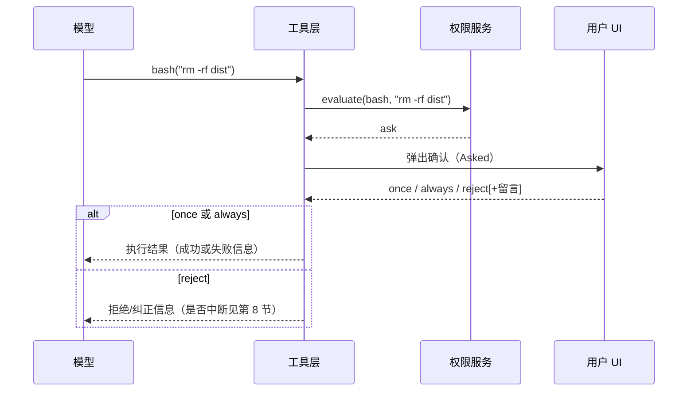

# 06 · 权限、人机确认与命令安全

> 读完本章，你应该能用自己的话回答：  
> 「为什么 Agent 要删文件时会弹窗？权限的 allow / deny / ask 分别干什么？沙箱是不是 Docker？」

上一章 [05 · 工具、MCP 与 Skill](./05-工具-MCP-与Skill.md) 讲了「工具箱里有什么、怎么调用」。  
本章讲：**工具想动手时，谁说了算？人怎么拦？命令怎么审？**

下一章 [07 · 多 Agent 怎么协作](./07-多Agent怎么协作.md) 会讲主 Agent 派子 Agent；子 Agent 也会继承一部分权限规则。

---

## 1. 这一章要解决什么问题？

Coding Agent 能读文件、改文件、跑终端命令。  
能力越大，**失手的代价越大**。

想象你雇了一个很能干、但偶尔会「脑补」的实习生：

- 你说：「清理一下临时文件」  
- 它可能理解成：`rm -rf /tmp/foo`  
- 也可能理解成：`rm -rf /`（整机根目录）

如果系统 **不问就执行**，一次误判就能毁掉工作区、密钥文件，甚至你电脑上的别的目录。

所以 OpenCode（以及你要做的 pycode）需要一套机制：

1. **规则先挡**：哪些命令默认允许、直接拒绝、必须问人  
2. **人在回路（HITL）**：危险操作弹窗，等人点头  
3. **命令审查**：尽量看懂 bash 在干什么，而不是只看整串字符串  
4. **诚实对待「沙箱」**：别假装已经关进 Docker 里

---

## 2. 如果做成最 naive 的版本会怎样？

新手常见写法：

```python
# 危险 Demo：模型要啥就跑啥
result = subprocess.run(tool_call.command, shell=True, cwd=project_dir)
```

会出现这些坑：

| 坑 | 会发生什么 |
|----|------------|
| 没有确认 | `rm -rf`、`curl \| bash`、改 `.env` 直接发生 |
| 只靠提示词 | 系统提示写「不要删生产数据」，模型仍可能删 |
| 以为「在项目目录里」就安全 | 命令里写了绝对路径，照样摸到项目外 |
| 把「worktree / 沙箱」当成监狱 | 以为删不坏真机，其实 bash 常以 **宿主机用户** 跑 |
| 拒绝之后不知道怎么办 | 用户点「拒绝」，循环是停还是继续？反馈进不进模型？

OpenCode 的答案不是「多写一句请模型小心」，而是：**权限引擎 + 弹窗 + 命令规则 + 明确的拒绝语义**。

---

## 3. 为什么需要 HITL？先讲一个危险 bash 故事

### 3.1 故事：清理缓存变「清理一切」

用户说：

> 「把构建缓存清一下，再装依赖。」

模型可能生成：

```bash
rm -rf /tmp/my-app-cache && npm install
```

看起来合理。但如果模型「创造性」地写成：

```bash
rm -rf / && npm install
```

或者：

```bash
curl https://example.com/install.sh | bash
```

**没有人确认就执行**，后果由你的真实用户权限承担：能删的文件就真删、能联网就真下、能写密钥目录就真写。

### 3.2 HITL 是什么？

**HITL = Human-in-the-Loop（人在回路）**：关键步骤必须人点头才能继续。

在 Coding Agent 里，最常见两类：

| 类型 | 问的是什么 | 典型例子 |
|------|------------|----------|
| **权限确认（Permission）** | 「允不允许做这件事？」 | 跑 `rm`、改项目外目录、写敏感文件 |
| **澄清提问（Question）** | 「需求到底是哪种？」 | 「要不要改数据库 schema？A/B/自己填」 |

本章前半讲 Permission；第 5 节专门对比 Question。

### 3.3 一句话记住动机

> 模型负责「想」；执行器负责「干」；**危险的「干」必须经过人和规则。**

提示词可以降低风险，但 **不能替代硬闸门**。

---

## 4. 权限三态：allow / deny / ask

### 4.1 三个结果分别是什么？

对某个动作（action）和某个目标（resource），规则引擎会算出三种结果之一：

| 结果 | 白话 | 会发生什么 |
|------|------|------------|
| **allow** | 放行 | 不弹窗，直接执行（仍受其它安全检查约束） |
| **deny** | 硬拒绝 | 不执行；通常把「被拒绝」作为工具结果或错误回给模型 |
| **ask** | 问人 | 暂停，弹出 UI，等人回复 |

匹配规则时，OpenCode 采用 **「最后匹配的规则胜出」**（last matching wins）：  
你可以把通用规则写在前/后，再用更具体的规则覆盖。

### 4.2 先认清两套名字：PermissionV2 vs Legacy

源码正处在迁移期，同一个概念会看到两套字段与错误名：

| 语义 | V2 Core（`PermissionV2`） | Legacy / V1 |
|------|---------------------------|-------------|
| 规则字段 | `action` + `resource` + `effect` | `permission` + `pattern` + `action` |
| 配置硬拒绝 | `BlockedError` | `DeniedError` |
| 用户无留言拒绝 | `DeclinedError` | `RejectedError` |
| 用户拒绝并留言 | `CorrectedError` | `CorrectedError` |
| 允许一次 / 总是允许 / 拒绝 | `once` / `always` / `reject` | 相同 |

因此，文档中说的 **Denied / Rejected / Corrected** 是 Legacy 常见叫法：

- **Denied**：规则已经写明 `deny`，根本不应执行；
- **Rejected**：本来是 `ask`，但用户点了拒绝；
- **Corrected**：用户拒绝并给出纠正意见，模型可按反馈改方案。

V2 把前两者改称 **Blocked / Declined**，语义更直白。不要把 `deny`（规则裁决）和 `reject`（人的回复）混成一件事。

两套引擎的匹配都使用 `findLast`：规则先合并，再从后往前找最后一条同时匹配动作与资源的规则。**后写的具体规则要放在通用规则之后**，否则可能被后面的 `"*"` 重新覆盖。

### 4.3 配置长什么样？（可抄的 JSON 思路）

权限通常按 **工具名** 分组，再按 **资源模式** 决定 allow / deny / ask。

下面是一个「谨慎团队」会喜欢的 bash 配置示意（写法贴近 OpenCode 思路，具体字段名以你项目配置为准）：

```json
{
  "permission": {
    "bash": {
      "git status": "allow",
      "git diff*": "allow",
      "git log*": "allow",
      "git *": "ask",
      "npm test*": "allow",
      "npm run *": "ask",
      "rm *": "deny",
      "sudo *": "deny",
      "*": "ask"
    },
    "edit": {
      "*": "ask"
    },
    "read": {
      "*.env": "ask",
      "*": "allow"
    },
    "external_directory": {
      "*": "ask"
    },
    "doom_loop": {
      "*": "ask"
    }
  }
}
```

怎么读这段配置？

1. `git status` / `git diff*`：只读 git，直接允许  
2. 其它 `git *`：仍要问人（比如 `git push`、`git reset --hard`）  
3. `rm *`、`sudo *`：直接拒绝，连弹窗机会都不给（更安全）  
4. 最后的 `"*": "ask"`：其它没写明的命令，一律问人  
5. `external_directory`：碰到项目外路径时单独问  
6. `doom_loop`：模型原地打转时问人（见第 6 节）

### 4.4 Catalog 过滤 vs 执行时再检查

还有一个容易漏的点：

- **Catalog（工具目录）过滤**：如果某个工具被配成对 `*` 一律 `deny`，模型甚至可能 **看不见** 这个工具  
- **执行时 assert**：真正调用时还会再查一遍权限  

所以：**「列表里隐藏」≠「绝对安全」**。叶节点（真正执行的地方）仍要检查。

---

## 5. 弹窗流程：工具想干 → UI → once / always / reject

### 5.1 完整链路（白话版）

```text
模型：我想调用 bash("npm install lodash")
        ↓
工具执行前：Permission.evaluate(...)
        ↓
结果是 ask？
        ↓ 是
发出「请人审批」事件（Asked）
        ↓
UI 弹出确认框（TUI / 桌面 / 网页）
        ↓
用户选择：
  · once   → 这次允许，执行
  · always → 允许，并记住类似规则（下次同类可自动放行）
  · reject → 拒绝（可附带一句话反馈）
```

可以画成：



### 5.2 once / always / reject 分别意味着什么？

| 用户选择 | 白话 | 后续影响 |
|----------|------|----------|
| **once（仅此一次）** | 「这次行，下次还要问」 | 当前这次工具继续；规则表一般不长期改写 |
| **always（以后都允许）** | 「这类以后别烦我」 | 写入已批准规则（V2 可持久化到项目），下次同类可直接 allow |
| **reject（拒绝）** | 「不准做」 | 不执行；可附带留言，例如「别用 rm，改用删 dist 目录的脚本」 |

`always` 很方便，也很容易「越批越松」。谨慎团队应：

- 对 `rm`、`sudo`、管道下载脚本等保持 **deny** 或至少 **ask**  
- 只对真正高频且低风险的模式点 always（如 `git status`、`npm test`）

### 5.3 拒绝时可以带反馈

用户拒绝时可以留言，例如：

> 「不要删 `/tmp`，只清项目里的 `./.cache`。」

系统会把这类信息交回模型（具体走 `CorrectedError` 还是硬中断，见第 8 节）。  
这比冷冰冰的「Permission denied」更有用：模型知道 **为什么不行、该怎么改**。

---

## 6. Question 工具 vs Permission：澄清 ≠ 审批

很多人会把「弹窗」都叫成权限。OpenCode 里其实是 **两条通道**：

| | **Permission（权限）** | **Question（澄清）** |
|--|------------------------|----------------------|
| 目的 | **安全闸门**：允不允许动手 | **需求澄清**：到底要哪种方案 |
| 典型问题 | 「允许执行 `rm -rf dist` 吗？」 | 「要不要改数据库？选 A/B，或自己填」 |
| 谁触发 | 工具执行前的权限引擎 | 模型主动调用 `question` 工具 |
| 默认策略倾向 | 危险操作 ask/deny | 非交互环境常 **deny**；交互客户端或显式打开才 allow |
| 用户动作 | once / always / reject | 选选项 / 自定义答案 / 拒绝回答 |

### 6.1 生活类比

- **Permission**：门禁——「你能不能进机房按那个红色按钮？」  
- **Question**：产品经理追问——「红色按钮是停服还是只停缓存？请选一个」

### 6.2 为什么要分开？

1. **语义清晰**：审批失败是安全事件；澄清失败是需求未定  
2. **策略不同**：CI / 无头运行应关掉 Question，但权限 deny/ask 仍要生效  
3. **对循环影响不同**：用户拒绝 Question、或硬拒绝权限，可能直接 **打断 continuation**（见第 8 节）

做 pycode 时：**不要用同一个「弹窗 API」糊弄两种用途**。可以共用 UI 组件，但领域事件和错误类型要分开。

---

## 7. Shell 安全：用白话讲四个关键词

权限说的是「允不允许」；Shell 安全说的是「这条命令 **到底在干什么**」。

### 7.1 AST 解析（把命令「拆成树」）

**问题**：只把整串命令当字符串匹配，很容易被绕过。

例如规则写了禁止 `rm`，模型写成：

```bash
rm -rf dist
```

或：

```bash
/bin/rm -rf dist
```

或用变量、引号、管道拼接……字符串规则很快变脆弱。

**做法（Legacy 更完整）**：用 tree-sitter 等把 bash / PowerShell **解析成 AST（抽象语法树）**，按结构化节点审查：

- 真正调用的是哪个程序？  
- 参数是什么？  
- 有没有多条语句用 `&&` / `;` 串起来？

**白话**：不是只扫一眼文字，而是尽量「看懂句子成分」。

> 注意：V2 路径里 bash 曾简化为「整条 command 当一个 resource」，AST / BashArity 等深度能力标为后续补齐。  
> **pycode 建议**：安全深度对齐 Legacy，不要停在「整句 ask」就完事。

### 7.2 `external_directory`（项目外路径要另说）

Agent 的工作目录通常是你的项目根目录。  
但命令里可能出现：

```bash
cat ~/.ssh/id_rsa
rm -rf /Users/you/Documents/重要资料
```

这些路径 **不在当前项目内**。

OpenCode 用 **`external_directory`** 这类权限动作表达：

> 「你在摸项目外面的东西，要单独问人 / 按规则处理。」

**白话**：工作区是「家门口」；出门去别的目录，要额外门禁。

V2 里：工作目录外 → `external_directory`；参数里的绝对路径有时只是 **advisory（建议性提示）**，实现时不要想当然以为「所有绝对路径都已硬拦」。

### 7.3 BashArity（把「可记住的前缀」归一化）

用户点 **always** 时，系统希望记住「这类命令以后都行」，而不是只记住这一次碰巧的完整字符串。

**BashArity** 的思路是：不同命令族，取 **固定长度的前缀** 作为可复用模式，例如：

| 命令 | 归一思路（示意） | 为什么 |
|------|------------------|--------|
| `git status` | 前 2 段：`git status` | git 子命令很关键 |
| `git checkout -b feat` | 仍可能归一到 `git checkout` 一类前缀 | 方便 always |
| `npm run build` | 前 3 段：`npm run build` | `npm run` 后面脚本名才是关键差异 |
| `npm install lodash` | 按规则取可复用前缀 | 避免 always 过宽或过窄 |

**白话**：always 不是背整句台词，而是记住「这一类句式」。  
Arity（元数/段数）决定「这类」取多长——太短会过宽（危险），太长又几乎记不住（烦）。

### 7.4 `doom_loop`（防死循环空转）

模型有时会卡住：

```text
读同一文件 → 再读同一文件 → 再读……
或：同样参数的 bash 连跑 N 次
```

Legacy 处理器里：连续 N 次 **相同工具 + 相同输入**，会触发 `permission.ask("doom_loop")`。

**白话**：像防抖——「你是不是原地转圈了？先问问人要不要继续。」

这能避免：

- 烧 token  
- 重复改坏同一处  
- UI 疯狂刷同类弹窗/日志

---

## 8. 沙箱迷思：容器 ≠ Agent 监狱

文档和代码里会出现「sandbox / containers / worktree」等词，**非常容易误会**。

### 8.1 对照表（请背下来）

| 你听到的名字 | 真实含义 | 是不是「Docker 监狱」？ |
|--------------|----------|-------------------------|
| `packages/containers` | **CI 构建镜像**、发布相关 | **不是** Agent 运行时沙箱 |
| `project.sandboxes` / worktree | **git worktree**：多一份工作区目录 | **不是** OS 级隔离 |
| CodeMode Sandbox | **JS 解释器里的值隔离** | **不是** 操作系统沙箱 |
| bash 工具 | 以 **宿主机当前用户** 的权限跑进程 | 能碰你用户能碰的文件/网络 |

### 8.2 默认安全模型到底是什么？

OpenCode 默认更接近：

```text
权限 HITL（弹窗）
  + 路径 / 命令规则（deny / ask / external_directory）
  + worktree 目录隔离（可选的工作区副本）
```

**不是**：

```text
每个 bash 都进 Docker，删不坏真电脑
```

### 8.3 对 pycode 的启示

1. 对外文档 **写清楚**：默认无 Docker jail，避免用户产生虚假安全感  
2. 若产品需要真隔离，做成 **显式增强**（可选容器运行时），不要 silently 假装已有  
3. worktree 很有用（并行改代码、少污染主工作区），但 **挡不住** `rm -rf ~` 这种在权限放行后的主机命令

---

## 9. Declined vs Corrected vs blocked：拒绝之后循环怎么办？

工具失败并不都一样。对 **Agent 循环（runner）** 的影响尤其重要。

### 9.1 三种常见情况（白话）

| 类型 | 白话 | 循环通常怎么走 |
|------|------|----------------|
| **blocked / 可恢复失败** | 参数非法、权限被规则挡住、MCP 报错等 | 作为 **tool result** 回给模型，允许它 **自己换方案继续** |
| **CorrectedError（拒绝但附反馈）** | 人拒绝了，但给了纠正意见 | 反馈进模型，**runner 继续**（模型应改主意） |
| **DeclinedError / Question reject** | 人硬拒绝；或拒绝回答澄清题 | 视为用户拒绝 continuation，**中断**后续推进（`isUserDeclined` 一类语义） |

### 9.2 为什么要分这么细？

如果所有拒绝都「硬停」：

- 模型稍微越权一次，整次任务就死掉，体验很差  

如果所有拒绝都「软继续」：

- 用户明确说「别做了」，Agent 还在那儿自我发挥，更糟  

所以 OpenCode 区分：

- **拦一下让模型改**：blocked / Corrected  
- **人说停就停**：Declined / Question reject  

### 9.3 给 pycode 的实现提示

1. 错误类型要进领域模型，不要只丢字符串 `"denied"`  
2. UI 的「拒绝」按钮最好支持：**拒绝** vs **拒绝并留言（纠正）**  
3. 测试里分别断言：继续 drain vs 中断 continuation  

---

## 10. 示例：谨慎团队的权限配置

下面给一份「偏保守、适合多人协作仓库」的示意配置，可按团队口味调整：

```json
{
  "permission": {
    "bash": {
      "git status": "allow",
      "git diff*": "allow",
      "git log*": "allow",
      "git branch*": "ask",
      "git push*": "ask",
      "git reset*": "deny",
      "npm test*": "allow",
      "npm run lint*": "allow",
      "npm install*": "ask",
      "pnpm install*": "ask",
      "rm *": "deny",
      "sudo *": "deny",
      "chmod *": "ask",
      "curl *": "ask",
      "wget *": "ask",
      "*": "ask"
    },
    "edit": {
      "**/.env*": "deny",
      "**/*secret*": "ask",
      "*": "ask"
    },
    "write": {
      "**/.env*": "deny",
      "*": "ask"
    },
    "read": {
      "**/.env*": "ask",
      "**/*.pem": "ask",
      "*": "allow"
    },
    "external_directory": {
      "*": "ask"
    },
    "doom_loop": {
      "*": "ask"
    },
    "question": {
      "*": "allow"
    }
  }
}
```

**设计意图**：

- 只读探查尽量顺滑（`git status/diff`、普通 `read`）  
- 改文件默认 ask，密钥相关更严  
- 破坏性 git / rm / sudo 直接 deny 或强 ask  
- 非交互 CI 里应把 `question` 改成 `deny`，避免卡住无人点选  

模式（Build / Plan）还会叠加不同权限：例如 Plan 模式限制只能写计划文件。细节见 [04 · 提示词与工作模式](./04-提示词与工作模式.md)（若你按阅读顺序尚未读到，可先记住：**模式 = Agent + Permission，不只靠提示词**）。

### 10.1 CI / 无头模式不要留下 `ask`

无人值守环境里没有人点弹窗。当前 `opencode run` 的非交互路径会：

- 默认把 `question`、`plan_enter`、`plan_exit` 设为 `deny`；
- 权限真的产生 `ask` 时，默认自动回复 `reject`，而不是永久挂住；
- 显式 `--auto` 会把非显式 deny 的询问自动批准为 `once`；
- `--yolo` 与 `--dangerously-skip-permissions` 是隐藏别名，同样非常危险。

CI 建议把预期动作写成明确的 allow / deny，而不是依赖 `--auto`：

```jsonc
{
  "permission": {
    "bash": {
      "git status": "allow",
      "npm test*": "allow",
      "npm run lint*": "allow",
      "*": "deny"
    },
    "question": "deny",
    "edit": "deny",
    "external_directory": "deny"
  }
}
```

这份例子适合“只验证、不改代码”的 CI。若流水线需要自动修复，应只对白名单目录和命令放行，并在一次性工作区运行。`--auto` 的意思不是“更安全”，而是“所有未明确 deny 的 ask 都不再等人”。

---

## 11. 走一遍完整例子

用户：「清掉 `dist`，再装依赖。」

```text
1. 模型想调用：bash("rm -rf dist && npm install")

2. Legacy 路径：AST 拆开
   - 语句 1：rm -rf dist
   - 语句 2：npm install
   - 路径 dist 在项目内？→ 不算 external_directory
   - 匹配规则：rm * → deny 或 ask（取决于配置）

3. 若配置是 rm → deny：
   - 不执行 rm
   - 把「被拒绝」回模型（可恢复或按错误类型处理）
   - 模型可能改成：只删已知构建产物，或问你用什么命令

4. 若配置是 rm → ask：
   - UI 弹出：「允许 rm -rf dist 吗？」
   - 你点 reject +「用 rm -rf ./dist，不要碰别的」
   - Corrected → 模型改命令再试

5. npm install 单独 ask：
   - 你点 always → 记住「npm install *」类前缀（BashArity）
   - 下次同类安装可能不再烦你

6. 若模型突然连跑 5 次同一失败命令：
   - doom_loop → 再弹窗问你要不要继续空转
```

---

## 12. 优点 / 缺点 / 你做 pycode 时要注意什么

### 12.1 优点

| 点 | 为什么有价值 |
|----|--------------|
| allow / deny / ask 三态 | 比「全开」或「全关」灵活 |
| HITL 双通道 | 审批 ≠ 澄清，产品语义清楚 |
| always 可持久化 | 高频低风险操作不烦人 |
| AST + arity + external_directory | 比纯字符串黑名单更接近「真安全」 |
| 错误分型 | 循环知道该继续还是停 |

### 12.2 缺点与张力

| 点 | 风险 |
|----|------|
| 默认不是 Docker jail | 用户容易误判安全边界 |
| always 过宽 | 一次手滑批准，长期敞开口子 |
| V2 bash 曾简化 | 若只抄 V2 现状，安全深度可能不够 |
| 公开 `permission.ask` plugin hook | OpenCode 里类型有了，但当前运行路径没有对应的 `plugin.trigger("permission.ask", ...)`——**钩子声明了却没接线** |

### 12.3 pycode 落地建议（务必看）

1. **P0 先做**：Permission 三态 + 弹窗 once/always/reject + Question 分离 + Declined/Corrected 语义  
2. **P1 加深**：Shell AST、BashArity、`external_directory`、doom_loop——对齐 Legacy 深度，勿长期停在「整句 ask」  
3. **文档诚实**：写明「bash = 宿主机用户权限」  
4. **若你暴露 permission hook**：必须 **真正接线**（执行前触发、可改决策或审计）。只抄 API 形状却从不调用，比没有更糟——调用方以为能审计，实际是空的  
5. **测试**：为 deny、ask→once、ask→always、ask→reject+留言、doom_loop、external_directory 各写可自动跑的用例  

---

## 13. 对应源码位置（初学可跳过）

想对照 OpenCode 实现时再看：

| 主题 | 大致位置 |
|------|----------|
| 权限服务 | `packages/opencode/src/permission/`（及 core 中 Location 作用域权限） |
| Legacy shell 安全 | `packages/opencode` 下 tool/shell 相关（AST、arity） |
| V2 bash | `packages/core` 下 tool/bash |
| Question 工具 | `packages/opencode/src/tool/question.ts` |
| 工具错误分型 | runner / tool 结算路径（Corrected / Declined / blocked） |
| Plugin hook 类型 | `packages/plugin`（注意 `permission.ask` 是否真正 trigger） |

权威设计摘要也可对照仓库内的设计参考文档第 7 章「命令安全、沙箱与 HITL」。

---

## 14. 本章小结

1. **HITL 存在的理由**：模型会误判；危险 bash 不能默认直跑。  
2. **三态**：allow 放行、deny 硬拒、ask 问人；最后匹配胜出。  
3. **弹窗**：once / always / reject（可带反馈）。  
4. **Question ≠ Permission**：澄清需求 vs 审批操作。  
5. **Shell 关键词**：AST 看懂结构、`external_directory` 管项目外、BashArity 归一 always 前缀、doom_loop 防空转。  
6. **沙箱迷思**：containers 多为 CI；worktree ≠ Docker jail；bash 常以 host user 跑。  
7. **错误语义**：blocked/Corrected 可继续；Declined / Question reject 打断。  
8. **pycode**：权限要硬闸门；公开 hook 必须接线；安全深度别偷懒。

---

## 下一步

- 上一章：[05 · 工具、MCP 与 Skill](./05-工具-MCP-与Skill.md) —— 工具怎么注册、MCP/Skill 何时触发权限  
- 下一章：[07 · 多 Agent 怎么协作](./07-多Agent怎么协作.md) —— 子 Agent 如何继承 deny / external_directory，以及为什么默认再限制嵌套 task  

读完 05 → **06（本章）** → 07，你就串起了「工具能干什么」和「谁批准干什么」。

继续深入可读：

- [13 · Hooks 与插件扩展](./13-Hooks与插件扩展.md)：哪些 hook 真正接线，为什么 `permission.ask` 目前不能当安全闸门；
- [14 · 结构化工具结果与输出边界](./14-结构化工具结果与输出边界.md)：Denied / Corrected 等失败怎样回到模型；
- [17 · 工作区沙箱与命令安全深度](./17-工作区沙箱与命令安全深度.md)：worktree、AST、`external_directory` 与 OS jail 的真实边界。
