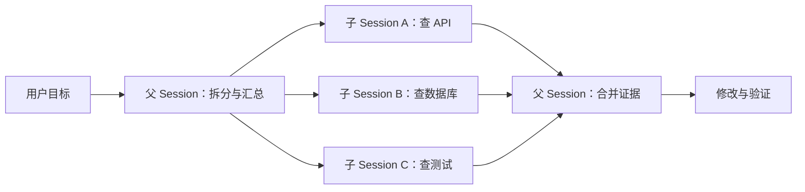

# 07 · 多 Agent 怎么协作

> 读完本章，你应该能用自己的话回答：  
> 「主 Agent 为什么要再雇一个子 Agent？它们怎么分工、怎么恢复、权限怎么继承？」
>
> **实现状态（务必先看）**：本章的 `task` 链路目前**主要属于 Legacy 会话编排**。源码仍通过
> `SessionV1`、旧 `SessionPrompt` 适配层运行子任务；V2 已有新的 durable prompt、runner 与
> Context Epoch 等基础设施，但还没有把这里描述的整套多 Agent 编排完整迁过去。下面会如实讲
> 当前实现，也会把可复用的设计原则与 pycode 建议分开标明。

---

## 1. 这一章要解决什么问题

修一个 bug，通常要干两件性质完全不同的事：

| 工作类型 | 典型动作 | 风险 |
|----------|----------|------|
| **搜索 / 摸清现状** | 全局搜关键词、列文件、读实现、问「这段逻辑在哪」 | 低：只读，搞错了最多多花时间 |
| **动手改代码** | 编辑文件、跑命令、提交式改动 | 高：改错了会破坏项目 |

一个人（一个 Agent）可以两件事都干，但会遇到现实痛点：

1. **上下文被搜索垃圾填满**  
   搜了 30 个文件、几十段匹配，真正要改的那几行反而被淹没。后面模型「记不住」重点，或上下文直接爆掉。
2. **角色互相干扰**  
   「先只读探索」和「大胆改代码」需要不同的权限与提示词。混在同一条对话里，模型容易：该搜的时候乱改，该改的时候还在瞎搜。
3. **想并行**  
   「一边查 A 模块，一边查 B 模块」——一个会话串行跑，慢；拆成两个独立笔记本，可以并行。

所以 OpenCode 的思路是：**主 Agent 当项目经理，用 `task` 工具雇专职子 Agent**，各自有独立会话（笔记本），干完把摘要交回。

类比：

```text
你（用户）
  └── 主实习生 build（能改代码）
        ├── 雇一个「只负责搜代码」的 explore
        └── 根据搜到的结论，自己动手改
```

---

### 1.1 如果做成最 naive 的版本会怎样？

新手常见做法：**同一个聊天窗口里角色扮演**。

```text
用户：帮我找登录 500 的原因，然后再修。

模型：（假装）好的，我现在切换成「探索模式」……
（还是同一条 messages 列表，还是同一套权限）
（读了一大堆文件后）好，我切换成「编辑模式」开始改……
```

看起来省事，问题很多：

| 问题 | 会发生什么 |
|------|------------|
| **没有真正隔离** | 搜索过程的噪声全留在同一本笔记本里，改代码时模型仍「看见」全部噪声 |
| **权限靠自觉** | 提示词写「探索时不要改文件」，模型经常不听话；没有硬性 deny |
| **无法单独恢复** | 探索半路断了，没法只「继续那个探索任务」，只能整段对话重来 |
| **无法并行** | 同一会话一次只能跑一条循环，两个搜索任务只能排队 |
| **无法审计** | 事后很难分清「哪段是子任务的结论、哪段是主对话」 |

OpenCode **明确不做**「同一对话换人设」。多 Agent = **真正开子 Session**。

---

## 2. OpenCode 的核心设计：`task` 创建子 Session

### 2.1 核心机制

主 Agent 调用内置工具 **`task`**。系统会：

1. 检查嵌套深度（默认子 Agent 不能再无限雇子 Agent）
2. 做权限确认（能不能派这个类型的子 Agent）
3. **新建**（或 **恢复**）一个子 Session，并记下 `parentID` = 父会话 ID
4. 在子 Session 里用指定角色（如 `explore`）跑完整的 Agent 循环
5. 把结果包成 `<task_result>` 之类的文本，交回父 Agent

不是「换一张面具」，而是「另开一本笔记本」。

这里的“隔离”有明确边界：**隔离的是 Session 消息历史、Agent 身份与工具循环，不是自动创建
Git worktree、容器或文件系统副本。** 多个子 Session 默认仍可能看到同一个工作区，所以并行写
同一文件仍会冲突；如果产品需要文件级隔离，要另加 workspace/worktree 沙箱。

```text
父 Session（build）
  │
  │  task(subagent_type="explore", prompt="找出登录 500 的调用链")
  ▼
子 Session（parentID = 父的 id，agent = explore）
  │  独立消息历史、独立工具循环
  ▼
返回摘要 → 父 Session 继续（例如自己 edit）
```

### 2.2 关键参数（白话）

| 参数 | 意思 |
|------|------|
| `description` | 短标题，3～5 个词，给人看的 |
| `prompt` | 交给子 Agent 的具体任务说明 |
| `subagent_type` | 用哪种子角色，如 `explore` / `general` |
| `task_id` | **可选**。填了就表示「继续上次那个子会话」，而不是新开一本 |
| `background` | **可选**。`true` = 后台跑，父 Agent 先不等结果（需实验开关） |

### 2.3 `parentID` 与深度限制

- 每个子 Session 带 **`parentID`**，形成父子树。  
- 系统从当前会话沿 `parentID` 往上数，得到 **嵌套深度**。  
- 配置项 **`subagent_depth`**（默认 **1**）：深度到了就不能再 `task` 嵌套。  

默认语义很朴素：**主 Agent 可以雇一层帮手，帮手默认不能再雇帮手**，避免「子 Agent 套娃」把费用和复杂度炸掉。需要更深时再调大 `subagent_depth`。

配置示例：

```json
{
  "subagent_depth": 2,
  "permission": {
    "task": {
      "explore": "allow",
      "general": "ask"
    }
  }
}
```

这表示最多允许两层子 Agent；派 `explore` 可直接执行，派 `general` 仍需确认。**不要因为能设成 5
就设成 5**：每多一层都增加费用、延迟、权限推理与故障恢复难度。

### 2.4 返回长什么样

前台任务完成后，父模型大致会看到类似结构（示意）：

```xml
<task id="ses_子会话ID" state="completed">
<task_result>
（子 Agent 的最终文字结论）
</task_result>
</task>
```

父 Agent 根据这段结论决定下一步——通常是自己动手改，而不是把探索噪声整段复制进主对话。

---

## 3. Agent 角色：explore、general 与隐藏角色

OpenCode 里有「主角色」和「子角色」：

| 名字 | 类型 | 人话 |
|------|------|------|
| **build** | 主 Agent（primary） | 默认的「能干活的编程助手」：按权限读改跑，日常修 bug、写功能 |
| **plan** | 主 Agent（primary） | 「先想清楚再动手」：几乎不能改业务代码，最多写计划文档；适合方案讨论 |
| **explore** | 子 Agent（subagent） | 「只负责摸地图」：擅长 glob/grep/read/bash 等只读向探索；默认大幅收紧写权限 |
| **general** | 子 Agent（subagent） | 「能多步研究/执行的万能帮手」：适合复杂调研或可并行的小块工作；默认不当 TODO 管理员 |

还有三类 **隐藏 Agent**：

| 名字 | 系统用途 | 为什么隐藏 |
|------|----------|------------|
| `compaction` | Legacy 路径中的会话压缩/摘要工作 | 由系统触发，不是用户工作模式 |
| `title` | 给会话生成短标题 | 只做内部元数据生成，工具全 deny |
| `summary` | 生成会话摘要 | 只做内部摘要，工具全 deny |

它们在 `agent.ts` 中是 `hidden: true`，而且默认所有工具都 deny。**隐藏不等于更高权限**，恰恰是
「系统会用，但不应出现在用户的 Agent 选择器里」。它们也不是主 Agent 应通过 `task` 手动派遣的
普通帮手。

怎么选？

```text
只想查清「代码在哪、怎么串起来」 → explore
需要子任务里也可能改文件、多步执行     → general
用户当面聊、最终拍板改仓库             → build（主会话）
用户说「先别改，一起设计方案」         → plan（主会话切模式）
```

**记住**：`explore` / `general` 通常通过 **`task` 启动**；`build` / `plan` 是用户选的主工作模式（详见 [04-提示词与工作模式](./04-提示词与工作模式.md)，若该章尚未写完，可先结合权限章理解）。

### 3.1 自定义一个只读子 Agent

内置 `explore` 不合适时，可以配置自己的 subagent。下面只开放读与搜索：

```json
{
  "agent": {
    "api-reviewer": {
      "mode": "subagent",
      "description": "只读检查公开 API 兼容性",
      "permission": {
        "*": "deny",
        "read": "allow",
        "grep": "allow",
        "glob": "allow"
      }
    }
  }
}
```

之后用 `subagent_type: "api-reviewer"` 派遣。`mode: "subagent"` 表示它适合作为 task 目标；权限仍会
与父 Session 的 deny / `external_directory` 护栏一起派生，配置自定义角色不能绕过父级禁止。

---

## 4. 用 `task_id` 恢复子任务

子任务也会中断：网络挂了、你点了停止、上下文炸了、模型中途报错……

OpenCode 的恢复方式很直接：

> **`task_id` = 子 Session 的 ID。再调一次 `task` 并传入同一个 id，就是接着那本笔记本写，而不是撕掉重开。**

### 4.1 第一次（新开）

```json
{
  "description": "查缓存键路径",
  "prompt": "找出登录接口里 cache key 是怎么拼的，列出相关文件与函数。",
  "subagent_type": "explore"
}
```

系统创建子 Session，例如 id = `ses_abc123`。结果里会带上这个 id（父模型 / 工具元数据里能看到）。

### 4.2 半路失败后（恢复）

```json
{
  "description": "继续查缓存键",
  "prompt": "上次查到一半断了。请接着上次进度，补全 cache key 相关调用链，并给出结论。",
  "subagent_type": "explore",
  "task_id": "ses_abc123"
}
```

要点：

| 要点 | 说明 |
|------|------|
| **会话复用** | 同一 `task_id` → 同一子 Session，历史消息还在 |
| **不是 Fork** | Fork 是「复制整段对话开新枝」；task 恢复是「继续那个子任务笔记本」 |
| **找不到 id** | 实现上可降级为新建；调用方应尽量用上次返回的真实 session id |

和「整段用户对话从崩溃恢复」不是同一套机制。子任务恢复 = **复用子 Session**；会话级容错见后续 [09-取消-恢复与容错](./09-取消-恢复与容错.md)。

---

## 5. 前台、后台与并行任务

| | **前台（默认）** | **后台 `background=true`** |
|--|------------------|----------------------------|
| 父 Agent 行为 | **等**子任务跑完，拿到 `<task_result>` 再继续想 | **立刻返回**「已在后台跑」，父可先干别的 |
| 适用 | 下一步强依赖结论（先搜再改） | 互不抢同一批文件的独立调研 |
| 完成后 | 结果直接出现在本次工具返回里 | 完成后 **自动回注** 父会话（合成一条通知式输入） |
| 注意 | 简单、好推理 | 需要实验 flag；父模型被明确告知：**不要轮询、不要 sleep 等、不要重复干同一份活** |

默认用前台就够了。只有「主会话还要继续聊用户 / 干不重叠的事」时才考虑后台。

示意：

```text
前台：
  父 ──task──▶ 子（跑完）──结果──▶ 父继续

后台：
  父 ──task(background)──▶ 立刻拿到「running」
  子在旁边跑……
  完成后系统把结果塞回父会话，再唤醒父继续
```

### 5.1 后台任务需要实验开关

`background: true` 不是默认稳定能力，当前必须设置：

```bash
OPENCODE_EXPERIMENTAL_BACKGROUND_SUBAGENTS=true opencode
```

开关未启用时，工具会直接报错，而不是悄悄退化成前台任务。后台任务完成后，系统会把带
`synthetic: true` 的结果输入注入父 Session，并再次唤醒父会话。

### 5.2 并行的正确心智模型

并行不是「一个 Agent 同时想两件事」，而是**多个独立子 Session 各跑自己的循环**：



适合并行的任务必须满足：

1. **输入可独立说明**：每个子 Agent 不依赖另一个尚未产出的中间结论。
2. **工作区不重叠**：尤其是后台任务，不要让两个 Agent 同时修改同一文件。
3. **输出契约清楚**：统一返回「结论、证据路径、未确认项」，父 Agent 才能低成本合并。
4. **父 Agent 负责收口**：子 Agent 提供材料，不应各自对同一架构问题拍最终板。

若 B 必须等待 A 的结果，正确做法是 `A → 父汇总 → B`，而不是为了“并行”强行同时启动。

---

## 6. 子 Agent 的权限如何派生？

权限细节见 [06-权限-人机确认与命令安全](./06-权限-人机确认与命令安全.md)。这里只讲 **生子 Session 时多出来的规则**。

设计原则（白话）：

1. **子 Agent 自己的能力表说了算**  
   例如 `explore` 自带「几乎全 deny，只放开搜索类工具」——不会因为父亲是 `build` 就自动获得写文件权。
2. **父亲的「禁止」会传给孩子**  
   父 Session 上已经 **deny** 的规则，以及 **external_directory** 相关限制，会带到子 Session。  
   含义：老板已经禁止的事，实习生不能靠「换个子身份」绕过去。
3. **默认再加两道保险**（若子角色自己的规则没明确放开）  
   - 默认 **deny `task`**：防止子 Agent 再无限雇孙子（配合深度限制）  
   - 默认 **deny `todowrite`**：避免多个会话抢着改同一份 TODO 列表  
4. **派 `task` 本身也要过权限**  
   父 Agent 调用 `task` 时，会按 `subagent_type` 做一次权限询问（和删文件一样，可被策略配置成 allow/deny/ask）。

源码中的 `deriveSubagentSessionPermission(...)` 可以概括成：

```text
子 Session 附加权限
  = 父 Session 的所有 deny
  + 父 Session 的所有 external_directory 规则
  +（子角色未明确配置时）deny todowrite
  +（子角色未明确配置时）deny task
```

这里容易误解：函数**不是**把父亲的整张 allow 表复制给孩子。子 Agent 能做什么，首先由自己的
Agent 权限表决定；父 Session 的 deny 与目录边界再作为不可绕过的护栏叠上去。`task.ts` 创建子
Session 时还会合并实验性的 `primary_tools` deny。

一句话：

> **孩子不能比父亲更「无法无天」；孩子还可以比父亲更「老实」（例如 explore 只读）。**

---

## 7. 完整示例：并行调查，父会话收口

场景：用户说——「登录接口偶发 500，先查清再修。」

### 步骤 A：用户对主会话（build）说话

主 Agent 判断：先摸清再改。若登录路由与 Redis 配置互不依赖，可以并行派两个探索任务：

```json
{
  "description": "查登录错误路径",
  "prompt": "定位登录路由与错误处理，找可能抛 500 的路径。thoroughness: medium。按结论、证据路径、未确认项输出，不改代码。",
  "subagent_type": "explore",
  "background": true
}
```

```json
{
  "description": "查 Redis 超时",
  "prompt": "定位登录依赖的 Redis 配置与调用链，检查超时和 cache key。按结论、证据路径、未确认项输出，不改代码。",
  "subagent_type": "explore",
  "background": true
}
```

### 步骤 B：两个子 Session（explore）各自循环

每个子 Agent 都可能：

1. `grep` 登录、auth、500  
2. `glob` 找 `**/auth/**`  
3. `read` 可疑文件  
4. 用 bash 只做只读类辅助（若策略允许）  
5. 输出结论：「`src/auth/login.ts:88` 在 cache miss 时未处理 null」

这些中间步骤 **主要留在子笔记本里**，不会把父会话撑爆。

### 步骤 C：结果回到父 Session

父模型看到 `<task_result>` 后，**自己**调用 `edit` / `read` / 测试命令去修，而不是再让 explore 改代码。

```text
用户
 └─ build（父）
      ├─ task → explore A（登录路径）→ 结论
      ├─ task → explore B（Redis 路径）→ 结论
      └─ edit / bash（父动手修）→ 验证
```

这就是 OpenCode 想要的分工：**搜索噪声隔离在子 Session；主 Session 保持「决策 + 改动」的清晰叙事。**

---

## 8. 取舍、pycode 落地与源码地图

### 8.1 优点

- **上下文隔离**：搜索垃圾不污染主对话  
- **权限可硬约束**：explore 真的很难「手滑改文件」  
- **可恢复**：`task_id` 接着干，不必整段重来  
- **可并行（进阶）**：多个子任务、后台任务，适合大仓库摸底  
- **可审计**：父子 Session、`parentID` 关系清楚  

### 8.2 缺点 / 代价

- **多一次（或多次）模型调用**：贵、稍慢  
- **交接靠摘要**：子任务细节若没写进结论，父可能丢信息——prompt 要写清「交什么格式的报告」  
- **嵌套要克制**：深度默认 1，乱套娃会失控  
- **后台更复杂**：通知回注、不要轮询，产品和提示词都要教模型「怎么等」  
- **和 Fork、Drain 恢复不是一回事**：三套概念别揉成一个 API（见设计参考里的强调）

### 8.3 pycode 落地建议

1. **先做前台 `task` + 独立子 Session + `parentID`**，再做后台。  
2. **`task_id` 从第一天就设计成「子会话 id」**，恢复逻辑会非常简单。  
3. **权限派生写清楚**：继承父 deny / external_directory；默认 deny 嵌套 `task`；子角色自带能力表。  
4. **深度限制做成配置**，默认 1。  
5. **不要**用「同一 messages 里切换 system 角色」冒充多 Agent。  
6. 父→子的 prompt 模板建议固定要求：「结论、证据（路径:行号）、未验证的猜测分开写」。  
7. 产品文案与权限要一致：例如鼓励用 `general`，就不要在默认 plan 里悄悄 `task.general: deny` 却不解释（OpenCode 里曾有过这种张力，pycode 实现时主动统一）。

8. **先标清 Legacy / V2 边界**：当前 `task` 调用的是 Legacy prompt/session 适配链。迁移到 V2 时，
   至少要重新定义 durable admission、后台完成通知、子 Session placement、取消与恢复语义；不要
   只把 import 从 V1 改成 V2 就宣称完成迁移。

### 8.4 对应源码位置（初学可跳过）

| 主题 | 大致位置 |
|------|----------|
| `task` 工具 | `packages/opencode/src/tool/task.ts` |
| 子 Session 权限派生 | `packages/opencode/src/agent/subagent-permissions.ts` |
| Agent 目录（build/plan/general/explore） | `packages/opencode/src/agent/agent.ts` |
| 任务恢复设计说明 | 仓库根目录 `FAILURE_RECOVERY_AND_FORK_DESIGN.md` |
| 设计对照摘要 | `PYCODE_DESIGN_REFERENCE.md` §5 |

### 8.5 本章小结

1. 一个 Agent 也能搜也能改，但噪声、权限、并行、恢复都会变痛。  
2. 同聊天角色扮演 **不够**；OpenCode 用 **`task` 真正创建子 Session**。  
3. `parentID` 连父子；`subagent_depth` 防止套娃。  
4. `explore` 摸地图，`general` 多步帮手，`build`/`plan` 是主模式。  
5. **`task_id` = 接着那本子任务笔记本写**。  
6. 前台等结果；后台先返回、完成后再通知（进阶）。  
7. 孩子继承父亲的禁止，并可以更只读、默认不能再派 task。  

**上一章**：[06-权限-人机确认与命令安全.md](./06-权限-人机确认与命令安全.md) —— 删文件为什么要弹窗、规则如何生效。  
**下一章**：[08-会话记忆与上下文压缩.md](./08-会话记忆与上下文压缩.md) —— 对话太长怎么办，和「子 Session 隔离噪声」如何配合。
