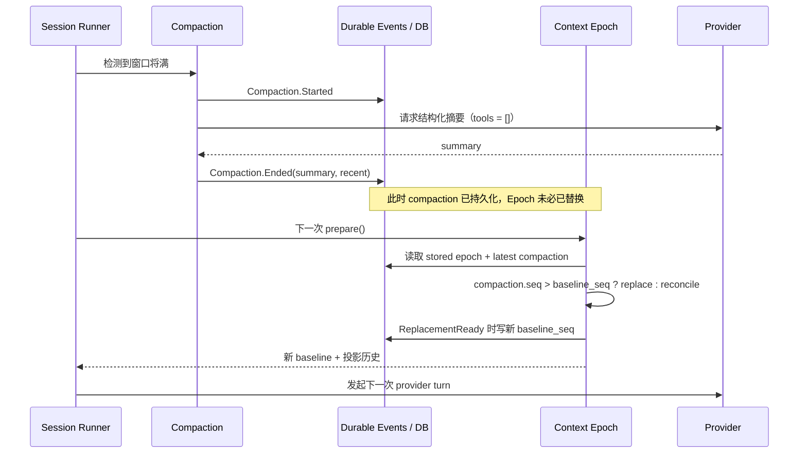

# 08 · 会话记忆与上下文压缩

> 读完本章，你应该能用自己的话回答：  
> 「对话越聊越长时，OpenCode 怎么腾出模型的上下文空间？数据库里的记录会被删掉吗？」
>
> 本章以 V2 Session Core 为主。先记住两个准确说法：**短期记忆是投影历史
>（projected history）与当前 Context Epoch 共同组成的模型可见切面；长期记忆是数据库中的
> durable events。Compaction 改投影选择，不删除这些历史事件。**

---

## 1. 这一章要解决什么问题？

Coding Agent 会 **一边聊、一边读文件、一边跑命令**。  
每一轮都要把「到目前为止相关的对话」塞进大模型的请求里。

问题来了：

> **模型一次能看的字数是有上限的。**

这个上限，行业里叫 **Context Window（上下文窗口）**。

### 1.1 书桌类比

把大模型想成一个实习生，他面前只有一张 **固定大小的书桌**：

| 类比 | 真实含义 |
|------|----------|
| 书桌面积 | 上下文窗口能装下的 token 数量 |
| 桌上的便签、打印件 | 系统提示、对话历史、工具结果 |
| 新任务又来了一叠资料 | 新的用户消息、新的读文件结果 |
| 桌子满了 | 请求太大，模型拒绝处理（overflow） |

你不能指望书桌 magically 变大。  
你只能决定：**桌上放什么、拿走什么、哪些改成一张摘要便签**。

本章讲的就是：OpenCode 如何管理这张书桌，同时 **不把你的笔记本（数据库）撕掉**。

---

### 1.2 如果做成最 naive 的版本会怎样？

新手最常见的做法：

```text
messages = []   # 内存里的对话列表
每轮调用模型前：
  messages.append(新消息)
  如果太长：
    从最老的消息开始删，直到塞得下
  call_llm(messages)
```

#### 1.2.1 你会立刻丢掉什么？

| 丢失的东西 | 后果 |
|------------|------|
| 最早的用户目标 | 模型忘了「一开始要修什么 bug」 |
| 中间做过的决定 | 「我们改用内存缓存」被忘掉，又改回 Redis |
| 已经读过的关键结论 | 重复读同一批文件，浪费时间与钱 |
| 失败过的尝试 | 又去踩同一个坑 |
| UI 回看能力 | 聊天记录也没了，用户无法审计 |

更糟的是：很多实现 **模型可见历史** 和 **产品侧聊天记录** 是同一份 list。  
一删，两边一起没——既伤模型，也伤用户。

#### 1.2.2 另一种 naive：只靠「向量数据库长期记忆」

有人一上来就做 RAG：把旧对话切块、embedding、检索。

这对「跨很多天、跨很多项目的模糊回忆」可能有用，但：

- **本会话内** 的连贯编程任务，更需要 **有序的近期原文 + 结构化摘要**，不是随便召回几段相似文本
- 向量检索会漏关键约束（文件路径、错误原文、约定好的方案）
- 把它塞进「压缩」里，会把两件不同的事先搅在一起

OpenCode 的默认路径 **不是** 向量记忆。向量记忆若要做，应是 **另一层**（本章末尾会再强调）。

---

## 2. 两层设计：durable events 与模型可见投影

一句话：

> **完整历史写进数据库（长期可回看）；压缩只改变「这一轮模型看见什么」。**

可以记成两个存储面：

```text
┌──────────────────────────────────────────────┐
│  数据库事件（笔记本 / 长期）                     │
│  用户输入、模型输出、工具状态、compaction 等事件    │
│  是 durable 事实来源，可重建投影与回看             │
└──────────────────────────────────────────────┘
                      │
                      │  组装「模型可见切面」
                      ▼
┌──────────────────────────────────────────────┐
│  Projected History + Context Epoch（书桌 / 短期）│
│  Epoch baseline + 摘要检查点 + 最近原文 + 本轮输入│
│  太长就 compaction：换模型切面，不删 durable events│
└──────────────────────────────────────────────┘
```

对应不变量（设计里反复强调的一句话）：

> **Compaction 不删历史** —— 只改模型可见切面；DB 仍有全文。

---

## 3. 短期记忆与长期记忆到底是什么？

这里的短/长，是 **产品语言**，不是机器学习论文里的 memory 模块，也 **默认不是向量库**。

| 说法 | OpenCode 语境里大概是什么 | 模型看得见吗？ |
|------|---------------------------|----------------|
| **短期记忆** | 当前 Context Epoch baseline + `SessionHistory` 选出的 projected history + 本轮工具结果 | 是（组装进 provider request） |
| **长期记忆** | SQLite 中按序持久化的 Session events；消息表是其可查询投影 | UI / runner 可读取；模型不会自动看到全部 |
| Inbox 里未 promote 的输入 | 已记账、尚未入席 | 否 |
| 旧工具输出的 prune | 主要是 Legacy 的模型侧减负策略，不是这里 V2 compaction 的核心步骤 | 不应把它理解为删除 V2 durable history |

### 3.1 `SessionHistory` 做的是选择，不是删除

`history.ts` 查询最近一次 compaction 与 Context Epoch 的 `baseline_seq`，然后选出 runner 当前需要的
消息范围：

- 有 compaction：从最近 compaction 记录开始读，并保留该 Epoch 中仍需生效的 system update。
- 有 Epoch baseline：早于 baseline 的旧 system 消息不再重复塞给模型。
- 查询结果按 `seq` 升序解码，形成本轮 projected history。

旧行仍在数据库中；`WHERE seq >= ...` 是**读取切片**，不是 `DELETE`。

也不要把 **prune** 和 V2 compaction 混为一谈。prune 主要出现在 Legacy 路径，用于缩减旧工具
输出的模型侧负担；本章三份 V2 核心源码的主线是「compaction event + history projection +
Context Epoch」。设计 pycode V2 时，不应先复制 Legacy prune，更不能把 prune 实现成删除
durable events。

### 3.2 用生活话再讲一遍

- **长期** = 你锁在柜子里的全部会议记录（厚厚一摞）  
- **短期** = 今天开会时摊在桌上、供决策用的那几页 + 一张「前情提要」便签  

柜子不会因为桌面整理而被清空。  
桌面整理（compaction）只是为了让实习生还能继续干活。

### 3.3 和「向量长期记忆」划清界限

| | OpenCode 默认 | 向量记忆（可选新层） |
|--|---------------|---------------------|
| 目的 | 本会话续聊、不丢账本 | 跨会话/跨项目的语义召回 |
| 数据形态 | 事件日志 + 摘要检查点 | embedding + 检索 |
| 触发 | 上下文将满 / overflow | 你主动 query |
| 是否默认有 | 有 | **没有** |

做 pycode 时：先把「DB events + 模型切面压缩」做对；若产品真要「三个月前那个项目怎么配的」，
再 **单独加一层**，不要塞进 compaction 算法。跨 Session 向量记忆属于 **OUT OF SCOPE / 可选附加层**，
不是 OpenCode V2 Session 正确性的前置条件。

---

## 4. Compaction 算法：用白话走一遍

当系统估计「马上塞不下」时，大致做五步：

```text
① 估计：这次请求大概要多少 token？
② 保留近期：从对话尾部往前，抠出大约 keep.tokens 的「原文」
③ 摘要头部：更早的内容交给模型，按固定模板写成结构化摘要
④ 打检查点：写入一条 compaction 记录（摘要 + 保留的 recent）
⑤ 切换条件成熟：compaction 事件落库后，下一次 prepare 才可能替换 Context Epoch baseline
```

### 4.1 ① 估计（estimate）

系统会粗估：system + messages + tools 大概占多少。  
和模型的 `context` 上限比一比，还要留出：

- 模型还要生成的输出空间，或  
- 配置里的 `buffer`（安全垫）

经验公式（理解用）：

```text
若 估计用量 > context - max(输出上限, buffer)
  → 该压缩了
```

默认 `buffer` 很大（约 20_000），是为了 **宁可早一点整理书桌，也不要贴着极限撞墙**。

### 4.2 ② 保留近期（keep recent）

从 **最新消息往旧** 累加，直到大约 `keep.tokens`（默认约 8_000）。

- 落在预算内的尾部 → **原文保留**（`recent`）  
- 更早的部分 → 进入待摘要的 `head`

为什么必须留 recent？  
因为编程任务里，「刚刚读的报错」「正在改的文件」「上一轮工具结果」往往比三小时前的寒暄更关键。摘要再好，也替代不了最近几步的细节。

### 4.3 ③ 摘要头部（summarize head）

用一次不带工具的专门模型调用，按固定 Markdown 模板产出摘要。模板的**概念目标**是保存“继续
工作所需的锚点”，而不是写漂亮的聊天纪要，大致包括：

- **Objective**：用户想达成什么  
- **Important Details**：约束、决策、关键事实  
- **Work State**：已完成 / 进行中 / 卡住  
- **Next Move**：下一步做什么  
- **Relevant Files**：相关路径及原因  

规则强调：保留精确路径、符号、命令、错误串；不要写「我正在做摘要」这种元话术。

若之前已经有过摘要，会把「旧摘要 + 上次保留的 recent + 新的待压缩头部」一起交给模型，要求
**更新旧摘要**：保留仍为真的事实、删掉过时状态、合并新证据，而不是每次从零乱写一篇。

### 4.4 ④ 写入 compaction 事件

压缩结束会留下一条 **compaction** 类消息/事件，核心带：

- `summary`：结构化摘要文本  
- `recent`：保留的近期原文  

之后装载历史时，大致从「最近一次 compaction」起切：模型看到的是 **摘要 + 那之后的对话**，
而不是从会话第一句开始的全文。源码会先发布 `Compaction.Started`，摘要成功后再发布
`Compaction.Ended`；失败或空摘要不会伪造一个成功检查点。

## 5. Context Epoch 何时切换？

最容易写错的一句话是「一 compact，Epoch 当场就换了」。准确过程是：

1. compaction 成功事件先取得自己的 `seq`。
2. 下一次 `SessionContextEpoch.prepare(...)` 同时读取当前 Epoch 与最新 compaction。
3. 只有当 `compaction.seq > stored.baseline_seq` 时，才把它视为 replacement 边界。
4. `SystemContext.replace(...)` 返回 `ReplacementReady` 后，才写入新 baseline 与新的
   `baseline_seq`；若 replacement 被阻塞，则暂时沿用旧 baseline。



这个时序让 Epoch 切换有一个**可持久化、可比较的序号边界**，而不是靠进程内布尔变量猜“刚才
是不是压缩过”。你仍可以把它想成换桌垫，但要记得：整理结束后，要到下一次开工准备阶段才换。

---

## 6. 完整示例：压缩前后模型看见什么

下面是一个 **教学用简化例子**（真实消息会更多、工具结果更长）。

### 6.1 压缩前（模型可见 ≈ 全文）

```text
[System baseline]
你是编程助手……（较长）

[User] 登录接口 500，帮我查
[Assistant] 我先搜相关路由……
[Tool] grep → 找到 auth.ts
[User] 顺便看看有没有 Redis 超时
[Assistant] 读了配置，超时是 2s……
……（中间又聊了 40 轮：读日志、改代码、跑测试、改方案……）
[User] 测试还是红的，把失败栈贴给你了：……（很长）
[Assistant] 准备再跑一次测试……
```

书桌已经快满了：早期「怎么找到 auth.ts」的过程占了很多格，但对「当前红测」帮助有限。

### 6.2 压缩后（模型可见 ≈ 摘要 + 近期原文）

```text
[System baseline · 新 Epoch]
你是编程助手……（按新世代定稿）

[Compaction summary]
## Objective
- 修复登录接口 500，当前卡在集成测试失败

## Important Details
- 超时相关曾怀疑 Redis 2s；后来确认主因是 auth token 校验空指针
- 用户要求：不要改公开 API 形状

## Work State
### Completed
- 定位到 auth.ts 校验分支；加了空值守卫
### Active
- 集成测试 TestLogin#refresh 仍失败
### Blocked
- 失败栈指向 mock clock 与真实 TTL 不一致

## Next Move
1. 对齐测试里的时间模拟与 TTL
2. 重跑该测试

## Relevant Files
- packages/.../auth.ts：空值守卫
- packages/.../login.test.ts：失败用例

[Recent · 原文保留]
[User] 测试还是红的，把失败栈贴给你了：……
[Assistant] 准备再跑一次测试……
```

注意：

- **UI / 数据库** 仍可翻出「第一天怎么搜到 auth.ts」的全过程  
- **模型** 主要靠摘要续上目标与状态，靠 recent 抓住眼前失败栈  

---

## 7. 配置与 overflow 恢复

### 7.1 配置旋钮：`auto` / `buffer` / `keep.tokens`

V2 配置形态大致如下（字段名以 core 为准）：

```json
{
  "compaction": {
    "auto": true,
    "buffer": 20000,
    "keep": {
      "tokens": 8000
    }
  }
}
```

| 字段 | 默认（约） | 白话 |
|------|------------|------|
| `auto` | `true` | 估出来将满时 **自动** 压缩；设为 `false` 则不主动整理（仍可能走 overflow 恢复路径，取决于调用方） |
| `buffer` | `20000` | 安全垫：越早触发压缩，越不容易贴着上限爆炸 |
| `keep.tokens` | `8000` | 压缩后 **尽量原样保留** 的近期对话 token 预算 |

### 7.2 怎么调（直觉）

| 你的情况 | 可以怎么想 |
|----------|------------|
| 经常 overflow | 略增大 `buffer`，让压缩更早发生 |
| 摘要后模型「忘了刚做的细节」 | 增大 `keep.tokens`，多留原文 |
| 想省摘要调用、接受撞上限风险 | 减小 `buffer` 或关 `auto`（一般不推荐新手关） |
| 上下文窗口本身很小的模型 | `keep.tokens` 别设得比窗口还夸张；否则 recent 会挤爆 |

### 7.3 和旧配置名的对照（读老文档时）

老路径里可能看到 `reserved`、`preserve_recent_tokens`、`tail_turns` 等名字。  
学设计时抓住三件事即可：**开不开关、安全垫多大、近期原文留多少**。

---

### 7.4 Overflow 恢复：只救一次

自动估计不可能永远准——token 估算是启发式的。  
有时请求发出去了，provider 仍回报 **上下文溢出（context overflow）**。

OpenCode 的策略是：

```text
本轮 provider 尝试失败，且判定为 overflow
  → 尝试再 compact 一次（overflow 恢复）
  → 用压缩后的切面重建请求，再试
  → 若压缩后还 overflow：停止，避免死循环
```

要点：

1. **最多认真救一轮**（压缩后再试）；不是「失败就无限压缩」  
2. 压缩成功后会走「重建再试」；**禁止**在已经 post-compaction 的尝试上再开第二轮 overflow 恢复  
3. 这样既扛住估计误差，又不会在满桌情况下空转烧钱  

类比：桌子真的塌了一次 → 紧急整理一次再摆 → 若还塌，就停下来报警，而不是整晚重复整理。

---

## 8. 取舍、pycode 落地与源码地图

### 8.1 优点

| 优点 | 为什么重要 |
|------|------------|
| 账本不丢 | UI、审计、计费、fork/revert 仍有全文 |
| 模型侧可控 | 用摘要 + recent 续任务，而不是静默删最老消息 |
| 结构化摘要 | Objective / Work State / Files 比「随便 summarize」更适合编程 |
| Epoch 分界清晰 | 压缩后系统上下文可换新 baseline，减少垃圾堆积 |
| Overflow 有限次兜底 | 估计不准时还有一次逃生舱 |

### 8.2 缺点与张力

| 缺点 / 张力 | 含义 |
|-------------|------|
| 摘要会丢细节 | 再好的模板也可能漏掉冷门约束 |
| Token 估计不准 | 依赖 buffer + 一次 overflow 恢复 |
| 多一次模型调用 | 压缩本身要花钱、花时间 |
| 不是跨会话记忆 | 「上个月那个仓库」默认想不起来 |
| 和多 Agent 叠加时更绕 | 子会话各有历史；压缩边界要按会话理解（见第 07 章） |

### 8.3 向量记忆：明确不在本章范围内

请明确拆开：

```text
层 A：Session transcript + Compaction     ← OpenCode 已有
层 B：Embedding / RAG / 跨 Session 知识库 ← OUT OF SCOPE，可选附加
```

错误做法：把 RAG 塞进 compaction，导致「压缩」行为变得不可预测。  
正确做法：compaction 只管 **本会话书桌**；向量层在组装请求前 **可选地注入** 几段检索结果（并自己管权限与新鲜度）。

### 8.4 pycode 验收时可盯的点

1. 触发压缩后，DB 里仍能查出压缩前的用户/助手/工具全文  
2. 模型下一轮请求里出现摘要结构 + 近期原文，而不是从 session 第 1 条开始  
3. `auto=false` 时不主动压缩（除非你显式走 overflow 路径）  
4. overflow 恢复成功一次后续聊；再次 overflow 不会死循环  
5. 不要在 MVP 里绑定向量库
6. latest compaction 的 `seq` 不大于 Epoch `baseline_seq` 时，不应无故替换 baseline
7. 摘要失败时不写成功事件；下一轮仍能从原有 durable events 重建投影

### 8.5 对应源码位置（初学可跳过）

| 主题 | 大致位置 |
|------|----------|
| 压缩算法 | `packages/core/src/session/compaction.ts` |
| Context Epoch 初始化、reconcile 与 replace | `packages/core/src/session/context-epoch.ts` |
| projected history 的读取边界 | `packages/core/src/session/history.ts` |
| 术语与 Epoch | 仓库 `CONTEXT.md`；术语表见 [02](./02-白话术语表.md) |
| 设计对照长文 | 根目录 `PYCODE_DESIGN_REFERENCE.md` 第 9 节 |

### 8.6 和前后章的关系

- **上一章**：[07-多Agent怎么协作.md](./07-多Agent怎么协作.md)  
  子 Agent 往往是 **另一本会话笔记本**。每本笔记本各自可能触发压缩；主会话通常只吃回传的摘要结果，而不是子会话全文。

- **下一章**：[09-取消-恢复与容错.md](./09-取消-恢复与容错.md)  
  压缩解决的是「桌子太大」；取消/崩溃解决的是「人喊停 / 进程挂了」。两者都依赖：**该进数据库的先记账**，否则恢复时没有材料可续。

### 8.7 本章一句话复习

> **长期是 DB durable events；短期是 Epoch baseline + projected history。Compaction 只换书桌切面，
> 不删账本；向量回忆若需要，另开可选层，别冒充 compaction。**
