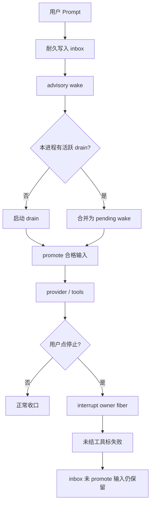
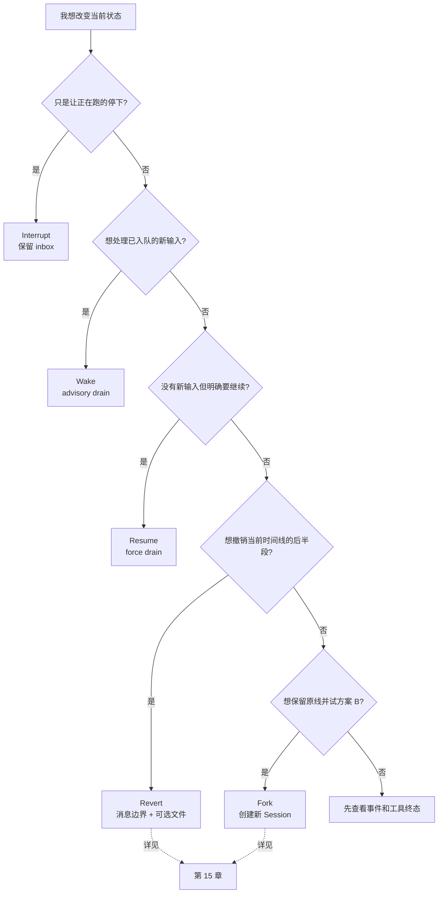

# 09 · 取消、恢复与容错

> 读完本章，你应能准确解释：为什么「停止」不能清空 inbox；`wake` 和 `resume` 为什么不是一回事；工具为何要从 `pending/running` 收口为失败；以及为什么 OpenCode **刻意没有**把进程崩溃后的 provider 续跑伪装成已经解决的问题。

本章只讨论**执行韧性**。如果你想撤回消息和文件、从旧历史另开时间线，请直接跳到 [15 · Fork、Revert 与文件快照](./15-Fork-Revert与文件快照.md)。

---

## 1. 先划边界：五种「恢复」其实是五件事

Coding Agent 同时管理对话、模型流、工具进程、文件和用户排队输入。它被打断时，「恢复」可能指完全不同的目标。

| 用户场景 | 真正需要的能力 | 操作对象 |
|---|---|---|
| 点「停止」，不要再生成 | `interrupt` | 当前进程拥有的活跃执行 |
| 消息已经记账，希望系统处理 | `wake` | inbox 中符合条件的输入 |
| 没有新消息，也明确要求继续 | `resume` / force run | 当前 Session 的 drain |
| 网络失败，客户端重发同一消息 | exact retry | 同一条耐久输入 |
| 回到旧节点或试方案 B | `revert` / `fork` | 消息历史与文件状态 |

最重要的边界是：

> **执行被中断，不等于输入被删除；执行恢复，也不等于历史回退或时间线分叉。**

### 1.1 三层状态不要揉成一个 `run_id`

可以把系统想成三层：

```text
耐久输入层：session_input / messages / events
    ↑ 可跨进程保存

进程执行层：SessionRunCoordinator / drain / fibers
    ↑ 只属于当前进程

工作区状态层：snapshot / diff / files
    ↑ 与消息边界关联，但不是执行本身
```

OpenCode V2 没有把一次 drain 塑造成耐久的「大 Run 实体」。一次 drain 是进程内协调活动，不是新的 transcript 边界。崩溃恢复必须从耐久输入、投影历史、provider 尝试和工具状态推断，不能只拿一个 `run_id` 重放。

### 1.2 本章的四条不变量

1. `prompt` 先耐久 admission，再做 advisory wake。  
2. `interrupt` 停当前执行，但**保留尚未 promote 的 inbox**。  
3. 每个 provider turn 只显式调用一次 `llm.stream(request)`；是否开始下一 turn 由已落盘状态决定。  
4. post-crash provider continuation **deferred by design**：未完成完整策略前，不自动猜测重试是否安全。

---

## 2. 为什么一个 `cancelled = True` 不够

最 naive 的 Python Agent 往往这样写：

```python
cancelled = False

def stop():
    global cancelled
    cancelled = True

def run_agent():
    while not cancelled:
        call_model()
```

这只能让某个循环「以后别再进下一轮」，却回答不了以下问题：

- 模型流正在阻塞时，谁来取消它？
- `bash` 子进程和并发工具 fiber 是否一起停止？
- 数据库里显示 `running` 的工具如何得到终态？
- 停止期间新来的消息是丢弃、保留还是立即执行？
- 两个客户端同时点继续，是否会启动两个相同 Session 的执行？
- 进程重启后，内存里的 `cancelled` 已消失，系统依据什么判断？

### 2.1 更糟的错误：停止时清空队列

假设用户先发：

```text
消息 A：重构认证模块
消息 B：不要改公开 API
```

A 正在执行，B 已 admission 到 inbox、尚未 promote。此时用户点停止，常见错误实现是：

```python
async def interrupt(session_id):
    await cancel_current_task(session_id)
    await inbox.delete_all(session_id)  # 错
```

结果是用户明确说过的约束 B 被静默丢掉。之后点继续，模型根本不知道「不要改公开 API」。

正确语义是：

```python
async def interrupt(session_id):
    await coordinator.interrupt(session_id)
    # 不删除 inbox
```

### 2.2 把所有失败都自动重试也不安全

模型调用失败看起来像普通 HTTP 失败，但 Agent 已经可能产生外部副作用：

```text
provider 发出 tool call
  → 工具执行数据库迁移（成功）
  → 进程在写回 tool result 前崩溃
```

重启后如果盲目重放 provider turn，迁移可能执行第二次。类似风险还包括重复发邮件、重复创建工单、重复支付或覆盖文件。

因此容错目标不是「永远自动继续」，而是：

> **先让状态诚实、边界清楚，再在有足够证据时继续。**

---

## 3. Interrupt：停执行，但 inbox 必须留下

### 3.1 用厨房类比

- Session 是一桌客人的整本点菜单。  
- inbox 是已经取号、还没被后厨接单的菜。  
- drain 是后厨当前这一轮处理。  
- interrupt 是喊「先停火」。  

停火不等于撕掉点菜单，也不等于把所有未做的菜扔掉。



### 3.2 为什么 inbox 能留下

V2 的 prompt 路径把「接收输入」与「执行模型」拆开：

1. `SessionInput.admit(...)` 通过耐久事件写入 `session_input`。  
2. 输入在 `promoted_seq` 为空时仍是 pending。  
3. `SessionExecution.wake(sessionID)` 只是建议执行器去 drain。  
4. interrupt 取消的是协调器拥有的执行 fiber，不删除 `session_input` 行。

这使两个动作拥有不同的失败边界：

```text
admission 成功、wake 前进程崩溃
→ 输入仍在数据库中

wake 成功、provider 执行中被 interrupt
→ 当前执行停止，尚未 promote 的输入仍在
```

### 3.3 interrupt 的精确语义

`SessionRunCoordinator.interrupt(key)`：

- 没有活跃 owner：no-op，不报「Session 已坏」；
- 有活跃 owner：设置 `stopping = true`；
- 清掉此前累计的 `pendingWake`；
- interrupt owner fiber，并等待清理路径完成；
- 只影响**当前进程拥有**的执行链。

这里有一个容易漏掉的竞态：如果清理期间又收到新 wake，新 wake 不能永久丢失。协调器会让清理完成后的 successor 接手。也就是说：

```text
旧 wake → interrupt 时清除
interrupt 清理期间的新 wake → 保留并在清理后再 drain
```

### 3.4 多机限制

当前本地实现按 Session ID 在进程内路由。`active` 也只是「本进程拥有的活跃 Session」快照。

所以：

- idle 或不在本进程的 interrupt 是 no-op；
- 它不是集群广播；
- 未来若做远程 placement，定位远端 owner 应放在 `SessionExecution` 路由层，而不是让 Location-scoped runner 接管全局协调。

pycode 的第一版若只有单进程，这个边界完全合理，但 API 文档应明确写出「process-local」。

---

## 4. 工具终态：`failUnsettledTools` 与 `failInterruptedTools`

Agent 最危险的「幽灵状态」是：执行已经没了，历史里工具仍显示 `pending` 或 `running`。

OpenCode 用两个名字相近、工作时机不同的机制收口。

### 4.1 `failUnsettledTools`：收口当前 provider turn

`createLLMEventPublisher(...)` 在内存中跟踪当前 turn 看到的 tool call。每个工具都有是否 `settled` 的状态。

`failUnsettledTools(message, hostedOnly?)` 会：

1. 遍历当前 publisher 已知的工具；
2. 跳过已经 settled 的工具；
3. 可选只处理 provider 执行的 hosted tools；
4. 发布耐久 `SessionEvent.Tool.Failed`；
5. 保留 provider 是否执行及 metadata，避免恢复信息被抹掉。

它在多种当前-turn 异常上使用：

| 情况 | 失败文案直觉 |
|---|---|
| 达到 Agent 最大步数，工具被禁用 | Tools are disabled... |
| provider 未返回 hosted tool 结果 | Provider did not return a tool result |
| 用户拒绝权限/问题 | Tool execution interrupted |
| provider stream 或工具 fiber 被 interrupt | Tool execution interrupted |
| 工具 fiber 非中断失败 | Tool execution failed: ... |

重点：它只认识**这个 publisher 当前持有**的 tool call。

### 4.2 `failInterruptedTools`：新 drain 前清理历史遗留

进程已经崩溃时，旧 publisher 的内存当然不存在。因此 runner 每次真正开始 drain 前，还会扫描投影历史：

```text
对 Session context 中每条 assistant message：
  对 content 中每个 tool：
    如果 status 是 pending 或 running：
      发布 Tool.Failed("Tool execution interrupted")
```

这就是 `failInterruptedTools(sessionID)`。它回答的是：

> 「上次进程没来得及收口，数据库里残留的未终结工具怎么办？」

注意调用顺序：runner 先判断本次是否需要运行；若既非 force、又无 pending steer/queue，会直接返回。真正要开始 drain 时，才先清理遗留工具，再进入新 turn。

### 4.3 两者不是重复代码

| 机制 | 信息来源 | 典型时机 | 目的 |
|---|---|---|---|
| `failUnsettledTools` | 当前 publisher 的内存跟踪 | 当前 turn 收尾 | 不让本轮已看到的工具悬空 |
| `failInterruptedTools` | 耐久投影历史 | 下一次 drain 开头 | 修复上次崩溃留下的悬空状态 |

如果只有前者，硬崩溃会绕过清理。  
如果只有后者，UI 要等到下一次 drain 才看到失败，而且当前 turn 的错误边界不完整。

### 4.4 Python 最小实现

```python
async def fail_interrupted_tools(session_id: str) -> None:
    messages = await history.project(session_id)
    for message in messages:
        if message.role != "assistant":
            continue
        for tool in message.tools:
            if tool.status not in {"pending", "running"}:
                continue
            await events.publish_tool_failed(
                session_id=session_id,
                message_id=message.id,
                call_id=tool.id,
                error="Tool execution interrupted",
                provider=tool.provider,
            )
```

这段代码的目标不是重做工具，而是把历史变得诚实。若工具本身支持业务幂等键，可以由更高层明确决定重试；基础 runner 不应擅自猜。

---

## 5. SessionRunCoordinator：join、wake、interrupt 怎么配合

协调器解决两个互相拉扯的问题：

1. 同一个 Session 不能同时有两个 drain 改写同一条历史。  
2. 不同 Session 应该并发，不能全局串行。

它按 `key = sessionID` 维护活跃 entry：

```text
Entry
├── done          所有 joiner 等待的结果
├── owner         真正执行 drain 的 fiber
├── pendingWake   活跃期间是否收到过新工作
└── stopping      是否正在 interrupt 清理
```

### 5.1 `run` / resume：空闲时启动，忙时 join

显式 `resume(sessionID)` 最终映射到 coordinator `run(key)`：

- 空闲：以 `force = true` 启动 drain；
- 已活跃：不再启动第二个 drain，只等待同一个 `done`；
- 正在 stopping：先等旧 entry 清理，再重新 `run`。

因此两个客户端同时点「继续」，结果是**共享一个执行**，不是双倍调用 provider。

还要注意：一个 join waiter 自己被取消，不会连带取消 owner。否则某个断线客户端会把所有人共享的 Session 执行杀掉。

### 5.2 `wake`：登记新工作，可合并

`wake(key)` 是 advisory：

- 空闲：以 `force = false` 启动 drain；
- 活跃：只把 `pendingWake = true`；
- 活跃期间连续 wake 三次：合并成一个 follow-up。

合并不会丢掉真实消息，因为真相在 inbox。wake 只是「记得再看一眼」，不是消息本身。

当当前 drain 成功且 `pendingWake` 为真，协调器启动一个非强制 successor。若 drain 失败但竞态中已有新 wake，也会为新工作安排后继 entry，同时让原 joiner 收到原失败。

### 5.3 `interrupt`：只停 owner，不删耐久工作

`interrupt(key)`：

- 标记 stopping；
- 清除旧 pending wake；
- 中断 owner；
- 等它的 finalizer / publisher / 工具 fiber 清理完成。

如果清理期间到来新的 wake，新的 entry 会在旧 owner 退出后启动。这个细节保证「停止」不会永久吞掉用户停止后新发的话。

### 5.4 行为矩阵

| 当前状态 | 调用 | 结果 |
|---|---|---|
| idle | `wake` | 启动 `force=false` drain |
| idle | `resume/run` | 启动 `force=true` drain，并等待 |
| idle | `interrupt` | no-op |
| active | `wake` × N | 合并成一个 follow-up |
| active | `resume/run` | join 当前执行 |
| active | `interrupt` | 停 owner，清旧 pending wake |
| stopping | 新 `wake` | 清理后启动非强制 successor |
| stopping | 新 `resume` | 清理后启动强制 successor |
| Session A active | Session B `run` | A/B 可并发 |

### 5.5 wake 与 resume 的业务差别

runner 收到 `force` 后会先检查 inbox：

```text
hasSteer = 有 pending steer?
hasQueue = 若无 steer，是否有 pending queue?

如果 force=false 且两者都没有：
  直接返回

如果 force=true：
  即便没有新 inbox，也明确进入 continuation 判断
```

所以：

- prompt admission 后用 wake，避免无事强跑；
- 用户明确点击「继续」才用 resume；
- 不要把每个轮询、每次页面刷新都变成 force run。

---

## 6. 崩溃后能恢复什么，哪些刻意延期

### 6.1 已经安全具备的能力

进程重启后，系统仍可以：

- 读取已 admission、未 promote 的 inbox；
- 读取已投影的用户/助手/工具历史；
- 在下一次 drain 前把遗留 `pending/running` 工具标失败；
- 通过显式 `resume` 从耐久历史继续；
- 用相同 message ID 做 exact retry，避免输入重复 admission。

这些都是「从已确认的耐久事实继续」。

### 6.2 没有自动承诺的能力

OpenCode V2 **刻意延期** post-crash provider continuation recovery。

关键歧义是：

```text
请求是否真的到达 provider？
provider 是否生成过输出，但本地未收到？
hosted tool 是否已经执行？
本地工具是否产生副作用，但结果未发布？
下一轮是继续当前 turn、重试当前 turn，还是先 promote queue？
```

仅凭「Session 不是 busy」无法回答这些问题。wake 也不会推断「曾经 promote 的模糊 provider 工作现在可以安全重试」。

> **Deferred by design 不是忘了写自动重试，而是拒绝在副作用边界不清时假装可靠。**

未来完整切片至少要一起设计：

1. provider-dispatch ambiguity：请求发到哪里了；  
2. required continuation：耐久历史是否明确要求下一 turn；  
3. hosted/local tool 的执行与 settlement metadata；  
4. steer/queue 的 promotion 顺序；  
5. retry budget、backoff 与幂等键；  
6. 启动时如何发现候选 Session；  
7. UI 可见的 recovering / needs-attention 状态；  
8. 多进程 owner 与租约，而不是假设一个耐久 drain ID。

### 6.3 exact retry 只解决「重复投递」

客户端可以使用稳定 message ID：

```python
message_id = "msg_client_01H..."

await client.prompt(
    session_id="ses_123",
    message_id=message_id,
    text="修复登录 500",
    delivery="steer",
    resume=True,
)

# HTTP 响应丢失后，以同一个 ID 和完全相同的内容重试
await client.prompt(
    session_id="ses_123",
    message_id=message_id,
    text="修复登录 500",
    delivery="steer",
    resume=True,
)
```

精确重试要求 Session、prompt 内容、delivery mode 一致；同 ID 不同内容应报冲突。它防止的是「同一用户输入入队两次」，**不证明 provider/tool 副作用可以重放**。

### 6.4 API 与配置建议

教学版 Python API 可以明确拆成：

```python
# 先记账，并默认 advisory wake
await sessions.prompt(
    session_id,
    text="检查缓存键",
    delivery="steer",   # 或 queue
    resume=True,
)

# 批量导入或 admit-only
await sessions.prompt(
    session_id,
    text="稍后处理",
    delivery="queue",
    resume=False,
)

# 用户明确继续；这是 force drain
await sessions.resume(session_id)

# 用户明确停止；不删除 inbox
await sessions.interrupt(session_id)
```

配置不要提供一个含糊的 `auto_retry_everything=true`。若 pycode 需要可控策略，可以先只开放安全旋钮：

```json
{
  "execution": {
    "auto_wake_on_prompt": true,
    "provider_retry": {
      "transport_errors_before_output": 2,
      "post_crash_continuation": false
    }
  }
}
```

这里第二个字段必须默认 `false`，且在没有完整恢复模型前不应偷偷实现为「重放最后一轮」。

---

## 7. 决策树、取舍与 pycode 验收

### 7.1 用户到底应该点什么



如果用户说「崩溃后继续」，还要追问：

```text
有未 promote inbox？
  → wake 可以处理耐久输入

只有已 promote、provider 状态不明的工作？
  → 不自动重放；显示需要人工确认

用户明确接受风险并点继续？
  → resume 从耐久投影历史继续，而不是复活旧 fiber

用户其实想撤回文件或另开路线？
  → 去第 15 章选择 Revert / Fork
```

### 7.2 这种拆分的优点

- **不丢用户输入**：停止和 inbox 生命周期解耦。  
- **同 Session 串行**：并发 resume 会 join，不会双跑。  
- **跨 Session 并行**：无需全局大锁。  
- **状态诚实**：未完成工具最终进入 Failed，而非永远 Running。  
- **副作用更安全**：不拿 wake 冒充崩溃重放协议。  
- **职责可测试**：admission、coordinator、runner、snapshot 各有边界。

### 7.3 代价与限制

- API 概念变多，UI 文案必须区分「停止」「继续」「重试」「撤回」。  
- interrupt 当前是 process-local，多机需要 placement/owner 路由。  
- 工具标失败只能说明「本地不知道最终结果」，不能撤销外部副作用。  
- post-crash 自动续跑暂缺，需要用户确认或领域级幂等。  
- 合并 wake 依赖 inbox 是耐久事实；若只用内存队列，这个设计不成立。

### 7.4 pycode 最小架构

```text
SessionInputRepository
  admit / pending / promote

SessionRunCoordinator
  run / wake / interrupt / active

SessionRunner
  fail_interrupted_tools
  drain steer / queue
  one provider stream per turn

ToolPublisher
  fail_unsettled_tools

SessionService
  prompt / resume / interrupt
```

不要在 MVP 中加入一个包办所有概念的 `RecoverableRunManager`。先让上面四个边界各自正确。

### 7.5 建议验收用例

1. A 执行时 B 已入 inbox；interrupt 后 B 仍可查询。  
2. idle interrupt 成功返回且不改历史。  
3. 同 Session 两个并发 resume 只触发一次 drain。  
4. 不同 Session 可以同时进入 drain。  
5. active 期间十次 wake 最多形成一个合并 follow-up。  
6. interrupt 会清除停止前的 pending wake。  
7. interrupt 清理期间的新 wake 会在清理后执行。  
8. join waiter 被取消不影响 owner。  
9. 新 drain 将历史中的 pending/running 工具发布为 Failed。  
10. 当前 turn 被 interrupt 时，publisher 将未 settled 工具收口。  
11. 相同 message ID + 相同内容 exact retry 不重复 admission。  
12. 相同 message ID + 不同内容返回冲突。  
13. 仅 wake、无 pending inbox 时不调用 provider。  
14. 崩溃重启不会自动重放状态不明的 provider turn。

---

## 8. 源码索引与本章小结

### 8.1 OpenCode 源码索引

| 主题 | 位置 | 阅读重点 |
|---|---|---|
| 协调器 | `packages/core/src/session/run-coordinator.ts` | join、wake 合并、interrupt 竞态 |
| 执行接口 | `packages/core/src/session/execution.ts` | process-global、Session-ID based 接口 |
| 本地路由 | `packages/core/src/session/execution/local.ts` | Session → Location-scoped runner |
| Runner 主循环 | `packages/core/src/session/runner/llm.ts` | `failInterruptedTools`、force、steer/queue |
| 当前 turn 发布器 | `packages/core/src/session/runner/publish-llm-event.ts` | `failUnsettledTools` |
| Inbox | `packages/core/src/session/input.ts` | admit、pending、promote |
| V2 Session 门面 | `packages/core/src/session.ts` | prompt/resume/interrupt 的组合 |
| 协调器测试 | `packages/core/test/session-run-coordinator.test.ts` | 并发、失败、清理竞态 |
| 恢复待办 | `specs/v2/todo.md` | deferred durable continuation recovery |
| Session 规范 | `specs/v2/session.md` | post-crash continuation 的设计边界 |
| 子任务恢复 | `packages/opencode/src/tool/task.ts` | `task_id` 复用子 Session |

### 8.2 和其他章节的关系

- [03 · Agent 循环](./03-Agent循环-一次对话如何跑完.md)：drain 如何推动 provider turn。  
- [07 · 多 Agent 怎么协作](./07-多Agent怎么协作.md)：`task_id` 是子 Session 复用，不是 drain ID。  
- [08 · 会话记忆与上下文压缩](./08-会话记忆与上下文压缩.md)：恢复依赖耐久历史；compaction 不等于 revert。  
- [10 · 可观测性](./10-可观测性-如何看见Agent在干嘛.md)：如何从事件判断卡在 provider、工具还是 inbox。  
- [15 · Fork、Revert 与文件快照](./15-Fork-Revert与文件快照.md)：需要改写历史或工作区时该选什么。

### 8.3 一句话复习

> **Interrupt 只停当前 owner、保留 inbox；wake 处理新工作、resume 明确强制继续；当前 turn 和历史遗留工具都要收口；而 post-crash provider 自动续跑在副作用模型完整之前，刻意不做。**

**上一章**：[08-会话记忆与上下文压缩.md](./08-会话记忆与上下文压缩.md)  
**下一章**：[10-可观测性-如何看见Agent在干嘛.md](./10-可观测性-如何看见Agent在干嘛.md)
