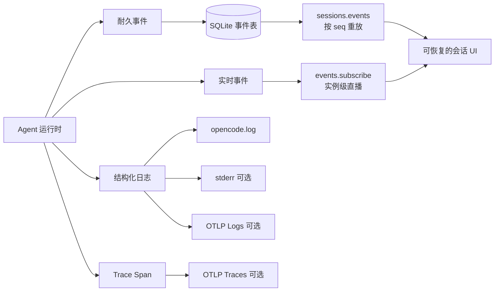
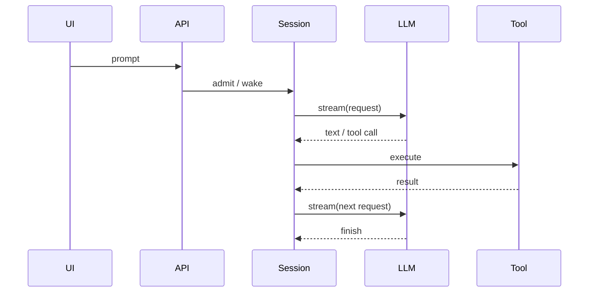

# 10 · 可观测性：如何看见 Agent 在干嘛

> 读完本章，你应能回答：  
> 「Agent 卡住时，我该查会话耐久事件、实例实时事件、日志，还是 OTLP 追踪？」

如果你还不熟悉一次 Agent 循环，先读 [03 · Agent 循环](./03-Agent循环-一次对话如何跑完.md)。本章默认你已经知道「模型可能调用工具，工具结果又会触发下一轮模型」。

---

## 1. 先建立地图：事件、日志、追踪各自回答什么

普通 HTTP 接口通常很短：收到请求，查一次数据库，返回结果。Agent 的一次请求却可能持续几分钟：

```text
用户输入
  → 消息入队
  → 模型流式输出
  → 请求权限
  → 执行工具
  → 再次调用模型
  → 上下文压缩
  → 最终结束
```

任何一环都可能等待、重试或失败。只在 UI 上放一个「转圈」图标，等于把所有故障都压成同一种症状。

可以把 OpenCode 的可观测性分成四件东西：

| 手段 | 主要问题 | 是否适合程序消费 | 断线后能否补回 |
|---|---|---:|---:|
| 会话耐久事件 | 这个 Session 已经确认发生了什么？ | 是 | 是 |
| 实例实时事件 | 这个进程此刻正在发生什么？ | 是 | 否 |
| 结构化日志 | 内部为什么这样执行或失败？ | 人和机器都可 | 看日志文件是否保留 |
| OTLP 日志与追踪 | 跨函数、跨服务的耗时在哪里？ | 是 | 由观测后端保存 |

最重要的判断是：

> **业务真相用耐久事件恢复；即时体验用实时事件增强；原因与耗时用日志、追踪解释。**

它们不是互相替代的。例如，`tool.success` 能告诉 UI「工具成功了」，日志可以说明用了哪个执行环境，trace 可以说明工具耗时 12 秒中的 11 秒花在网络上。



---

## 2. 事件目录：Durable 与 Live 到底有哪些

### 2.1 不是靠名字猜，而是靠定义中的 `durable`

`packages/schema/src/session-event.ts` 是当前 Session 事件合同。事件定义带有：

```text
durable: {
  aggregate: "sessionID",
  version: 1 或 2
}
```

就表示它要按 `sessionID` 聚合并持久化。发布成功后，事件会得到：

```json
{
  "durable": {
    "aggregateID": "ses_...",
    "seq": 17,
    "version": 1
  }
}
```

- `aggregateID`：这条序列属于哪个聚合；对 Session 事件就是 Session ID。
- `seq`：该聚合内单调递增的序号，从 `0` 开始；它不是全服务器统一序号。
- `version`：持久化格式版本，用于未来兼容演进。

`packages/schema/src/durable-event-manifest.ts` 不重新发明事件，而是从 Session 清单中筛出耐久定义。Core 从数据库读取时也会用该清单解码；未知或错误标记的耐久类型会被拒绝。

### 2.2 当前 Session 耐久事件目录

为方便记忆，可以按阶段分组：

| 阶段 | 耐久事件（省略 `session.next.`） | 它证明了什么 |
|---|---|---|
| 会话选择 | `agent.switched`、`model.switched`、`moved` | Agent、模型或工作位置已改变 |
| Prompt | `prompt.admitted`、`prompted` | 输入已被耐久接纳；输入已进入可见历史 |
| 上下文 | `context.updated`、`synthetic` | 上下文或系统生成内容已记录 |
| Shell | `shell.started`、`shell.ended` | 命令生命周期边界 |
| Provider step | `step.started`、`step.ended`、`step.failed` | 一次模型回合开始、结算或失败 |
| 文本 | `text.started`、`text.ended` | 文本块开始及最终完整文本 |
| 推理 | `reasoning.started`、`reasoning.ended` | 推理块边界及最终完整值 |
| 工具输入 | `tool.input.started`、`tool.input.ended` | 参数开始及最终完整原始输入 |
| 工具执行 | `tool.called`、`tool.progress`、`tool.success`、`tool.failed` | 调用、有限进度检查点与最终结算 |
| 恢复 | `retried` | Provider 调用发生了重试 |
| 压缩 | `compaction.started`、`compaction.ended` | 上下文压缩边界与最终结果 |
| Revert | `revert.staged`、`revert.cleared`、`revert.committed` | 文件回退状态变化 |

两个容易误解的点：

1. `prompt.admitted` 和 `prompted` 不是重复。前者说明输入已可靠接纳，后者说明它已被提升到可见历史。queue 与 steer 的差异可回看 [03 · Agent 循环](./03-Agent循环-一次对话如何跑完.md)。
2. `tool.progress` 虽然耐久，但应是**有界的语义检查点**，例如「已处理 500/1000 个文件」，而不是把每个 stdout 字节都写入数据库。

### 2.3 明确的 Live-only 事件

以下增量事件没有 `durable` 配置：

| 实时事件 | 用途 | 断线后的替代真相 |
|---|---|---|
| `session.next.text.delta` | 打字机文字增量 | `text.ended` 的完整 `text` |
| `session.next.reasoning.delta` | 推理增量 | `reasoning.ended` 的完整 `text` |
| `session.next.tool.input.delta` | 流式工具参数 | `tool.input.ended` 的完整 `text` |
| `session.next.compaction.delta` | 压缩摘要生成进度 | `compaction.ended` 的最终结果 |

这就是「最终状态靠耐久，丝滑动画靠直播」的具体含义。把每个 token 都持久化会造成数据库写放大、历史重放过慢和碎片合并复杂；反过来只保留 delta，客户端断线后又无法恢复完整结果。

### 2.4 服务器事件总目录更大

`event-manifest.ts` 组装服务器公开事件。除了 Session 事件，还有模型目录、集成、文件系统、插件、PTY、Permission、Question、Todo 等事件。因此 `events.subscribe` 看见的不只是当前聊天。

这里要分清：

- **Session durable manifest**：哪些 Session 事件可入库、可重放。
- **Server event manifest**：实例级 SSE 允许发送哪些事件。

新提交的耐久 Session 事件也会出现在实时总线上，但「实时看见」不等于「该实时总线负责重放」。

---

## 3. 两条 SSE：`sessions.events` 与 `events.subscribe`

SSE（Server-Sent Events）可以理解为服务器保持一个 HTTP 响应不结束，不断发送：

```text
event: message
data: {"type":"...","data":{...}}

```

它是**服务器单向推送**。回复权限、提交 Prompt 等仍走普通 HTTP。更多合同边界见 [19 · HTTP API 与 Client 约定](./19-HTTP-API与Client约定.md)。

### 3.1 `sessions.events({ sessionID, after })`

底层路由是：

```text
GET /api/session/:sessionID/event?after=<seq>
```

语义：

1. 从数据库读取 `seq > after` 的该 Session 耐久事件；
2. 按 `seq` 升序发送；
3. 历史追平后保持连接；
4. 新耐久事件提交后，再从数据库继续读取。

`after` 是**排他的**。本地已经可靠应用 `seq=41`，重连传 `after=41`，第一条应是 `42`。

Core 会先安装唤醒订阅，再读取历史，避免「刚读完历史、尚未监听时恰好提交」产生缝隙。唤醒只表示数据库可能有新内容，输出仍按数据库序号读取，所以多个唤醒合并也不会漏耐久事件。

客户端规则：

- 事件成功写入本地状态后，才保存新 `last_seq`；
- `last_seq` 按 Session 分开保存；
- 收到小于等于 `last_seq` 的重复事件时幂等忽略；
- 不要用 Session A 的 `seq` 恢复 Session B。

### 3.2 `events.subscribe()`

底层路由是：

```text
GET /api/event
```

它订阅当前服务器进程的事件总线：

- 先收到 `server.connected`；
- 此后收到该实例发布的服务器事件；
- 每 15 秒发送 heartbeat 注释，帮助连接保活；
- 服务端使用容量 256 的有界队列，慢消费者溢出时连接失败，而不是无限占内存。

它没有 `after`，也没有全局重放语义。断线期间的 Permission、Question 或 delta 可能已经丢失。

| 需求 | 应使用 |
|---|---|
| 恢复某个 Session 的确定历史 | `sessions.events(after=last_seq)` |
| 实时显示文字 delta | `events.subscribe()` |
| 监听 Permission / Question 弹窗 | `events.subscribe()`，重连后查 pending API |
| 观察实例的文件、PTY、插件活动 | `events.subscribe()` |
| 审计或可靠异步消费 | 不要只依赖 `events.subscribe()` |

### 3.3 Python 订阅伪代码

下面不假设某个 Python SDK，而是展示 pycode 客户端必须保留的语义：

```python
import asyncio
import json

import httpx


async def sse_json(client: httpx.AsyncClient, url: str, params=None):
    async with client.stream(
        "GET",
        url,
        params=params,
        headers={"Accept": "text/event-stream"},
    ) as response:
        response.raise_for_status()
        async for line in response.aiter_lines():
            if not line.startswith("data:"):
                continue  # 空行、event: message、heartbeat
            yield json.loads(line.removeprefix("data:").strip())


async def follow_session(base_url: str, session_id: str, state):
    async with httpx.AsyncClient(base_url=base_url, timeout=None) as client:
        while True:
            try:
                params = {} if state.last_seq is None else {"after": state.last_seq}
                async for event in sse_json(
                    client,
                    f"/api/session/{session_id}/event",
                    params=params,
                ):
                    seq = event["durable"]["seq"]
                    if state.last_seq is not None and seq <= state.last_seq:
                        continue
                    await state.apply_durable(event)  # 先成功应用
                    await state.save_last_seq(seq)    # 再保存断点
            except (httpx.TransportError, httpx.RemoteProtocolError):
                await asyncio.sleep(1)  # 生产代码应做退避、上限与取消


async def follow_live(base_url: str, ui):
    async with httpx.AsyncClient(base_url=base_url, timeout=None) as client:
        async for event in sse_json(client, "/api/event"):
            await ui.apply_live_hint(event)
```

真实编码与生成客户端以 Protocol/Client 为准。这里的重点是：**无限读超时、忽略 heartbeat、按 Session 保存 seq、应用成功后再推进断点**。

---

## 4. Permission、Question 与子 Agent 怎么观察

### 4.1 Permission：最常见的「看起来卡死」

权限流程发布：

- `permission.v2.asked`
- `permission.v2.replied`

它们在服务器实时事件清单中，但不在当前 Session 耐久清单中。UI 在线时可立即弹窗；断线时错过 `asked` 后，不能因为重连没收到事件就认定「没有待批准项」。

恢复时查询：

```text
GET /api/session/:sessionID/permission
```

也可按 Location 查询：

```text
GET /api/permission/request
```

看到 `tool.called` 长时间没有 `tool.success` / `tool.failed`，第一件事就是检查 pending permission，不要立刻判断工具死锁。

### 4.2 Question：Agent 正在等人回答

提问流程发布：

- `question.v2.asked`
- `question.v2.replied`
- `question.v2.rejected`

恢复时查询：

```text
GET /api/session/:sessionID/question
```

Permission 是「是否允许动作」，Question 是「Agent 需要业务信息」。两者都是合理等待状态，UI 不应只显示模糊的「思考中」。

### 4.3 子 Agent：不要假设一定有专用事件

当前目录没有一组可无条件依赖的通用 `subagent.started` / `subagent.ended` Session 事件。子 Agent 往往通过以下现象观察：

- 父 Session 中 task/subagent 工具的 `tool.called`、`tool.progress`、`tool.success`、`tool.failed`；
- 子 Session 自己的事件流；
- Session 信息上的父子关系，如 `parentID`；
- 产品 UI 维护的子任务状态。

pycode 应先选择模型：

1. **单 Session、工具式子任务**：父会话工具事件是主时间线。
2. **父子 Session**：每个子 Session 有自己的耐久 `seq`，父会话保存关联和最终结算。

不要把多个子 Session 的 `seq` 排成全局顺序。多 Agent 组织方式见 [07 · 多 Agent 怎么协作](./07-多Agent怎么协作.md)。

---

## 5. 日志：三个必须知道的配置点

事件描述「领域里发生了什么」，日志解释「内部为什么这样做」。OpenCode Core 日志采用单行 `key=value`，包含时间、级别、run ID、消息、span 和 annotations。

### 5.1 `opencode.log`

默认 logger 追加写入：

```text
<OpenCode 日志目录>/opencode.log
```

具体目录由运行环境的全局路径配置决定，不要在跨平台脚本里硬编码某个 home 路径。日志默认写文件，不一定出现在终端。

### 5.2 `OPENCODE_LOG_LEVEL`

```bash
OPENCODE_LOG_LEVEL=DEBUG opencode
```

可选值：

- `DEBUG`
- `INFO`
- `WARN`
- `ERROR`

大小写会被统一处理；无效值回退为 `INFO`。

### 5.3 `OPENCODE_PRINT_LOGS`

```bash
OPENCODE_PRINT_LOGS=1 OPENCODE_LOG_LEVEL=DEBUG opencode
```

`OPENCODE_PRINT_LOGS=1` 表示「文件日志 + stderr」，不是关闭文件日志。

排障建议：

1. 先用默认 `INFO` 重现；
2. 信息不足再切 `DEBUG`；
3. 记录时间、Session ID、message ID、call ID；
4. 从同一 `run` 附近筛选；
5. 分享前移除 Prompt、路径、命令输出、token 和凭据。

理想日志能关联：

```text
timestamp=... level=Info run=... message="tool settled" sessionID=ses_... callID=... tool=bash
```

不要把日志当业务数据库。日志被轮转后，UI 仍应靠耐久事件恢复。

---

## 6. OTLP：把日志和耗时送到观测后端

配置：

```bash
OTEL_EXPORTER_OTLP_ENDPOINT=http://localhost:4318 opencode
```

当前实现会追加：

```text
<endpoint>/v1/logs
<endpoint>/v1/traces
```

因此通常填写 Collector 根地址，不要手动附加 `/v1/traces`。

启用后：

- Effect 日志可通过 OTLP Logs 导出；
- trace 通过 OTLP HTTP exporter 批量导出；
- service name 是 `opencode`；
- resource 带版本、发布渠道、client、run ID、instance ID；
- 未设置 endpoint 时，OTLP logger 不启用，tracing layer 为空。

Collector 需要认证时，实现还支持 `OTEL_EXPORTER_OTLP_HEADERS`；通用资源标签可放在 `OTEL_RESOURCE_ATTRIBUTES`。



trace 应回答：

- HTTP 接纳慢，还是排队慢？
- Provider 首 token 慢，还是完整输出慢？
- 工具执行慢，还是权限等待慢？
- 重试发生几次？

pycode 的合理顺序是：先稳定事件与 `seq`，再做结构化日志，最后接 OTLP 和指标。Provider 与单次 `llm.stream` 的职责见 [18 · LLM 层与 Provider 边界](./18-LLM层与Provider边界.md)。

---

## 7. 「卡住了」排障剧本

不要一上来重启。重启会把实时证据和进程状态一起清掉。

### 7.1 通用五步法

**第一步：固定对象**

记录 Session ID、发生时间、最后 message ID、最后 call ID、客户端最后 `seq`。

**第二步：恢复耐久时间线**

用 `sessions.events(after=last_seq)` 或有限分页 history 检查：

- 最后是 `prompt.admitted`，还是已有 `prompted`？
- 有 `step.started`，但没有 `step.ended` / `step.failed`？
- 有 `tool.called`，但没有结算？
- 有 `compaction.started`，但没有 `compaction.ended`？

**第三步：查合理等待**

依次检查 pending Permission、pending Question、运行中的父/子 Session，以及 bash/PTY 是否等待输入。

**第四步：查日志**

按时间、Session ID、call ID、`run` 关联。必要时用 DEBUG + stderr 做最小复现。

**第五步：查 trace 与外部依赖**

事件边界正常但耗时异常时，再看 Provider、MCP、工具子进程和数据库 span。

### 7.2 症状速查

| 症状 | 首要证据 | 常见原因 | 下一步 |
|---|---|---|---|
| 输入后完全没动 | `prompt.admitted` | HTTP 未成功、冲突、只 admit 未 wake | 查响应与日志 |
| admitted 没 prompted | 两事件间序列 | queue 未到边界、runner 未 drain | 查执行状态 |
| 工具一直 running | `tool.called` 后无结算 | Permission、Question、等待输入 | 查 pending API |
| 文字突然停止 | 无 `text.ended` / step 结算 | SSE 或 Provider 中断 | 用耐久流重连 |
| 刷新后少字 | UI 只依赖 delta | 未用 `text.ended` 重建 | 修 durable 投影 |
| 重复工具结果 | 重复 seq 被应用 | 断点时机错误、不幂等 | 应用后再推进 seq |
| 压缩很久 | `compaction.started` | Provider 慢或压缩失败 | 查 ended 与 trace |
| 父 Agent 不结束 | task 未结算或子 Session 活跃 | 子 Agent 在等待 | 进入子时间线 |
| 全局流断开 | 消费者落后 | 256 队列溢出、网络断开 | 重连并查 durable/pending |

### 7.3 不要从「没看见」推出「没发生」

- 没在 `events.subscribe` 看见 `permission.asked`，不代表没有 pending permission；
- 没看见 delta，不代表最终文本不存在；
- 全局实时流重连不会补发全部历史；
- 日志没找到一行，不代表业务没有提交。

最终应回到对应权威来源：耐久事件、pending API、Session 投影或数据库。

---

## 8. pycode 最小落地、源码索引与小结

### 8.1 最小但完整的设计

第一版不需要复制 Effect，也不必先搭 Jaeger：

```text
pycode/
  observability/
    logging.py          # 结构化日志、敏感字段过滤
    tracing.py          # 可先为空实现，后续接 OTLP
  events/
    catalog.py          # durable/live 定义
    store.py            # 按 session_id + seq 持久化
    bus.py              # 进程内实时广播
  server/
    session_events.py   # after=seq SSE
    live_events.py      # 实例级 SSE
```

数据库最小约束：

```text
events(
  id,
  session_id,
  seq,
  type,
  version,
  payload,
  created_at,
  UNIQUE(session_id, seq),
  UNIQUE(id)
)
```

`seq` 分配、事件写入和对应业务投影应在同一事务边界。实时 delta 只走广播，不写事件表。

验收标准：

- SSE 断开期间提交三条耐久事件，旧 `after` 重连后按序补齐；
- 重复连接不会重复显示已应用事件；
- delta 丢失后，`text.ended` 仍恢复完整文本；
- Permission/Question 事件丢失后，pending API 仍恢复弹窗；
- 慢实时消费者不会无限占内存；
- 日志默认写文件，开关后同时输出 stderr；
- 未设置 OTLP endpoint 时系统正常运行。

### 8.2 源码索引

- `packages/schema/src/session-event.ts`：Session durable/live 定义与清单。
- `packages/schema/src/durable-event-manifest.ts`：耐久总清单与 Session manifest。
- `packages/schema/src/event-manifest.ts`：服务器公开事件目录。
- `packages/schema/src/permission.ts`、`question.ts`：权限和提问事件。
- `packages/core/src/event.ts`：耐久提交、`seq`、重放、PubSub 与无缝追读。
- `packages/protocol/src/groups/session.ts`：history 与 `session.events` 合同。
- `packages/protocol/src/groups/event.ts`：实例级 `event.subscribe` 合同。
- `packages/protocol/src/groups/permission.ts`、`question.ts`：pending 查询与回复 API。
- `packages/server/src/handlers/session.ts`：Session SSE handler。
- `packages/server/src/handlers/event.ts`：实例 SSE、256 容量与 heartbeat。
- `packages/core/src/observability/logging.ts`：日志环境变量与 `opencode.log`。
- `packages/core/src/observability/otlp.ts`：OTLP Logs、Traces 和 resource。
- `packages/core/src/flag/flag.ts`：OTLP 环境变量读取。

### 8.3 本章小结

- Durable 是按 Session 聚合、带 `seq`、可重放的业务事实。
- Live 是进程即时通知；delta、Permission、Question 不能只靠它恢复。
- `sessions.events(after=seq)` 负责可靠追平，`events.subscribe()` 负责实例直播。
- 日志默认进入 `opencode.log`；`OPENCODE_PRINT_LOGS=1` 同时打印 stderr。
- `OPENCODE_LOG_LEVEL` 控制级别；`OTEL_EXPORTER_OTLP_ENDPOINT` 启用 OTLP。
- 排障顺序：固定 ID → 耐久时间线 → pending 等待 → 日志 → trace。

第一次阅读整套指南，可回到 [00 · 阅读指南](./00-阅读指南.md)。

**上一章**：[09 · 取消、恢复与容错](./09-取消-恢复与容错.md)  
**下一章**：[11 · 工程分层与代码组织](./11-工程分层与代码组织.md)
