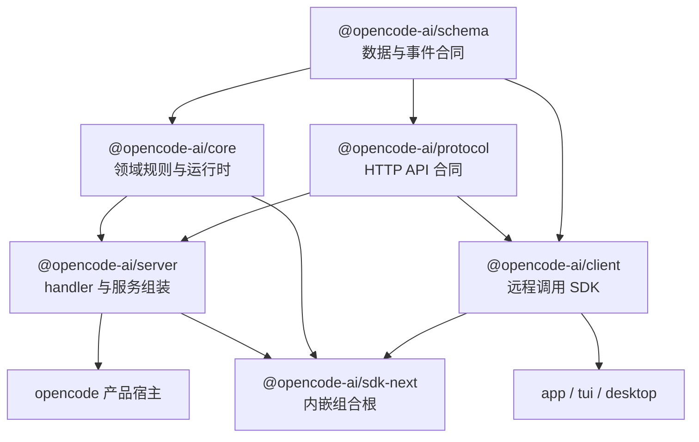
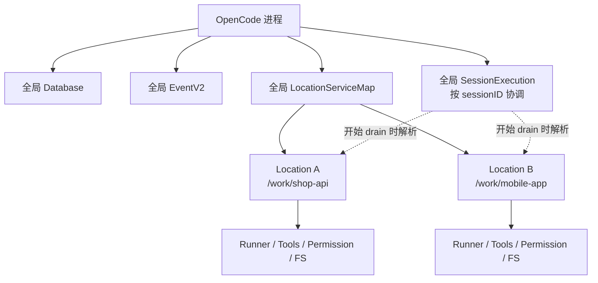

# 11 · 工程分层与代码组织

> 读完本章，你应能画出 OpenCode 与 pycode 的包图，并解释：  
> 「为什么 Client 不能 import Core？为什么文件工具必须按 Location 隔离？」

本章讲的是**依赖方向和运行作用域**，不是要求 Python 项目照搬 TypeScript、Bun 或 Effect。第一次阅读可先看 [00 · 阅读指南](./00-阅读指南.md)。

---

## 1. 分层不是为了“高级”，而是为了限制改动范围

个人 Demo 可以只有一个文件：

```text
agent.py
  ├─ HTTP 路由
  ├─ SQLite
  ├─ 模型调用
  ├─ 工具执行
  ├─ 权限
  └─ 命令行 UI
```

这种写法在第一个星期很快，随后会出现：

- 改一个 JSON 字段，服务器、UI、数据库一起坏；
- 想增加桌面端，只能复制业务逻辑；
- 测试模型调用时不得不启动整个应用；
- 客户端能绕过权限层直接写数据库；
- 项目 A 的工具可能误用项目 B 的工作目录。

分层的目标不是「文件越多越好」，而是回答三个问题：

1. **合同在哪里？** 请求、响应、事件长什么样。
2. **规则在哪里？** Session、权限、工具、压缩如何运行。
3. **边界在哪里？** 哪些模块允许互相 import，哪些状态允许共享。

一个实用检验是：

> 修改模型供应商适配，不应迫使 HTTP Client 改写；修改 UI，不应改变 Session 的持久化规则。

Agent 循环本身见 [03 · Agent 循环](./03-Agent循环-一次对话如何跑完.md)，本章只讨论如何把这些职责放进正确包中。

---

## 2. 正确的依赖图：不是一条机械直线

有时为了记忆，会把架构简称为：

```text
Schema → Protocol → Core → Server → Client
```

但如果箭头表示“左边被右边依赖”，这条直线并不精确。**Client 不能依赖 Server，Core 也不应依赖 Protocol。** 仓库规则表达的是：

- Schema 是浏览器安全的合同基础；
- Core 与 Protocol 都可以依赖 Schema；
- Server 依赖 Core 和 Protocol；
- Client 运行时代码只依赖 Schema 和 Protocol，绝不依赖 Core 或 Server；
- `sdk-next` 是专门的组合根，可以把 Client、Core、Server 组装到同一进程。



图中箭头表示“上游被下游依赖”。最关键的禁止边：

```text
client -X-> core
client -X-> server
protocol -X-> core
schema -X-> server
```

### 为什么这样安排

**Schema 不知道谁使用它。**  
它只描述 Session、Event、Permission 等可序列化数据，不启动服务、不查数据库。

**Protocol 不实现业务。**  
它声明路径、方法、query、body、success 和 error。比如 `after` 是数字、Session 事件是 SSE，这些属于 HTTP 合同。

**Core 不需要知道 HTTP。**  
Core 可以提供 `session.events(...)` 流，但不关心它最后被编码成 SSE、内存调用还是测试输入。

**Server 是适配和组装层。**  
它把 Protocol endpoint 接到 Core service，将领域错误映射为 HTTP 错误。

**Client 只认识公开合同。**  
它能在浏览器、桌面 renderer 或其他进程运行，不应把数据库驱动和服务端文件系统打进 bundle。

这也解释了 [19 · HTTP API 与 Client 约定](./19-HTTP-API与Client约定.md) 中的原则：公共 Protocol 或 Server `HttpApi` 改动后，要重新生成 Client，而不是手改 generated 文件。

---

## 3. Monorepo 包地图：遇到问题先去哪个包

OpenCode 是 monorepo：多个可独立理解的包放在同一个仓库。下面是本指南最相关的地图。

| 包 | 主要职责 | 不应承担 |
|---|---|---|
| `packages/schema` | 浏览器安全的数据、事件、错误载荷合同 | 数据库、网络 handler、进程状态 |
| `packages/protocol` | `/api/...` 路径、请求响应、SSE 合同 | Session 执行、工具逻辑 |
| `packages/core` | 当前领域运行时：Session、事件、权限、Location、工具、数据库 | UI 与具体 HTTP transport |
| `packages/server` | 将 Core 接到 Protocol，组装 router、middleware、handler | 浏览器 UI、客户端状态 |
| `packages/client` | 从 Protocol 生成 Promise / Effect 客户端 | import Core/Server、直接写库 |
| `packages/sdk-next` | Effect-native 内嵌宿主，组合 Client + Core + Server | 定义第二套业务实现 |
| `packages/llm` | 单次模型请求、Provider 协议、流事件归一化 | Session 循环、权限、持久化 |
| `packages/opencode` | 产品宿主、CLI/服务入口，以及仍在迁移的产品代码 | 作为浏览器安全合同层 |
| `packages/app` | Web/Solid 应用 UI | 服务器数据库规则 |
| `packages/tui` | 终端 UI 与终端交互 | 公共 HTTP 合同 |
| `packages/desktop` | Electron 主进程、preload、桌面打包，复用 app | Core 领域合同的副本 |

### 3.1 `llm` 与 `core` 为什么分开

`packages/llm` 的理想职责是**一次 Provider turn**：

```text
LLMRequest → stream → LLMEvent
```

它负责：

- OpenAI、Anthropic、Gemini 等协议编解码；
- endpoint、认证、framing；
- 把供应商流转换成统一 text/tool/finish 事件。

Session 层负责：

```text
何时调用模型
→ 如何保存输出
→ 是否执行工具
→ 是否继续下一轮
→ 何时压缩、重试或停止
```

所以不要在 LLM 包里悄悄做完整 Agent loop。Provider 边界详见 [18 · LLM 层与 Provider 边界](./18-LLM层与Provider边界.md)。

### 3.2 `opencode`、`app`、`tui`、`desktop` 的关系

它们都是产品层，但运行位置不同：

- `opencode`：启动进程、CLI 和服务端产品入口；
- `tui`：终端中的交互界面；
- `app`：浏览器/桌面 renderer 可复用的图形界面；
- `desktop`：Electron 外壳，负责窗口、IPC、更新和本机能力。

产品层可以组合下层能力，但不要把产品特有状态倒灌回 Schema 或 Protocol。

### 3.3 仓库正在演进，依赖表比目录印象可靠

大仓库通常存在新旧架构并行。例如产品包可能暂时依赖 legacy SDK，`sdk-next` 则承载新的内嵌组合。判断真实依赖时应看：

1. 根 `AGENTS.md` 的边界规则；
2. 各包 `package.json` 的 runtime dependencies；
3. 具体 import；
4. Schema/Protocol 的 current 与 V1 说明。

不要因为某个历史文件还在，就把它当成新 pycode 的目标设计。

---

## 4. Location-scoped 与 process-global：另一个维度

包分层回答「代码依赖谁」；作用域回答「一个运行实例由谁共享」。

假设同一 OpenCode 进程打开两个项目：

```text
/work/shop-api
/work/mobile-app
```

如果 bash、文件读取、权限和模型工具共享一个含糊的 `cwd`，在 mobile-app 对话里可能误删 shop-api 文件。因此与工作区相关的能力必须绑定 Location。

### 4.1 Location-scoped

当前 V2 设计中，以下能力应按 Location 提供：

- `SessionRunner`
- 模型解析
- Tool Registry
- Permission
- 文件系统与工作目录

Location 至少描述目录；显式 `workspaceID` 为未来放置语义保留。省略 `workspaceID` 表示隐式本地放置。

可以把 Location 想成 Python 中显式传递的：

```python
@dataclass(frozen=True)
class Location:
    directory: Path
    workspace_id: str | None = None
```

工具执行不应读取某个可变全局 `CURRENT_DIRECTORY`，而应从当前 Location 得到目录。

### 4.2 Process-global

以下组件需要在进程内统一协调：

- Database；
- EventV2 服务与耐久事件序列；
- `LocationServiceMap`；
- `SessionExecution`；
- 按 Session ID 协调的本地执行所有权。

`SessionExecution` 接收 Session ID，在真正 drain 开始时才通过 Session 存储和 `LocationServiceMap` 找到 Location。它不应让每个 Location 各自维护一个互不知情的同 Session 协调器，否则同一 Session 可能并发执行两次。



### 4.3 一个判断口诀

问自己：

- 「换一个项目目录，这个对象应该换一份吗？」是 → Location-scoped。
- 「同一进程中所有窗口必须共享同一真相吗？」是 → process-global。

作用域和生命周期也要一起设计。Location 关闭时，应清理它的文件 watcher、PTY、后台 fiber 和工具注册；进程退出时，再释放全局数据库和路由资源。

---

## 5. Embedded mode：同进程不等于绕过边界

`sdk-next` 提供内嵌模式。它把 Server 已组装好的 HTTP router 放在内存里执行：

- 不打开监听端口；
- 不产生真实网络 I/O；
- 仍使用相同 route、middleware、handler、codec 和 error；
- Effect Scope 关闭时释放 router、Location、fiber 和工具注册。

可以把两种模式画成：

```text
远程模式
Client → TCP/HTTP → Server Router → Core

内嵌模式
Client → 内存 HTTP → 同一个 Server Router → Core
```

内嵌模式的价值不是“可以直接 import 数据库”，而是**省掉网络运输，同时保留公开边界**。

错误做法：

```python
# UI 因为与服务端同进程，就直接改库
database.execute("DELETE FROM session WHERE id = ?", [session_id])
```

正确方向：

```python
# 仍调用统一 Client/API；transport 可以是内存实现
await client.sessions.delete(session_id)
```

这样远程模式和内嵌模式的语义不会分叉，鉴权、middleware、错误编码和测试覆盖也能复用。

pycode 不必一开始实现内存 ASGI transport，但应避免让 Client API 与 HTTP 细节绑死。FastAPI/Starlette 项目可在后期用 ASGI transport 执行同一 app，而不是另写一套 embedded service。

---

## 6. Python 读者如何理解 Effect：学边界，不必学语法

OpenCode 大量使用 Effect 来表达：

- 一个操作需要哪些服务；
- 可能返回哪些类型化错误；
- 流和并发任务由哪个 Scope 管理；
- Layer 如何组装实现；
- 日志和 trace 如何沿调用链传播。

如果你写 Python，**不需要为了模仿 OpenCode 而引入 Effect 替代品**。可用熟悉工具保留同样的工程性质：

| Effect 中的概念 | Python 可采用 |
|---|---|
| `Effect` | `async def` + 明确返回值/异常 |
| `Stream` | async iterator / async generator |
| `Service` | Protocol/ABC 或普通对象 |
| `Layer` | composition root / factory |
| `Scope`、finalizer | `async with`、`AsyncExitStack` |
| fiber | `asyncio.Task`、`TaskGroup` |
| typed schema | Pydantic model / dataclass + validator |

例如，不要让业务函数内部偷偷创建所有依赖：

```python
async def run_session(
    session_id: str,
    store: SessionStore,
    llm: LLMClient,
    tools: ToolRegistry,
) -> None:
    ...
```

在程序入口集中组装：

```python
async def main() -> None:
    store = SqliteSessionStore(database)
    llm = RoutingLLMClient(providers)
    tools = ToolRegistry(location)
    runner = SessionRunner(store=store, llm=llm, tools=tools)
    await serve(build_app(runner))
```

重点不是写很多 interface。只有当替换边界真实存在时才抽象：

- SQLite 与未来远程 Store；
- 真实 Provider 与测试 Provider；
- 远程 HTTP transport 与内存 ASGI transport。

单次使用的小函数不要提前拆成五层。清晰的目录、显式参数和 `asyncio.TaskGroup` 已足以实现第一版。

### Python 并发注意事项

`asyncio` 不会自动保证同一 Session 串行。你仍需要：

- process-global 的 `dict[session_id, coordinator]`；
- 同 Session join/coalesce；
- 不同 Session 允许并发；
- Location 关闭时取消其后台任务；
- durable admission 与模型执行分离。

换句话说：可以不用 Effect，但不能省略 Effect 帮你显式表达的生命周期和依赖关系。

---

## 7. 建议的 pycode 包映射树

下面是一棵适合从小做大的 Python 目录。它映射 OpenCode 的职责，但没有为每个 TypeScript 文件制造一个 Python 文件：

```text
pycode/
├── schema/                       # OpenCode: packages/schema
│   ├── session.py                # Pydantic/dataclass 合同
│   ├── event.py
│   ├── permission.py
│   └── question.py
├── protocol/                     # OpenCode: packages/protocol
│   ├── session.py                # 路径名、request/response model
│   └── errors.py
├── llm/                          # OpenCode: packages/llm
│   ├── models.py
│   ├── events.py
│   ├── client.py                 # 一次 stream(request)
│   └── providers/
│       ├── openai.py
│       └── anthropic.py
├── core/                         # OpenCode: packages/core
│   ├── database.py
│   ├── events/
│   │   ├── store.py
│   │   └── bus.py
│   ├── location.py
│   ├── session/
│   │   ├── service.py
│   │   ├── execution.py
│   │   └── runner.py
│   ├── tools/
│   ├── permission/
│   ├── question/
│   └── system_context/
├── server/                       # OpenCode: packages/server
│   ├── app.py
│   ├── middleware.py
│   └── routes/
├── client/                       # OpenCode: packages/client
│   ├── client.py
│   ├── transport.py
│   └── sse.py
├── sdk/                          # OpenCode: packages/sdk-next
│   └── embedded.py               # 后期加入内存 ASGI 组合
├── cli/                          # OpenCode: opencode / tui
│   └── main.py
└── app/                          # 可选 Web/Desktop UI
```

### 7.1 对应关系与 import 规则

建议用下面的规则约束：

```text
schema
  ↑          ↑
protocol   core ← llm
  ↑          ↑
client     server
   \         /
    \       /
      sdk / product entrypoint
```

更具体地：

- `schema` 不 import 其他 pycode 业务包；
- `protocol` 只 import `schema`；
- `llm` 可 import共享 schema，但不 import `core.session`；
- `core` 可 import `schema` 和 `llm`；
- `server` import `protocol` 与 `core`；
- `client` import `protocol` 与 `schema`，不 import `core`；
- `sdk`/入口负责组合，不定义第二份 Session 规则。

### 7.2 不要过早拆包

如果第一版只有 20 个文件，可以让 `schema/`、`protocol/` 先是同一 Python distribution 下的子包。重要的是 import 方向，不是立刻发布十个 wheel。

当某个边界满足以下条件再独立发行：

- 有独立消费者；
- 需要独立版本；
- 需要阻止引入服务端依赖；
- 有清晰稳定的公共 API。

### 7.3 可验证的架构测试

架构不能只靠口头约定。pycode 可以加入简单检查：

- `client/` 中禁止 `from pycode.core ...`；
- `schema/` 中禁止网络、数据库依赖；
- `llm/` 中禁止 import `core.session`；
- Server route 测试使用真实 handler，但替换窄边界 Provider；
- Embedded 与网络 transport 跑同一组 Client 合同测试。

---

## 8. 落地顺序、源码索引与小结

### 8.1 推荐落地顺序

**第一阶段：合同和单进程 Core**

1. 定义 Schema；
2. 实现一次 `llm.stream`；
3. 实现 SessionRunner、事件存储和工具；
4. 用 `asyncio` 保证同 Session 串行。

**第二阶段：Server 与 Client**

1. Protocol 定义路由；
2. Server handler 只做适配；
3. Client 只依赖 Schema/Protocol；
4. SSE 支持 `after=seq` 恢复。

**第三阶段：多入口与 Embedded**

1. CLI/TUI 只走 Client；
2. 加 Web/Desktop；
3. 用同一 Server app 提供内存 transport；
4. 为 Location 生命周期加清理。

成功标准：

- Client 包安装后不会带入数据库驱动；
- 更换 Provider 不改 Session HTTP 合同；
- 两个 Location 的工具目录互不串线；
- 同 Session 不会同时运行两个 drain；
- 远程与 Embedded 模式通过相同合同测试；
- UI 重启后可通过耐久事件恢复。

### 8.2 源码索引

- `AGENTS.md`：仓库级依赖方向、Client 禁止边与 `sdk-next` 组合规则。
- `packages/schema/package.json`：Schema 的轻量 runtime 依赖。
- `packages/protocol/package.json`：Protocol 运行时依赖 Schema。
- `packages/core/package.json`：Core 依赖 Schema 与 LLM 等领域能力。
- `packages/server/package.json`：Server 依赖 Core 与 Protocol。
- `packages/client/package.json`：Client runtime 只依赖 Schema 与 Protocol；Core/Server 仅用于开发生成和测试。
- `packages/sdk-next/package.json`：组合 Client、Core、Server。
- `packages/sdk-next/README.md`：内嵌 router、无监听端口与 Scope 生命周期。
- `packages/sdk-next/src/opencode.ts`：Embedded 组合入口。
- `packages/server/src/routes.ts`：全局服务与路由 Layer 组装。
- `packages/core/src/location.ts`：Location 合同与服务。
- `packages/core/src/location-service-map.ts`：Location 服务映射。
- `packages/core/src/session/execution/`：process-global、Session-ID based 执行协调。
- `packages/core/src/session/runner/`：Location-scoped SessionRunner。
- `packages/llm/`：单次 Provider turn 的模型与协议实现。
- `packages/opencode/package.json`、`packages/app/package.json`、`packages/tui/package.json`、`packages/desktop/package.json`：产品层包关系。

### 8.3 本章小结

- 精确依赖图不是机械的 `Schema → Protocol → Core → Server → Client` 直线。
- Schema 是底座；Core 与 Protocol 是不同分支；Server 汇合二者。
- Client 只依赖 Schema/Protocol，不能碰 Core/Server；`sdk-next` 是有意的组合根。
- Database、Event、SessionExecution 等是 process-global；Runner、工具、权限、文件系统按 Location 隔离。
- Embedded 省掉网络，但仍走同一 router 和 API 边界。
- Python 不需要 Effect；`asyncio`、显式依赖和清楚的生命周期足够。

继续深入时，可读 [18 · LLM 层与 Provider 边界](./18-LLM层与Provider边界.md) 和 [19 · HTTP API 与 Client 约定](./19-HTTP-API与Client约定.md)。

**上一章**：[10 · 可观测性](./10-可观测性-如何看见Agent在干嘛.md)  
**下一章**：[12 · PyCode 落地路线图](./12-PyCode落地路线图.md)
