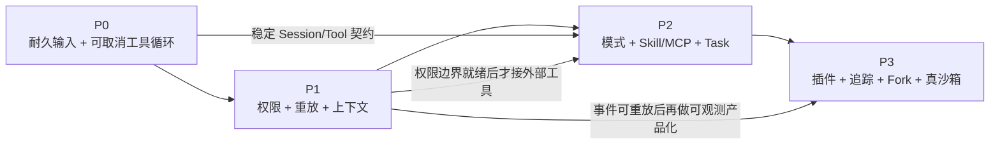

# 12 · PyCode 落地路线图

> 本章是「照着做」的清单。  
> 每做完一阶段，用 **成功标准** 自己验收，避免幻想进度。

---

## 1. 总原则（写在墙上）

1. **对齐 OpenCode 的 V2 思路**，不要先复刻旧 V1 细节再迁移。  
2. **Python 用 async + 清晰模块**，不要机械翻译 TypeScript Effect。  
3. **先能安全地循环，再追求花活**（向量记忆、自动意图、Docker 沙箱都可以后加）。  
4. **每阶段都要有可演示脚本**（哪怕是 CLI）。

阅读不够可回：[00-阅读指南](./00-阅读指南.md)。

---

## 2. 先看依赖：不是四个平行愿望

P0–P3 是依赖关系，不是四支可以同时开工的队伍。尤其不要在 Session、权限和事件契约尚未稳定时，先做漂亮 TUI 或大量插件。



可以并行的是同一阶段内边界清楚的工作，例如 P0 的 schema、SQLite 存储和只读工具；不能并行假装完成的是跨阶段依赖，例如“先接 MCP，之后再补权限”。

每阶段的通用验收规则：

- 必须有自动化测试，不只靠手动演示。
- 必须能指出失败时是哪条不变量被破坏。
- 必须在真实临时目录和真实 SQLite 上跑关键路径。
- 必须保留一个最短 CLI 演示，方便初学者观察系统状态。

---

## 3. 阶段 P0：能跑通「可取消的工具循环」

**阶段目标：** 先做出一个行为诚实的最小 Agent。它不一定聪明，但输入不会凭空消失，同一 Session 不会并行跑乱，停止后也不会伪装成“什么都恢复好了”。

### 做什么

| 模块 | 最小内容 |
|------|----------|
| schema | Session、Message、ToolCall、Event 的 pydantic 模型 |
| 存储 | SQLite：sessions、messages/events、session_input |
| 入队 | `prompt()` 写入 inbox；可选 wake |
| 执行器 | 每个 session 一把锁；串行 drain |
| 循环 | promote → 调模型一次 → 执行工具 → 写回 → 再调 |
| 取消 | interrupt 取消当前任务；工具标失败；inbox 保留 |
| 工具 | 至少 `read` / `write` / `bash`（bash 先整命令 ask 也行） |

### 成功标准（必须全过）

- [ ] `prompt()` 先写入一条耐久 inbox 记录，再触发 advisory wake。
- [ ] 连续发两句，不会有两个 drain 并行把同一会话跑乱。
- [ ] 两个不同 Session 可以并行，不被一把全局锁串行化。
- [ ] 一次 provider turn 只发生一次显式 `llm.stream(request)`。
- [ ] 工具调用先记录为 `running`，完成后必定收口为成功或失败。
- [ ] 点停止后，当前执行结束；尚未 promote 的下一句仍在 inbox。
- [ ] 进程重启后，历史消息和待处理输入仍可读。
- [ ] 同 message id、同内容、同 delivery 重试不会重复插入。
- [ ] 同 message id 改换 Session、内容或 delivery 时明确报冲突。
- [ ] `read`、`write`、`bash` 各有一条真实实现测试，不只测试假函数。

### 演示脚本想法

```bash
pycode chat --session demo
# 输入修 bug → 看到 read/grep
# Ctrl+C 或 /stop → 再 /resume
```

---

## 4. 阶段 P1：权限、提问、压缩、系统上下文

**阶段目标：** 从“能循环”升级为“能安全地被人使用，并能在断线后解释发生了什么”。

### 做什么

- Permission：`allow` / `deny` / `ask` + 简单 TUI 弹窗  
- Question 工具：阻塞问用户  
- Compaction：超窗口时摘要 + 保留近期原文；**库里全文仍在**  
- System Context：至少注入 cwd、日期、可选 `AGENTS.md`  
- 事件 SSE：耐久事件可 `after=seq` 重放  

### 成功标准

- [ ] `rm` 类命令能被 `deny` 或 `ask` 拦住，拒绝不会偷偷执行。
- [ ] `ask` 的请求、回答与最终工具状态能关联到同一 Session 和 tool call。
- [ ] `question` 等待用户时可以取消，不会留下永久 `running`。
- [ ] 压缩后数据库仍能读出压缩前原文；改变的是模型视图，不是历史真相。
- [ ] 断线重连只靠 `after=seq` 能补齐耐久事件，且没有重复或漏事件。
- [ ] live-only token delta 不进入耐久游标，不承诺断线后逐 token 重放。
- [ ] 换目录后环境信息会更新，或严格按已写明的 context epoch 规则更新。
- [ ] `AGENTS.md` 等特权上下文的实际模型输入可追溯。
- [ ] P0 全部回归测试继续通过。

---

## 5. 阶段 P2：像「真产品」一点

**阶段目标：** 在已经可信的 Session 和权限边界上，加入工作模式和外部能力；不让“生态丰富”反过来破坏核心安全。

### 做什么

- Build / Plan 双模式（权限硬闸 + 提示词）  
- Skill：扫描 `SKILL.md` + skill 工具加载正文  
- MCP：先支持 stdio 一种 transport  
- Task 子会话：explore/general；支持 task_id 恢复  
- Shell：尽量补上命令解析 / 外部目录检查 / 重复调用提醒  

### 成功标准

- [ ] Plan 模式下写普通业务代码会被执行层拒绝，而不只是提示词劝阻。
- [ ] Build / Plan 切换发生在明确边界，切换前后的权限可被测试观察。
- [ ] MCP 工具以稳定、无冲突的名字出现，调用仍经过同一权限系统。
- [ ] MCP server 退出、超时或返回坏数据时，当前 tool call 明确失败。
- [ ] Skill 列表进入提示词，正文只在需要时加载；不存在的 Skill 明确报错。
- [ ] 子任务能返回结构化结果；恢复语义有测试，不靠内存对象碰巧还在。
- [ ] Task 若暂时复用 legacy 路径，文档和代码都明确标注适配边界。
- [ ] P0、P1 全部回归测试继续通过。

---

## 6. 阶段 P3：增强与打磨

**阶段目标：** 只在核心契约稳定后增加扩展性、可观测性和高级恢复能力。P3 不是“想做什么都扔进来”，每项仍应有独立开关和验收证据。

- Plugin hooks（before/after）；若公开 `permission.ask` 就必须真接线  
- OTLP 追踪  
- Fork 对话  
- 可选：Docker/bubblewrap 真沙箱（明确是增强，不是 OpenCode 默认行为）  
- 可选：向量长期记忆（**新层**，别塞进 compaction）  
- 可选：自动意图路由进 Plan（OpenCode 没有，是你的产品创新）  

### 成功标准

- [ ] 每个公开 hook 都能在端到端测试中观察到，且错误传播策略明确。
- [ ] 一次用户请求可通过 trace 关联 admission、provider turn、tool call 和 settlement。
- [ ] Fork 后父子历史边界清楚，后续写入不会串线。
- [ ] 若宣称“沙箱”，测试必须证明文件、进程和网络边界；只有命令审批不得叫沙箱。
- [ ] 长期记忆关闭时，Session 与 compaction 行为完全不受影响。
- [ ] 自动路由关闭时，模式选择退回显式用户控制。
- [ ] 发布说明逐项区分“已稳定”“实验性”“明确延后”。
- [ ] P0–P2 全部回归测试继续通过。

---

## 7. 推荐的文件级任务拆分（适合多 Agent 并行写代码）

```text
pycode/schema/*          ← 一人/一Agent
pycode/core/session/*    ← 循环核心，优先
pycode/core/tool/*       ← 可并行
pycode/core/permission/* ← 可并行
pycode/server/*          ← 等 schema 稳定后
pycode/cli/*             ← 随时可做薄封装
```

文档同样按章拆在 `docs/pycode-guide/`，改工具就改第 05 章，互不堵车。

---

## 8. 刻意不做清单（避免分心）

| 刻意不做 | 现在不做的原因 | 何时重评 |
|---|---|---|
| 完美复刻 Effect Layer | Python 的惯用抽象不同，机械翻译只会增加心智负担 | async、依赖注入和资源清理出现真实缺口时 |
| 同时长期维护完整 V1 与 V2 Session | 两套语义会让修复、测试和迁移成本翻倍 | 不重评；只保留有截止日期的兼容入口 |
| 一上来做集群多机抢会话 | 本地 coordinator 的正确性尚未证明，分布式 ownership 还需要 fencing | 单进程容量成为已测量瓶颈后 |
| `wake` 自动重放所有副作用 | 崩溃点可能位于“副作用成功、结果未落盘”之间 | 有耐久 dispatch 身份、幂等策略和人工恢复状态后 |
| 把命令审批称为沙箱 | `ask/allow/deny` 不隔离宿主文件、进程和网络权限 | 真正引入容器或 OS 隔离并通过逃逸测试后 |
| 没有权限系统就接 MCP | 外部工具扩大能力面，也扩大数据泄露和副作用风险 | P1 权限验收通过后 |
| 把长期记忆塞进 compaction | 摘要是上下文控制，长期记忆是独立检索产品 | Session 稳定且有单独数据生命周期后 |
| 为了“智能”自动切 Plan | 这是产品策略，不是 OpenCode V2 核心兼容要求 | 显式模式稳定并有误路由指标后 |

---

## 9. OpenCode 版本对齐策略

PyCode 应当学习 OpenCode 的**不变量和契约**，而不是追逐每次文件移动，也不是把当前 V1 和实验 V2 全量复制一遍。

### 9.1 以什么为准

优先级从高到低：

1. `specs/v2/session.md`、`specs/v2/tools.md` 等 V2 规格；
2. `specs/v2/schema-changelog.md` 中的契约变化与兼容说明；
3. `packages/core/src/session/runner/` 和相应测试体现的当前行为；
4. V1 代码只作为尚未迁移能力的行为参考，不作为 PyCode 新架构的中心。

建议在 PyCode 仓库维护一份很短的 `OPENCODE_ALIGNMENT.md`，记录：

```text
上次对齐的 OpenCode commit/tag：
采用的 V2 规格日期：
已实现的不变量：
有意不同之处：
仍经 legacy 适配的能力：
下次删除兼容层的条件：
```

### 9.2 如何跟进上游变化

- 每两到四周检查一次 V2 规格和 schema changelog，不按每个 commit 追更。
- 把变化分成“语义变化、schema/API 变化、内部重构”三类；内部重构通常无需照搬。
- 语义变化先补 contract test，再改实现。
- 未发布、可丢弃的 V2 实验事件，不承诺永久迁移；PyCode 自己发布后则必须有版本策略。
- V1 兼容入口必须写删除条件，例如“原生 V2 Task 通过验收后删除 legacy adapter”，不能无限期双维护。

> 目标不是“永远和某个目录结构一模一样”，而是明确回答：PyCode 当前对齐哪版契约、哪里不同、为什么不同。

---

## 10. 风险登记表

风险登记不是悲观清单，而是防止路线图把“尚未设计”写成“已经可靠”。

| 风险 | 常见误判 | 当前控制 | 触发升级的信号 |
|---|---|---|---|
| 沙箱神话 | 有 `ask` 就认为 shell 被隔离 | 文案明确“权限审批不是沙箱”；默认最小权限 | 开始处理不可信仓库或多租户任务 |
| 崩溃恢复延后 | 重启后自动 `wake` 就能安全续跑 | 保留 durable inbox；遗留 `running` 工具收口失败；不盲重放副作用 | 出现真实中断恢复需求或重复副作用事故 |
| Task 仍走 legacy | 子会话能跑就认为已是原生 V2 | 用明确 adapter 隔离，测试父子身份与结果；不承诺完整 V2 恢复 | 上游原生 V2 Task 契约稳定 |
| V1/V2 双维护失控 | “兼容更稳” | V2 为主，V1 只作限时适配，并记录删除条件 | 同一 bug 需要在两套 Session 修两次 |
| 事件重放误解 | 断线后能恢复每个 token | 只用耐久事件推进 cursor，delta 明确为 live-only | UI 把 delta 当成最终状态或 cursor |
| 单进程 ownership | SQLite 耐久就等于多机安全 | 明确 coordinator 仅进程内；暂不做集群承诺 | 同一数据库被多个执行进程使用 |
| 工具副作用 | 工具失败就表示什么也没发生 | 记录调用与 settlement；错误提示允许“部分已应用” | 引入支付、发布、迁移等高风险工具 |
| Provider 漂移 | fixture 永远代表线上模型 | record/replay 保证协议，少量受控 smoke 检查真实服务 | Provider schema、流事件或鉴权变化 |
| 队列与并发无上限 | 本地 Demo 没问题就可公开服务 | 先限制输入、工具并发和输出大小 | 面向多调用方或不可信输入开放 |

风险和测试必须互相引用：具体方法见 [20 · 测试策略与可验证目标](./20-测试策略与可验证目标.md)。

---

## 11. 学习时如何对照 OpenCode 源码

不必从头读到尾。按地图打卡：

| 你想理解 | 先看文档章 | 再看代码 |
|----------|------------|----------|
| 循环 | [03](./03-Agent循环-一次对话如何跑完.md) | `packages/core/src/session/runner/llm.ts` |
| 提示词 | [04](./04-提示词与工作模式.md) | `system-context/`、`agent/agent.ts` |
| 工具 | [05](./05-工具-MCP-与Skill.md) | `packages/core/src/tool/`、`opencode/src/mcp/` |
| 权限 | [06](./06-权限-人机确认与命令安全.md) | `opencode/src/permission/`、`tool/shell.ts` |
| 多 Agent | [07](./07-多Agent怎么协作.md) | `tool/task.ts` |
| 压缩 | [08](./08-会话记忆与上下文压缩.md) | `session/compaction.ts` |
| 取消恢复 | [09](./09-取消-恢复与容错.md) | `run-coordinator.ts` |
| 可观测 | [10](./10-可观测性-如何看见Agent在干嘛.md) | `event.ts`、`observability/` |
| 分层 | [11](./11-工程分层与代码组织.md) | 根目录 `AGENTS.md` |
| LLM 边界 | [18](./18-LLM层与Provider边界.md) | `packages/core/src/session/runner/llm.ts` |
| 测试 | [20](./20-测试策略与可验证目标.md) | `packages/core/test/session-runner*.test.ts` |

权威规格（进阶）：`specs/v2/session.md`、`CONTEXT.md`。

落地前建议至少读完：

- [03 · Agent 循环](./03-Agent循环-一次对话如何跑完.md)：理解 provider turn 与外层循环；
- [05 · 工具、MCP 与 Skill](./05-工具-MCP-与Skill.md)：理解能力如何进入系统；
- [06 · 权限与命令安全](./06-权限-人机确认与命令安全.md)：不要把审批误叫沙箱；
- [09 · 取消、恢复与容错](./09-取消-恢复与容错.md)：理解哪些恢复被刻意延后；
- [11 · 工程分层](./11-工程分层与代码组织.md)：保持依赖方向；
- [18 · LLM 与 Provider 边界](./18-LLM层与Provider边界.md)：守住一次 turn 一次请求；
- [20 · 测试策略](./20-测试策略与可验证目标.md)：把本章清单变成自动证据。

---

## 12. 一周体验版时间表（业余）

| 天 | 目标 |
|----|------|
| Day 1–2 | 读完 01–03；画出自己的循环图 |
| Day 3–4 | P0：SQLite + 假 LLM（固定回复工具调用）跑通循环 |
| Day 5 | 接真模型 API；read/write |
| Day 6 | ask 权限 + stop |
| Day 7 | 写一页自己的设计笔记：哪些要抄、哪些要简化 |

---

## 13. 你怎么知道「学会了」？

闭卷回答：

1. 为什么用户消息要先入队再执行？  
2. Steer 和 Queue 用户体验差在哪？  
3. 为什么 Plan 不能只靠提示词？  
4. Skill 和 MCP 有什么不同？  
5. 压缩删的是「模型看见的内容」还是「数据库」？  
6. 点停止后，排队消息还在吗？  

答得清，就可以开工写 pycode 了。

---

## 14. 本章小结

- 按 P0→P1→P2→P3 推进，用清单验收  
- 文档与代码都按主题拆分，利于并行  
- 先安全循环，后生态与花活
- 追踪 V2 规格与不变量，不无限期双维护 V1/V2
- 把沙箱、崩溃恢复、legacy Task 等未完成边界写进风险登记表

**返回目录**：[00-阅读指南.md](./00-阅读指南.md)
