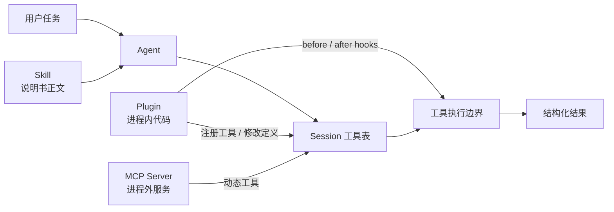

# 13 · Hooks 与插件扩展

> 读完本章，你应该能回答：插件、MCP、Skill 分别怎样扩展 Agent？  
> `tool.execute.before/after`、`tool.definition`、`shell.env` 在什么时候触发？`permission.ask` 现在能不能拦住权限？

本章接着 [05 · 工具、MCP 与 Skill](./05-工具-MCP-与Skill.md) 展开“扩展”这件事。权限边界见 [06](./06-权限-人机确认与命令安全.md)，工具结果边界见 [14](./14-结构化工具结果与输出边界.md)。

---

## 1. 这一章要解决什么问题？

公司常会提出这些要求：

- 每次工具执行前都记审计日志；
- 给 `bash` 注入代理地址、构建缓存目录等环境变量；
- 改写工具描述，让模型遵守内部规范；
- 接入 Jira、浏览器或内部数据库；
- 给 Agent 一份“发布前检查清单”。

它们看起来都叫“扩展”，实际有三条不同路径：

| 路径 | 扩展的是什么 | 典型用途 |
|------|--------------|----------|
| **Plugin** | OpenCode 进程内的生命周期与工具行为 | hook、注册自定义工具、改配置 |
| **MCP** | 进程外服务提供的工具 / 资源 | Jira、数据库、浏览器、远程系统 |
| **Skill** | 给模型看的按需说明书 | 团队工作流、SDK 用法、检查清单 |

选错路径会产生错误期待。例如，加载 Skill 不会注册工具；接入 MCP 也不会自动得到任意 OpenCode 内部生命周期 hook。

---

## 2. Naive 做法为什么会失控？

最直接的写法是在核心循环里硬编码：

```python
if tool_name == "bash":
    args["env"]["HTTP_PROXY"] = "..."
audit.log(tool_name, args)
result = run_tool(tool_name, args)
audit.log(result)
```

一开始能用，但很快会遇到：

1. 每加一个公司需求都改 runner，核心循环越来越脆；
2. 内置工具、插件工具、MCP 工具可能走不同分支，审计容易漏；
3. 插件直接抛错时，工具是否执行、结果是否落库变得含糊；
4. 一个“看起来存在”的 hook 若没被调用，会制造虚假安全感。

正确方向是把稳定的扩展点定义成 hook，并在明确的执行边界统一触发。

---

## 3. 三条扩展路径：Plugin、MCP、Skill



### 3.1 Plugin：进程内扩展

插件是 TypeScript/JavaScript 代码。公开 `Hooks` 类型位于 `packages/plugin/src/index.ts`，插件可以：

- 在 `tool` 字段注册自定义工具；
- 实现 `tool.definition`、`tool.execute.before/after`、`shell.env` 等 hook；
- 监听事件或修改聊天参数、请求头、系统提示。

Legacy 注册表还会扫描配置目录中的 `{tool,tools}/*.{js,ts}`。默认导出用文件名作工具名；具名导出会成为 `{文件名}_{导出名}`。

### 3.2 MCP：进程外工具协议

MCP Server 通过标准协议列出工具。OpenCode 把名字清洗后注册为 `{server}_{tool}`，再在 Session 中执行远程调用。适合跨语言、跨进程、远程部署的业务能力。

### 3.3 Skill：上下文扩展

Skill 先把 `name + description` 索引放进上下文，模型需要时调用 `skill` 读取 `SKILL.md` 正文。它只增加知识和流程指导，**不会向工具表注册新工具**。

一句话选择：

```text
要进程内改生命周期 → Plugin
要接外部可执行服务 → MCP
要教模型工作方法   → Skill
```

---

## 4. 四个关键 Hook 何时触发？

### 4.1 `tool.definition`

Legacy `ToolRegistry.tools()` 在把工具定义交给模型前触发它。插件可修改：

- `description`：模型看到的工具说明；
- `parameters` / JSON Schema：模型应生成怎样的参数。

它改变的是**广告给模型的定义**，不是执行权限。即使把工具隐藏或描述成“只读”，叶子执行器仍必须做真实权限检查。

### 4.2 `tool.execute.before`

`packages/opencode/src/session/tools.ts` 在内置、插件和 MCP 工具真正执行前触发：

```text
模型工具调用 → before(output.args 可改) → 权限 / 工具执行
```

适合参数规范化、审计、附加组织信息。它可以原地修改 `output.args`。

### 4.3 `tool.execute.after`

工具返回后触发，可修改 `title`、`output`、`metadata`，适合：

- 脱敏；
- 加显示标题；
- 发送审计或指标；
- 给 UI 补充元数据。

注意顺序：对普通 Legacy 工具，通用截断通常已在工具包装层完成；MCP 路径的 after 与结果规范化顺序存在专门分支。插件不要假设自己总能看到“未截断的完整 stdout”。

### 4.4 `shell.env`

Legacy Shell 工具在启动进程前触发，输入含 `cwd/sessionID/callID`，输出为额外环境变量。最终环境是：

```text
process.env + plugin 返回的 env
```

后者同名键会覆盖宿主环境值。它适合注入普通构建配置，不适合无条件注入长期密钥；工具输出、子进程日志和错误都可能泄露环境信息。

---

## 5. 配置与插件示例

`opencode.jsonc` 中可声明插件包：

```jsonc
{
  "$schema": "https://opencode.ai/config.json",
  "plugin": [
    "./plugins/audit-tools.ts",
    ["@company/opencode-plugin", { "team": "platform" }]
  ]
}
```

教学版插件示例：

```typescript
import type { Plugin } from "@opencode-ai/plugin"

export const AuditPlugin: Plugin = async () => ({
  "tool.definition": async (input, output) => {
    if (input.toolID === "bash") {
      output.description += "\nRun the narrowest command that verifies the task."
    }
  },

  "tool.execute.before": async (input, output) => {
    console.info("tool.start", input.tool, input.callID, output.args)
  },

  "tool.execute.after": async (input, output) => {
    console.info("tool.end", input.tool, input.callID, output.metadata)
  },

  "shell.env": async (_input, output) => {
    output.env.CI = "1"
  },
})
```

这是机制示例，不是完整安全插件。生产审计还要考虑参数脱敏、失败路径、日志不可篡改和插件自身异常。

---

## 6. 真实边界：`permission.ask` 有类型，但没有接线

`packages/plugin/src/index.ts` 的 `Hooks` 接口声明了：

```typescript
"permission.ask"?: (
  input: Permission,
  output: { status: "ask" | "deny" | "allow" },
) => Promise<void>
```

但当前仓库的运行路径中没有对应的 `plugin.trigger("permission.ask", ...)`。也就是说：

- TypeScript 会允许插件实现这个字段；
- 运行时权限服务不会调用它；
- 它目前**不能**用于拦截、放行或审计权限决策。

这是“API 形状存在，但功能未接线”，必须诚实记录。安全系统里，未触发的 hook 比没有 hook 更危险，因为使用者会误以为保护已经生效。

权限主路径仍是 [06](./06-权限-人机确认与命令安全.md) 中的 Permission 服务、规则求值、Asked/Replied 事件与 UI 回复。若未来接线，应明确：

1. hook 在规则求值前还是后运行；
2. 能否把 deny 改成 allow；
3. 插件抛错时默认拒绝还是继续；
4. V2 与 Legacy 是否语义一致；
5. 审计 hook 是否允许修改决策，还是只读观察。

此外，Plugin 运行在 OpenCode 进程内，通常拥有与宿主相同的文件和网络权限。它不是沙箱中的低权限脚本。

---

## 7. pycode 怎么落地？

建议按最小可验证路径实现：

1. 定义一个明确的 Hook 注册表，按注册顺序触发；
2. 先实现 `tool_definition`、`tool_execute_before/after`、`shell_env`；
3. 所有工具类型经过同一个执行边界，避免 MCP 或插件工具漏 hook；
4. before 允许改参数后，要**重新做 schema 校验**；
5. after 只处理展示与审计，不得绕开 [14](./14-结构化工具结果与输出边界.md) 的统一截断；
6. hook 异常策略写进契约，并分别测试“执行前失败”和“执行后失败”；
7. `permission_ask` 要么真正接线并测试，要么不要公开。

Python 侧可采用简单配置：

```yaml
plugins:
  - pycode_plugins.audit:plugin

hooks:
  fail_closed:
    - tool_execute_before
  fail_open:
    - tool_execute_after
```

这里 `fail_closed` 表示 before hook 出错就不执行副作用；after 可按产品要求选择记录错误后保留原始工具结果。不要让一个审计上传故障把已经成功的文件修改伪装成“从未发生”。

---

## 8. 源码索引、验证清单与延伸阅读

| 主题 | 源码位置 |
|------|----------|
| Plugin 公开类型与 Hooks | `packages/plugin/src/index.ts` |
| Plugin 工具定义 | `packages/plugin/src/tool.ts` |
| Legacy 工具与插件注册 | `packages/opencode/src/tool/registry.ts` |
| before / after 与 MCP Session 工具 | `packages/opencode/src/session/tools.ts` |
| `shell.env` 触发 | `packages/opencode/src/tool/shell.ts` |
| MCP 名字清洗 | `packages/opencode/src/mcp/catalog.ts` |
| V2 canonical Tool / Registry | `packages/core/src/tool/tool.ts`、`registry.ts` |

验证实现时至少检查：

- `tool.definition` 的改写真的进入模型请求；
- before 修改后的参数被实际执行且重新校验；
- 成功、失败、取消三条路径是否都留下审计；
- MCP 与插件工具是否也触发 before/after；
- 全仓库是否真的存在 `plugin.trigger("permission.ask", ...)`——当前答案是**没有**。

相关章节：

- [05 · 工具、MCP 与 Skill](./05-工具-MCP-与Skill.md)
- [06 · 权限、人机确认与命令安全](./06-权限-人机确认与命令安全.md)
- [14 · 结构化工具结果与输出边界](./14-结构化工具结果与输出边界.md)
- [17 · 工作区沙箱与命令安全深度](./17-工作区沙箱与命令安全深度.md)
