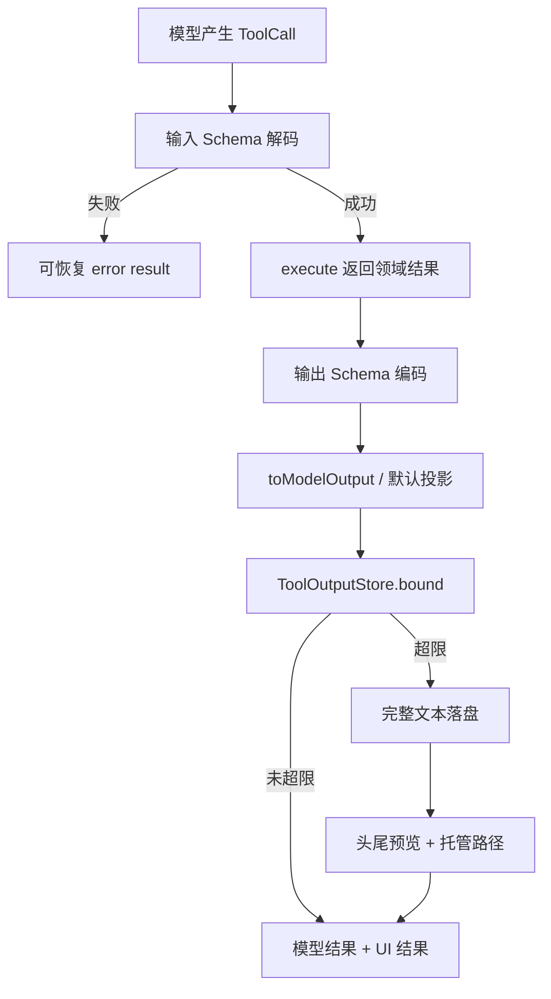

# 14 · 结构化工具结果与输出边界

> 读完本章，你应该能回答：工具内部结果、UI 展示和模型可见输出为什么不能混成一个字符串？  
> `ExecuteResult`、`toModelOutput`、截断落盘、非法参数和 provider 托管工具分别怎样处理？

工具从哪里来见 [05](./05-工具-MCP-与Skill.md)，执行 hook 见 [13](./13-Hooks与插件扩展.md)，权限失败语义见 [06](./06-权限-人机确认与命令安全.md)。

---

## 1. 这一章要解决什么问题？

工具执行后，至少有三类消费者：

1. **模型**：需要足够的信息决定下一步；
2. **UI / 会话历史**：需要标题、状态、附件、进度；
3. **系统内部**：可能需要完整结构化结果、落盘路径和审计信息。

如果全部压成一个字符串，会丢掉类型；如果全部原样塞给模型，又可能被 50MB 日志打爆上下文。

所以关键原则是：

> 工具先返回完整、可验证的领域结果；系统再在唯一边界投影成模型可见输出，并限制大小。

---

## 2. Legacy 的 `ExecuteResult` 与 V2 的 Tool Output

Legacy `packages/opencode/src/tool/tool.ts` 定义：

```typescript
interface ExecuteResult {
  title: string
  metadata: Record<string, unknown>
  output: string
  attachments?: FilePart[]
}
```

各字段用途：

| 字段 | 主要消费者 | 含义 |
|------|------------|------|
| `title` | UI | 这次调用的简短标题 |
| `metadata` | UI / 会话 / 运行时 | 退出码、截断标记、进度等 |
| `output` | 模型与 UI | 文本结果 |
| `attachments` | 模型 / UI | 图片、PDF 等文件内容 |

V2 Core 的 `Tool.make` 更严格：

- `input`：输入 Schema；
- `output`：工具领域输出 Schema；
- `structured` / `toStructuredOutput`：可选的结构化结果投影；
- `execute`：返回完整领域值；
- `toModelOutput`：把领域值投影成模型可读的 text/file 内容。

这使“数据库返回了 100 行对象”和“模型应看到怎样的摘要”不再是同一件事。

---

## 3. 从调用到结算：唯一输出边界



V2 `ToolRegistry.Materialization.settle` 是统一结算点：

1. 捕获物化时广告给模型的那份工具注册，避免注册变化后误调另一实现；
2. 解码输入并执行；
3. 验证、编码输出；
4. 调用 `toModelOutput`；
5. 由 `ToolOutputStore.bound` 做通用限界；
6. 生成模型结果，并把 `outputPaths` 交给会话层保存。

注册表本身不做权限授权；权限由工具叶子持有。输出边界与权限边界是两件事。

---

## 4. `toModelOutput`：结构化结果怎样给模型看？

假设工具查询构建状态，内部结果是：

```json
{
  "status": "failed",
  "durationMs": 81234,
  "failedTests": ["auth rejects expired token"],
  "rawLog": "……数万行……"
}
```

模型未必需要完整 JSON。pycode 可以这样投影：

```python
class TestResult(BaseModel):
    status: str
    duration_ms: int
    failed_tests: list[str]
    raw_log: str


def to_model_output(result: TestResult) -> list[dict]:
    summary = (
        f"status={result.status}\n"
        f"duration_ms={result.duration_ms}\n"
        f"failed_tests={result.failed_tests}"
    )
    return [{"type": "text", "text": summary}]
```

V2 未提供 `toModelOutput` 时：

- 字符串输出默认成为 text；
- 非字符串若没有显式内容，可由统一边界把 structured 值 JSON 化后限界；
- file 内容保留为媒体附件，不与大文本一起被丢掉。

不要在每个工具里各写一套随意截断。工具可以做**生产者捕获上限**（例如进程 stdout 最多保留多少），但“喂给模型前的通用大小限制”应只有一个结算边界。

---

## 5. Truncate 与落盘：大输出不能直接塞上下文

Legacy `Truncate` 默认限制是：

```jsonc
{
  "tool_output": {
    "max_lines": 2000,
    "max_bytes": 51200
  }
}
```

超过行数或 UTF-8 字节数时：

1. 完整文本写入托管截断目录；
2. 模型只看到头部或尾部预览；
3. 返回 `truncated: true` 与 `outputPath`；
4. 提示模型用 Grep / Read 的 offset/limit 定点查看；
5. 旧文件按保留策略清理，当前默认保留 7 天。

V2 `ToolOutputStore` 同样默认 2000 行 / 50 KiB，但预览会尽量保留**头和尾**，并把完整文本写入全局数据目录下的 `tool-output` 托管目录。`outputPaths` 不是工具随便指定的路径，而是结算边界生成的托管输出引用。

```yaml
# pycode 示例
tool_output:
  max_lines: 2000
  max_bytes: 51200
  retention_days: 7
```

需要区分两层保险：

- **生产者捕获限制**：防止子进程把 Agent 内存撑爆；被丢掉的数据可能无法恢复；
- **模型输出限制**：完整结果已获得，只是不全塞进上下文，通常可落盘后再分页读。

---

## 6. 失败也是结构化结果：InvalidArguments 与 provider 托管工具

### 6.1 `InvalidArgumentsError` 是可恢复失败

Legacy 工具包装层先用 Schema 解码参数。失败时抛出带工具名和详细路径的 `InvalidArgumentsError`，其消息明确要求模型重写输入。

这类错误不代表进程崩溃，也不应静默吞掉：

```text
模型调用 read({ "path": 123 })
  → Schema 校验失败
  → tool error result: path 必须是字符串
  → 模型改成 read({ "path": "README.md" })
```

V2 把输入解码失败转换成 `ToolFailure("Invalid tool input: ...")`，`ToolRegistry.settle` 再转换为 `result.type = "error"`。目标相同：**把可纠正失败送回模型，让循环自修**。

权限的 Denied/Blocked、用户 Corrected 与硬拒绝的区别见 [06](./06-权限-人机确认与命令安全.md)。不要把所有错误都变成 fatal exception。

### 6.2 `providerExecuted`：托管工具不要在宿主再执行一次

有些 provider 自己执行 Web Search、Code Interpreter 等托管工具。流事件会标记 `providerExecuted: true`：

- provider 负责实际执行，并随后发回 tool result；
- OpenCode 负责持久化调用与结果、展示状态；
- 宿主 Tool Registry **跳过本地 dispatch**；
- 否则同一次副作用可能执行两遍。

V2 runner 的判断很直接：只有 `tool-call` 且 `providerExecuted !== true` 才交给 `toolMaterialization.settle`。Legacy processor 也把该标记写进 tool part metadata，并接受 provider 发来的结果。

“托管”指执行责任在 provider，不等于结果可无限大、无需审计或天然安全。结果进入会话时仍要遵守 provider 事件规范和本地输出边界。

---

## 7. pycode 落地建议与测试目标

建议的数据模型：

```python
@dataclass(frozen=True)
class ToolOutput:
    structured: object
    content: list[TextPart | FilePart]


@dataclass(frozen=True)
class Settlement:
    result: ToolResultValue
    output: ToolOutput | None
    managed_paths: tuple[Path, ...] = ()
```

实现顺序：

1. 输入、输出都做 Schema 校验；
2. 工具只返回完整领域结果，不自行伪造托管路径；
3. 提供 `to_model_output` 投影；
4. 统一 settlement 做文本限界、落盘与保留期清理；
5. 非法参数、未知工具、陈旧工具调用返回可恢复 error result；
6. provider-executed 调用只记录，不本地执行；
7. 文件附件单独限制 MIME、大小与编码。

至少测试：

- 多字节中文按 UTF-8 字节截断时不产生乱码；
- 超行数、超字节、两者同时超限；
- 落盘失败不能谎报成功路径；
- structured 值保留，模型文本被限界；
- InvalidArguments 能让下一轮继续；
- `providerExecuted: true` 时本地 execute 调用次数为 0；
- 托管文件清理不会删除不属于本系统的文件。

---

## 8. 源码索引与章节关系

| 主题 | 源码位置 |
|------|----------|
| Legacy `ExecuteResult` / InvalidArguments | `packages/opencode/src/tool/tool.ts` |
| Legacy 通用截断 | `packages/opencode/src/tool/truncate.ts` |
| MCP 结果规范化与截断 | `packages/opencode/src/session/tools.ts` |
| V2 `Tool.make` / `toModelOutput` | `packages/core/src/tool/tool.ts` |
| V2 统一 settle | `packages/core/src/tool/registry.ts` |
| V2 落盘与限界 | `packages/core/src/tool-output-store.ts` |
| providerExecuted runner 分流 | `packages/core/src/session/runner/llm.ts` |
| provider 工具事件 Schema | `packages/llm/src/schema/events.ts` |
| Legacy provider 结果持久化 | `packages/opencode/src/session/processor.ts` |

相关章节：

- [05 · 工具、MCP 与 Skill](./05-工具-MCP-与Skill.md)：工具从哪里来；
- [06 · 权限、人机确认与命令安全](./06-权限-人机确认与命令安全.md)：执行前为什么可能失败；
- [13 · Hooks 与插件扩展](./13-Hooks与插件扩展.md)：结果前后有哪些扩展点；
- [17 · 工作区沙箱与命令安全深度](./17-工作区沙箱与命令安全深度.md)：命令执行的真实安全边界。
