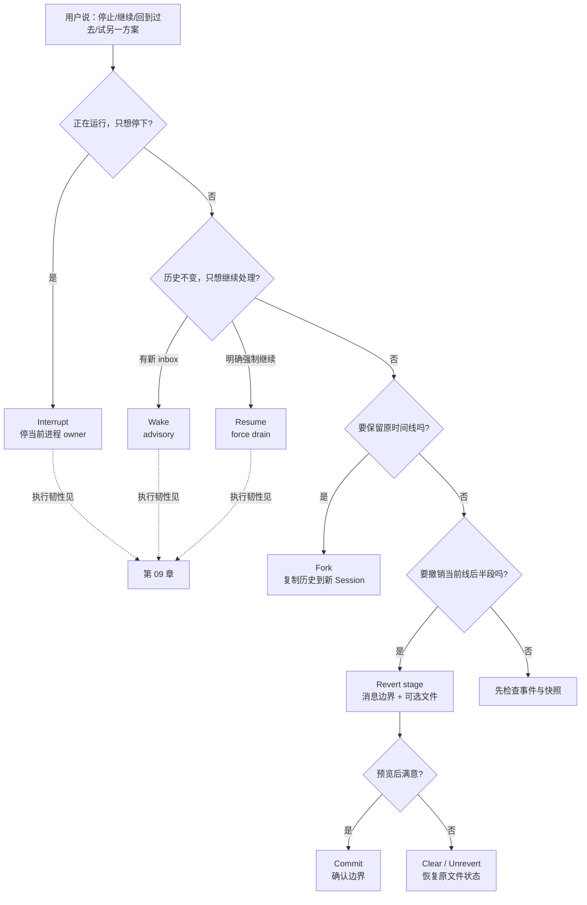
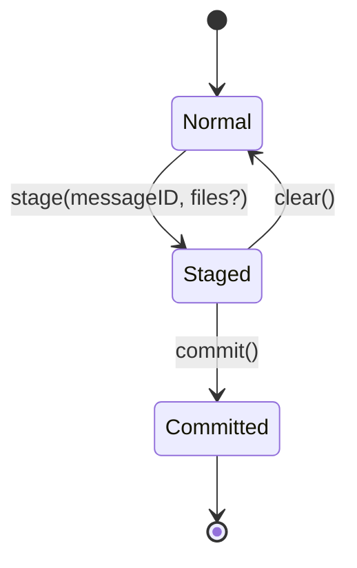

# 15 · Fork、Revert 与文件快照

> 读完本章，你应能分清四个经常混用的词：`interrupt` 停当前执行，`resume/wake` 让执行器再检查工作，`revert` 在当前 Session 暂存一个历史回退边界并恢复相关文件，`fork` 则复制历史到一个新 Session。后两者都**不是**进程崩溃后的执行恢复。

---

## 1. 这一章解决什么问题：历史和文件如何一起改变

Coding Agent 不只写聊天记录，也会真实修改工作区。

假设一次会话发生了这些事：

```text
用户：修复登录 500
助手：修改 auth.ts
助手：修改 token.ts
用户：这个方案不对，回到修改 auth.ts 之前
```

这里至少有两个「时间轴」：

1. **对话时间轴**：哪些用户消息、助手消息、tool parts 仍算当前历史；  
2. **文件时间轴**：`auth.ts`、`token.ts` 此刻是什么内容。

只改其中一条会出问题：

| 只做什么 | 会出现什么错位 |
|---|---|
| 只隐藏后半段消息 | UI 说「没改过」，磁盘却仍保留改动 |
| 只恢复文件 | 模型历史仍以为那些修改存在 |
| 只停止执行 | 历史和文件完全没回退 |
| 直接复制 Session | 原工作区未必隔离，新旧分支仍可能改同一批文件 |

因此 OpenCode 把动作拆开：

| 操作 | 核心问题 | 是否创建新 Session | 是否停止当前执行 | 是否改文件 |
|---|---|---:|---:|---:|
| Interrupt | 现在别再跑 | 否 | 是 | 不负责撤销 |
| Wake / Resume | 再检查或继续执行 | 否 | 否 | 后续执行可能会改 |
| Revert | 当前线回到某个消息边界 | 否 | 通常要求不 busy | 可选恢复 |
| Fork | 从旧历史复制一条新线 | 是 | 否 | 单凭 fork 不保证工作区隔离 |

### 1.1 版本现实：不要把 V1 和 V2 拼成一个不存在的实现

截至本仓库当前设计：

- **V1 Fork 在 `packages/opencode` 产品层较成熟**：有 Session 克隆逻辑、HTTP API 和前端使用路径。  
- **V1 也有完整的 revert/unrevert/cleanup 产品流程**，以 message/part 边界和 patch parts 工作。  
- **V2 Revert 位于 `packages/core`**：使用 `stage / clear / commit` 三阶段，并结合 core Snapshot 服务。  
- V2 Session 有 `parent_id` 等树形基础，但不要因此宣称「V2 已暴露和 V1 完全相同的 Fork 产品 API」。

本章会分别讲清这些实现，而不是用一段伪代码抹平差异。

### 1.2 本章不解决执行恢复

如果进程崩溃、provider 状态不明、工具显示 running，该去看 [09 · 取消、恢复与容错](./09-取消-恢复与容错.md)。

Fork/Revert/Snapshot 能帮你管理「想保留哪段历史和哪些文件」，但它们不能回答：

- provider 请求是否已执行；
- 外部邮件是否已发送；
- 数据库迁移是否跑了一半；
- 旧 drain 应否自动重放。

---

## 2. 先看决策树：我到底该选哪个操作



### 2.1 四句话记忆

> **Interrupt 是踩刹车。**  
> **Resume/Wake 是重新点火。**  
> **Revert 是在同一本笔记本里撤到书签。**  
> **Fork 是复印前半本，另开一本笔记本。**

### 2.2 常见误用

#### 误用 A：把 Fork 当「失败任务继续」

Fork 会生成新 Session 和新消息 ID。它不是恢复旧 provider stream，也不会继承进程内 fiber。

如果子 Agent 要继续同一子任务，可能应复用 `task_id`；如果主 Session 只是被停止，应 `resume`。只有想保留原线并尝试另一个方案时，才 Fork。

#### 误用 B：把 Revert 当 Git reset

Revert 是 Session 语义：它从消息边界规划相关文件恢复，并维护 `session.revert` 状态。它不等同于对整个仓库执行 `git reset --hard`，也不该无差别删除用户在会话外做的修改。

#### 误用 C：以为 Interrupt 会自动撤销文件

工具可能已经写完文件才收到 interrupt。停止只能阻止后续工作，不能逆转已经落盘的副作用。要撤销，应显式 Revert，且先检查差异。

#### 误用 D：以为 Fork 天然隔离文件

两条 Session 历史彼此独立，不代表它们一定有不同工作树。如果都指向同一 directory/worktree，之后的工具仍可能改同一文件。真正并行试验通常还需要独立 worktree 或沙箱。

---

## 3. Fork：复制历史，创建独立 Session

### 3.1 用户看到的效果

```text
原 Session：
U1 → A1 → U2 → A2 → U3 → A3
            │
            └── fork(messageID = U2)
                  ↓
新 Session：
U1' → A1'
```

当前 V1 实现的边界语义值得特别注意：指定 `messageID` 时，代码找到该消息索引，然后复制 `slice(0, target)`，即复制**目标消息之前**的历史，不包含目标消息本身。

不同产品可能把「fork at message」解释为包含或不包含目标，所以 pycode 必须在 API 文档和测试中钉死边界，不能靠自然语言猜。

### 3.2 V1 Fork 的实际步骤

`packages/opencode/src/session/session.ts` 中的成熟路径大致做：

1. 读取原 Session；  
2. 基于原标题生成 `(fork #N)` 一类新标题；  
3. 创建新 Session，复制 workspaceID 和 metadata；  
4. 读取原 Session 消息；  
5. 若指定 messageID，截断到目标索引之前；  
6. 为每条消息生成新 Message ID；  
7. 用 `idMap` 重写 assistant `parentID`；  
8. 为每个 part 生成新 Part ID；  
9. 对 compaction part 的 `tail_start_id` 做映射；  
10. 返回新 Session。

### 3.3 为什么 ID 必须重建

若新旧 Session 共用消息 ID，会引发：

- 数据库主键冲突；
- 事件无法判断属于哪条时间线；
- assistant `parentID` 指回旧 Session；
- 修改新分支的 part 可能污染原分支；
- compaction 的尾部引用跨分支。

因此 Fork 复制的是**内容与结构**，不是实体身份。

```text
旧：msg_A → msg_B → msg_C
        parentID ↗

映射：
msg_A → msg_A2
msg_B → msg_B2
msg_C → msg_C2

新引用只能指向 A2/B2/C2
```

### 3.4 HTTP API 直觉

V1 产品 API 暴露：

```http
POST /session/:sessionID/fork
Content-Type: application/json

{
  "messageID": "msg_123"
}
```

`messageID` 可选；省略时复制完整历史。响应是新 Session 信息。

Python 客户端可以设计为：

```python
forked = await client.sessions.fork(
    session_id="ses_original",
    before_message_id="msg_123",
)

print(forked.id)
```

这里故意用 `before_message_id`，比含糊的 `message_id` 更能表达当前 V1 的「不包含目标」语义。如果要对齐 OpenCode 原 API，则保留 `messageID`，但必须在 docstring 中写清。

### 3.5 Fork 不复制什么

设计时不要默认为 Fork 会复制所有运行态：

- 不复制活跃 provider stream；  
- 不复制 coordinator owner/pending wake；  
- 不等价于恢复失败 drain；  
- 不自动克隆外部系统副作用；  
- 不一定创建独立文件工作树；  
- 不应照搬旧 Session 的临时锁、busy 状态或进程句柄。

### 3.6 会话树的含义

Session 可以通过 `parent_id` 表达来源：

```text
根 Session
├── 子 Session：Task 子 Agent
├── Fork A：方案 A
└── Fork B：方案 B
```

但同样有 `parent_id` 不代表来源语义相同。Task 子会话是委派关系，Fork 是历史克隆关系。若产品需要区分，最好有明确 relation/type，而不是只看 parent 是否存在。

---

## 4. Revert：同一 Session 的三阶段回退

Fork 保留原线，Revert 则改变当前线的有效边界。

### 4.1 为什么 V2 用 stage / clear / commit

直接「点一下就永久删历史并覆盖文件」风险很高。V2 core 把过程拆成：



- `stage`：计算消息边界，暂存 revert 状态，并可先恢复相关文件供预览；  
- `clear`：取消这次 staged revert，把文件恢复到 stage 前捕获的状态；  
- `commit`：确认 revert 边界，发布 committed 事件；投影层据此确定有效历史。

这比「立即破坏性删除」更适合 UI 的撤销预览。

### 4.2 V2 `stage` 如何规划文件

输入：

```text
session
messageID
files?: boolean
```

规划逻辑从目标消息的序号开始，查询其后的 assistant messages。对这些消息：

- 只看带 `snapshot.start` 的 assistant message；  
- 收集其 `snapshot.files`；  
- 同一文件只保留第一次出现时对应的 start snapshot。

为什么取第一次？

```text
目标边界后：
Step 1 首次修改 auth.ts，start = S1
Step 2 再次修改 auth.ts，start = S2

要回到目标边界：
auth.ts 应恢复到 S1，而不是 S2
```

### 4.3 `stage` 的文件安全网

stage 会先确定 `original`：

- 如果已有 staged revert，复用其 original snapshot；  
- 否则捕获当前工作区 snapshot。

然后：

1. 若之前已有 staged 文件，先以 original 为基准处理；  
2. 默认把本次边界后受影响文件恢复到各自起始 snapshot；  
3. 若 `files=false`，只 stage 消息边界，不恢复文件；  
4. 计算 original 与当前预览状态的文件 diff；  
5. 发布 `SessionEvent.RevertEvent.Staged`，保存 messageID、snapshot、diff、files。

这里的 original 是「让我能取消预览」的安全网，不是目标边界本身。

### 4.4 `clear`：取消预览

若用户看完差异说「算了」，`clear(session)`：

1. 读取 `session.revert.snapshot`；  
2. 把 staged 涉及文件恢复到 original；  
3. 发布 `RevertEvent.Cleared`；  
4. 投影清除 Session 的 revert 状态。

所以 clear 不是「再 revert 一次」，而是撤销 staged revert。

### 4.5 `commit`：确认边界

`commit(session)` 本身不再次执行文件恢复；文件预览在 stage 时已经发生。它发布：

```text
RevertEvent.Committed
  sessionID
  messageID
  timestamp
```

V2 projector 收到事件后会删除边界消息之后的 `SessionMessageTable` 行，以及 admission/promotion 序号越过边界的 `SessionInputTable` 行；随后清空 revert 状态并重置 Context Epoch。也就是说，`commit` 是破坏性确认，不只是 UI 隐藏。

### 4.6 V1 Revert 与 V2 Revert 不同

V1 `packages/opencode/src/session/revert.ts` 是另一套成熟产品逻辑：

- 可精确到 `messageID` 或 `partID`；  
- 要求 Session 不 busy；  
- 扫描消息和 patch parts；  
- `Snapshot.track()` 记录原状态；  
- `restore/revert` 应用文件变化；  
- `unrevert` 恢复原 snapshot；  
- `cleanup` 真正删除边界后的 messages/parts 并清除标记。

V2 core 则以事件投影、assistant snapshot 元数据和 `stage/clear/commit` 为中心。

学习设计时可提炼共同点：

> **先选择对话边界，再确定受影响文件，保留可撤销的原状态，最后才确认。**

但实现时不要从 V1 随便拿一个函数名塞进 V2。

---

## 5. 文件快照：它保存什么，又不保证什么

### 5.1 快照不是聊天消息

消息历史回答「Agent 说了什么、调用了什么」。  
快照回答「某个时刻文件树大致是什么样」。

在 V2 runner 中，每个 provider turn 附近会：

1. turn 开始前 `snapshots.capture()`；  
2. 把 start snapshot 放进 assistant/step 事件；  
3. 工具执行可能改文件；  
4. turn 收口时再次 capture；  
5. 计算 start → end 涉及的 files；  
6. 将 end snapshot 和文件列表写入 step-ended 事件。

这样 Revert 才能从消息边界追到文件边界。

### 5.2 Git-based snapshot 的直觉

V1 Snapshot 服务使用内部 Git 能力，提供类似：

```text
track()          记录当前状态并返回 hash
patch(hash)      计算相对某快照的变化
diff(hash)       生成文件差异
restore(hash)    恢复到某快照
revert(patches)  反向应用记录的 patch
```

V2 Snapshot 接口形状不同，更偏向：

```text
capture()
files({ from, to })
diff({ from, to, paths })
restore({ files: Map<path, snapshotID> })
```

V2 可以按文件映射到不同 snapshot，这正适合「每个文件恢复到它在边界后第一次被改之前」。

### 5.3 为什么不用粗暴的全仓 reset

用户可能在 Agent 运行期间自己修改另一个文件：

```text
Agent 修改 auth.ts
用户手工修改 README.md
Agent 修改 token.ts
用户 revert Agent 的登录方案
```

合理目标通常是恢复 `auth.ts` 和 `token.ts`，保留用户的 `README.md`。  
因此 V2 plan 收集边界后 assistant step 明确记录的文件，而不是默认重置整个工作区。

### 5.4 快照的能力边界

文件快照通常不能自动撤销：

- 已发送的邮件和消息；  
- 数据库 schema/data 迁移；  
- 云资源创建；  
- 已推送到远端的 Git commit；  
- 包管理器修改的全局缓存；  
- 工作区之外的文件；  
- 外部工具没有上报的隐式副作用。

这也是为什么 Revert 不是「事务回滚」。它主要是消息历史与可观察工作区文件的补偿机制。

### 5.5 快照失败怎么办

当前 runner 对某些辅助快照/文件列表失败采取降级：核心 turn 可以继续，文件列表可能是 `undefined`。

这意味着产品应允许：

- 对话正常完成，但提示「本轮文件快照不可用」；  
- Revert 只回退历史（`files=false`）；  
- 用户在 commit 前查看可恢复文件和 diff；  
- 不把快照缺失伪装成「已经成功恢复所有文件」。

---

## 6. API 设计与 Python 实现笔记

### 6.1 建议把四类 API 分组

```python
# 执行控制
await sessions.interrupt(session_id)
await sessions.wake(session_id)
await sessions.resume(session_id)

# 当前 Session 回退
preview = await sessions.revert.stage(
    session_id=session_id,
    message_id=message_id,
    files=True,
)
await sessions.revert.clear(session_id)
await sessions.revert.commit(session_id)

# 新时间线
forked = await sessions.fork(
    session_id=session_id,
    before_message_id=message_id,
)
```

不要设计成：

```python
await sessions.recover(
    mode="stop_or_retry_or_undo_or_clone",
    ...
)
```

这种万能入口把权限、幂等、返回值和失败语义全部搅在一起。

### 6.2 Python 数据模型

```python
from dataclasses import dataclass

@dataclass(frozen=True)
class FileDiff:
    path: str
    patch: str
    additions: int
    deletions: int

@dataclass(frozen=True)
class RevertPreview:
    session_id: str
    message_id: str
    original_snapshot: str | None
    files: tuple[FileDiff, ...]
```

stage 应返回可展示的 preview，而不是只返回 `True`。用户需要知道会改哪些文件。

### 6.3 Python stage 伪代码

```python
async def stage_revert(
    session_id: str,
    message_id: str,
    *,
    files: bool = True,
) -> RevertPreview:
    session = await sessions.require(session_id)
    await executions.require_idle(session_id)

    original = (
        session.revert.original_snapshot
        if session.revert
        else await snapshots.capture()
    )
    restore_plan = await plan_files_after_message(
        session_id=session_id,
        message_id=message_id,
    )

    if files:
        await snapshots.restore_files(restore_plan)

    diffs = (
        await snapshots.diff(
            from_snapshot=original,
            to_snapshot=await snapshots.capture(),
            paths=tuple(restore_plan),
        )
        if original and files
        else ()
    )
    return await events.stage_revert(
        session_id=session_id,
        message_id=message_id,
        original_snapshot=original,
        files=diffs,
    )
```

这是教学骨架，不是逐行翻译 Effect 实现。关键约束是：边界存在、Session 空闲、original 可回退、文件计划可预览。

### 6.4 Python Fork 伪代码

```python
async def fork_session(
    source_session_id: str,
    *,
    before_message_id: str | None = None,
) -> Session:
    source = await sessions.require(source_session_id)
    messages = await history.list(source_session_id)
    selected = take_before(messages, before_message_id)
    target = await sessions.create(
        title=next_fork_title(source.title),
        parent_id=source.id,
        workspace_id=source.workspace_id,
        metadata=deepcopy(source.metadata),
    )

    message_ids: dict[str, str] = {}
    for message in selected:
        cloned = clone_message(
            message,
            session_id=target.id,
            parent_id=message_ids.get(message.parent_id),
        )
        message_ids[message.id] = cloned.id
        await history.insert(cloned)

    return target
```

实现时还必须重写 parts 内部引用，例如 compaction tail。若只复制 message 文本，会得到结构不完整的分支。

### 6.5 权限与并发建议

- Revert/Fork 都应验证 Session 和 message 属于当前 workspace/用户。  
- Revert 应要求 Session 不 busy，或先显式 interrupt 并等待清理；不要边写文件边恢复。  
- stage/clear/commit 应有可重复调用的清晰语义。  
- Fork 读取历史时需要一致边界，避免一边复制一边又 append 新消息。  
- 文件路径必须限制在 Location/workspace 沙箱内。  
- diff 展示要限制体积，敏感文件需要脱敏或权限检查。

### 6.6 配置示例

这些是 pycode 教学配置建议，不是宣称 OpenCode 现有字段逐字如此：

```json
{
  "history": {
    "fork": {
      "enabled": true
    },
    "revert": {
      "restore_files_by_default": true,
      "require_preview": true
    }
  },
  "snapshot": {
    "enabled": true,
    "max_diff_bytes": 1048576
  }
}
```

不要加入 `revert_external_side_effects=true` 这种无法兑现的承诺。

---

## 7. 取舍、MVP 路线与验收标准

### 7.1 Fork 的优缺点

**优点**

- 原 Session 完整保留，适合探索方案 A/B；  
- 新旧消息身份隔离；  
- 容易审计「分叉从哪里来」；  
- 对话压缩和后续模型选择可各自发展。

**缺点**

- 克隆长历史有存储和复制成本；  
- 内部引用重写容易漏；  
- Session 隔离不自动等于文件隔离；  
- 两条线若共享工作区，后续结果仍可能互相污染。

### 7.2 Revert + Snapshot 的优缺点

**优点**

- 对话边界与文件变化能一起预览；  
- stage/clear/commit 给用户反悔机会；  
- 按受影响文件恢复，减少误伤；  
- 不要求把整个工作区变成一笔大事务。

**缺点**

- 快照不是万能事务，外部副作用无法撤销；  
- 消息边界到文件边界的映射依赖 runner 正确记录；  
- 快照缺失或文件在会话外被修改时可能冲突；  
- 三阶段 API 比单按钮复杂，UI 必须解释清楚。

### 7.3 pycode 分阶段落地

#### Phase 1：先做消息 Fork

- 新建 Session；  
- 截断并复制消息；  
- 重建消息/part ID 与内部引用；  
- 明确 before/inclusive 边界；  
- 暂不承诺独立 worktree。

#### Phase 2：只做消息 Revert

- stage message boundary；  
- clear / commit；  
- UI 展示哪些消息将隐藏/移除；  
- `files=false` 路径先跑通。

#### Phase 3：接入文件快照

- provider turn 前后 capture；  
- 记录受影响文件；  
- stage 返回 diff preview；  
- 按文件 restore；  
- 清晰处理 snapshot unavailable。

#### Phase 4：隔离工作区

- Fork 可选创建独立 worktree/sandbox；  
- 清楚展示分支对应目录；  
- 合并成果作为独立产品能力，不塞回执行恢复。

### 7.4 核心验收用例

Fork：

1. 不传 messageID 时复制完整历史。  
2. 指定边界时，包含/不包含语义与 API 文档一致。  
3. 新旧 Session、Message、Part ID 均不同。  
4. assistant parentID 只指向新 Session 消息。  
5. compaction tail 等内部引用被重写。  
6. 新分支追加消息不改变原 Session。  
7. 源 messageID 不存在时行为明确：报错或按完整历史复制，二选一并固定；当前 V1 是按完整历史复制，pycode 更建议严格报错。  

Revert：

8. message 不存在时返回 typed error。  
9. 默认只恢复目标边界后的 Agent 相关文件。  
10. 同一文件多次修改时恢复到第一次修改前的 snapshot。  
11. `files=false` 不触碰工作区。  
12. stage 返回 messageID、original snapshot、diff 和文件列表。  
13. clear 把文件恢复到 stage 前状态。  
14. commit 固化边界且不重复恢复文件。  
15. busy Session 不允许并发 revert。  
16. 工作区外路径无法进入 restore plan。

边界：

17. interrupt 后文件不会被宣称已自动回退。  
18. fork/revert 不会启动或恢复 provider stream。  
19. 快照不可用时明确降级，不显示「文件恢复成功」。  
20. 外部副作用始终标注为不可由 Snapshot 保证撤销。

---

## 8. 源码索引与本章小结

### 8.1 V1 产品层

| 主题 | 位置 | 阅读重点 |
|---|---|---|
| Session Fork | `packages/opencode/src/session/session.ts` | `fork`、ID map、截断边界 |
| Fork HTTP API | `packages/opencode/src/server/routes/instance/httpapi/groups/session.ts` | `/session/:sessionID/fork` 契约 |
| Fork Handler | `packages/opencode/src/server/routes/instance/httpapi/handlers/session.ts` | payload 到 service |
| Fork 对话框 | `packages/app/src/components/dialog-fork.tsx` | 用户如何选择分叉点 |
| V1 Revert | `packages/opencode/src/session/revert.ts` | revert/unrevert/cleanup、part 边界 |
| V1 Snapshot | `packages/opencode/src/snapshot/index.ts` | track、restore、diff、patch |
| Task 子会话 | `packages/opencode/src/tool/task.ts` | `task_id` 与 Fork 的区别 |

### 8.2 V2 core

| 主题 | 位置 | 阅读重点 |
|---|---|---|
| V2 Revert | `packages/core/src/session/revert.ts` | plan、stage、clear、commit |
| V2 Session 门面 | `packages/core/src/session.ts` | revert API 如何提供 Location 服务 |
| Session schema | `packages/core/src/session/schema.ts` | revert 状态、Session 信息 |
| Session SQL | `packages/core/src/session/sql.ts` | `parent_id`、`revert` 持久化 |
| Runner 快照 | `packages/core/src/session/runner/llm.ts` | turn start/end capture |
| 消息投影 | `packages/core/src/session/message-updater.ts` | snapshot 和 revert 事件如何投影 |
| Revert 投影 | `packages/core/src/session/projector.ts` | staged/cleared/committed 状态 |
| Snapshot 模块 | `packages/core/src/snapshot.ts` | capture/files/diff/restore |

### 8.3 延伸阅读

- [09 · 取消、恢复与容错](./09-取消-恢复与容错.md)：执行控制与崩溃边界。  
- [08 · 会话记忆与上下文压缩](./08-会话记忆与上下文压缩.md)：Fork 为什么要重写 compaction 引用。  
- [17 · 工作区沙箱与命令安全深度](./17-工作区沙箱与命令安全深度.md)：Fork 后如何获得真正文件隔离。  
- 根目录 `FAILURE_RECOVERY_AND_FORK_DESIGN.md`：已迁移的旧版综合材料，适合追溯，不应替代本章的版本边界。

### 8.4 一句话复习

> **Interrupt/Resume 管「还跑不跑」，Revert 管「当前线退到哪里并恢复哪些文件」，Fork 管「从哪里复制出新线」；快照只补偿可观察的工作区文件，不能冒充 provider 或外部副作用的执行恢复。**

**上一章**：[14-结构化工具结果与输出边界.md](./14-结构化工具结果与输出边界.md)  
**下一章**：[16-澄清提问与交互契约.md](./16-澄清提问与交互契约.md)
