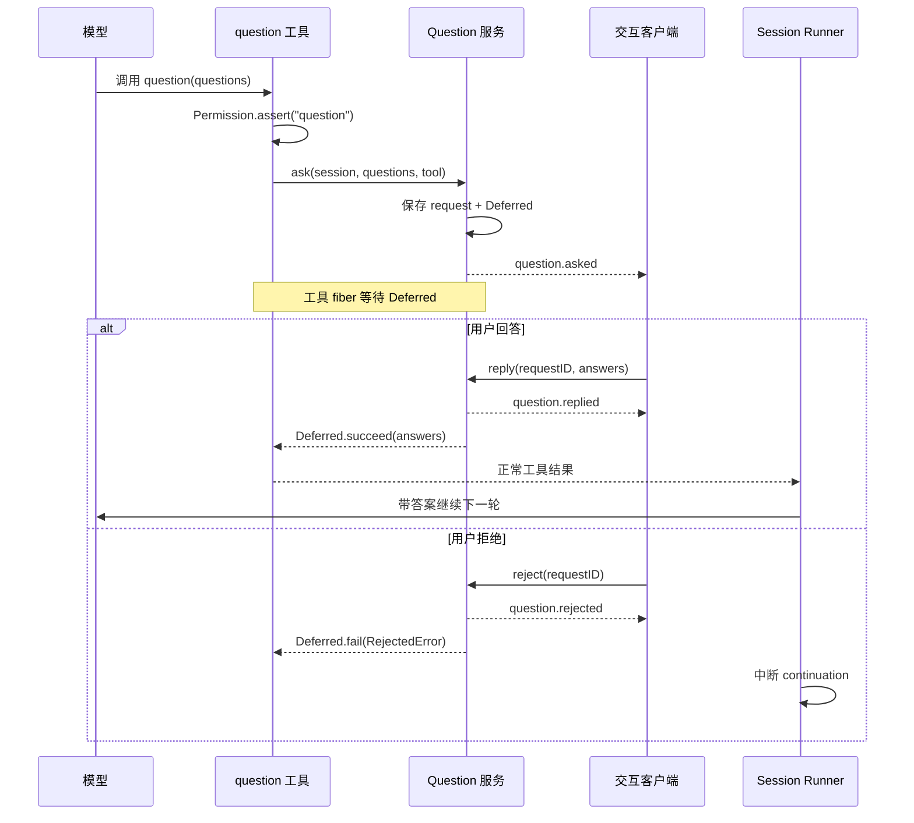

# 16 · 澄清提问与交互契约

> 读完本章，你应该能用自己的话回答：  
> 「Agent 为什么会停下来问我？Question 和权限弹窗有什么不同？没人回答时系统该怎么办？」

如果 `Tool`、`Permission`、`Agent` 这些词还不熟，先看 [02 · 白话术语表](./02-白话术语表.md)。工作模式见 [04 · 提示词与工作模式](./04-提示词与工作模式.md)，危险操作审批见 [06 · 权限、人机确认与命令安全](./06-权限-人机确认与命令安全.md)。

---

## 1. 问题从哪里来：模型不能靠猜完成所有任务

用户常会说：

> 「给登录页加个第三方登录。」

但这句话没有说明：

- 接 Google、GitHub，还是公司 SSO？
- 只改前端按钮，还是后端 OAuth 回调也要做？
- 客户端密钥从哪里读取？

最 naive 的 Agent 会挑一个自己喜欢的答案直接开工。更可靠的 Agent 应先读代码；如果关键分歧仍无法从仓库事实中消除，就调用 `question` 工具，把选择交还给用户。

Question 适合问 **答案会实质改变实现路径** 的问题，不适合把一切都推回给用户：

| 应该问 | 不必问 |
|--------|--------|
| A/B 会改变数据模型、API 或兼容性 | 能从代码、配置、测试中直接查到 |
| 缺少业务偏好，无法从技术事实推出 | 存在明显安全且可逆的默认值 |
| 需求互相冲突，需要用户裁决 | 只是 Agent 不愿意先探索代码 |

OpenCode 没有独立 NLU / 意图分类器。模式由显式 Agent 决定，动作由 Permission 约束，剩余歧义才由 `question` 向人确认；三者的关系见 [04 · 提示词与工作模式](./04-提示词与工作模式.md)。

---

## 2. Question ≠ Permission：同样像弹窗，实际是两条通道

这是本章最重要的区别：

| | Question（澄清） | Permission（权限） |
|--|------------------|---------------------|
| 核心问题 | 「你想要哪一种？」 | 「允许系统执行这个动作吗？」 |
| 发起者 | 模型主动调用 `question` 工具 | 工具叶节点请求权限判断 |
| 内容 | 单选、多选、自定义答案 | once / always / reject，可能带纠正意见 |
| 目的 | 补齐需求与偏好 | 控制安全边界 |
| 结果 | 答案回到模型上下文 | 决定工具是否执行、规则是否记住 |
| 拒绝语义 | 用户不愿提供继续所需的信息 | 可能是硬拒绝，也可能附反馈让模型换方案 |

生活类比：

- **Question** 是产品经理问：「登录方式选 GitHub 还是 Google？」
- **Permission** 是门卫问：「这个程序现在可以读取 `.env` 吗？」

两者可以复用同一个 UI 外壳，却不能复用同一个领域对象。否则日志只会留下「用户点了拒绝」，你无法判断这是需求仍未确定，还是危险操作被拦下；循环也不知道应该继续换方案还是停止。

还有一层容易忽略：`question` 本身也是工具，因此也要受 `question` 权限控制。当前 Core 工具会先断言 `action="question"`，允许后才创建澄清请求。**这不把 Question 变成 Permission**；它只是表示「是否允许 Agent 打扰用户提问」也是一项可配置能力。

---

## 3. 一次提问的交互契约

一份 Question Request 通常包含：

- `id`：本次请求的唯一标识，回复和拒绝都靠它配对。
- `sessionID`：问题属于哪个会话。
- `questions`：一个或多个问题。
- `tool`（可选）：发起提问的 assistant message / tool call，便于 UI 和工具结算关联。

每个问题包含简短标题、完整问题、候选项，以及是否允许多选或自定义输入。答案按问题顺序返回，且每题都是字符串数组：单选也是一个元素的数组，多选可以有多个。

```text
questions[0] = “OAuth 提供商选哪个？”
answers[0]   = [“GitHub”]

questions[1] = “还需要哪些登录方式？”（multiple=true）
answers[1]   = [“Google”, “企业 SSO”]
```

一个稳健的 API 契约还应保证：

1. `reply(request_id, answers)` 只能结算仍在等待的请求。
2. `reject(request_id)` 只能拒绝仍在等待的请求。
3. 找不到请求时返回明确的 `NotFoundError`，不能静默成功。
4. 回复与拒绝只能有一个获胜；重复结算不能第二次唤醒执行链。
5. 返回给模型的文本应明确对应关系，例如：`"OAuth 提供商"="GitHub"`，而不是只塞一个没有题目的答案数组。

---

## 4. Asked / Replied / Rejected：事件让 UI 看见生命周期

Question 服务不是直接打开某个终端弹窗。它发布领域事件，由 TUI、桌面端、Web 或远程客户端决定如何展示：

| 事件 | 何时发布 | 关键内容 |
|------|----------|----------|
| `question.v2.asked` | 请求进入等待状态后 | request id、session、题目、关联 tool |
| `question.v2.replied` | 用户提交答案时 | request id、session、answers |
| `question.v2.rejected` | 用户关闭或拒答时 | request id、session |

事件的价值不只是「刷新 UI」：

- 多个客户端可以观察同一个会话，知道当前卡在哪个问题。
- 远程客户端可以通过 HTTP `list / reply / reject` 接手交互。
- 日志可以区分「问过且回答」「问过但拒绝」，方便调试 Agent 为什么停止。
- 请求与工具调用有关联时，UI 能把回答正确结算回那次 tool call。

不要把这些事件误读为 durable 用户消息。它们描述的是交互请求生命周期；回答最终还会作为 `question` 工具结果进入模型可见的会话历史。

---

## 5. Deferred：为什么提问会阻塞，但不堵死整个服务器

Core 的 Question 服务为每个 pending request 保存一对对象：

```text
request + Deferred[answers | RejectedError]
```

`Deferred` 可以理解成「以后才会填上的一次性结果盒子」：

1. `ask()` 创建 request 和 Deferred，放进 Location 作用域的 pending map。
2. 发布 `Asked` 事件。
3. 当前 `question` 工具 fiber 等待 Deferred；**它暂停的是这条执行链，不是整个服务器线程**。
4. `reply()` 发布 `Replied`，用 answers 成功完成 Deferred。
5. `reject()` 发布 `Rejected`，用 `RejectedError` 失败完成 Deferred。
6. 无论怎样结束，都从 pending map 清理请求。



Question 服务属于 Location：一个工作位置中的回复不能意外结算另一个 Location 的 Deferred。Location 销毁时，所有 pending Deferred 也会失败并清空，不能留下永远等待的悬挂请求。

---

## 6. 拒绝不是空答案：它会中断 continuation

用户按下 Esc、关闭问题或明确拒答，表达的通常不是「答案为空」，而是：

> 「不要沿着这次提问继续推进。」

因此 OpenCode 把拒绝建模为 `RejectedError`。Session Runner 在等待工具 fibers 时识别这个错误，把未结算工具标成 interrupted，并停止后续 continuation；它不会把 `"User declined"` 当普通工具输出再喂给模型，让模型绕开用户继续猜。

这和一些权限失败不同：

- 预设规则 `deny` 挡住某个工具时，模型往往还能看到失败并换一条安全路线。
- 用户拒绝 Question，表示继续所需的信息没有提供，通常应硬停。
- 用户拒绝 Permission 但附带纠正意见时，某些路径允许模型按反馈换方案；细分见 [06 · 权限、人机确认与命令安全](./06-权限-人机确认与命令安全.md)。

pycode 不应写成 `except Exception: return "Unanswered"`。这样会抹掉用户的停止意图。应使用可识别的领域错误，并在 runner 边界专门测试「reject 后不再发起下一次 provider turn」。

---

## 7. CI / Headless：非交互环境默认 deny

CI、后台任务和无头服务通常没有人守着弹窗。如果仍允许模型调用 `question`：

```text
Agent 发问 → Deferred 等待 → 没有客户端回复 → Job 永远挂起
```

OpenCode 的默认权限把 `question` 设为 `deny`，交互型 Build / Plan Agent 再显式覆盖为允许。这样，非交互调用方若没有主动配置交互能力，就不会意外进入无限等待。

为 headless 场景设计时，建议遵守：

1. **默认 deny**：没有 Question handler，就不要暴露或允许该工具。
2. **显式开启**：只有调用方承诺消费 Asked 并调用 reply/reject 时才 allow。
3. **超时是宿主策略**：需要超时时，由宿主在期限后 reject / cancel；不要偷偷选择第一个选项。
4. **预先给足输入**：CI 参数、配置文件或 API payload 应包含关键选择，减少运行中提问。
5. **拒绝要能结束 Job**：映射为清晰的 cancelled / needs-input 状态，而不是模糊的测试失败。

若业务希望「无人时使用默认值」，默认值必须写进产品契约并可审计；这和让模型自行猜测不是一回事。

---

## 8. pycode 最小实现、测试与源码地图

下面的 Python 伪代码只表达领域边界，不绑定 asyncio Web 框架：

```python
class QuestionRejected(Exception):
    pass


class QuestionNotFound(Exception):
    pass


class QuestionService:
    def __init__(self, events):
        self.events = events
        self.pending = {}

    async def ask(self, session_id, questions, tool=None):
        request = QuestionRequest.create(session_id, questions, tool)
        future = asyncio.get_running_loop().create_future()
        self.pending[request.id] = (request, future)
        await self.events.publish("question.asked", request)
        try:
            return await future
        finally:
            self.pending.pop(request.id, None)

    async def reply(self, request_id, answers):
        item = self.pending.get(request_id)
        if item is None:
            raise QuestionNotFound(request_id)
        request, future = item
        await self.events.publish(
            "question.replied",
            {"session_id": request.session_id, "request_id": request_id, "answers": answers},
        )
        future.set_result(answers)

    async def reject(self, request_id):
        item = self.pending.get(request_id)
        if item is None:
            raise QuestionNotFound(request_id)
        request, future = item
        await self.events.publish(
            "question.rejected",
            {"session_id": request.session_id, "request_id": request_id},
        )
        future.set_exception(QuestionRejected())


async def execute_question(tool_input, context, permission, questions):
    await permission.assert_allowed("question", "*", context)
    return await questions.ask(
        context.session_id,
        tool_input.questions,
        tool={"message_id": context.message_id, "call_id": context.call_id},
    )
```

最小验证清单：

- `ask` 发布 Asked，并在回答前保持 pending。
- `reply` 发布 Replied，答案回到原工具调用，pending 被清理。
- `reject` 发布 Rejected，runner 中断 continuation，pending 被清理。
- 重复或未知 request id 返回 NotFound。
- `question=deny` 时不创建 pending request。
- 多题、多选、自定义答案保持顺序。
- Location / 服务关闭时，所有等待者都能结束。
- Headless 默认配置不会等待 Question。

对照源码时从这些路径开始：

| 主题 | Current Core / Schema | Legacy / OpenCode 等价位置 |
|------|-----------------------|----------------------------|
| Question 服务、Deferred、事件发布 | `packages/core/src/question.ts` | `packages/opencode/src/question/index.ts` |
| Question 工具、权限断言、模型输出 | `packages/core/src/tool/question.ts` | `packages/opencode/src/tool/question.ts` |
| Asked / Replied / Rejected 契约 | `packages/schema/src/question.ts` | `packages/schema/src/v1/question.ts` |
| reject 中断 continuation | `packages/core/src/session/runner/llm.ts` | Legacy session processor / permission-question 结算路径 |
| HTTP list / reply / reject | Current Protocol / Server Question API | `packages/opencode/src/server/routes/instance/httpapi/handlers/question.ts` |
| CLI 问题状态机 | — | `packages/opencode/src/cli/cmd/run/question.shared.ts` |

本章收束成三句话：**Question 补需求，Permission 守安全；Question 用事件连接执行链与 UI，用 Deferred 阻塞当前工具；用户 reject 是停止信号，非交互环境默认 deny。**
