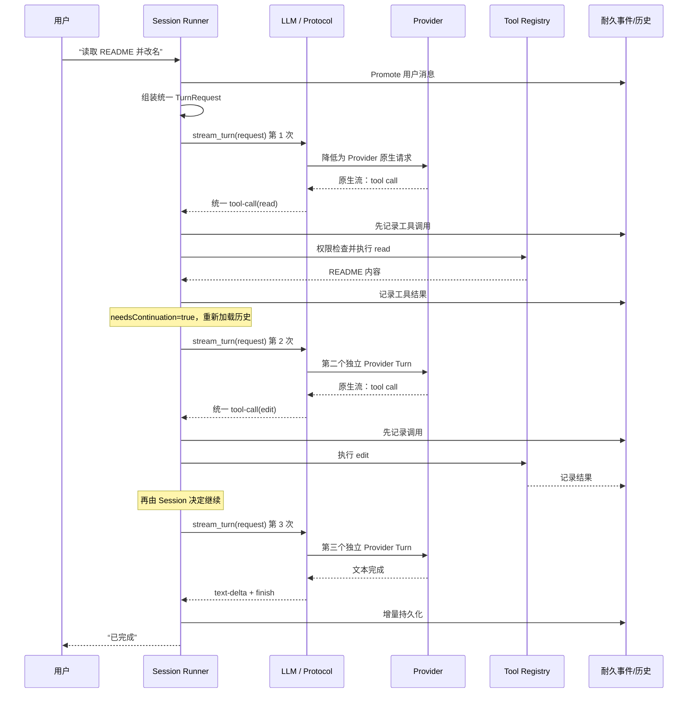

# 18 · LLM 层与 Provider 边界

> 本章讨论一个看似简单、实际决定 Agent 能否可靠运行的问题：  
> **谁负责“只请求一次模型”，谁负责“继续跑工具和下一轮”？**
>
> 先记结论：在 OpenCode V2 Session 中，`llm.stream(request)` 表示 **恰好一个 Provider Turn**。  
> 工具执行、权限、持久化、步数限制与 continuation（是否继续）都由 Session 拥有。

如果你还不熟悉 Provider Turn、工具调用、Session 等词，先看 [02-白话术语表](./02-白话术语表.md)；如果还没理解多轮 Agent 循环，先读 [03-Agent循环](./03-Agent循环-一次对话如何跑完.md)。

---

## 1. 这一章要解决什么问题

### 1.1 模型服务和 Coding Agent 不是同一层

调用大模型，最小过程只有这些：

1. 选择模型和 Provider（模型服务商）
2. 把通用 request 转成服务商要求的 HTTP / WebSocket 格式
3. 发送一次请求
4. 把流式响应统一成文本、推理、工具调用、用量、结束原因等事件

但 Coding Agent 还必须做更多事：

- 保存 Session 历史
- 决定用户新消息何时进入模型可见历史
- 判断工具能否执行，必要时询问用户权限
- 先记录工具调用，再执行读写文件等副作用
- 工具完成后决定是否再请求模型
- 处理中断、步数上限、压缩和恢复

这两组职责不能糊成一个“大模型函数”。

### 1.2 本章最重要的两个名词

**Provider Turn（服务商回合）**：向某个模型服务商发起 **一次** 请求，并接收这次请求的完整规范化响应。

**Session Loop（会话循环）**：围绕多个 Provider Turn，管理历史、工具、权限、持久化和 continuation 的外层 Agent 循环。

可以把它想成：

```text
LLM 层：只负责打一次电话，并把各家方言翻译成普通话
Session：负责为什么打、电话后做什么、要不要再打一通
```

### 1.3 核心不变量

> **一次 `llm.stream(request)` = 一个 Provider Turn。**
>
> 它可以流出很多事件，但不能在内部执行本地工具后又偷偷请求第二次模型。

这里的“一次”是一次服务商网络回合，不是只返回一个 token，也不是一次用户任务只能调用一次模型。一个完整任务通常会有多个 Provider Turn，只是它们必须由 Session 明确编排。

---

## 2. 最 naive 的版本会怎样

### 2.1 把所有事情塞进 `ask_model`

初学者很容易写出下面的代码：

```python
async def ask_model(messages, tools):
    while True:
        reply = await provider.stream_and_collect(messages, tools)
        messages.append(reply)

        if not reply.tool_calls:
            return reply.text

        for call in reply.tool_calls:
            result = await tools[call.name](call.arguments)
            messages.append(tool_result(call, result))
```

调用方看见的只是一次 `ask_model(...)`，内部却可能：

- 请求 Provider 五次
- 改文件三次
- 等用户授权一次
- 消耗大量 token

这个 API 很方便写 Demo，却隐藏了真正重要的执行边界。

### 2.2 隐藏工具循环为什么危险

| 问题 | 隐藏循环的后果 |
|------|----------------|
| 持久化 | Session 不知道第二次模型请求前历史是否已经可靠写入 |
| 取消 | 不清楚要取消当前网络流、工具，还是整个递归循环 |
| 权限 | LLM 包不得不理解项目权限和人机确认 |
| Steer / Queue | 新用户输入不知道应插入哪个安全边界 |
| 计费与限流 | 外面的一次函数调用对应多少次真实 Provider 请求不透明 |
| 崩溃恢复 | 进程挂掉后，不知道工具是否已经执行、下一轮是否已经开始 |
| 测试 | 很难断言“本回合只请求 Provider 一次” |

最危险的是本地工具有副作用。读文件通常还能重试，写文件、执行 shell、发布消息却不能在崩溃后随便猜测是否应该重放。

### 2.3 另一个 naive 坑：把 Provider 差异泄漏到 Session

如果 Session 直接拼接 OpenAI、Anthropic、Gemini 各自的请求体，它会很快变成：

```python
if provider == "openai":
    ...
elif provider == "anthropic":
    ...
elif provider == "gemini":
    ...
```

随后工具调用格式、流式事件、认证、URL、缓存字段全部混进会话循环。结果是：

- 新增 Provider 要改 Session 核心；
- 同一种协议被多个兼容服务复用时，代码大量复制；
- Session 测试必须理解每家服务商的 wire format（线上格式）。

所以还需要第二条边界：**Provider / Protocol 负责翻译差异，Session 只看统一的 request 和事件。**

---

## 3. OpenCode 选择了什么设计

### 3.1 职责分层

> **标签：V2 已有。**

| 层 | 应该负责 | 不应该负责 |
|----|----------|------------|
| Session Runner | 历史、System Context、模型选择、步数、工具权限、持久化、continuation | Provider 原生 JSON / SSE 解析 |
| LLM 核心 | 通用 request / message / event、一次 Provider Turn | Session 历史、用户准入、自动继续 |
| Provider facade | API Key、base URL、部署参数、选择具体模型/协议 | 工具副作用、Session 状态 |
| Protocol | 通用 request → 原生 body；原生流 → 统一事件 | 决定要不要下一轮 |
| Transport / Framing | HTTP/WebSocket 发送；字节流切成 SSE 等 frame | 理解 Agent 业务 |

这使上层只需处理统一事件，例如：

```text
text-delta
reasoning-delta
tool-call
tool-result
usage
finish
provider-error
```

不同 Provider 的原生事件名字和先后差异，由 Protocol 的状态机吸收。

### 3.2 `LLM.request` 是数据，`Model` 是可执行能力

LLM 包采用 Schema-first 思路：可序列化的 request、message、tool definition、event 有统一数据模型。

但不是所有东西都应该伪装成 JSON：

- 可序列化：消息、工具定义、生成参数、Provider metadata
- 进程本地：API transport、认证逻辑、工具 handler、hook、配置后的 Model

这个区别很重要。工具的 JSON Schema 可以进 request；真正会执行 `rm` 或写文件的函数不能随历史一起序列化。

### 3.3 Route 把 Provider 接入拆成正交部件

当前 `packages/llm` 的 Route（可执行路由）主要组合：

1. **Protocol**：请求体构造、原生事件 Schema、流式状态机
2. **Endpoint**：base URL、path、query
3. **Auth**：Bearer、API Key header、请求签名
4. **Framing**：把字节流切成 SSE、AWS event-stream 等 frame
5. **Transport**：实际通过 HTTP 或 WebSocket 收发

例如许多“OpenAI 兼容”服务可以复用同一个 OpenAI Chat Protocol，只替换 Endpoint、Auth 和少量配置。修复一次协议解析，所有复用者都受益。

### 3.4 工具定义可以下发，工具执行留在 Session

Session 把工具的名字、说明、参数 Schema 交给 LLM 层，让 Provider 知道模型可以请求哪些工具。

模型返回本地 `tool-call` 后：

1. LLM 层只把它规范化成统一事件；
2. Session 先持久化工具调用；
3. Session 做权限检查；
4. Session 通过 Core 的 Tool Registry 执行；
5. Session 持久化成功或失败；
6. Session 重新读取历史；
7. Session 决定是否开启下一 Provider Turn。

LLM 包里的窄工具 dispatcher 可以负责“校验一次输入并调用一个 handler”，但它不能追加 Session 历史、计算步数或自动继续模型轮次。

### 3.5 Provider-hosted 工具是另一种情况

有些工具由 Provider 自己执行，例如服务商托管的 web search。统一事件会标记它是 `providerExecuted`（由服务商执行）。

Session 遇到这类调用时：

- 保留 Provider 返回的调用和结果；
- **不再执行同名本地 handler**；
- 保留继续请求所需的 Provider metadata。

否则一次托管搜索可能被错误地在本地再执行一次。

### 3.6 真正的调用点在哪里

`packages/core/src/session/runner/llm.ts` 是理解 V2 边界的关键路径。概念上它做这些事：

```text
选择 Agent / Model
→ 加载 System Context 与投影历史
→ 根据 max steps 决定是否暴露工具
→ 组装 LLM.request
→ llm.stream(request) 恰好一次
→ 增量持久化规范化事件
→ 等待本地工具结算
→ 返回 needsContinuation
→ 外层 Session 循环决定下一回合
```

注意：文件名虽然叫 `runner/llm.ts`，它仍是 **Session-owned orchestration**，不是把 Session 循环塞进底层 LLM package。

---

## 4. 为什么这样演进

### 4.1 从“统一调用模型”演进到“显式回合”

早期集成通常追求一个简单入口：给 messages，拿 response。加入工具后，又自然演变为“工具跑完自动继续”。

但 OpenCode 是耐久 Coding Agent，不是一次性聊天封装。它必须在每个副作用前后留下可观察、可恢复的边界。因此 V2 将一次 Provider Turn 提升为明确原语，让 Session 自己拥有循环。

### 4.2 V2 与 Legacy 的关系

| 状态 | 边界 |
|------|------|
| **V2 已有** | Core Session Runner 每回合显式调用一次 `llm.stream(request)`，工具结算后由外层继续 |
| **Legacy only / 对照** | 旧 Session 路径有自己的 processor、AI SDK 适配和原生 runtime 桥接，不应成为 pycode 的目标结构 |
| **deferred** | Provider work 的崩溃后自动续跑、跨节点 Session owner、完整重试政策仍需单独设计 |

不要因为 Legacy 仍在产品中工作，就把 V1 的大编排器原样复刻到 pycode。pycode 应对齐当前 V2 的职责边界。

### 4.3 `packages/llm/DESIGN.md` 还描述了下一步 API 演进

> **标签：提案，不等于当前稳定 API。**

设计稿提出区分两组高层语义：

- `generate` / `stream`：完整 Model Run，可以自动运行工具和多回合；
- `generateTurn` / `streamTurn`：严格一个 Provider Turn，不执行本地工具，不自动继续。

这对通用 LLM 库很合理：普通应用想要开箱即用的工具循环，耐久 Agent 则需要显式 Turn API。

但对 OpenCode Session 的结论不变：

> 即使未来通用库提供“完整 Run”快捷 API，OpenCode Session 也应使用 **Turn 级 API**，保留自己的持久化、权限、工具结算和 continuation 边界。

当前仓库中的名字仍可能是 `LLMClient.stream` 或 `llm.stream`，其当前语义就是一次 Provider Turn。读设计稿时要区分“现行 API”和“拟议命名”，不要只凭函数名猜语义。

### 4.4 为什么不能让两层都拥有循环

如果 LLM 包自动循环一次，Session 外层又循环一次，会出现“双层状态机”：

```text
Session continuation loop
  └─ LLM hidden tool loop
       ├─ provider turn
       ├─ tool side effect
       └─ provider turn
```

此时 Session 看不见内层安全边界，也无法保证事件先持久化再副作用。架构上必须只有一个 owner：

- 普通非耐久应用：可以让通用 LLM Run API 拥有循环；
- OpenCode / pycode Session：必须让 Session 拥有循环，并调用 Turn API。

---

## 5. 配置与接口长什么样

### 5.1 当前 OpenCode 的概念性 TypeScript 形状

下面不是逐行复制源码，而是突出边界：

```ts
const request = LLM.request({
  model,
  system,
  messages,
  tools: toolMaterialization?.definitions ?? [],
  toolChoice: isLastStep ? "none" : undefined,
})

const providerStream = llm.stream(request)

// 消费的是一次 Provider Turn 的规范化事件
yield* providerStream.pipe(
  Stream.runForEach((event) => publish(event)),
)

// 本地工具由 Session/Core 结算
yield* awaitToolSettlements()

return { needsContinuation }
```

最后一步禁用工具，是 Session 的 `max_steps` 策略；LLM / Provider 只是忠实执行 `tools=[]` 和 `toolChoice="none"`。

### 5.2 Provider 配置与生成参数要分开

部署配置回答“请求发到哪里、怎样认证”：

```ts
const openai = OpenAI.configure({
  apiKey,
  baseURL: "https://gateway.example.com/openai/v1",
})

const model = openai.responses("gpt-4o-mini")
```

单次生成参数回答“这次怎样生成”：

```ts
const request = LLM.request({
  model,
  messages,
  generation: {
    temperature: 0.2,
    maxTokens: 2000,
  },
})
```

不要把 temperature、工具、System Prompt 塞进 Provider 的部署配置。否则切换 Session 或单次覆盖时，默认值来源会变得不透明。

### 5.3 pycode 的 Python 边界伪代码

推荐先定义一个**只会跑一个回合**的 LLM port（端口 / 接口）：

```python
from dataclasses import dataclass
from typing import AsyncIterator, Protocol


@dataclass(frozen=True)
class TurnRequest:
    model: "Model"
    system: list[str]
    messages: list["Message"]
    tools: list["ToolDefinition"]
    tool_choice: str | None = None


class LLMPort(Protocol):
    def stream_turn(
        self,
        request: TurnRequest,
    ) -> AsyncIterator["TurnEvent"]:
        """恰好一个 Provider Turn；不执行本地工具，不自动继续。"""
        ...
```

Provider adapter（适配器）负责一次请求和格式翻译：

```python
class OpenAIResponsesAdapter:
    async def stream_turn(
        self,
        request: TurnRequest,
    ) -> AsyncIterator["TurnEvent"]:
        body = lower_to_openai_responses(request)

        async for frame in self.transport.stream(body):
            for event in parse_openai_frame(frame):
                yield event
```

Session Runner 拥有循环：

```python
async def run_session(session_id: str) -> None:
    needs_continuation = True
    step = 1

    while needs_continuation:
        promoted = await inbox.promote_eligible(session_id)
        if promoted:
            step = 1

        history = await history_store.load_for_model(session_id)
        is_last_step = step >= agent.max_steps
        request = TurnRequest(
            model=resolve_model(session_id),
            system=build_system_context(session_id),
            messages=history + max_steps_notice(is_last_step),
            tools=[] if is_last_step else tool_registry.definitions(),
            tool_choice="none" if is_last_step else None,
        )

        needs_continuation = False
        jobs = []

        # 核心不变量：循环体内只有这一处 Provider 调用
        async for event in llm.stream_turn(request):
            await events.persist(session_id, event)

            if event.type == "tool-call" and not event.provider_executed:
                needs_continuation = True
                jobs.append(tool_registry.settle_durably(session_id, event))

        await gather_all(jobs)
        step += 1
```

真实实现还要处理中断、权限拒绝、压缩、Provider error 和 steer / queue；但这些仍属于 Session，不应该搬进 `stream_turn`。

### 5.4 建议的错误边界

LLM / Provider 层适合返回带类型的错误：

- 认证失败
- request 不合法
- 模型能力不支持
- transport / rate limit 失败
- Provider 响应无法解析
- Protocol / Hook 错误

Session 层处理：

- Permission declined
- Question rejected
- Tool settlement failed
- Session interrupted
- max steps reached
- 是否重试、压缩或终止 continuation

Provider 层可以对**尚未产生可观察输出**的瞬时网络错误做有界重试；一旦工具可能已经执行或输出已对外可见，就不能静默重打整个 Agent 回合。

---

## 6. 走一遍完整示例

用户说：

> “读取 README，把项目名改成 PyCode。”

第一次 Provider Turn 只产生一个 `read` 工具调用；Session 执行并保存结果。第二次 Turn 产生 `edit`；第三次 Turn 用文字完成。



### 6.1 第一个回合内部发生了什么

1. Session 选择模型，读取投影后的历史。
2. Session 把通用 messages 和工具定义放进 request。
3. Protocol 将它降低成 Provider 原生 body。
4. Endpoint + Auth + Transport 发出一次请求。
5. Framing 将字节切成 frame。
6. Protocol 状态机将 frame 转成统一 `tool-call`。
7. `llm.stream` 结束；它没有执行 `read`。
8. Session 持久化调用并通过 Tool Registry 执行。

### 6.2 continuation 为什么属于 Session

只有 Session 知道这些事实：

- 工具结果是否已耐久保存；
- 用户是否在中途发来了 steer；
- 权限请求是否被拒绝；
- 是否达到 max steps；
- 是否需要先做 context compaction；
- Session 是否正在被 interrupt。

因此只有 Session 有足够信息正确回答：“要不要开下一 Provider Turn？”

### 6.3 出错时怎样分层

假设第二次请求遇到上下文溢出：

- LLM / Protocol 把它识别成 Provider error；
- Session 判断是否可先压缩历史；
- 压缩成功后，Session 重建 request，再发起一个新的、显式的 Provider Turn；
- 如果已经出现不可安全重放的副作用，不能让底层网络库偷偷重试整个循环。

当前 V2 已有自动预算压缩和一次溢出恢复路径；更广泛的崩溃后 durable continuation recovery 仍是 **deferred**。

---

## 7. 优点、缺点与 pycode 注意事项

### 7.1 优点

1. **持久化边界清楚**：每次 Provider Turn 和每个工具副作用都能显式记账。
2. **取消语义清楚**：可以中断当前流和工具，不必猜隐藏循环跑到哪一层。
3. **Provider 可替换**：Session 面对统一 request / event，不关心原生 SSE 字段。
4. **协议可复用**：多个 OpenAI-compatible Provider 可共享 Protocol。
5. **测试容易**：能断言一个 Turn 只发送一次请求，工具不会被 LLM 包偷偷执行。
6. **安全职责集中**：权限、工作目录和工具执行仍由 Session / Core 控制。

### 7.2 代价

1. Session Runner 需要维护明确的 continuation 状态机。
2. 每个工具波次后要重新读取投影历史并组装下一次 request。
3. 通用 LLM 包若同时提供 Run API 和 Turn API，命名和文档必须非常清楚。
4. Provider adapter 需要认真处理流式半包、终止事件和 metadata 回放。
5. “一次 stream”容易被误解为“一次任务只能问模型一次”，文档和类型命名要反复强调 Turn。

### 7.3 pycode 的最小落地建议

第一版只做这些：

- 一个统一的 `TurnRequest`
- 一个闭合的 `TurnEvent` union
- 每个 Provider 一个 `stream_turn`
- Session Runner 外层 continuation 循环
- 本地工具定义与 handler 分离
- 工具调用先持久化、后执行
- 测试“每个 turn 只有一次 transport request”

先不要做：

- 在 LLM adapter 里自动运行本地工具
- 全局可变 Provider registry
- 为了“通用”提前设计 embeddings / image / speech
- 崩溃后自动重打 Provider work
- 把所有 Provider 原生字段塞进通用事件

Provider 特有但必须往返的数据，放进不透明的 `provider_metadata`；不要假装它是跨 Provider 的通用语义。

### 7.4 pycode 评审清单

- [ ] `stream_turn` 是否可能请求 Provider 超过一次？
- [ ] LLM 包是否 import 了 Session、Permission 或数据库？
- [ ] 本地工具 handler 是否被放进可序列化 request？
- [ ] 工具调用是否由 Session 先记账再执行？
- [ ] hosted tool 是否会被错误地本地二次执行？
- [ ] Provider 原生事件是否在 Protocol 边界被规范化？
- [ ] max steps、steer、queue、compaction 是否仍由 Session 决定？
- [ ] 重试是否只覆盖安全、尚无可观察输出的瞬时失败？

只要前两项回答错误，就说明边界已经开始塌陷。

---

## 8. 对应源码位置

初学者不必一次读完。建议先看前四项：

```text
packages/core/src/session/runner/llm.ts
  V2 Session 编排核心：组装请求、一次 stream、工具结算、continuation、max steps。

packages/core/src/session/runner/max-steps.ts
  到达 Agent 步数上限时的文字收尾约束。

packages/llm/AGENTS.md
  当前 LLM 包的架构约定：Schema-first、Route、Protocol、工具 dispatch 边界。

packages/llm/DESIGN.md
  下一代通用 AI Library 讨论稿；重点看 Provider Turn、Model Run 和迁移建议。

packages/llm/src/schema/
  通用 request、message、event、error 等可序列化数据模型。

packages/llm/src/route/
  Protocol、Endpoint、Auth、Framing、Transport 与一次请求执行。

packages/llm/src/protocols/
  OpenAI、Anthropic、Gemini、Bedrock 等协议 lowering 与流式状态机。

packages/llm/src/providers/
  Provider facade：部署配置、认证和模型选择。

packages/llm/src/tool-runtime.ts
  单次工具 dispatch；不拥有 Session 循环。

packages/core/src/tool/registry.ts
  Session/Core 侧工具定义物化与耐久结算入口。

specs/v2/session.md
  V2 Session 的准入、回合、工具结算、continuation 与恢复边界。
```

Legacy 对照路径：

```text
packages/opencode/src/session/llm.ts
packages/opencode/src/session/llm/native-request.ts
packages/opencode/src/session/llm/native-runtime.ts
packages/opencode/src/session/llm/ai-sdk.ts
```

这些路径解释当前产品兼容层怎样连接不同 runtime，但 pycode 不应复制其中的历史兼容复杂度。

---

## 本章小结

1. Provider Turn 是一次真实模型服务请求；Session Loop 是围绕多个 Turn 的 Agent 编排。
2. OpenCode V2 中，`llm.stream(request)` 每回合恰好调用一次。
3. LLM / Protocol 统一 Provider 差异，不执行本地工具，不拥有 Session continuation。
4. Session 负责历史、权限、工具副作用、步数、压缩、中断和是否继续。
5. 通用 LLM 库可以有自动 Run API，但 OpenCode / pycode 的耐久 Session 必须使用 Turn 级边界。

> 若你只能记住一句：  
> **LLM 层只打一通电话；Session 负责整场对话，也负责每一次工具副作用。**
