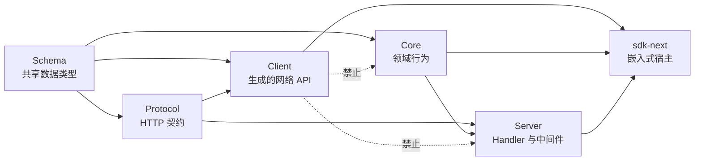
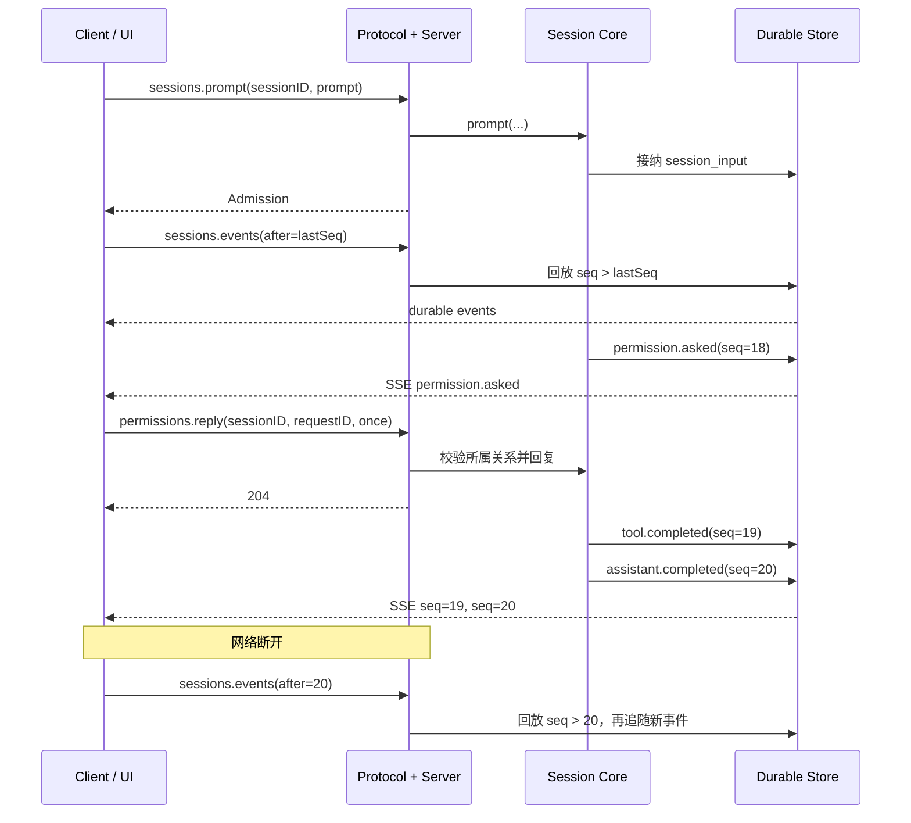

# 19 · HTTP API 与 Client 约定

> 本章回答一个很容易被低估的问题：  
> **怎样让命令行、桌面端、浏览器和嵌入式运行时都通过同一份可靠契约操作 Agent？**
>
> 先记结论：Protocol 声明“线上能说什么”，Server 实现这些语义，Client 从同一份 `HttpApi` 生成。Client 不应复制路由，也不能导入 Core 来“走捷径”。

如果你还不熟悉 Session、权限请求和事件流，建议先读 [03-Agent循环](./03-Agent循环-一次对话如何跑完.md)、[06-权限与人机确认](./06-权限-人机确认与命令安全.md) 和 [10-可观测性](./10-可观测性-如何看见Agent在干嘛.md)。

---

## 1. 这一章要解决什么问题

一个 Coding Agent 通常不只有一个界面：

- CLI 发送 prompt 并显示增量结果；
- Web / Desktop 订阅 Session 状态；
- 自动化脚本中断任务；
- UI 回答权限请求和模型提问；
- 嵌入式宿主在同一进程中调用 Agent。

如果每个入口都直接调用 Core，会很快出现四套不同语义：某个客户端认为“发送 prompt”会等到任务结束，另一个只等到消息入库；某个流会自动重连，另一个断开即结束；某个权限回复只按 `requestID` 查找，甚至可能回复到别的 Session。

因此需要三条明确边界：

1. **Protocol 是公开网络契约**：路径、方法、输入、输出、错误、SSE 数据类型。
2. **Server 是适配层**：把公开契约映射到 Core 能力，并保留 Session 所属关系、Location 中间件和错误语义。
3. **Client 是契约投影**：由公开 `HttpApi` 生成 Promise / Effect API，不手写另一套“看起来差不多”的接口。

OpenCode 的依赖方向可以简化为：



虚线不是调用关系，而是必须守住的禁区。`@opencode-ai/client` 的运行时依赖只有轻量的 Schema / Protocol；它不能因为“类型方便”而把数据库、文件监听、Provider、原生模块或 Session 执行器带进浏览器 bundle。

---

## 2. 最 naive 的版本会怎样

### 2.1 手写服务端和客户端两份路由

初学者常这样做：

```python
# server.py
@app.post("/sessions/{session_id}/prompt")
async def prompt(session_id: str, body: dict): ...

# client.py
async def send_message(session_id: str, text: str):
    return await http.post(f"/session/{session_id}/messages", json={"text": text})
```

路径、字段和返回值已经不一致。即使第一天能工作，后续也会发生：

- Server 改了字段，Client 类型没有更新；
- 204 No Content 被 Client 当 JSON 解析；
- 声明错误和网络错误混为一谈；
- Session 路由漏掉 Location 中间件；
- SSE 被普通 JSON 请求函数处理；
- 浏览器 Client 为了复用类型导入整个 Core。

### 2.2 把 `prompt` 当成“等待最终答案”

公开的 `sessions.prompt(...)` 不是“阻塞直到 Agent 完成”。它先**耐久接纳一条输入**，默认再发出一次 advisory wake（建议执行器开始 drain）。返回的是 admission 结果。

这一区分很重要：

```text
HTTP 201/200 成功
≠ 模型已经回答
≠ 工具已经执行
≠ Session 已经 idle
```

省略 `resume` 时，服务端接纳后尝试唤醒执行；`resume: false` 表示只接纳、不主动恢复执行。调用方若想观察后续结果，应订阅事件；若只想等待空闲，可使用专门的 wait 操作，而不是把 prompt 请求保持几十分钟。

### 2.3 所有事件都塞进一个流

OpenCode 有两个语义不同的流：

- `sessions.events({ sessionID, after })`：某个 Session 的**耐久事件流**，支持按 sequence 回放；
- `events.subscribe()`：当前 Server 实例的**实时活动流**，没有回放保证。

把 Session ID 做成全局实时流的可选筛选参数，看似简单，却丢失了耐久性、cursor、生命周期和断线恢复规则。二者应保持为不同 endpoint。

### 2.4 SDK 自动重连但不告诉调用方

实时流断线期间的事件无法补回。若 SDK 静默重连，UI 会误以为自己拥有完整状态。耐久流虽然能补回，也必须由上层明确保存最后一个 `seq`，再以 `after=seq` 订阅。生成 Client 本身只负责一次连接，断线应明确失败。

---

## 3. OpenCode 选择了什么设计

### 3.1 Protocol 先声明，再由 Handler 实现

`packages/protocol/src/groups/*.ts` 使用 `HttpApiEndpoint` 声明：

- HTTP method 和 path；
- path / query / payload Schema；
- success Schema 或 SSE Schema；
- 可公开的声明错误；
- OpenAPI operation identifier 与说明；
- 中间件应该放在哪些 endpoint 上。

例如 Session 组声明 `session.prompt`，Server 的 `SessionHandler` 用同一个 operation 名实现它。这样“路径是什么”和“业务怎么做”不会分散在两个手写路由表中。

### 3.2 五个关键操作

#### `sessions.prompt`

线上路径为 `POST /api/session/:sessionID/prompt`。请求可包含：

```jsonc
{
  "id": "可选的客户端消息 ID",
  "prompt": { "text": "请解释这个项目" },
  "delivery": "可选：steer 或 queue",
  "resume": true
}
```

核心语义：

- 一次请求耐久接纳一个 `session_input`；
- 默认接纳后唤醒 Session 执行；
- `resume: false` 是 admit-only；
- 重用消息 ID 只有在 Session、prompt 和 delivery 完全一致时才是精确重试；
- 冲突重用返回声明的 `ConflictError`，而不是偷偷覆盖。

#### `sessions.events`

线上路径为 `GET /api/session/:sessionID/event?after=N`，返回 SSE：

- 先验证 Session；
- 回放 `seq > after` 的耐久公开事件；
- 回放结束后继续发送新提交事件；
- 不包含仅在内存中存在的 token 碎片；
- `after` 是**排他游标**，不是“从 N 开始重复发”。

每条耐久事件带有类似下面的元数据：

```json
{
  "durable": {
    "aggregateID": "session-id",
    "seq": 42,
    "version": 1
  }
}
```

调用方应在**成功处理**事件后更新本地 `last_seq`。如果先更新再处理，进程恰好崩溃，就可能永久跳过一条事件。

#### `sessions.interrupt`

线上路径为 `POST /api/session/:sessionID/interrupt`，成功返回 204：

- 未知 Session 返回 `SessionNotFoundError`；
- 已知但 idle、已经结束或不由当前进程持有时是 no-op；
- 因而对已知 Session 来说它是幂等的；
- 它中断当前进程拥有的执行链，不承诺跨节点取消。

#### `permissions.reply`

线上路径为：

```text
POST /api/session/:sessionID/permission/:requestID/reply
```

payload 是 `{ reply, message? }`。Handler 会同时校验 `requestID` 存在且属于路径中的 `sessionID`。只按全局 request ID 回复是不够的，否则会破坏资源所属边界。

#### `questions.reply`

线上路径为：

```text
POST /api/session/:sessionID/question/:requestID/reply
```

payload 包含 `answers`。另有 `.../reject` 明确拒绝问题。Question Handler 同样检查问题属于该 Session；不存在或不属于该 Session 都按 `QuestionNotFoundError` 处理，避免泄露跨 Session 信息。

### 3.3 Client 的公开形状

代码生成把内部 operation 映射为面向使用者的能力组：

```ts
client.sessions.prompt(...)
client.sessions.events(...)
client.sessions.interrupt(...)
client.permissions.reply(...)
client.questions.reply(...)
client.questions.reject(...)
```

Promise 根入口使用 `fetch`，返回 Promise 或懒启动的 `AsyncIterable`；`/effect` 入口返回 Effect / Stream 并使用环境提供的 `HttpClient`。

两种 emitter 可以暴露不同的值模型，但必须来自同一份契约：

- Promise 版偏向零 Effect 的结构化 wire type；
- Effect 版可保留品牌、Schema 转换和运行时解码；
- endpoint、状态码、path、query、错误与流式性质不能漂移。

### 3.4 生成文件纪律

`packages/client/src/generated` 和 `src/generated-effect` 是生成结果，不应直接编辑。公开 Protocol 或 Server `HttpApi` 改动后：

```bash
cd packages/client
bun run generate
bun run check:generated
```

仓库脚本会从权威 API 编译中间契约，再并行生成 Promise 和 Effect Client。`check:generated` 重新生成并检查 diff，适合 CI 防止漏提交。

需要特别注意：`packages/client/package.json` 中 Core / Server 只允许作为**开发期代码生成输入**；生成后的 Client 运行时不能 import 它们。边界测试会检查浏览器 bundle 和 import graph。

---

## 4. SSE、断线与恢复语义

### 4.1 SSE 是 frame，不是“一行一个 JSON”

SSE 响应的 `Content-Type` 是 `text/event-stream`。一个事件可能跨多个 TCP chunk，多个 `data:` 行也可以组成一条数据。客户端必须：

1. 增量解码 UTF-8；
2. 兼容 `\r\n` / `\n`；
3. 以空行结束一个 SSE event；
4. 合并同一 event 的多个 `data:` 行；
5. 忽略 `: heartbeat` 注释；
6. 再对完整 `data` 做 JSON 解析。

不能对 `response.aiter_lines()` 中每一行直接 `json.loads`。

### 4.2 冷流与懒连接

生成的 Promise streaming 方法直接返回 `AsyncIterable`。构造 iterable 时不联网；第一次 `next()` 才建立连接。于是 HTTP 声明错误、transport error、content-type 错误也会在迭代期间出现。

这能让调用方自然使用取消：

```ts
const controller = new AbortController()

for await (const event of client.sessions.events(
  { sessionID, after: lastSeq },
  { signal: controller.signal },
)) {
  // 处理事件
}
```

结束迭代或触发 `AbortSignal` 时，应关闭底层响应流。

### 4.3 两类流的恢复策略

| 流 | 保证 | 断线后正确动作 |
|---|---|---|
| `sessions.events` | 耐久、按 Session sequence 回放 | 保存最后成功处理的 `seq`，以 `after=seq` 显式重订阅 |
| `events.subscribe` | 当前实例实时事件，无回放 | 先刷新权威状态，再显式重新订阅 |

生成 Client **不会自动重连**。这不是能力缺失，而是为了避免隐藏“是否丢事件”这个业务决定。

### 4.4 一个可靠的耐久重连循环

```python
async def consume_session_events(client, session_id: str, after: int | None):
    last_seq = after

    while True:
        try:
            async for event in client.session_events(session_id, after=last_seq):
                await project_event(event)  # 先完成幂等投影
                last_seq = event["durable"]["seq"]  # 再推进 checkpoint
                await save_checkpoint(session_id, last_seq)
        except (httpx.TransportError, SseProtocolError):
            await asyncio.sleep(1)
            # 新连接使用 after=last_seq，服务端先回放遗漏事件
```

这是应用层策略，不应塞进底层 HTTP 方法。生产实现还应加入指数退避、最大延迟、取消信号，并区分不可重试的 4xx 声明错误。

---

## 5. Python FastAPI / httpx 的边界伪代码

下面是 pycode 的**边界示例**，不是要求逐行复制 OpenCode 的 Effect 实现。

### 5.1 契约模型

```python
from typing import Literal
from pydantic import BaseModel


class Prompt(BaseModel):
    text: str


class PromptRequest(BaseModel):
    id: str | None = None
    prompt: Prompt
    delivery: Literal["steer", "queue"] | None = None
    resume: bool | None = None


class PermissionReply(BaseModel):
    reply: Literal["once", "always", "reject"]
    message: str | None = None


class QuestionReply(BaseModel):
    answers: list[list[str]]
```

Pydantic 模型属于 transport / schema 层。它们描述可序列化数据，不应包含数据库 Session 对象、工具 handler 或 Provider client。

### 5.2 FastAPI Handler 只做适配

```python
from fastapi import APIRouter, Depends, Response
from fastapi.responses import StreamingResponse

router = APIRouter(prefix="/api")


@router.post("/session/{session_id}/prompt")
async def prompt(
    session_id: str,
    body: PromptRequest,
    sessions: SessionService = Depends(get_sessions),
):
    admitted = await sessions.prompt(
        session_id=session_id,
        message_id=body.id,
        prompt=body.prompt,
        delivery=body.delivery,
        resume=body.resume,
    )
    return {"data": admitted}


@router.get("/session/{session_id}/event")
async def events(
    session_id: str,
    after: int | None = None,
    sessions: SessionService = Depends(get_sessions),
):
    await sessions.require(session_id)

    async def body():
        async for event in sessions.events(session_id, after=after):
            yield encode_sse(event="message", data=event)

    return StreamingResponse(body(), media_type="text/event-stream")


@router.post("/session/{session_id}/interrupt", status_code=204)
async def interrupt(session_id: str, sessions=Depends(get_sessions)):
    await sessions.require(session_id)
    await sessions.interrupt(session_id)
    return Response(status_code=204)
```

Handler 不应自己实现 Agent loop，也不应重新定义 prompt 精确重试逻辑。它只负责 decode、调用领域 service、将领域错误映射为公开错误。

权限与问题回复必须保留所属检查：

```python
@router.post(
    "/session/{session_id}/permission/{request_id}/reply",
    status_code=204,
)
async def reply_permission(session_id: str, request_id: str, body: PermissionReply):
    request = await permissions.get(request_id)
    if request is None or request.session_id != session_id:
        raise PermissionRequestNotFound(request_id)
    await permissions.reply(request_id, body.reply, body.message)
    return Response(status_code=204)
```

### 5.3 httpx Client 不导入领域实现

```python
class PyCodeClient:
    def __init__(self, base_url: str, transport: httpx.AsyncBaseTransport | None = None):
        self._http = httpx.AsyncClient(
            base_url=base_url,
            transport=transport,
            timeout=None,
        )

    async def prompt(self, session_id: str, body: PromptRequest) -> Admission:
        response = await self._http.post(
            f"/api/session/{quote(session_id, safe='')}/prompt",
            json=body.model_dump(exclude_none=True),
        )
        raise_declared_error(response)
        return Admission.model_validate(response.json()["data"])

    async def interrupt(self, session_id: str) -> None:
        response = await self._http.post(
            f"/api/session/{quote(session_id, safe='')}/interrupt"
        )
        raise_declared_error(response)
```

Client 可以依赖共享 Pydantic DTO 或生成类型，但不能 import `SessionRunner`、数据库 repository 或权限执行器。嵌入式模式若要避免真实 socket，应给同一个 HTTP Client 注入 ASGI transport，而不是绕过 router：

```python
transport = httpx.ASGITransport(app=fastapi_app)
client = PyCodeClient("http://embedded", transport=transport)
```

这样网络和嵌入式模式仍经过相同的编码、路由、中间件、Handler 和错误边界。

---

## 6. 走一遍完整示例

用户在桌面端发送“运行测试；需要危险命令时先问我”：



这里有几个容易忽略的点：

1. prompt 成功只说明输入已接纳。
2. 权限请求通过耐久 Session 事件到达 UI。
3. 回复路径同时携带 Session ID 和 request ID。
4. UI 处理完 `seq=20` 后保存 checkpoint。
5. 重连时 `after=20`，不会重复 `seq=20`。

如果用户点击停止：

```text
client.sessions.interrupt({ sessionID })
→ Server 先验证 Session
→ 中断本进程拥有的活跃执行
→ idle 时仍返回 204
```

UI 不应根据 interrupt 的 204 推断“最后一个 Provider 网络包绝对没有到达”；它仍应以耐久事件和刷新后的 Session 状态为准。

---

## 7. 优点、代价与 pycode 注意事项

### 7.1 优点

1. **单一事实来源**：路由、Schema、错误和流式类型从公开 `HttpApi` 派生。
2. **运行时边界干净**：Client 不加载数据库、Core、Server 和原生依赖。
3. **网络 / 嵌入式一致**：只替换 transport，不绕过 Handler。
4. **耐久恢复显式**：`after=seq` 让断线补偿可测试、可观察。
5. **错误可分类**：声明的领域错误与 transport / malformed response 等基础设施错误分开。
6. **取消不污染领域输入**：`AbortSignal` 等属于每次 transport options，而不是 prompt payload。

### 7.2 代价

1. 改公开契约后必须重新生成并提交产物。
2. Promise 与 Effect emitter 都要做契约一致性测试。
3. SSE parser 要正确处理 chunk、换行、heartbeat 和取消。
4. 生成 Client 不替应用决定重试、checkpoint 和状态刷新策略。
5. Protocol 与 Schema 必须保持轻量，不能为了复用一个类型随意反向依赖 Core。

### 7.3 pycode 最小落地

第一版建议只做：

- Pydantic DTO + 明确的领域错误；
- FastAPI 路由作为唯一公开契约；
- 从 OpenAPI 生成或严格测试的 httpx Client；
- `prompt` 返回 admission，不等待最终答案；
- Session 耐久 SSE 支持 `after`；
- 权限 / 问题回复检查 Session 所属关系；
- `interrupt` 对已知 idle Session 幂等；
- ASGI transport 实现嵌入式调用。

先不要做：

- Client 自动无限重连；
- 一个 SSE 混合耐久事件与实例实时事件；
- Client 直接导入领域 service；
- 为“本地调用更快”绕开 HTTP router；
- 手工编辑生成文件；
- 把 transport timeout、header、cancel token 塞进领域 payload。

### 7.4 评审清单

- [ ] Protocol 是否是 path、method、payload、success、error 的唯一来源？
- [ ] Client 的运行时依赖是否完全不包含 Core / Server？
- [ ] `sessions.prompt` 是否返回 admission，而非伪装成最终答案？
- [ ] `sessions.events(after)` 是否只发送 `seq > after` 的耐久事件？
- [ ] checkpoint 是否在事件处理成功后推进？
- [ ] 实时流断线后是否先刷新权威状态？
- [ ] 权限和问题回复是否验证 request 属于 Session？
- [ ] 已知 idle Session 的 interrupt 是否为 no-op？
- [ ] 生成文件是否只通过生成命令更新？
- [ ] SSE 的取消是否真正关闭响应体？

---

## 8. 对应源码位置

建议按下面顺序阅读：

```text
packages/protocol/src/groups/session.ts
  sessions.prompt、history、events、interrupt 等公开 endpoint 与 Schema。

packages/protocol/src/groups/permission.ts
  权限请求、查询、回复路径和声明错误。

packages/protocol/src/groups/question.ts
  问题查询、回答与拒绝契约。

packages/protocol/src/groups/event.ts
  实例级 live SSE；注意它与 Session durable events 不同。

packages/server/src/handlers/session.ts
  Protocol operation 到 SessionV2 Service 的适配与错误映射。

packages/server/src/handlers/permission.ts
packages/server/src/handlers/question.ts
  request 所属 Session 的验证与回复处理。

packages/server/src/handlers/event.ts
  实例流、server.connected、15 秒 heartbeat 和 SSE headers。

packages/client/src/contract.ts
  Protocol-only Client API 投影与消费端 capability 命名。

packages/client/script/build.ts
  从权威 HttpApi 编译并生成 Promise / Effect Client。

packages/client/src/generated/
packages/client/src/generated-effect/
  生成产物，只读；不要手工修改。

packages/client/test/import-boundaries.test.ts
packages/client/test/contract-identity.test.ts
  浏览器安全依赖边界与 Server / Client 契约一致性。

CONTEXT.md（Client contract architecture）
  Client、SDK Contract IR、SSE、重连和嵌入式 transport 的架构约定。
```

---

## 本章小结

1. Protocol 声明公开网络契约，Server 实现，Client 从同一契约生成。
2. `sessions.prompt` 的成功表示耐久接纳，不表示 Agent 已完成。
3. `sessions.events` 是可通过 `after=seq` 恢复的 Session 耐久流；实例 `events.subscribe` 是不可回放的实时流。
4. 生成 Client 不自动重连，上层必须明确决定 checkpoint、刷新与重试。
5. Client 运行时只能依赖轻量 Schema / Protocol，不能导入 Core 或 Server。
6. pycode 可用 FastAPI + Pydantic 定义边界，用 httpx / ASGI transport 统一网络与嵌入式调用。

> 若你只能记住一句：  
> **Client 是公开契约的投影，不是 Core 的另一个入口。**
