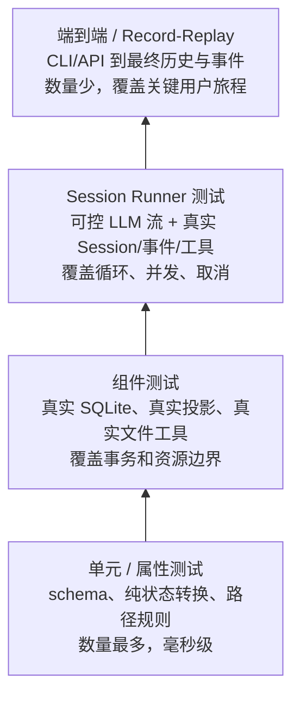

# 20 · 测试策略与可验证目标

> Coding Agent 的测试目标，不是证明“模型每次都说同一句话”，而是证明：  
> **输入不会丢、执行不会乱、副作用不会被悄悄重放、事件可以恢复、权限真的生效。**

本章给 PyCode 一套可直接落地的八段式测试模板。它参考 OpenCode `packages/core/test/` 的真实测试方式，重点覆盖 Session runner、耐久事件、工具边界和 LLM record/replay。

如果还不熟悉 Agent 循环，先读 [03 · Agent 循环](./03-Agent循环-一次对话如何跑完.md)；如果对取消与恢复的边界不清楚，先读 [09 · 取消、恢复与容错](./09-取消-恢复与容错.md)。

---

## 1. 先定义“正确”：测试不变量，而不是文案

普通聊天机器人常用“输入一句话，断言回复包含某个词”。Coding Agent 不能只这样测，因为真正危险的错误通常发生在回复文字之外：

- 同一 Session 被两个执行器同时推进；
- 工具已经改了文件，但数据库仍显示 `running`；
- 用户点停止后，下一条排队消息被删掉；
- 断线重连漏掉一条关键事件；
- Plan 模式嘴上说“不修改”，执行层却仍允许写文件；
- 进程崩溃后盲目重放有副作用的工具。

因此每个功能先写成三列，再写测试：

| 功能 | 可观察结果 | 不允许发生 |
|---|---|---|
| prompt admission | inbox 恰好新增一条耐久输入 | 网络重试插入两条 |
| Session 执行 | 同 Session 同时最多一个 drain | 并发修改同一段历史 |
| provider turn | 每轮恰好一次 `llm.stream` | LLM 层偷偷递归跑完整工具循环 |
| 工具调用 | called/running 最终收口为 success/failed | 永久停在 running |
| interrupt | 活跃执行停止，待处理 inbox 保留 | 把“停止”实现成“清空队列” |
| replay | durable seq 严格递增，可从 cursor 继续 | token delta 推进耐久 cursor |

一个好测试的名字应当能读成规格，例如：

```python
async def test_interrupt_preserves_unpromoted_input(): ...

async def test_concurrent_resumes_share_one_session_drain(): ...

async def test_replay_after_sequence_has_no_gap_or_duplicate(): ...
```

这比 `test_session_works()` 更有价值：测试失败时，团队立刻知道哪条承诺被破坏。

---

## 2. 测试哲学：少 mock，多测真实实现

OpenCode 根目录 `AGENTS.md` 给出的测试原则很明确：

1. **尽量避免 mock。**
2. **测试真实实现，不要在测试里复制一遍业务逻辑。**
3. **不要从仓库根目录运行测试；进入具体 package 目录。**

PyCode 应继承这套思想，但要准确理解“少 mock”：

- SQLite、临时目录、事件投影、权限判断、工具参数校验，应使用真实实现。
- 时间、并发和取消，应通过 gate、barrier 或可控 task 协调，而不是 `sleep(0.2)` 猜时序。
- 外部 LLM 网络是不稳定且收费的边界，可以替换为协议级 fake 或 record/replay。
- 测试替身只放在真正的系统边界；不要把 Session store、runner、projector 全部替换掉后，还声称测了 Session。

### 2.1 推荐与不推荐

| 推荐 | 不推荐 | 原因 |
|---|---|---|
| 临时目录 + 真实文件工具 | mock `open()` 后断言调用次数 | 前者能发现路径、编码和权限问题 |
| 临时 SQLite + 真实 migration | 用字典假装数据库 | 前者能发现事务、索引和唯一约束问题 |
| 可控 LLM event stream | mock 整个 runner 的最终字符串 | 前者仍经过真实编排和投影 |
| `asyncio.Event` 控制并发边界 | 固定 `sleep()` 等任务“应该开始了” | gate 更确定，不易产生偶发失败 |
| 比较公开事件与读模型 | 断言内部私有函数被调用 | 前者允许安全重构 |

### 2.2 从 package 目录运行

OpenCode 的 Core 测试应这样运行：

```bash
cd packages/core
bun test test/session-runner.test.ts
bun test test/event.test.ts
bun typecheck
```

不要在 OpenCode 仓库根目录直接跑测试；仓库有保护规则。PyCode 也应约定从自己的 Python package 目录运行，例如：

```bash
cd packages/pycode
pytest -q
```

如果 PyCode 最终不是 monorepo，就从包含 `pyproject.toml` 的项目目录运行。关键不是照抄路径，而是让测试的工作目录、fixture 查找和包导入保持确定。

---

## 3. 测试金字塔：底层多，真实主链路不可少

下面的金字塔不是说“端到端测试越少越好”，而是说昂贵测试只覆盖关键旅程，组合爆炸交给更快的契约与组件测试。



建议比例只作起点，不作为 KPI：

- 约 50%：schema、纯函数、状态转换、属性测试；
- 约 25%：真实存储与工具组件；
- 约 20%：Session runner；
- 约 5%：record/replay 和完整 CLI/API 旅程。

### 3.1 各层分别抓什么 bug

**单元 / 属性层**

- 非法 tool input 是否被 schema 拒绝；
- 路径规范化是否允许 `../` 或 symlink escape；
- delivery 排序是否始终保持 FIFO；
- 事件编码再解码是否保持语义；
- message id 冲突规则是否完整。

**组件层**

- durable event 与 projector 是否同事务提交；
- commit 失败时事件、序列和投影是否一起回滚；
- 文件工具是否真的读写临时目录；
- migration 后旧数据是否仍可读取；
- 权限规则是否在真实 tool executor 前执行。

**Runner 层**

- 一个 provider turn 一次 stream；
- 工具调用、并行工具、settlement 与 continuation；
- steer / queue 的安全边界；
- interruption 与遗留 `running` 状态清理；
- compaction 后重新加载历史。

**端到端层**

- 用户从 CLI 发 prompt，能看到最终消息和耐久事件；
- 断线后用 cursor 恢复；
- record/replay fixture 能离线复现一个完整 provider 响应；
- Plan 模式的写操作被硬拒绝。

---

## 4. 测试夹具：建立“小而真实”的实验室

PyCode 最重要的 fixture 不是一个万能 `MagicMock`，而是一套可组合的真实运行环境。

### 4.1 每个测试默认拥有

- 一个独立临时目录；
- 一个独立 SQLite 数据库；
- 已执行的真实 migration；
- 真实 Session store、event store 和 projector；
- 可控时钟，仅在确实涉及时间排序时注入；
- 可控 LLM transport；
- 默认拒绝危险副作用的测试权限策略。

推荐 fixture 轮廓：

```python
@pytest.fixture
async def app(tmp_path):
    database = await Database.open(tmp_path / "pycode.db")
    await database.migrate()
    llm = ScriptedLLM()
    application = await create_application(
        database=database,
        workspace=tmp_path / "workspace",
        llm=llm,
    )
    try:
        yield application, llm
    finally:
        await application.close()
```

这里替换的是外部 LLM transport；数据库、runner、事件投影和文件系统仍走真实实现。

### 4.2 并发测试不要靠运气

用显式 gate 固定时序：

```python
started = asyncio.Event()
release = asyncio.Event()

llm.enqueue(block_until=release, notify_started=started)
first = asyncio.create_task(session.resume(session_id))
await started.wait()
second = asyncio.create_task(session.resume(session_id))

assert runner.active_count(session_id) == 1
release.set()
await asyncio.gather(first, second)
```

OpenCode 的 `session-run-coordinator.test.ts` 也采用同类思路：通过 `Deferred` 控制 drain 何时开始和释放，从而验证同 Session 的 resume 合并、wake 合并、不同 Session 并行以及 interrupt 清理。PyCode 可以用 `asyncio.Event` 表达同一个测试思想。

### 4.3 fixture 必须自描述

每份 LLM fixture 至少记录：

- provider 协议与模型标识；
- 录制日期和上游 API 版本；
- 请求中被脱敏或归一化的字段；
- 预期流事件摘要；
- 重新录制命令；
- 是否包含 tool call、reasoning、usage 等特殊分支。

不得把 API key、用户原文、绝对主目录和临时签名写进仓库。

---

## 5. Session Runner：测试真正的 Agent 循环

Session runner 是 PyCode 风险最高的单元。它应使用“可控 LLM + 真实其余组件”的方式测试，而不是只测一个 `while` 函数。

OpenCode 可直接参考的测试包括：

- `packages/core/test/session-runner.test.ts`：完整 runner 场景；
- `packages/core/test/session-runner-model.test.ts`：模型解析与切换；
- `packages/core/test/session-runner-message.test.ts`：消息降低与历史；
- `packages/core/test/session-runner-tool-registry.test.ts`：工具注册与可见性；
- `packages/core/test/session-runner-tool-events.test.ts`：工具事件序列化和兼容；
- `packages/core/test/session-run-coordinator.test.ts`：并发、wake、resume、interrupt。

### 5.1 最小必测矩阵

| 场景 | LLM 脚本 | 必须断言 |
|---|---|---|
| 纯文本完成 | text → finish | 一条 assistant 终态；一次 stream |
| 单工具循环 | tool call → tool result 后 text | called、success、第二个 provider turn |
| 工具失败 | tool call 指向失败工具 | failed 已耐久；不会永久 running |
| 非法参数 | tool call 参数不符合 schema | 工具函数未执行；错误结果进入历史 |
| 多工具 | 同一 turn 发多个 tool call | 允许按设计并行；settlement 全部完成后再 continuation |
| 中途 interrupt | stream 或工具被 gate 阻塞 | 活跃任务取消；inbox 保留；状态收口 |
| 重复 resume | 两个调用同时进入 | 同一 Session 只有一个 drain |
| 不同 Session | 两个 Session 同时阻塞 | 两者可以同时 active |
| steer | 当前任务需 continuation 时新输入到达 | 在下一安全 provider-turn 边界 promote |
| queue | 当前任务仍需 continuation 时新输入到达 | 到原任务本应 idle 时再 promote |
| 步数上限 | LLM 连续请求工具 | 达上限后停止工具，不无限循环 |
| 压缩 | 历史超过预算 | 原文仍耐久；模型视图使用 checkpoint |

### 5.2 一个关键断言：请求次数属于 Session

LLM fake 应保存收到的 request：

```python
assert len(llm.requests) == 2
assert llm.requests[0].messages[-1].role == "user"
assert llm.requests[1].messages[-1].role == "tool"
```

这能证明：

1. 第一次 provider turn 产出工具调用；
2. Session 执行并记录工具；
3. Session 决定开始第二次 provider turn；
4. LLM 层没有在一次 `stream()` 内偷偷完成整个循环。

对应的设计原因见 [18 · LLM 层与 Provider 边界](./18-LLM层与Provider边界.md)。

### 5.3 不要测试模型措辞

对于 fake 或录制响应，可以断言精确文本；对于真实在线 smoke test，只断言结构：

- 有 assistant 消息；
- finish reason 合法；
- tool call 能解码；
- usage 非负；
- 没有泄露 fixture 中的秘密。

不要断言线上模型必须回复“你好！”——模型升级会让这种测试无意义地变红。

---

## 6. 事件契约与重放：证明“断线后还能相信”

事件测试分为三类：**schema contract、事务 contract、replay contract**。

### 6.1 Schema contract

每个耐久事件都应测试：

- 当前 encoder 输出可被当前 decoder 读取；
- 需要兼容的历史版本仍能解码；
- 破坏性 payload 变化必须提升事件版本；
- live-only 事件没有耐久 `seq`；
- durable event 的公开字段不会意外带入大块二进制或内部对象。

OpenCode 的 `session-runner-tool-events.test.ts` 有一个很实用的模式：检查媒体 base64 只序列化一次、旧版 success payload 仍可解码、失败不会错误发布 success。PyCode 的文件、图片和大工具输出也应有类似 contract test。

### 6.2 事务 contract

必须测试以下原子性：

```text
写 durable event
  + 推进 aggregate seq
  + 更新 projector/read model
  + 更新 inbox/tool settlement
= 要么全部成功，要么全部回滚
```

至少注入一次 projector 或 commit 失败，随后直接查询真实 SQLite，确认：

- 没有半条事件；
- aggregate sequence 没有被错误推进；
- read model 没有残留；
- 重试后可使用正确的下一序列。

OpenCode `packages/core/test/event.test.ts` 正在测试这些边界：commit 失败回滚、每个 aggregate 独立递增、projector 顺序以及 replay 的 sequence mismatch。

### 6.3 Replay contract

重放测试至少覆盖：

- `after` 是 exclusive cursor；
- 返回序列严格递增且唯一；
- replay 历史与订阅 live tail 交接期间不漏事件；
- 多个 wake 可以合并，但数据库中的事件不能丢；
- live-only delta 不出现在 durable stream；
- 重复导入同一外部事件幂等或明确冲突；
- aggregate ID 与 payload 所属 Session 不一致时拒绝。

推荐用模型测试表达：

```python
seen = await events.history(session_id, after=3)
assert [event.seq for event in seen] == [4, 5, 6]

replayed_state = project(seen_from_zero)
assert replayed_state == await sessions.read_model(session_id)
```

最后一条是很强的验收：**从零重放得到的状态，应与在线投影状态等价。**

---

## 7. Mock LLM 策略：脚本 fake + Record/Replay

“不要 mock”不等于每次测试都请求真实模型。正确做法是把 LLM 当成外部协议边界，分两层测试。

### 7.1 第一层：Scripted LLM

绝大多数 runner 测试使用确定的规范化事件：

```python
llm.enqueue([
    StepStarted(index=0),
    ToolCalled(id="call-1", name="read", input={"path": "README.md"}),
    StepFinished(index=0, reason="tool_calls"),
])
llm.enqueue([
    StepStarted(index=1),
    TextDelta("文件内容是……"),
    StepFinished(index=1, reason="stop"),
])
```

它应支持：

- 保存全部 request；
- 按调用顺序返回多组事件；
- 在 stream 中途失败；
- 用 gate 暂停 stream；
- 返回畸形 tool input；
- 模拟 provider error、context overflow 和取消。

它不应直接返回最终 Session message，因为那会绕过真正要测的事件发布、工具执行和历史投影。

### 7.2 第二层：HTTP Record/Replay

少量协议集成测试先请求真实 provider 并录制脱敏 HTTP cassette，日常 CI 离线回放。

OpenCode 的 `packages/core/test/session-runner-recorded.test.ts` 就是具体范例：

- `RECORD=true` 时录制；
- 默认从 `test/fixtures/recordings/` 回放；
- 回放仍经过真实 LLM client、runner、SQLite 和事件投影；
- 最后同时断言消息结果与耐久事件顺序。

PyCode 可采用同样流程：

```bash
# 人工、受控地刷新 fixture
PYCODE_RECORD_LLM=1 pytest tests/recorded/test_openai_chat.py

# 本地和 CI 默认离线回放
pytest tests/recorded/test_openai_chat.py
```

### 7.3 Cassette 的稳定化规则

录制时删除或归一化：

- `Authorization`、cookie、API key；
- request id、trace id；
- `Date`、签名和临时 URL；
- 随机边界字符串；
- 本机绝对路径；
- 与断言无关的易变响应头。

保留：

- 请求方法、路径和关键 body；
- 流事件边界及顺序；
- tool call id/name/arguments；
- finish reason、usage 和错误类型；
- provider 特有、后续 continuation 必需的 metadata。

Record/replay 证明的是“我们的协议适配仍能读懂一份真实响应”，不是证明 provider 今天在线。因此可另外安排极少量、非阻塞或受控的在线 smoke test，但不要让普通 PR 依赖外部模型稳定性。

---

## 8. 验收映射与交付门禁

路线图中的每一项“完成”，都必须映射到自动化证据。下面是最小映射，可直接复制到 PyCode 的 issue 或 PR 模板。

| 路线图能力 | 自动化验收 | 手动演示 | 失败时阻止发布 |
|---|---|---|---|
| prompt 幂等 admission | exact retry 不重复；冲突重用报错 | 断网重发同一消息 | 是 |
| 单 Session 串行 | 两个 resume 只启动一个 drain | 两个客户端同时继续 | 是 |
| 多 Session 并行 | 两个 Session 同时 active | 两个终端同时运行 | 是 |
| interrupt | stream/tool 被取消；待处理 inbox 保留 | `/stop` 后 `/resume` | 是 |
| 工具 settlement | success/failed 都有终态；重启清理遗留 running | 执行成功与失败命令 | 是 |
| 权限 | deny/ask 在 executor 前生效 | 尝试危险 shell | 是 |
| Plan 硬闸 | write/bash mutation 被执行层拒绝 | Plan 中要求改代码 | 是 |
| durable replay | cursor 后无漏、无重；live delta 不进入 | SSE 断开再连接 | 是 |
| compaction | 原始历史保留；模型视图切换 checkpoint | 长会话继续提问 | 是 |
| Skill | 列表可见、正文按需加载 | 调用一个 Skill | 否，若功能仍标实验 |
| MCP | 工具命名、权限、坏响应和进程退出均有测试 | 连接本地 stdio server | 是，启用 MCP 时 |
| Task | 父子身份、结构化结果、恢复边界有测试 | 恢复一个 task id | 是，启用 Task 时 |
| Fork | 父子历史不串线 | 从旧消息创建分支 | 是，启用 Fork 时 |
| 真沙箱 | 文件、进程、网络隔离与逃逸负例 | 在隔离环境尝试越界 | 是，若产品宣称沙箱 |

### 8.1 PR 的最小验证清单

- [ ] 每项需求都有至少一条可观察验收标准。
- [ ] bug 修复先有能复现失败的测试。
- [ ] 关键路径使用真实 SQLite 和真实文件系统。
- [ ] LLM 替身停留在 transport/protocol 边界。
- [ ] 并发测试使用 gate，不依赖固定 sleep。
- [ ] 新耐久事件有 schema、事务和 replay 测试。
- [ ] fixture 已脱敏，并记录重录方式。
- [ ] 测试从具体 package 目录运行。
- [ ] 变更 package 的类型检查通过。
- [ ] 手动演示只作补充，不代替自动验收。

### 8.2 P0–P3 发布门禁

**P0：** runner 最小矩阵、幂等 admission、并发 resume、interrupt、真实文件工具全部通过。  
**P1：** 权限硬边界、事件重放、compaction 保留原文、context 更新全部通过。  
**P2：** Build/Plan、Skill、MCP、Task 各自契约测试通过，且 P0–P1 不回归。  
**P3：** 每个可选增强独立验收；未实现的恢复或隔离能力不得写进稳定功能声明。

最终判断标准很简单：

> 如果一个能力只能靠“我刚才手动试了一次，看起来能用”来证明，它还没有达到可发布状态。

---

## 本章小结

- 测试 Coding Agent，重点是状态、不变量和副作用边界，不是模型措辞。
- 遵循 OpenCode 的原则：少 mock、测真实实现、从 package 目录运行。
- Session runner 用可控 LLM 流测试；数据库、事件、投影和工具尽量走真实实现。
- 耐久事件必须同时验证 schema、事务原子性和 replay。
- 外部 LLM 用 scripted fake 覆盖组合，用脱敏 record/replay 覆盖真实协议。
- 路线图的每个“完成”都要能指向自动化验收证据。

**返回目录**：[00-阅读指南.md](./00-阅读指南.md)  
**返回路线图**：[12-PyCode落地路线图.md](./12-PyCode落地路线图.md)
