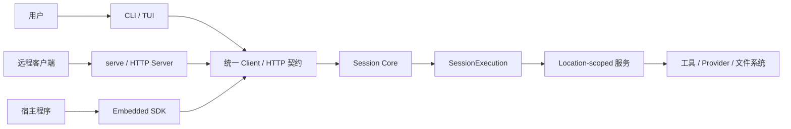
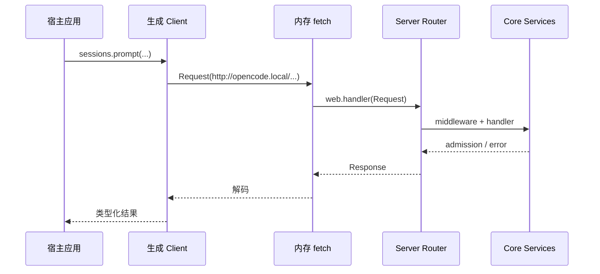
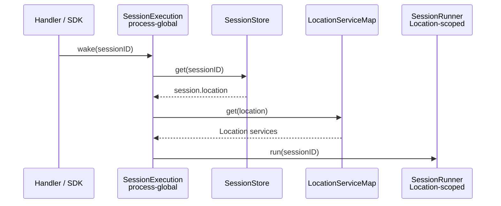

# 21 · 运行形态与部署

> 本章回答一个很实用的问题：  
> **同一套 Coding Agent 核心，怎样既能在终端里运行，又能提供 HTTP 服务，还能被别的程序嵌入？**
>
> 先记结论：CLI / TUI、HTTP Server 和 Embedded SDK 是三种“入口”，不是三套 Agent。它们应复用相同的 Session、权限、工具和持久化语义。

如果你还不熟悉 Session 和 HTTP 契约，建议先读 [03-Agent循环](./03-Agent循环-一次对话如何跑完.md) 和 [19-HTTP API 与 Client 约定](./19-HTTP-API与Client约定.md)。

---

## 1. 这一章要解决什么问题

一个 Agent 写好以后，通常需要面对三类使用者：

1. **人直接使用**：在 CLI / TUI 里输入问题、看增量输出、批准权限。
2. **远程程序使用**：通过 HTTP API 创建 Session、发送 prompt、订阅事件。
3. **同进程程序使用**：宿主应用不想监听端口，希望直接把 Agent 作为库嵌入。

三种形态可以画成：



这里最重要的不是“有没有 socket”，而是三种入口是否保持相同语义：

- prompt 成功表示输入被接纳，不能被某个入口偷偷解释成“任务已经完成”；
- 权限判断不能因为是 embedded 就被跳过；
- Session 事件和中断行为不能因 UI 不同而变化；
- 工作目录、工具和 Provider 必须绑定到正确的 Location。

### 1.1 三种运行形态的定位

**CLI / TUI** 是给人用的交互界面。它负责输入、渲染和交互，不应拥有 Agent loop。

**serve** 是无界面的 HTTP 服务。它适合 Web、Desktop、自动化脚本或另一台机器上的客户端。

**embedded** 是进程内宿主。它不开放 TCP 端口，但仍走相同 router、middleware、handler、codec 和 error 边界。

---

## 2. 最 naive 的版本会怎样

### 2.1 为三种入口各写一套业务逻辑

初学者可能会这样组织：

```text
cli_agent.py       有一套 while/tool loop
http_agent.py      又有一套 while/tool loop
embedded_agent.py  再复制一套 while/tool loop
```

很快就会出现漂移：

- CLI 支持权限询问，HTTP 直接放行；
- embedded 模式不写数据库，重启后丢历史；
- HTTP 支持 interrupt，TUI 只能强杀进程；
- 三套入口对“工作目录”的理解不同；
- 修复一次精确重试问题，需要修改三处。

正确方向是让入口只做适配：

```text
用户交互 / HTTP / 进程内调用
           ↓
       同一公开契约
           ↓
       同一 Session Core
```

### 2.2 embedded 直接调用内部函数

“同进程”很容易被误解为“可以绕过所有边界”：

```python
# 不推荐：宿主直接碰内部 runner
await session_runner.run(session_id)
```

这样虽然少了一层调用，却也绕过了：

- 请求 Schema 解码；
- Location 中间件；
- 声明错误映射；
- 权限和 Session 所属检查；
- 网络模式与嵌入模式的一致性测试。

OpenCode 的 `sdk-next` 采用的是**内存中的 HTTP router**：它创建 `Request`，交给真实 handler 处理，但不监听端口，也不产生真实网络 I/O。

### 2.3 把每个目录都变成一套全局执行器

另一个常见误区是：

```text
目录 A → SessionExecution A
目录 B → SessionExecution B
```

当前 V2 设计不是这样。`SessionExecution` 是**进程全局、按 Session ID 路由**的；真正依赖目录的 Runner、工具、Provider 和文件系统能力属于 Location。

如果把执行协调器也复制到每个目录，会难以回答：

- 某个 Session 当前是否已经在本进程运行？
- 两次相同 Session 的 wake 应该合并还是并发？
- interrupt 应该发给哪一个执行所有者？

---

## 3. OpenCode 选择了什么设计

### 3.1 serve：真正监听 HTTP

`opencode serve` 是 headless server 入口。当前命令会：

1. 解析 `--hostname`、`--port`、mDNS 和 CORS 配置；
2. 动态加载 Server；
3. 调用 `Server.listen(...)`；
4. 打印监听地址；
5. 保持进程运行。

网络参数的默认值是：

- `hostname = 127.0.0.1`，默认只监听本机；
- `port = 0`；当前 listener 会先尝试 4096，占用时再选择可用端口；
- mDNS 默认关闭；
- 额外 CORS origin 默认为空。

`packages/server` 中的新 Server 组装也展示了同一原则：公开 `Api`、handlers、Location middleware、authorization 和 Core services 被装成一个 router。它不是另一套 Session 实现。

### 3.2 embedded：真实 router，内存 transport

`packages/sdk-next/src/opencode.ts` 的做法可以概括为：



它没有 TCP listener，却保留：

- 同一套路由和 handler；
- 同一套输入输出 codec；
- 同一套声明错误；
- Location 解析和 Session 执行；
- Scope 关闭时的资源释放。

embedded 还提供宿主专用的 `tools.register(...)`。这是明确的 local-only 扩展能力，不需要为了网络客户端暴露同一个接口。

### 3.3 CLI / TUI：界面也是客户端

OpenCode 的 TUI 并不把业务逻辑塞进渲染层。当前默认 TUI 会启动 worker，并根据参数选择两类 transport：

- 默认使用内部 URL、worker fetch 和内部事件通道；
- 显式指定网络参数时，启动可监听的 Server，再让 TUI 作为 HTTP 客户端连接。

因此 TUI 的职责主要是：

- 收集 prompt；
- 展示 Session、消息、工具状态；
- 处理权限和问题交互；
- 转发中断、继续、切换模型等操作。

命令行的一次性 `run`、交互式 TUI 和远程 `attach` 可以有不同用户体验，但不应各自发明 Session 语义。

### 3.4 两套 Server 组装代码意味着什么

当前仓库正处于架构演进中：

- `packages/opencode/src/server/` 是现有 CLI `serve` 使用的完整 Server 入口；
- `packages/server/` 是拆分后的 Protocol / Core Server 包，也被 `sdk-next` 用来组装 embedded router。

读源码时不要看到两个 `createRoutes` 就推断为“两套产品协议”。应关注它们都在朝相同边界收敛：入口组装服务，handler 适配契约，Session Core 拥有领域语义。

---

## 4. 鉴权与部署的最小安全集

### 4.1 当前已有的是 HTTP Basic Auth

OpenCode 当前的最小 Server 鉴权由两个环境变量控制：

```bash
OPENCODE_SERVER_USERNAME=opencode
OPENCODE_SERVER_PASSWORD=your-password
```

规则是：

- 未设置非空 `OPENCODE_SERVER_PASSWORD` 时，不要求鉴权；
- username 默认是 `opencode`；
- 设置密码后，请求必须提供匹配的 HTTP Basic Authorization；
- 未通过时返回公开的 Unauthorized 错误，并带 `WWW-Authenticate` header。

这不是 Bearer token，也不是多用户账号系统。不要把“设置了 Server 密码”写成“已经实现租户隔离、权限角色和审计”。

### 4.2 最小部署原则

对学习和个人本机使用，推荐：

1. 默认绑定 `127.0.0.1`；
2. 不把端口转发到公网；
3. 即便只在局域网使用，只要绑定 `0.0.0.0`，就设置强密码；
4. 不把密码写进仓库；
5. CORS 只允许确实需要的 origin；
6. 将工作目录视为安全边界，因为 Agent 可能读文件、写文件和执行命令。

生产部署还需要 TLS、反向代理、secret 管理、限流、日志脱敏、备份和进程监督。这些不属于当前“最小鉴权”的自动保证。

### 4.3 embedded 并不自动等于安全

embedded router 会明确关闭 HTTP 鉴权，因为它不接受外部网络连接。但宿主仍必须控制：

- 谁可以调用宿主 API；
- 传入哪个目录；
- 注册哪些工具；
- 权限请求由谁批准；
- Session 数据存在哪里。

“没有端口”只减少网络暴露面，不会让危险 shell 命令自动变安全。

---

## 5. process-global SessionExecution 与 Location

这是部署形态中最容易混淆、也最值得单独理解的一层。

### 5.1 SessionExecution 是进程级协调器

`SessionExecution` 的接口接收 Session ID，提供：

- `active`：查看本进程拥有的活跃执行；
- `resume(sessionID)`：空闲时开始，已运行时加入同一执行；
- `wake(sessionID)`：登记新工作，重复 wake 可以合并；
- `interrupt(sessionID)`：中断本进程拥有的活跃工作，空闲时 no-op。

它的本地实现先从 `SessionStore` 读取 Session，再根据 Session 中保存的 `location` 找到对应服务：



这使同一个进程能协调多个目录中的多个 Session，同时保证同一 Session 的 wake 不会随意并发执行。

### 5.2 Location 是“在哪里运行”

Location 至少包含：

- directory；
- 可选 workspace ID；
- 解析后的 project 信息。

依赖工作区的能力属于 Location scope，例如：

- 文件系统和文件监听；
- ToolRegistry；
- Provider / 模型解析；
- SessionRunner；
- 项目配置、技能、命令和权限策略。

`LocationServiceMap` 按 `Location.Ref` 懒加载这些服务，并让不同目录得到隔离的实例。当前实现还设置了空闲回收时间，以释放长时间不用的 Location 资源。

### 5.3 为什么这对部署重要

无论入口是 serve 还是 embedded，都应该只有当前 host 的进程级执行协调器。请求携带或从 Session 恢复 Location，再进入对应目录的 Runner。

当前本地实现只拥有**本进程执行**。它没有自动提供集群调度：

- 另一个进程不知道当前进程中的 active fiber；
- interrupt 不承诺跨节点取消；
- 进程崩溃后的 Provider 工作不会被凭空安全重放；
- 多副本部署需要额外的 placement、lease 和恢复设计。

因此“把 serve 启动两个副本”不等于已经得到可靠集群。

---

## 6. 本地学习：怎样运行和观察

下面只给高层学习路径，不假设你的 Provider 密钥、平台依赖和配置已经完成。

### 6.1 安装依赖

仓库使用 Bun workspace。先在仓库根目录安装依赖：

```bash
bun install
```

不要从根目录运行测试；仓库根脚本会主动拒绝。类型检查和测试应进入具体 package。

### 6.2 启动交互式 TUI

最直接的学习入口是：

```bash
cd packages/opencode
bun dev
```

这会运行 CLI 默认命令并进入 TUI。学习时可以重点观察：

1. 创建 Session；
2. 输入 prompt；
3. 工具调用与权限询问；
4. 中断；
5. 恢复已有 Session。

如果只是阅读架构，不必一开始就配置所有 Provider。先从测试、路由和 Session 数据结构理解边界。

### 6.3 启动 headless serve

可以通过开发入口启动子命令：

```bash
cd packages/opencode
bun dev serve
```

需要显式端口时：

```bash
bun dev serve --hostname 127.0.0.1 --port 4096
```

需要保护 HTTP 时：

```bash
OPENCODE_SERVER_PASSWORD=learning-only bun dev serve --port 4096
```

终端打印的实际地址才是准确信息，特别是端口自动回退时。随后可以查看 `/openapi.json`，再结合第 19 章理解 API。

### 6.4 验证拆分 package

修改相关代码后，至少在对应 package 运行：

```bash
cd packages/server
bun typecheck

cd ../sdk-next
bun typecheck
bun test

cd ../opencode
bun typecheck
```

具体测试应按改动范围选择，不要为了学习在根目录跑整个仓库测试。

---

## 7. pycode 的最小实现

pycode 可以先支持两种正式入口：

- FastAPI serve；
- Typer CLI；

embedded 可以作为可选第三步，但不要复制 Agent loop。

### 7.1 FastAPI serve

```python
from contextlib import asynccontextmanager

import uvicorn
from fastapi import FastAPI


@asynccontextmanager
async def lifespan(app: FastAPI):
    host = await create_host()
    app.state.host = host
    yield
    await host.aclose()


app = FastAPI(lifespan=lifespan)
app.include_router(session_router, prefix="/api")


def serve(hostname: str, port: int) -> None:
    uvicorn.run(app, host=hostname, port=port)
```

这里的 `create_host()` 应创建一次进程级服务：

- 数据库与 Session store；
- process-global `SessionExecution`；
- Location service cache；
- 事件总线。

不要在每个 HTTP request 中新建一套执行器。

### 7.2 Typer CLI

```python
import typer

cli = typer.Typer(no_args_is_help=False)


@cli.command()
def serve(
    hostname: str = "127.0.0.1",
    port: int = 4096,
) -> None:
    run_server(hostname=hostname, port=port)


@cli.callback(invoke_without_command=True)
def tui(ctx: typer.Context, project: str = ".") -> None:
    if ctx.invoked_subcommand is not None:
        return
    run_tui(project)
```

Typer 负责参数和命令分派；TUI 负责交互。它们都应调用 Client / application service，而不是拥有自己的执行循环。

### 7.3 可选 embedded

Python 中可以用 ASGI transport 复用 FastAPI router：

```python
import httpx


async def create_embedded() -> PyCodeClient:
    host = await create_host()
    app = create_app(host)
    transport = httpx.ASGITransport(app=app)
    http = httpx.AsyncClient(
        base_url="http://pycode.local",
        transport=transport,
        timeout=None,
    )
    return PyCodeClient(http=http, close_host=host.aclose)
```

这与 `sdk-next` 的核心思路相同：没有 socket，但仍通过真实 router。

### 7.4 pycode 注意事项

第一版建议做到：

- [ ] 一个 host 只有一个 SessionExecution；
- [ ] Runner、工具和文件系统按 Location 隔离；
- [ ] CLI / HTTP / embedded 共享 Session 语义；
- [ ] 默认只监听 loopback；
- [ ] 非 loopback 部署必须有明确鉴权；
- [ ] shutdown 会关闭 listener、流、后台任务和 Location 资源；
- [ ] embedded 生命周期由宿主明确拥有。

先不要做：

- Kubernetes 多副本自动执行同一 Session；
- 自制分布式锁和崩溃重放；
- CLI 绕过权限系统；
- embedded 直接 import 内部 Runner；
- 同时实现 Basic、JWT、OAuth、API Key 四套认证。

---

## 8. 对应源码位置

建议按下面顺序阅读：

```text
packages/opencode/src/cli/cmd/serve.ts
  `opencode serve` 命令入口、无密码警告和 Server.listen 调用。

packages/opencode/src/cli/network.ts
  hostname、port、mDNS、CORS 的默认值与配置合并。

packages/opencode/src/server/server.ts
  现有 CLI Server 的 listener、端口回退、Scope 与停止流程。

packages/opencode/src/cli/cmd/tui.ts
  TUI 如何在内部 transport 与真实 HTTP transport 之间选择。

packages/opencode/src/server/auth.ts
  当前 CLI Server 的 Basic Auth 配置与 Authorization header。

packages/server/src/routes.ts
  拆分 Server 包如何组装 API、handlers、鉴权、Location 和 Core services。

packages/server/src/auth.ts
packages/server/src/middleware/authorization.ts
  Basic Auth 的最小配置、解析和 Unauthorized 映射。

packages/server/src/location.ts
  HTTP 请求如何从 query / header 解析 Location.Ref。

packages/sdk-next/src/opencode.ts
packages/sdk-next/README.md
  进程内 router、内存 fetch、Scope 生命周期和本地工具注册。

packages/sdk-next/test/embedded.test.ts
  embedded 确实经过真实 router、Session、Location 与事件系统的证据。

packages/core/src/session/execution.ts
  process-global SessionExecution 接口。

packages/core/src/session/execution/local.ts
  从 Session ID 恢复 Location，再调用 Location-scoped Runner。

packages/core/src/location.ts
packages/core/src/location-services.ts
  Location 信息及其拥有的服务集合。
```

---

## 本章小结

1. serve、embedded 和 CLI / TUI 是同一 Agent Core 的不同入口。
2. embedded 不监听端口，但应继续经过真实 router、middleware 和 handler。
3. `SessionExecution` 是 process-global 的 Session ID 路由器；Runner、工具、Provider 和文件系统属于 Location。
4. 当前最小 HTTP 鉴权是可选的 Basic Auth，不是完整多用户安全系统。
5. 本地学习可从 `packages/opencode` 的 `bun dev` 和 `bun dev serve` 开始。
6. pycode 可先用 FastAPI + Typer，再用 ASGI transport 提供可选 embedded。

> 若你只能记住一句：  
> **运行形态可以不同，但 Session 与权限语义只能有一套。**
