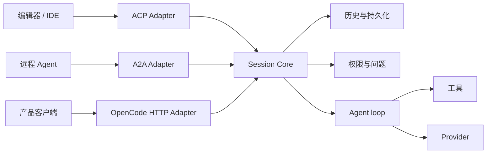
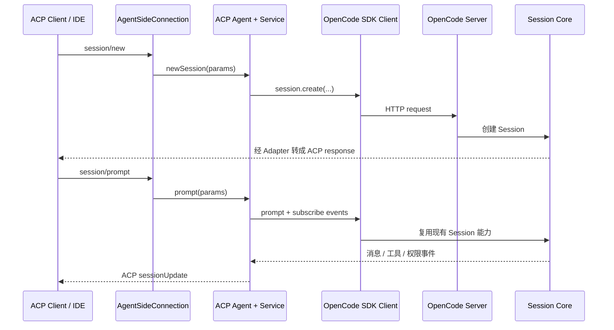
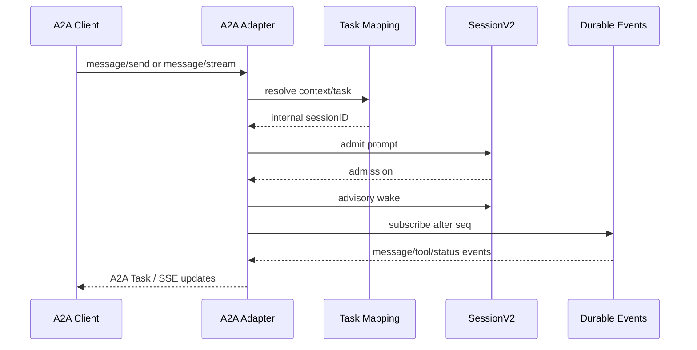
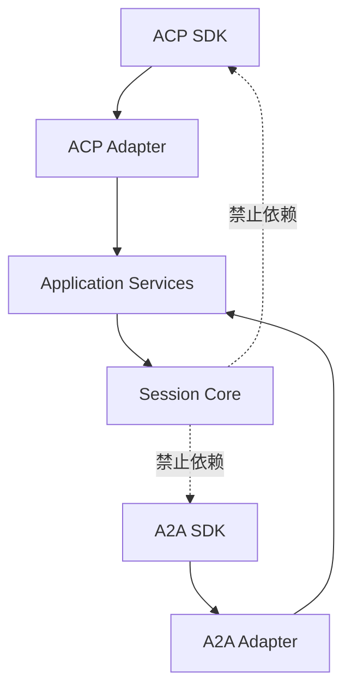

# 22 · 外部协议 ACP 与 A2A

> 本章讨论两个容易被名字吓到的外部协议：ACP 和 A2A。  
> **它们是产品的扩展入口，不是 Coding Agent 的核心循环。**
>
> 先记结论：ACP 让编辑器调用 Agent；A2A 让远程 Agent 调用另一个 Agent。协议适配层负责“翻译”，Session Core 仍负责历史、工具、权限、持久化与执行。

如果你还不熟悉 Agent loop 与多 Agent 的区别，建议先读 [03-Agent循环](./03-Agent循环-一次对话如何跑完.md) 和 [07-多 Agent 怎么协作](./07-多Agent怎么协作.md)。

---

## 1. 这一章要解决什么问题

一个 Coding Agent 除了自己的 TUI 和 HTTP API，还可能被外部生态调用：

- Zed、JetBrains 或其他编辑器希望用统一方式启动它；
- 另一个远程 Agent 希望把编码任务交给它；
- 外部调用方希望接收增量文本、工具进度和权限请求；
- 不同协议对 Session、消息、取消和错误有不同命名。

最危险的做法是为每个协议重写一套 Agent：

```text
ACP Agent loop
A2A Agent loop
HTTP Agent loop
TUI Agent loop
```

正确结构是：



适配层可以不同，核心不变量不能不同：

- 谁拥有 Session；
- prompt 何时被接纳；
- 工具是否需要权限；
- cancel / interrupt 的范围；
- 事件是否耐久；
- 模型回合和工具回合如何继续。

### 1.1 它们为什么是“产品扩展面”

没有 ACP 或 A2A，Agent 仍然可以在 TUI 中完成编码任务。因此这些协议不是 Agent 成立的必要条件。

它们解决的是**怎样接入别人的产品和网络**：

- ACP 扩展编辑器入口；
- A2A 扩展远程 Agent 协作入口；
- 两者都应建立在已经可工作的 Core 之上。

如果核心 Session 还不可靠，先加协议只会把内部不确定性暴露给更多调用方。

---

## 2. 初学者的一段话解释

### 2.1 ACP 是什么

**ACP（Agent Client Protocol）** 可以理解为“编辑器和 Coding Agent 之间的通用插头”。编辑器通常启动一个本地 Agent 子进程，然后双方通过 stdin / stdout 发送 JSON-RPC 消息。编辑器告诉 Agent“新建 Session”“发送 prompt”“取消”，Agent则回报文本、工具调用、权限请求和 Session 更新。这样编辑器不必为每个 Agent 写一套私有集成。

在当前 OpenCode 仓库中，ACP 是**已经实现**的：

- 有 `opencode acp` CLI 命令；
- 使用官方 `@agentclientprotocol/sdk`；
- 使用 stdio 上的 newline-delimited JSON-RPC；
- 有 initialize、鉴权、Session、prompt、cancel、内容转换等实现；
- 有单元测试和 CLI 子进程测试。

### 2.2 A2A 是什么

**A2A（Agent-to-Agent / Agent2Agent）** 可以理解为“网络上的 Agent 服务名片和任务协议”。一个 Agent 通过 HTTP 公布自己是谁、会什么，另一个 Agent 发现它以后发送任务、查询状态、取消或订阅流式进度。它解决的是跨进程、甚至跨机器的 Agent 协作，不等于编辑器启动本地助手。

在当前 OpenCode 仓库中，A2A **尚未实现**。搜索结果显示：

- 没有 `@a2a-js/sdk` 依赖；
- 没有 `packages/opencode/src/a2a/`；
- 没有 `opencode a2a` CLI 命令；
- 没有 Agent Card endpoint；
- 只有 `.codebuddy/plan/a2a-protocol-support/requirements.md` 描述候选需求。

因此本章提到的 A2A 路径、task 映射和 SSE 设计，只能标记为**计划 / 建议**，不能写成现有能力。

### 2.3 ACP、A2A、MCP 和 Subagent 不要混淆

| 名词 | 最简关系 | 主要用途 |
|---|---|---|
| ACP | 编辑器 ↔ Coding Agent | 让 IDE 统一接入本地 Agent |
| A2A | Agent ↔ 远程 Agent | 发现、委派和跟踪跨 Agent 任务 |
| MCP | Agent ↔ 工具 / 数据源 | 给 Agent 接文件、数据库、搜索等能力 |
| Subagent | 一个产品内部的 Agent 协作 | 上下文隔离、并行探索、任务委派 |

A2A 并不自动实现本地 Subagent 调度；Subagent 也不需要先实现 A2A。

---

## 3. 最 naive 的协议实现会怎样

### 3.1 在协议 handler 中写 Agent loop

下面这种设计边界不清：

```python
@rpc.method("session/prompt")
async def prompt(params):
    while True:
        response = await llm.stream(params)
        if not response.tool_calls:
            return response.text
        await run_tools(response.tool_calls)
```

handler 同时负责协议、模型、工具和循环后，会产生：

- ACP cancel 只能取消局部协程，不知道 Session 当前所有权；
- HTTP 与 ACP 的权限规则不同；
- 同一 Session 经不同入口看到不同历史；
- Provider 请求和工具副作用难以持久化；
- 协议升级会触碰核心执行逻辑。

协议 handler 应只负责转换和调用 application / Session service。

### 3.2 把 A2A Task ID 直接当 Session ID

A2A 的 Task、context 和 OpenCode Session 是不同领域概念。即使第一版选择一一映射，也应通过显式映射层：

```text
A2A task_id ── Adapter Mapping ──> internal session_id
```

不能因为字符串形状相同就把两个 ID 类型混用。未来一个 context 下有多个 task，或者一个 task 需要恢复已有 Session 时，隐式等同会立即失效。

### 3.3 把“需求文档”当成“已实现文档”

仓库中的 A2A requirements 使用 `SHALL` 描述目标，例如：

- `/.well-known/agent-card.json`；
- `message/send`、`message/stream`；
- `tasks/get`、`tasks/cancel`、`tasks/resubscribe`；
- 可能新增 `opencode a2a` 或挂到 `serve`。

这些是验收标准，不是源码证据。文档必须用下面的词区分：

```text
已有：源码、依赖、命令和测试都存在
计划：已写需求，但尚无实现
建议：本指南为 pycode 给出的设计
```

---

## 4. 当前 OpenCode 的 ACP 是怎样接入的

### 4.1 入口和 transport

`packages/opencode/src/cli/cmd/acp.ts` 注册 `opencode acp`。它做了两件事：

1. 启动现有 OpenCode HTTP Server，并创建内部 SDK client；
2. 使用 ACP 官方 SDK，把 stdin / stdout 包装为 nd-JSON stream。

可以把数据路径简化为：



这再次说明 ACP 不是第二个 Agent Core。它是 OpenCode SDK 之上的协议翻译层。

### 4.2 Agent 类只分派协议方法

`packages/opencode/src/acp/agent.ts` 的 `Agent` 实现官方 SDK 的 Agent 接口。方法包括：

- initialize / authenticate；
- newSession / loadSession / listSessions / resumeSession / closeSession；
- prompt / cancel；
- Session mode、model、config option；
- 实验性的 fork。

这些方法大多把参数交给 ACP service，再统一把内部错误转成 ACP `RequestError`。Agent 类本身不应该实现工具循环。

### 4.3 转换职责留在 ACP 目录

当前 ACP 目录按概念拆分：

- `content.ts`：ACP content 与内部 message parts 转换；
- `event.ts`：内部事件转成 ACP Session update；
- `permission.ts`：ACP 权限选项与内部权限回复；
- `tool.ts`：工具状态、位置和输出展示；
- `directory.ts`：目录快照与变化；
- `usage.ts`：用量信息；
- `error.ts`：错误边界；
- `service.ts`：协议用例编排。

这些转换是 adapter 的合理职责。它们不应反向塞进 Core，否则 Core 会开始依赖某个编辑器协议的类型。

### 4.4 使用官方 SDK 的意义

协议常有版本、错误码、能力协商和 framing 细节。使用官方 SDK 可以减少：

- 自己实现 JSON-RPC request / notification 分发；
- 混淆 id、result 和 error；
- 错误处理 stdin 分帧；
- 与协议版本演进脱节。

但 SDK 只能保证 protocol plumbing，不能替你保证 Session 所属、权限、持久化和取消语义。

---

## 5. A2A 的计划边界：现有与推测

### 5.1 requirements 中计划了什么

`.codebuddy/plan/a2a-protocol-support/requirements.md` 提议的 V1 是 **A2A Server**：

- 让远程 Agent 发现并调用 OpenCode；
- 使用候选官方 SDK `@a2a-js/sdk`；
- 提供 Agent Card；
- 支持同步发送、任务查询、取消和 SSE；
- 复用现有 Session / Prompt / Tool 能力；
- 暂不包含“OpenCode 主动调用其他 A2A Agent”的 Client 能力。

文档还保留了开放问题：

- A2A 独立命令还是挂到 `serve`；
- TaskStore 是否只存内存；
- context ID 如何映射 Session；
- 共用端口还是独立端口。

这些问题尚未被源码实现回答。

### 5.2 需求文档也需要随实现架构校准

该 requirements 是设计输入，不是最终架构真相。比如它提到某些旧入口和候选目录结构，而当前 Session V2 的重要约束是：

- prompt 先做耐久 admission；
- 执行由 `SessionExecution.wake(sessionID)` 调度；
- 不能绕回旧的内存工具循环；
- interrupt 只针对当前进程拥有的执行链；
- continuation 前应重载耐久历史。

真正实现 A2A 时，适配器必须以届时的公开 Protocol / SessionV2 能力为准，不能仅照抄需求中的候选调用名。

### 5.3 一个合理但尚未实现的数据流

下面是**建议设计，不是当前源码**：



需要明确决定：

- 同步 `message/send` 等待什么完成条件；
- task 状态是否耐久；
- SSE 重连从哪个 cursor 恢复；
- A2A cancel 如何映射本进程 interrupt；
- 权限请求怎样表现为 `input-required`；
- 文件 part 是否允许访问本地路径。

这些都不能由协议名称自动给出答案。

### 5.4 安全边界不能照搬假设

requirements 提议 A2A RPC 使用 Bearer token，并尝试复用现有 Server 密码。当前 OpenCode Server 实际实现的是 HTTP Basic Auth。

因此未来实现前必须明确选择：

1. A2A SDK 是否要求或支持特定 security scheme；
2. Basic credential 是否能安全映射为 Bearer；
3. Agent Card 公开范围；
4. A2A 路由与普通 OpenCode API 是否共享鉴权中间件。

在源码出现以前，不能宣称“A2A 已复用 `OPENCODE_SERVER_PASSWORD` 提供 Bearer 鉴权”。

---

## 6. pycode：Core 与 Adapter 怎样分层

### 6.1 应该属于 Core 的内容

pycode Core 应独立于 ACP / A2A，拥有：

- Session 创建、读取和持久化；
- prompt admission、steer / queue；
- SessionExecution 与 Runner；
- 模型、工具和 continuation；
- 权限、问题和中断；
- 领域事件与耐久游标；
- Location / workspace 隔离。

Core 类型不应 import ACP 或 A2A SDK。

### 6.2 应该属于 Adapter 的内容

协议 adapter 负责：

- JSON-RPC / HTTP / stdio transport；
- initialize 和能力协商；
- 外部 ID 与内部 Session ID 的映射；
- content parts 与内部 Prompt 的转换；
- 内部事件与外部 update / task 的转换；
- 外部错误码；
- 协议级鉴权和发现文档；
- 连接断开与订阅生命周期。

推荐依赖方向：



### 6.3 一个最小 ACP adapter 轮廓

下面是 pycode 的结构示例，不是某个现成 SDK 的精确 API：

```python
class AcpAdapter:
    def __init__(self, sessions: SessionApplication):
        self._sessions = sessions

    async def new_session(self, request: AcpNewSession) -> AcpSession:
        session = await self._sessions.create(directory=request.cwd)
        return AcpSession(session_id=session.id)

    async def prompt(self, request: AcpPrompt) -> AcpPromptResult:
        prompt = acp_content_to_prompt(request.content)
        admitted = await self._sessions.prompt(
            session_id=request.session_id,
            prompt=prompt,
        )
        return await project_acp_updates(admitted.session_id)
```

关键不在函数名，而在于 adapter 调用 application service，不直接调用 Provider 或工具。

### 6.4 A2A adapter 的建议接口

如果 pycode 以后实现 A2A，可以先建立自己的 protocol-neutral application port：

```python
class AgentApplication(Protocol):
    async def create_session(self, location: LocationRef) -> Session: ...
    async def admit(self, session_id: str, prompt: Prompt) -> Admission: ...
    async def interrupt(self, session_id: str) -> None: ...
    def events(self, session_id: str, after: int | None) -> AsyncIterator[Event]: ...
```

ACP、A2A 和 FastAPI 都调用它。不要为了适配 A2A `Task`，把 Core 的 Session 全部重命名成 Task。

---

## 7. 实现顺序、代价与检查清单

### 7.1 推荐顺序

对 pycode，建议按以下顺序：

1. **先稳定 Core**：Session、prompt、事件、权限和 interrupt 可测试。
2. **再做一个公开 HTTP API**：形成可靠 application 边界。
3. **实现 ACP adapter**：优先满足编辑器本地接入。
4. **有明确远程协作需求后再做 A2A**：不要因为协议流行就提前增加 TaskStore。

### 7.2 协议扩展的优点

- 外部产品不需要了解内部 Session 数据库；
- 一个 Agent 可接入多个编辑器或远程调用方；
- 标准能力协商减少私有集成；
- adapter 可以独立做协议一致性测试；
- Core 不必理解 stdio、JSON-RPC 和 Agent Card。

### 7.3 必须承担的代价

- 外部协议版本会升级；
- 内外状态机不一定一一对应；
- 流式事件和重连语义复杂；
- 取消可能只能 best-effort；
- content、文件和工具状态需要双向转换；
- 鉴权和网络暴露扩大安全面；
- 官方 SDK 也可能有运行时和版本约束。

### 7.4 评审清单

- [ ] 文档是否区分“已有”“计划”“建议”？
- [ ] 协议 handler 是否只做适配，没有自建 Agent loop？
- [ ] Core 是否完全不依赖 ACP / A2A SDK 类型？
- [ ] 外部 ID 到 Session ID 是否有显式映射？
- [ ] prompt 是否保持耐久 admission 语义？
- [ ] cancel 是否说明了作用域和 best-effort 边界？
- [ ] 权限请求是否能被外部调用方正确回答？
- [ ] 流式断线后是否明确说明可否回放？
- [ ] 文件 part 是否经过路径和权限校验？
- [ ] 鉴权 scheme 是否与真实中间件一致？
- [ ] 是否使用协议一致性测试，而不只测试 happy path？

---

## 8. 对应源码位置

### 8.1 ACP：当前已有实现

```text
packages/opencode/src/cli/cmd/acp.ts
  `opencode acp` 入口、内部 HTTP Server、SDK client 和 stdio nd-JSON transport。

packages/opencode/src/acp/agent.ts
  官方 ACP Agent 接口的方法分派和错误转换入口。

packages/opencode/src/acp/service.ts
  ACP 用例编排、Session 操作、命令和配置能力。

packages/opencode/src/acp/content.ts
  ACP content block 与内部消息 part 的转换。

packages/opencode/src/acp/event.ts
  内部事件到 ACP sessionUpdate 的投影。

packages/opencode/src/acp/permission.ts
packages/opencode/src/acp/tool.ts
  权限选择和工具状态的协议映射。

packages/opencode/src/acp/directory.ts
packages/opencode/src/acp/usage.ts
packages/opencode/src/acp/error.ts
  目录、用量和错误边界。

packages/opencode/test/acp/
packages/opencode/test/cli/acp/
  内容转换、目录、Service Session 和真实子进程协议测试。

packages/web/src/content/docs/*/acp.mdx
  面向使用者的 ACP 配置文档。
```

### 8.2 A2A：当前只有计划

```text
.codebuddy/plan/a2a-protocol-support/requirements.md
  A2A Server 的候选需求、验收标准和开放问题。

当前不存在：
  packages/opencode/src/a2a/
  @a2a-js/sdk 依赖
  opencode a2a 命令
  Agent Card endpoint
  A2A 测试目录
```

阅读 requirements 时尤其注意它最后列出的开放问题。需求文档没有被本章修改，它也不应被当成已完成清单。

---

## 本章小结

1. ACP 是编辑器 / 客户端连接本地 Coding Agent 的协议；OpenCode 当前已经实现。
2. A2A 是远程 Agent 之间发现和委派任务的协议；OpenCode 当前只有需求计划，尚未实现。
3. 两者都是产品扩展面，不应拥有自己的 Agent loop。
4. Core 拥有 Session、权限、工具和执行；adapter 拥有 transport、协议类型、ID 映射和事件转换。
5. A2A Task 与内部 Session 不应隐式等同。
6. pycode 应先稳定 Core 和 HTTP application 边界，再按真实需求增加 ACP / A2A。

> 若你只能记住一句：  
> **协议负责翻译“怎么说”，Session Core 负责决定“怎么做”。**
