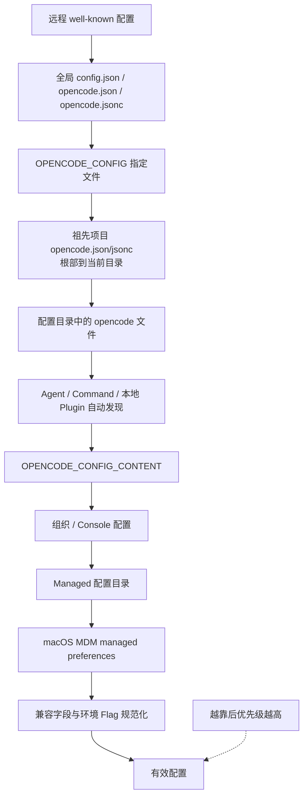

# 23 · 配置系统与合并规则

> 配置系统不是“读一个 JSON 文件”这么简单。  
> 它要回答：文件从哪里来、谁覆盖谁、对象怎样深合并、数组怎样处理、Agent Markdown 怎样加入、权限为什么由最后一条匹配规则决定。
>
> 本章会明确区分两件事：**当前 Legacy / V1 运行时真实行为**，以及 `specs/v2/config.md` 中仍在评审的 **V2 目标形状**。不要把提案字段直接当成已经上线的字段。

如果你还不理解 Agent、MCP、Permission、Compaction、Plugin 和 Skill，先读 [05-工具-MCP-与Skill](./05-工具-MCP-与Skill.md)、[06-权限](./06-权限-人机确认与命令安全.md)、[08-会话记忆](./08-会话记忆与上下文压缩.md) 和 [13-Hooks与插件扩展](./13-Hooks与插件扩展.md)。

---

## 1. 这一章要解决什么问题

一个真实项目可能同时有：

```text
~/.config/opencode/opencode.jsonc        用户默认值
repo/opencode.jsonc                     仓库共享配置
repo/packages/api/opencode.jsonc        子项目覆盖
repo/.opencode/opencode.jsonc           项目资源配置
repo/.opencode/agent/reviewer.md         自定义 Agent
repo/.opencode/plugins/audit.ts          本地 Plugin
OPENCODE_CONFIG_CONTENT                 启动时内联覆盖
企业托管配置 / MDM                       管理员强制策略
```

最终运行配置不是其中任意一个文件，而是它们按规则折叠后的结果。

至少要定义六类语义：

1. **发现**：搜索哪些目录和文件名？
2. **顺序**：先合并谁，后合并谁？
3. **对象**：嵌套对象是整体替换还是逐字段覆盖？
4. **数组**：追加、去重还是整体替换？
5. **资源**：Markdown Agent、本地 Plugin 等怎样进入同一配置？
6. **求值**：合并后的权限规则到底哪一条生效？

如果这些规则只藏在代码里，用户会遇到“我明明写了 allow，为什么还是 ask”一类难以解释的问题。

本章用两个词：

- **配置文档**：一个 JSON / JSONC 来源；
- **有效配置**：所有来源合并、规范化并应用环境覆盖后的最终结果。

---

## 2. 最 naive 的版本会怎样

### 2.1 只用 `dict.update`

```python
effective = global_config.copy()
effective.update(project_config)
```

如果全局配置是：

```json
{
  "agent": {
    "reviewer": {
      "model": "anthropic/claude",
      "steps": 10
    }
  }
}
```

项目只想改步数：

```json
{
  "agent": {
    "reviewer": {
      "steps": 20
    }
  }
}
```

浅合并会把整个 `agent` 对象替换掉，`model` 消失。配置通常需要**对象递归合并，叶子值后者覆盖前者**。

### 2.2 所有数组都追加

数组没有一种适合所有字段的规则：

- `instructions` 常希望合并多个来源并去重；
- Plugin 需要保留顺序，但同一插件后声明者应胜出；
- 权限规则顺序本身就是语义，不能排序；
- 某些普通列表更适合整体替换。

“数组一律 concat”会让插件加载两次，也可能改变权限行为。

### 2.3 认为“更具体的权限一定优先”

下面两段顺序不同，结果也不同：

```jsonc
// A：bash 的具体规则在后，bash 被 allow
{
  "permission": {
    "*": "ask",
    "bash": "allow"
  }
}
```

```jsonc
// B：通配规则在后，bash 也被 ask
{
  "permission": {
    "bash": "allow",
    "*": "ask"
  }
}
```

OpenCode 当前权限求值不是 CSS specificity。它保留作者插入顺序，并采用：

> **从后向前找第一条同时匹配 action 和 resource pattern 的规则。**

也就是 last-match wins（最后匹配者胜出）。

### 2.4 把 V2 设计稿字段当成当前配置

当前 V1 使用 `agent`、`provider`、`permission`、`plugin`；V2 评审稿提出 `agents`、`providers`、`permissions`、`plugins`。两套名字不能混写。

设计稿中的 `mcp.servers`、数组形态 `permissions` 和新版 `compaction.keep.tokens` 很适合 pycode 参考，但不等于当前 OpenCode Legacy loader 已经接受这些形状。

---

## 3. 当前 OpenCode 怎样加载与合并

### 3.1 总原则：后合并的来源覆盖先前来源

当前 `packages/opencode/src/config/config.ts` 使用深合并。概念上：

```python
result = deep_merge(result, next_source)
```

相同叶子字段由 `next_source` 覆盖；不同嵌套字段都保留。当前运行时的主要阶段可画成：



这是便于理解的主线，不代表每个部署都会有所有来源。没有配置的阶段只是合并空对象。

几个精确细节：

- 全局目录依次读 `config.json`、`opencode.json`、`opencode.jsonc`，后者可覆盖前者；
- 项目 `opencode.json(c)` 从 worktree 根部向当前目录合并，所以更靠近当前目录的文件更晚；
- `OPENCODE_CONFIG_CONTENT` 是解析后的内联 JSONC 来源；
- MDM managed preferences 在当前代码中最后合并，目的是覆盖一切；
- `OPENCODE_DISABLE_AUTOCOMPACT`、`OPENCODE_DISABLE_PRUNE` 等 flag 会在合并后改最终值。

`.opencode` 资源目录有自己的发现序列：全局配置目录、从当前目录向上发现的 `.opencode`、HOME 下 `.opencode`、显式 `OPENCODE_CONFIG_DIR`。它不应被想当然地等同于项目 JSON 文件的 root-to-leaf 顺序。若依赖多个层级的同名 Markdown Agent，必须用测试确认当前优先级；更好的做法是避免同名定义散落在多个目录。

### 3.2 深合并不是所有字段的完整答案

当前 loader 对 `instructions` 有特例：

```text
target.instructions + source.instructions
→ Set 去重
→ 保留第一次出现顺序
```

其它数组遵循底层 `mergeDeep` 行为，不能据此推导“所有数组都追加”。字段要有自己的合并契约。

Plugin 又是单独处理：

1. 配置文件中的相对路径先按**声明它的文件目录**解析；
2. 每个 Plugin 记录 `source` 和 `scope`；
3. 按加载身份去重：npm spec 用 package name，本地插件用完整 file URL；
4. 从后向前去重，因此同身份的**后声明来源获胜**；
5. 最后恢复剩余 Plugin 的正常加载顺序。

这样不会在合并后把 `./plugin.ts` 错误解释到另一个配置目录，也不会让同一个 npm package 初始化两次。

### 3.3 配置解析还会做规范化

当前 V1 兼容逻辑包括：

- `mode` 合入 `agent`，并标记为 primary；
- 顶层 `tools: { name: boolean }` 转成权限；
- Agent 内 `tools` 也转成 `permission`；
- `write` / `edit` / `patch` 统一映射到 `edit` 权限；
- `autoshare: true` 在没有 `share` 时变成 `share: "auto"`；
- `maxSteps` 作为 `steps` 的旧别名；
- 没有 `username` 时尝试使用操作系统用户名。

规范化应发生在清楚的边界，并且最终领域代码只读取一种规范形状。否则每个消费者都要重复兼容旧字段。

---

## 4. 七类核心配置怎样合并

### 4.1 Agent：命名 map 深合并，Markdown 也进入同一 map

当前 V1 JSONC 使用 `agent`：

```jsonc
{
  "model": "anthropic/claude-sonnet",
  "agent": {
    "reviewer": {
      "description": "审查正确性和测试遗漏",
      "mode": "subagent",
      "steps": 12,
      "permission": {
        "*": "ask",
        "read": "allow",
        "grep": "allow",
        "edit": "deny"
      }
    }
  }
}
```

不同来源里的同名 Agent 递归合并。例如全局定义 `model`，项目只覆盖 `steps`，两者都保留。

当前 loader 会在配置目录中扫描：

```text
agent/**/*.md
agents/**/*.md
```

因此项目常见路径是：

```text
.opencode/agent/reviewer.md
```

Markdown 的 YAML frontmatter 变成 Agent 字段，正文变成 `prompt`：

```markdown
---
description: 审查代码，不修改文件
mode: subagent
model: anthropic/claude-sonnet
steps: 12
permission:
  "*": ask
  read: allow
  grep: allow
  edit: deny
---

先找 correctness bug，再检查测试覆盖。只报告有证据的问题。
```

文件名和子路径决定 Agent name。Markdown 定义随后按同名 key 合入 `result.agent`。同一配置目录中同时使用单数 `agent/` 和复数 `agents/` 并定义同名项，会制造不必要的覆盖歧义，应避免。

V2 评审稿计划改用 `agents`，把正文语义字段从 `prompt` 改名为 `system`，并用 `disabled` 替代 `disable`。这是目标设计，不是当前 V1 文件格式。

### 4.2 Model / Provider：默认选择与目录补丁分开

当前 V1：

```jsonc
{
  "model": "internal/chat",
  "provider": {
    "internal": {
      "options": {
        "baseURL": "https://llm.example.com/v1",
        "apiKey": "{env:INTERNAL_LLM_API_KEY}"
      },
      "models": {
        "chat": {
          "limit": { "context": 128000, "output": 16000 }
        }
      }
    }
  }
}
```

- 顶层 `model` 是默认模型引用；
- `provider` 是按 provider ID 命名的 map；
- provider 内 model 也是命名 map；
- 后续文件可以只补一个 model limit 或 header，不必复制整棵对象。

V2 评审稿提出：

- `provider` → `providers`；
- model 的上游 ID 放到 `api.id`；
- provider / model / variant `options` 都作为 partial patch 合并；
- `small_model` 删除，标题 Agent 直接配置自己的 model；
- provider allow / deny 改由 `experimental.policies` 表达。

### 4.3 MCP：服务器按名字合并

当前 V1 的 `mcp` 是 server name 到 local / remote entry 的 map：

```jsonc
{
  "mcp": {
    "github": {
      "type": "local",
      "command": ["npx", "-y", "@github/github-mcp-server"],
      "environment": {
        "GITHUB_TOKEN": "{env:GITHUB_TOKEN}"
      },
      "enabled": true,
      "timeout": 60000
    },
    "docs": {
      "type": "remote",
      "url": "https://docs.example.com/mcp",
      "headers": {
        "Authorization": "Bearer {env:DOCS_TOKEN}"
      },
      "oauth": false
    }
  }
}
```

后续来源可以按同名 server 覆盖 `enabled`、`timeout` 或连接字段。类型从 local 改 remote 时不要依赖深合并“自动清掉”旧字段；更安全的实践是完整重写该 server entry，避免残留无意义字段。

V2 评审稿把它改为：

```jsonc
{
  "mcp": {
    "timeout": { "startup": 30000, "request": 300000 },
    "servers": {
      "github": {
        "type": "local",
        "command": ["npx", "-y", "@github/github-mcp-server"],
        "disabled": false,
        "timeout": { "startup": 60000 }
      }
    }
  }
}
```

新版区分启动和单次请求 timeout，并统一用 `disabled`。这仍是 V2 目标形状。

### 4.4 Permission：合并后展开为有序规则，最后匹配者胜出

当前 V1 支持短写：

```jsonc
{
  "permission": {
    "*": "ask",
    "read": "allow",
    "bash": {
      "*": "deny",
      "git status": "allow",
      "git diff*": "allow"
    },
    "edit": "deny"
  }
}
```

解析时保持 JSON 属性顺序，并展开为：

```text
("*", "*", ask)
("read", "*", allow)
("bash", "*", deny)
("bash", "git status", allow)
("bash", "git diff*", allow)
("edit", "*", deny)
```

求值时从最后向前查找。例如：

- `bash "rm -rf build"`：匹配 bash `*` → deny；
- `bash "git status"`：后面的精确规则也匹配 → allow；
- `read "README.md"`：read → allow；
- 未明确覆盖的 tool：`*` → ask。

Agent 权限会与默认权限、用户权限按顺序拼接。`Permission.merge(...)` 只是把 ruleset flatten，不做 specificity 排序，所以**后加入的 ruleset 天然优先**。

V2 提案把权限改为显式数组，语义更不容易受 JSON object key order 误解：

```jsonc
{
  "permissions": [
    { "action": "*", "resource": "*", "effect": "ask" },
    { "action": "bash", "resource": "*", "effect": "deny" },
    { "action": "bash", "resource": "git status", "effect": "allow" }
  ]
}
```

V2 同样强调 ordered ruleset。不要排序，也不要“自动把具体规则提到前面”。

### 4.5 Compaction：嵌套对象按字段覆盖

当前 V1：

```jsonc
{
  "compaction": {
    "auto": true,
    "prune": true,
    "tail_turns": 2,
    "preserve_recent_tokens": 4000,
    "reserved": 10000
  }
}
```

项目只写 `{ "compaction": { "prune": false } }` 时，其余全局字段继续保留。环境 flag 可在最终阶段强制关闭 auto / prune。

V2 提案将含义改得更清楚：

```jsonc
{
  "compaction": {
    "auto": true,
    "prune": true,
    "keep": { "tokens": 2000 },
    "buffer": 10000
  }
}
```

`keep.tokens` 是 checkpoint 中保留的近期历史预算，`buffer` 是触发压缩前预留的上下文余量。

### 4.6 Plugin：有序、带来源、后声明同身份获胜

当前 V1：

```jsonc
{
  "plugin": [
    "opencode-helicone-session",
    ["@my-org/audit-plugin", { "endpoint": "https://audit.example.com" }],
    "./plugins/local.ts"
  ]
}
```

此外还会自动扫描：

```text
.opencode/plugin/*.ts
.opencode/plugin/*.js
.opencode/plugins/*.ts
.opencode/plugins/*.js
```

Plugin 合并不能简单 Set string：

- tuple 与 string 可能指向同一 package；
- 后声明的 options 应获胜；
- 本地相对路径必须绑定原配置文件；
- global / local scope 必须保留到安装和执行阶段。

V2 提案使用复数 `plugins`，tuple 改成更可读的对象：

```jsonc
{
  "plugins": [
    "opencode-helicone-session",
    {
      "package": "@my-org/audit-plugin",
      "options": { "endpoint": "https://audit.example.com" }
    }
  ]
}
```

本地 `.opencode/plugins/` 自动发现仍与 package 配置分开。

### 4.7 Skills：发现来源，不是内联工作流

当前 V1：

```jsonc
{
  "skills": {
    "paths": ["./team-skills", "~/shared-skills"],
    "urls": ["https://example.com/.well-known/skills/"]
  }
}
```

Skill 的正文属于各自的 `SKILL.md`，配置只提供额外发现位置。Skill 和 instructions 也不同：

- instructions 自动进入上下文；
- Skill 由 Agent 有意加载或调用。

V2 提案把两类来源统一为一个数组：

```jsonc
{
  "skills": [
    "./team-skills",
    "~/shared-skills",
    "https://example.com/.well-known/skills/"
  ]
}
```

对 pycode 来说，来源数组应按配置层顺序合并去重；发现出来的同名 Skill 如何处理必须另行定义，不能悄悄依赖文件系统 glob 顺序。

---

## 5. 一个组合起来的 JSONC 示例

下面先展示**当前 V1 风格**，各片段可以来自不同文件。

全局 `~/.config/opencode/opencode.jsonc`：

```jsonc
{
  "$schema": "https://opencode.ai/config.json",
  "model": "internal/chat",
  "provider": {
    "internal": {
      "options": {
        "baseURL": "https://llm.example.com/v1",
        "apiKey": "{env:INTERNAL_LLM_API_KEY}"
      }
    }
  },
  "permission": {
    "*": "ask",
    "read": "allow",
    "grep": "allow",
    "bash": {
      "*": "deny",
      "git status": "allow"
    }
  },
  "compaction": {
    "auto": true,
    "prune": true,
    "reserved": 10000
  },
  "skills": {
    "paths": ["~/shared-skills"]
  },
  "plugin": ["@my-org/audit-plugin"]
}
```

仓库 `opencode.jsonc`：

```jsonc
{
  "agent": {
    "reviewer": {
      "description": "只读代码审查",
      "mode": "subagent",
      "steps": 12,
      "permission": {
        "*": "ask",
        "read": "allow",
        "grep": "allow",
        "edit": "deny",
        "bash": {
          "*": "deny",
          "git diff*": "allow"
        }
      }
    }
  },
  "mcp": {
    "docs": {
      "type": "remote",
      "url": "https://docs.example.com/mcp",
      "headers": {
        "Authorization": "Bearer {env:DOCS_TOKEN}"
      },
      "enabled": true
    }
  },
  "compaction": {
    "prune": false
  },
  "skills": {
    "paths": ["./.opencode/skills"]
  },
  "instructions": ["CONTRIBUTING.md", ".cursor/rules/*.md"],
  "plugin": [
    ["@my-org/audit-plugin", { "project": "payments" }],
    "./.opencode/plugins/local.ts"
  ]
}
```

合并结果的关键点：

- `model` 和 provider base URL 来自全局；
- 项目新增 reviewer Agent 和 docs MCP；
- `compaction.auto` 仍为 true，但 `prune` 被项目改为 false；
- instructions 使用专门的追加去重逻辑；
- 同一个 audit package 以后声明的 project options 获胜；
- reviewer 自己的 permission 在 Agent ruleset 中按最后匹配规则求值。

如果要参考 **V2 目标形状**，同一意图大致会写成：

```jsonc
{
  "model": "internal/chat",
  "providers": {
    "internal": {
      "options": {
        "headers": {
          "Authorization": "Bearer {env:INTERNAL_LLM_API_KEY}"
        }
      },
      "models": {
        "chat": {
          "api": { "id": "upstream-chat" },
          "limit": { "output": 16000 }
        }
      }
    }
  },
  "agents": {
    "reviewer": {
      "description": "只读代码审查",
      "system": "只报告有证据的问题。",
      "mode": "subagent",
      "steps": 12,
      "permissions": [
        { "action": "*", "resource": "*", "effect": "ask" },
        { "action": "read", "resource": "*", "effect": "allow" },
        { "action": "edit", "resource": "*", "effect": "deny" }
      ]
    }
  },
  "mcp": {
    "timeout": { "startup": 30000, "request": 300000 },
    "servers": {
      "docs": {
        "type": "remote",
        "url": "https://docs.example.com/mcp",
        "disabled": false
      }
    }
  },
  "compaction": {
    "auto": true,
    "prune": false,
    "keep": { "tokens": 2000 },
    "buffer": 10000
  },
  "plugins": [
    {
      "package": "@my-org/audit-plugin",
      "options": { "project": "payments" }
    }
  ],
  "skills": ["./.opencode/skills", "~/shared-skills"]
}
```

再次强调：这段是 V2 设计参考，不应直接复制到当前 V1 runtime。

---

## 6. pycode：Pydantic Settings + 分层文件

### 6.1 先定义可验证的最终形状

pycode 不必继承所有兼容字段。第一版可直接采用较清楚的复数命名：

```python
from typing import Annotated, Literal
from pydantic import BaseModel, Field, HttpUrl


class PermissionRule(BaseModel):
    action: str
    resource: str = "*"
    effect: Literal["allow", "deny", "ask"]


class AgentConfig(BaseModel):
    model: str | None = None
    description: str | None = None
    system: str | None = None
    mode: Literal["primary", "subagent", "all"] = "all"
    steps: int = Field(default=20, gt=0)
    disabled: bool = False
    permissions: list[PermissionRule] = Field(default_factory=list)


class LocalMCP(BaseModel):
    type: Literal["local"]
    command: list[str]
    environment: dict[str, str] = Field(default_factory=dict)
    disabled: bool = False


class RemoteMCP(BaseModel):
    type: Literal["remote"]
    url: HttpUrl
    headers: dict[str, str] = Field(default_factory=dict)
    disabled: bool = False


MCPServer = Annotated[LocalMCP | RemoteMCP, Field(discriminator="type")]


class MCPConfig(BaseModel):
    servers: dict[str, MCPServer] = Field(default_factory=dict)


class CompactionConfig(BaseModel):
    auto: bool = True
    prune: bool = True
    buffer: int = Field(default=10_000, ge=0)


class PyCodeSettings(BaseModel):
    model: str | None = None
    agents: dict[str, AgentConfig] = Field(default_factory=dict)
    mcp: MCPConfig = Field(default_factory=MCPConfig)
    permissions: list[PermissionRule] = Field(default_factory=list)
    compaction: CompactionConfig = Field(default_factory=CompactionConfig)
    plugins: list[str] = Field(default_factory=list)
    skills: list[str] = Field(default_factory=list)
```

Pydantic 的职责是**验证最终合并结果**，不是替你决定任意字段的 merge policy。`BaseSettings` 很适合环境变量覆盖，但复杂的文件发现和字段级数组语义仍应由一个显式 loader 负责。

### 6.2 给来源建立明确优先级

pycode 可采用简单、可解释的顺序：

```text
内置默认值
→ 用户配置 ~/.config/pycode/pycode.jsonc
→ 从仓库根到当前目录的 pycode.jsonc
→ 从仓库根到当前目录的 .pycode/pycode.jsonc
→ 显式 --config 文件
→ PYCODE_CONFIG_CONTENT
→ 管理员策略（如果产品需要）
```

越靠后优先级越高。不要让 JSON 文件和 Markdown 资源使用相反的祖先方向。

### 6.3 为字段写显式 merge policy

```python
def merge_config(base: dict, override: dict) -> dict:
    result = deep_merge_objects(base, override)

    result["skills"] = ordered_unique(
        [*base.get("skills", []), *override.get("skills", [])]
    )
    result["plugins"] = dedupe_plugins_last_wins(
        [*base.get("plugins", []), *override.get("plugins", [])]
    )
    result["permissions"] = [
        *base.get("permissions", []),
        *override.get("permissions", []),
    ]
    return result
```

关键是三类数组故意不同：

- skills：合并并保持顺序去重；
- plugins：同身份最后声明者获胜；
- permissions：完整保留顺序，后层规则追加在后。

权限求值保持简单：

```python
def evaluate_permission(
    action: str,
    resource: str,
    rules: list[PermissionRule],
) -> Literal["allow", "deny", "ask"]:
    for rule in reversed(rules):
        if wildcard_match(action, rule.action) and wildcard_match(
            resource, rule.resource
        ):
            return rule.effect
    return "ask"
```

默认 `ask` 比默认 allow 更适合作为第一版安全基线。

### 6.4 Markdown Agent 的最小实现

```text
.pycode/agent/reviewer.md
```

```markdown
---
description: 只读审查
mode: subagent
steps: 12
model: anthropic/claude-sonnet
---

检查正确性、边界条件和缺失测试。不要修改文件。
```

loader 过程：

1. 解析 frontmatter；
2. 由相对路径得到稳定 Agent name；
3. 正文写入 `system`；
4. 转为一个 `{"agents": {name: patch}}`；
5. 在该目录配置之后按固定规则合并；
6. 最终统一交给 `PyCodeSettings.model_validate(...)`。

若 JSONC 和 Markdown 定义同名 Agent，必须在文档中明确谁后合并。建议 Markdown 后合并，因为它是完整的人类可读 Agent 定义；但这属于 pycode 自己的选择，不是必须照搬 OpenCode 的历史顺序。

---

## 7. 优点、代价与 pycode 注意事项

### 7.1 分层配置的优点

1. **共享与个性化并存**：仓库提交安全默认值，用户保留自己的模型与凭据选择。
2. **局部覆盖**：子项目只改需要变化的叶子字段。
3. **资源可组合**：JSONC、Agent Markdown、本地 Plugin 都进入同一有效配置。
4. **安全规则可解释**：有序 ruleset + last-match 能准确说明决策来源。
5. **企业可治理**：管理员配置可放在明确的最高优先级。

### 7.2 代价与风险

1. 来源多以后，用户很难知道某个值来自哪里。
2. 深合并容易留下旧 union variant 的无意义字段。
3. 数组若没有字段级规则，会出现重复加载或顺序漂移。
4. object key order 承担权限语义不够直观，显式规则数组更好。
5. 自动发现 Markdown / Plugin 会让“目录顺序”也变成公开契约。
6. 环境变量替换可能泄露秘密，日志不能打印展开后的完整配置。

### 7.3 pycode 必做的可观测性

建议提供：

```text
pycode config sources
pycode config show --redact
pycode config explain agents.reviewer.model
pycode permission explain bash "git status"
```

`explain` 至少显示：

- 最终值；
- 获胜来源；
- 被覆盖的来源；
- 使用的 merge policy；
- Permission 的所有匹配规则及最终 last match。

这比在 debug 日志里打印整份配置更安全、更有用。

### 7.4 评审清单

- [ ] 是否有一张明确的来源优先级表？
- [ ] 对象、普通数组、skills、plugins、permissions 是否分别定义规则？
- [ ] 相对路径是否相对于声明它的配置文件解析？
- [ ] Agent Markdown 的 name、frontmatter、正文和覆盖顺序是否稳定？
- [ ] Permission 是否保留作者顺序并采用 last-match？
- [ ] 未匹配权限是否默认 ask / deny，而不是 allow？
- [ ] union 类型改变时是否完整替换，而非残留旧字段？
- [ ] 最终结果是否只验证一次并转成规范模型？
- [ ] 配置诊断是否隐藏 token、header 和 API key？
- [ ] 文档是否明确区分当前字段与 V2 提案字段？

---

## 8. 对应源码位置

```text
packages/core/src/v1/config/config.ts
  当前 V1 总 Schema：agent、provider、mcp、permission、plugin、skills、compaction。

packages/core/src/v1/config/agent.ts
  Agent 字段、tools → permission、maxSteps → steps 规范化。

packages/core/src/v1/config/permission.ts
  权限短写与对象形状；解析必须保留属性插入顺序。

packages/core/src/v1/config/mcp.ts
  当前 local / remote MCP 配置。

packages/core/src/v1/config/plugin.ts
packages/core/src/v1/config/skills.ts
  当前 Plugin spec 与 Skill 来源形状。

packages/opencode/src/config/config.ts
  当前运行时来源发现、深合并、instructions 特例、环境和 managed 覆盖。

packages/opencode/src/config/paths.ts
  项目 opencode 文件与 .opencode 目录的发现顺序。

packages/opencode/src/config/agent.ts
  agent(s)/**/*.md 的 frontmatter / 正文加载。

packages/opencode/src/config/plugin.ts
  本地 Plugin 扫描、相对路径解析、来源保留与后声明去重。

packages/opencode/src/permission/index.ts
  fromConfig、ruleset flatten 与 evaluate 的 last-match 逻辑。

packages/opencode/test/permission/next.test.ts
  属性顺序、通配规则、子 pattern 和最后匹配优先的可执行例子。

specs/v2/config.md
  V2 字段逐组评审；大量内容仍是 keep / remove / redesign 决策稿。
```

阅读源码时始终问一句：“这是当前 V1 runtime，还是 V2 review proposal？”这能避免把 `agents` 写进只认识 `agent` 的版本。

---

## 本章小结

1. 配置系统由来源发现、优先级、字段级 merge policy、规范化和验证共同组成。
2. 当前 OpenCode 以深合并为基础，后来源覆盖前来源，但 instructions、plugins、permissions 有专门语义。
3. Agent 可由 JSONC 或 `.opencode/agent/**/*.md` 定义；frontmatter 是字段，正文是 prompt。
4. Permission 保留作者顺序，最后一条同时匹配 action / resource 的规则获胜。
5. Model、MCP、Compaction 等命名对象适合局部 patch；Plugin、Skill 和 Permission 数组不能用同一种合并算法。
6. `specs/v2/config.md` 提出的复数命名和显式规则数组适合 pycode 参考，但不是当前 V1 配置事实。
7. pycode 应用 Pydantic 验证最终形状，用自写 layered loader 明确实现来源和合并规则。

> 若你只能记住一句：  
> **配置不是一份文件，而是一条有顺序、可解释、可验证的合并流水线。**
